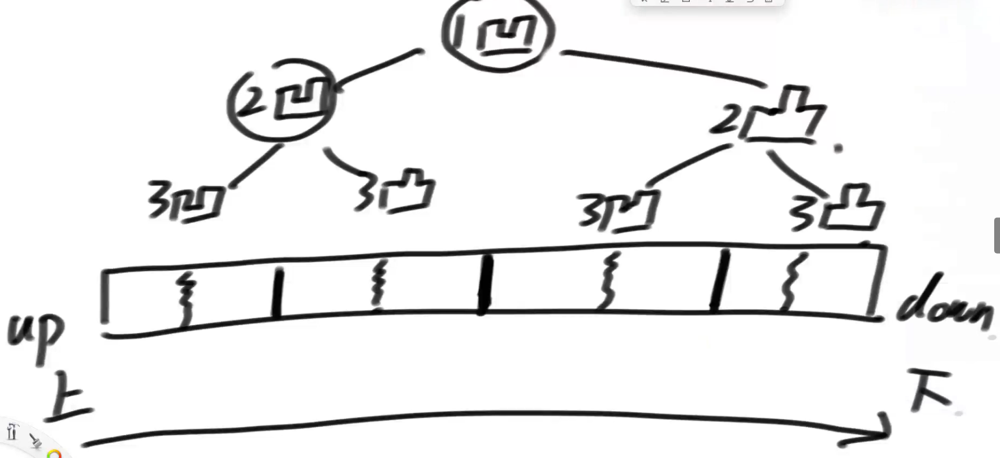
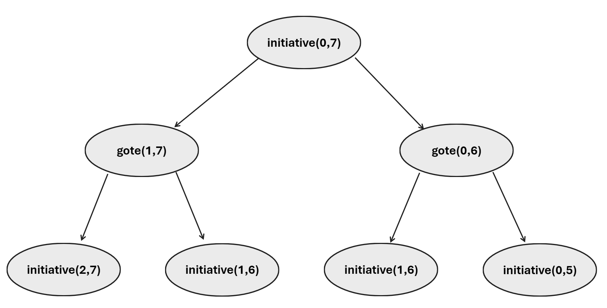

第三节 1：17：09

# 第一节 前置常识

## 常数时间操作

​	常见常数时间操作：

- 常见的算术运算
- 常见的位运算
- 赋值、自增、自减、比较操作等
- 数组寻址操作


## 对数器

​	对数器：使用一个绝对正确的解法作为基准，来测试自己编写的方法正确与否。测试的数据来源于随机生成。通常使用`Math.random()`方法来生成随机数。

​	`Math.random()`方法生成`[0, 1)`的随机浮点数。通过乘上系数和加上系数的方式来控制生成数据的上下界。如：

- `(int)(Math.random() * N)`，返回一个取值范围为`[0, N - 1]`的整数。因为强制类型转换直接舍弃小数部分。
- `(int)(Math.random() * (N + 1) - (int)(Math.random() * N))`，生成一个取值范围为`[N - 1, N]`的整数。


# 第二节 二分查找与异或

## 二分查找

​	对于中点下标的计算，为了防止溢出和加快速度，应当采取`mid = left + ((right - left) >> 1);`。因为，位运算比除法快得多。

​	对于边界条件，选取`while(left < right)`还是`while(left <= right)`，取决于是选取区间内至少有两个数才会进行二分，还是区间内至少有一个数才会进行二分操作。

​	二分法常用来解决如下问题：

- 有序数组中，查找某个数是否存在。
- 有序数组中，大于等于target的最左侧那个数的下标。
- 有序数组中，小于等于target的最右侧那个数的下标。
- 局部最小值问题。

### 有序数组中，大于等于target的最左侧那个数的下标

```java
public int existLeft(int[] nums, int target) {
    // 找到有序数组中，大于等于target的最左侧位置。该数可能不存在
    int left = 0, right = nums.length - 1;
    while (left <= right) {
        int mid = left + ((right - left) >> 1);
        if (nums[mid] >= target) {
            right = mid - 1;
        } else {
            left = mid + 1;
        }
    }   
    return right;
}
```


### 局部最小值问题

​	即便是数组非有序的，也是可以通过二分查找来找到满足条件的数的位置。

​	局部最小值问题为，找到一个数，该数满足数组中左右两边的数都比该数大，即为局部最小值。对于边界值，只要保证有值的一侧比当前值小即可。数组任意两个相邻的数不相等。

​	首先分析，如果两个边界都不满足局部最小值，且数组非有序，则一定存在局部最小值。因为，如果不存在可以推出数组是单调递增的。

​	先检查边界，如果不满足局部最小，采用二分法。检查mid位置是否满足局部最小，如果不满足，此时三元组如果是递增的，如果往较大的一侧查看则有可能找不到局部最小，而往较小一侧寻找一定可以找到局部最小值。如果非递增，则向任意一侧寻找都可以找到局部最小。

```java
public int localMin(int[] nums) {
    if (nums.length < 3) {
        return -1;
    }
    int left = 0, right = nums.length - 1;
    // 检查边界
    if (nums[left] < nums[left + 1]) return 0;
    if (nums[right] < nums[right - 1]) return right;
    while (left <= right) {
        int mid = left + ((right - left) >> 1);
    if (nums[mid] > nums[mid - 1]) {
        right = mid;
    } else if (nums[mid] > nums[mid + 1]) {
        left = mid;
    } else {
        return mid;
    }
    }   
    return -1;
}
```

​	注意修改区间边界时，应当是`left = mid;`，否则会跳过合理答案。

> 局部最大值同理，只需要将左右逻辑互换即可。


## 异或

​	相同为0，不同为1。又可以表述为不进位相加，模2加。有如下性质：

- 0和任何数异或，都等于该数本身。
- 1和任何数异或，等于按位取反。
- 任何数和自身异或，等于0。
- 异或满足交换律和结合律。

### 不借助额外空间交换数组中下标不等的两个数

```java
public void swap(int[] nums, int i, int j) {
    nums[i] = nums[i] ^ nums[j];
    nums[j] = nums[i] ^ nums[j];
    nums[i] = nums[i] ^ nums[j];
}
```

​	证明过程如下：

> 将两数简化为a, b。则上述代码对应为：`a = a ^ b`，`b = (a ^ b) ^ b = a`，`a = (a ^ b) ^ a = a；`

​	因此，如果两个数下标相等，则无法正常交换，会导致该位置元素变为零。


### 数组中只有一个元素出现了奇数次，其余都出现了偶数次，找到该元素

​	利用异或的性质，将所有元素都异或起来，最终结果就是该元素。因为，出现偶数次的元素经过异或操作结果都变为零，出现奇数次的会被保留。


### 数组中有两个数出现了奇数次，其余都出现了偶数次，找到这两个数

​	经过上述分析，我们可知数组中所有元素异或的结果为`a ^ b`(假设这两个数为a, b)。又这两个数不相等，否则违反命题中出现奇数次的设定。所以，a, b一定在某二进制位上数值是不相等的，一个为0，一个为1。于是，最终的结果`a ^ b`中，在该二进制位上一定为1。

​	于是，我们只要找到这个二进制位，然后设置一个flag数，让该数在这个二进制位上为1，其余位都为0。然后，将数组中的元素分为两种，一种在该位上为0，一种为1，分组进行异或。两组的结果就是要求的a, b。

```java
public int[] findTwo(int[] nums) {
    int length = nums.length;
    int wholeEor = 0;
    for (int i = 0; i < length; ++i) {
        wholeEor ^= nums[i];
    }
	int flag = wholeEor & (-wholeEor);
    int aEor = 0, bEor = 0;
    for (int i = 0; i < length; ++i) {
        if ((flag & nums[i]) == 0) {
            aEor ^= nums[i];
        } else {
            bEor ^= nums[i];
        }
    }
    return new int[]{aEor, bEor};
}
```


### 将一个整数最右侧的1提取出来

```java
public int findRightOne(int target) {
    int flag = 1;
    while ((flag & target) == 0) {
        flag <<= 1;
    }
    return flag;
}
```

​	上述为笨方法。

​	对于一个整数a，`~a`取反，再加1，`~a+1`这个数除了最右侧的1以外，所有的二进制位上的数都和a相反。于是最快速的方法为：

```java
public int findRigthOne(int target) {
    return a & (~a + 1);
}
```

​	由于计算机中采用的是补码来存储数据，`~a + 1`就是`-a`所以上述操作可以简化为：

```java
public int findRightOne(int target) {
    return a & (-a)
}
```


### 数组中只有一种数出现了K次，其余都出现了M次，找到出现了K次的数

​	Java中int整型长度为32位。可以申请一个长度为32的int数组bits，遍历源数组。对于每个元素将其二进制位上为1的位，累加到对应的整型数组中。即bits数组中，每一位都表示源数组中，在该二进制位上为1的数一共有几个。

```java
public int findK(int[] nums, int k, int m) {
    int[] bits = new int[32];
    for (int num : nums) {
        // 对于每个元素，将其看作一个32位二进制数，每一位如果为1，将bits数组对应位置元素加一
        for (int i = 0; i < 32; ++i) {
            if ((num & (1 << i)) != 0) {
                ++bits[i];
            }
        }
    }
    int ans = 0;
    // 检查bits数组每一个元素，如果当前元素不能被m整除，表明target在这一位上不为0
    for (int i = 0; i < 32; ++i) {
        if (bits[i] % m != 0) {
            ans |= (1 << i);
        }
    }
    return ans;
}
```

> 扩展，出现次数为k次的数字可能出现k次也可能出现次数不足k次。
>
> 就要判断bits数组每个元素，当其不能被m整除时，能否被k整除。


# 第三节 线性表相关

## 链表

​	单链表

```java
public class Node {
    public int value;
    public Node next;
    public Node(int data) {
        value = data;
    }
}
```

​	双链表

```java
public class DoubleNode {
    public int value;
    public DoubleNode pre;
    public DoubleNode post;
    public DoubleNode(int data) {
        value = data;
    }
}
```

​	必备基础：

- 单链表和双链表的反转
  - 双指针

```java
public Node reverseLinkedList(Node head) {
    Node pre = null;
    Node post = null;
    while (head != null) {
        post = head.next;
        head.next = pre;
        pre = head;
        head = post;
    }
    return pre;
}
```

- - 栈


- - 头插法

- 删除指定值
  - 不是指定值就插入新链表，否则跳过

## 链表问题

- 对于笔试，不太追求空间复杂度，一切为了时间复杂度。
- 对于面试，时间复杂度仍最重要，但是要找到最省空间的算法。


### 笔试题常用技巧

- 使用容器(哈希表，数组)
- 快慢指针


### 常见习题

#### 回文链表

#### partition

#### 随机链表的复制

题目描述：

​	单链表的节点，增加一个`rand`指针，随机指向链表内一个节点。将整个链表复制。

思路：

​	（1）借助容器。先遍历整个链表，然后将每个节点和其拷贝，存入HashMap<Node, Node>。然后，再次遍历链表，此时再设置next和rand指针即可

​	（2）遍历链表，每到一个节点，就拷贝一个，并将其插入到当前节点后面。遍历完成后，此时链表长度变为2倍。再次遍历链表，设置rand。再次遍历，将两个链表分开。

```java
public Node copyOfRandomLinkedList(Node head) {
    Node current = head;
    Node help = null;
    while (current != null) {
        Node newNode = new Node(current.data);
        help = current.next;
        current.next = newNode;
        newNode.next = help;
        current = help;
    }
    current = head;
    while (current != null) {
        current.next. rand = current.rand.next;
        current = current.next.next;
    }
    current = head;
    Node dummy = new Node(0);
    help = dummy;
    while (current != null) {
        help.next = current.next;
        current.next = help.next;
        help = help.next;
        current = current.next;
    }
    return dummy.next;
}
```

#### 链表相交(环)

题目描述：

​	给定两个单链表头节点。链表可能有环也可能无环，如果两链表相交则返回相交节点，否则返回null。

思路：

​	判断一个单链表是否有环，可以快慢指针，或者构建哈希表。哈希表就是将遍历过的节点放入哈希表中，每遍历到一个节点就检查哈希表中是否已经记录该节点即可。

​	快慢指针，两指针相遇之后，让另一个指针从头节点开始遍历，再次相遇的时候就是入口处。


​	对于两个有环的链表如何判断是否相交？


#### 对于一个单链表，不给定头节点，只是给定随机一个节点，能否删除。

​	不能直接删除这个节点，虽然对于非最后一个节点，可以通过拷贝下一个节点的方法，将当前节点的值覆盖，但是本质上并没有释放当前节点的空间，而释放的是别的空间。如果是服务器集群可能会发生无法拷贝的情况。

​	另外，对于末尾节点，这样的删除方法是无效的，因为无法让前置节点的next指向null。


## 队列和栈

- 双向链表实现
- 数组实现
  - 数组实现队列时，需要使用循环数组。头尾指针需要对`capacity`取余，另外需要添加`size`元素，来将头尾指针解耦

```java
public class QueueWithRecurrentArray {
    private int[] arr;
    private int head;
    private int rear;
    private int size;
    private int capacity;

    public QueueWithRecurrentArray() {
        this(8);
    }

    public QueueWithRecurrentArray(int capacity) {
        this.capacity = capacity;
        arr = new int[capacity];
        head = 0;
        rear = -1;
        size = 0;
    }
    
    public void offer(int value) {
        if (size == capacity) return;
        rear = (rear + 1) % capacity;
        arr[rear] = value;
        ++size;
    }

    public int poll() {
        if (size == 0) return -1;
        --size;
        int value = arr[head];
        head = (head + 1) % capacity;
        return value;
    }
}
```


### 实现一个栈，需要具备返回栈中最小元素的功能

​	要求：pop、push、getMin方法的时间复杂度都是O(1)

​	思路：准备两个栈，一个栈正常存储数据，另一个栈作为最小栈。当push元素时，检查当前元素是否比栈顶元素小，如果是就压入，否则重复压入当前栈顶元素。

```java
public class Stack {
    private Deque<Integer> stack = new LinkedList<>();
    private Deque<Integer> min = new LinkedList<>();
    private int capacity = 8;
    private int size = 0;
    
    public void push(int value) {
        if (size == capacity) return;
        ++size;
        stack.push(value);
        int top = stack.peek();
        min.push(Math.min(top, value));
    }
    
    public int pop() {
        if (size == 0) return -1;
        --size;
        min/pop();
        return stack.pop();
    }
    
    public int getMin() {
        if (size == 0) return;
        return min.peek();
    }
}
```

​	其原理就是，利用最小栈记录了每个时刻栈内的最小值。


### 使用栈实现队列

​	使用两个栈，一个作为入栈，一个作为出栈。队列新增元素时，压入入栈。队列删除元素时，将入栈全部压入出栈，然后弹出顶部元素。出栈不为空时，栈顶元素就是队列头部。出栈为空时，再进行倒腾。

```java
public class TwoStackImitateQueue {
    private Deque<Integer> pushStack = new LinkedList<>();
    private Deque<Integer> popStack = new LinkedList<>();
    private int size = 0;

    public void offer(int value) {
        pushStack.push(value);
        ++size;
    }

    public int poll() {
        if (size == 0) return -1;
        if (popStack.isEmpty()) reverse();
        --size;
        return popStack.pop();
    }

    private void reverse() {
        while (!pushStack.isEmpty()) {
            popStack.push(pushStack.pop());
        }
    }
}
```


### 使用队列实现栈

​	入栈就对应正常入队。出站时，将前n-1个元素依次出队，并重新入队，此时队头元素就对应栈顶元素。


## 递归

​	对于新手来说，把调用的过程画出结构图是必须的，这有利于分析递归

​	递归并不是玄学，递归底层是利用系统栈来实现的

​	任何递归函数都一定可以改成非递归

## 哈希表

​	为什么自定义类需要重写`equals`和`hasCode`方法，并且重写前者必须要重写后者。因为，判断两个对象是否相等时，先判断哈希值是否一致，如果一致再去判断内部元素是否相等。这样可以节省很多时间。因此，如果只重写`equals`，就会出现哈希值不相同但是对象相等的情况。

​	哈希表在使用时，增删改查时间复杂度都是O(1)


## 有序表

​	红黑树、AVL树、二叉搜索树都是有序表。

​	有序表在使用时，比哈希表功能多，时间复杂度都是O(logN)。

​	存入有序表的元素必须实现比较器。


# 第四节 归并与快排

## 归并排序

​	具体思想为，先不断划分，直到每个组只有一个元素。然后合并相邻的两个组，得到长度为2的归并段。依次向上归并，直到整个数组有序。

```java
public void mergeSort(int[] arr, int left, int right) {
    if (left == right)
        return;
    int mid = left + ((right - left) >> 1);
    mergeSort(arr, left, mid);
    mergeSort(arr, mid + 1, right);
    merge(arr, left, mid, right);
}

private void merge(int[] arr, int left, int mid, int right) {
    // 先申请额外空间，用来存储有序结果
    int[] sorted = new int[right - left + 1];
    // 开始比较，将较小的元素放入有序结果数组中
    int l = left, r = mid + 1;
    int index = 0;
    while (l <= mid && r <= right) {
        if (arr[l] < arr[r]) {
            sorted[index++] = arr[l++];
        } else {
            sorted[index++] = arr[r++];
        }
    }
    while (l <= mid) {
        sorted[index++] = arr[l++];
    }
    while (r <= right) {
        sorted[index++] = arr[r++];
    }
    // 然后将结果复制到原数组中
    for (int i = 0; i < sorted.length; ++i) {
        arr[left + i] = sorted[i];
    }
}
```

​	非递归实现：

​	指定步长，每次将相距为步长的一组数进行合并。然后增大步长。

```java
public void mergeSort(int[] arr) {
    int mergeSize = 0;
    int length = arr.length;
    while (mergeSize < length) { // 如果归并段大小已经大于数组长度了，证明上一次归并段已经超过了1/2数组，数组已经有序
        int left = 0; // 对于每个阶段，归并总是从数组起始开始的
        while (left < length) {
            int mid = left + mergeSize - 1; // 两两归并时，左边归并段的结束位置
            if (mid > length) break; // 如果数组末尾位置，长度不足一个归并段，不应该进行归并操作
            int right = Math.min(mid + 1, length - 1); // 同样是为了处理末尾位置
            merge(arr, left, mid, right);
            left = right + 1;
        }
        mergeSize <<= 1;
    }
}
```


### 小和问题

题目描述：

​	给定一个数组，求得每个元素左边比其小的元素的数量，然后输出数组所有元素该数据的和。

思路：

​	利用归并排序的思路。在两个归并段合并时，如果将右边归并段拷贝入有序数组，不会产生小和；如果将左边归并段拷贝入有序数组，就会产生小和。因为，左边比右边小才会拷贝左边。

​	当发现左边比右边小时，从右边当前元素开始，剩余所有的元素都会产生一个小和。因此，直接加上剩余数量。

```java
public int mergeSort(int[] arr, int left, int right) {
    if (left >= right) return 0;
    int mid = left + ((right - left) >> 1);
    int count = 0;
    count += mergeSort(arr, left, mid);
    count += mergeSort(arr, mid + 1, right);
    count += merge(arr, left, mid, right);
    return count;
}

private count merge(int[] arr, int left, int mid, int right) {
    int[] temp = new int[right - left + 1]; // 申请额外数组
    int l = left, r = mid + 1;
    int index = 0;
    int count = 0;
    while (l <= mid && r <= right) {
        if (arr[l] < arr[r]) { // 此时需要计算小和数量
            count += (r - right + 1);
            temp[index] = arr[l];
            ++l;
        } else {
            temp[index] = arr[r];
            ++r;
        }
        ++index;
    }
    while (l <= mid) {
        arr[index++] = arr[l++];
    }
    while (r <= right) {
        arr[index++] = arr[r++];
    }
    return count;
}
```


### 比右边的数大两倍(反转对)

题目描述：

​	对于数组中的元素，统计其右侧的元素满足比其小两倍的数量。

思路：

​	利用归并排序的思路。每次合并归并段时，都先统计下左边归并段当前元素的统计数量，然后再归并即可。

​	统计时，由于归并段都是升序排序的，所以，对于当前元素满足条件的右侧元素，对于后续元素同样满足。

```java
class Solution {
    public int reversePairs(int[] nums) {
        return mergeSort(nums, 0, nums.length - 1);
    }

    private int mergeSort(int[] nums, int left, int right) {
        if (left >= right) return 0;
        int mid = left + ((right - left) >> 1);
        return mergeSort(nums, left, mid) +
            mergeSort(nums, mid + 1, right) +
            merge(nums, left, mid, right);
    }

    private int merge(int[] nums, int left, int mid, int right) {
        int count = 0;
        int window = mid + 1;
        for (int i = left; i <= mid; ++i) {
            long pre = nums[i] + 0L;
            while (window <= right) { // 为了防止乘2溢出，改为long判断
                long post = (nums[window] + 0L) << 1;
                if (pre > post) ++window;
                else break;
            }
            count += (window - mid - 1);
        }
        int[] temp = new int[right - left + 1];
        int l = left, r = mid + 1, index = 0;
        while (l <= mid && r <= right) {
            if (nums[l] < nums[r]) {
                temp[index] = nums[l++];
            } else {
                temp[index] = nums[r++];
            }
            ++index;
        }
        while (l <= mid) {
            temp[index++] = nums[l++];
        }
        while (r <= right) {
            temp[index++] = nums[r++];
        }
        for (int i = 0; i < index; ++i)  {
            nums[left + i] = temp[i];
        }
        return count;
    }
}
```


### 范围和(count of range sum)

题目描述：

​	给定一个数组，一个lower下界，一个upper上界。求数组中子数组的和落在`[lower, upper]`范围内的子数组数量。

思路：

​	暴力解：先计算获得数组的前缀和数组，然后通过双重循环的方式，检查所有子数组的和，统计满足要求的数量。

​	优化解：对于每个元素i，统计以其为结尾的子数组，满足条件的个数。

​	如果0~i的前缀和为x，则上述统计，等同于，求以i-1结尾的所有前缀和中，有多少落在了`[x - upper, x - lower]`。假设以j结尾的前缀和落在了该范围内，则表明j~i范围的子数组满足条件。

> 原始数组arr[] -> 前缀和数组sum[] -> 对于sum[]中的每个元素，求落在其左边的，且范围在`[x - upper, x - lower]`的元素的个数。 -> 将问题转化为了基于归并排序的小和问题。

​	但是，如果在判断左组中有多少元素能够落在该区间时，不能直接使用双重循环，时间复杂度还是太高。经过观察，如果归并段是有序的，则区间的上下界是不会降低的，只会逐渐增高。同时，左组也是递增的。根据这个特性，可以设计使得指针不回溯，降低时间复杂度。

```java
int lower;
int upper;
public int countOfRangeSum(int[] arr, int lower, int upper) {
    long[] sum = new long[arr.length]; // 前缀和数组
    this.lower = lower;
    this.upper = upper;
    long temp = 0;
    int count = 0;
    for (int i = 0; i < sum.length; ++i) {
        temp += arr[i];
        sum[i] = temp;
        if (sum[i] >= lower && sum[i] <= upper) ++count;
    }
    // 通过归并排序的思路，将问题转换为小和问题
    return count + mergeSort(sum, 0, sum.length - 1);
}

private int mergeSort(long[] sum, int left, int right) {
    if (left >= right) return 0;
    int mid = left + ((right - left) >> 1);
    return mergeSort(sum, left, mid) +
        mergeSort(sum, mid + 1, right) +
        merge(sum, left, mid, right);
}

private int merge(long[] sum, int left, int mid, int right) {
    // 先统计数量，然后再进行归并排序
    int count = 0;
    // 直接计算，指针一直在回溯，时间复杂度还是N^2，会超时
    // for (int i = mid + 1; i <= right; ++i) {
    //     long rangeL = sum[i] - upper;
    //     long rangeR = sum[i] - lower;
    //     for (int j = left; j <= mid; ++j) {
    //         if (sum[j] >= rangeL && sum[j] <= rangeR) ++count;
    //     }
    // }
    int windowL = left;
    int windowR = left;
    for (int i = mid + 1; i <= right; ++i) {
        long rangeL = sum[i] - upper;
        long rangeR = sum[i] - lower;
        while (windowR <= mid && sum[windowR] <= rangeR) ++windowR;
        while (windowL <= mid && sum[windowL] < rangeL) ++windowL;
        count += windowR - windowL; 
    }
    long[] temp = new long[right - left + 1];
    int l = left, r = mid + 1;
    int index = 0;
    while (l <= mid && r <= right) {
        if (sum[l] < sum[r]) {
            temp[index] = sum[l];
            ++l;
        } else {
            temp[index] = sum[r];
            ++r;
        }
        ++index;
    }
    while (l <= mid) {
        temp[index] = sum[l];
        ++index;
        ++l;
    }
    while (r <= right) {
        temp[index] = sum[r];
        ++index;
        ++r;
    }
    for (int i = 0; i < index; ++i) {
        sum[left + i] = temp[i];
    }
    return count;
}
```


## 快速排序

​	主要思路为，通过分治法，每次都选取一个数字作为枢轴，将枢轴放置在其应该在的位置。即使得枢轴左边的数字都比其小，右边的数字都比枢轴大。

​	然后，枢轴将数组划分为两部分，然后递归使用分治，使得整个数组有序。

```java
public class QuickSort {
    public void quickSort(int[] arr, int left, int right) {
        if (left >= right) return;
        int pivot = partition(arr, left, right);
        quickSort(arr, left, pivot - 1);	
        quickSort(arr, pivot + 1, right);
    }

    private int partition(int[] arr, int left, int right) {
        int pivot = arr[left];
        while (left < right) {
            while (left < right && arr[right] > pivot) --right;
            arr[left] = arr[right];
            while (left < right && arr[left] < pivot) ++left;
            arr[right] = arr[left];
        }
        arr[left] = pivot;
        return left;
    }
}
```


# 第五节 堆

## 比较器

​	Java提供的工具类和方法，对于自定义的对象，通常需要实现比较器才能使用。即需要自己定义自定义对象的比较方法。

​	内部比较器需要自定义类实现`Comparable`接口，并重写`compareTo()`方法。系统基础类使用的是该方法。

​	通常实现外部比较器。有两种方法，要么实现一个类，实现`Comparator<T>`接口，并重写`compare(T o1, T o2)`方法。要么通过匿名内部类来实现比较器。

​	`compare`方法的返回值，规定为：返回负数第一个对象较小，返回零两个对象一样大，返回正数后者较大。	

```java
public class Student {
    private int id;
    private String name;
	
    public static void main(String[] args) {
        TreeMap<Student> map = new TreeMap<>(new Comparator<Student>() {
            @Override
            public int compare(Student o1, Student o2) {
				return o1.id - o2.id;
            }
        })
    }
}
```


## 堆

​	在Java中，使用`PriorityQueue`结构来实现对结构的。内部默认是小根堆。默认情况下队列是无限增长的，可以通过创建优先队列时传入`initialCapacity`参数来指定上限。`add()`将元素加入堆中，`poll()`将堆顶元素弹出。由于增删都需要维护堆的有序性，所以都是`O(logn)`的时间复杂度。

​	堆的建立：先将元素安排为完全二叉树的状态，然后从最后一个子树开始，先让两个孩子节点比较大小，较小的再和父节点比较，较小的节点会和父节点进行交换，直到整个树最小的节点放置在根节点。此时，每个子树都是最小的节点作为父节点。

​	堆的删除：将根节点和最后一个节点交换，然后删除根节点。此时，从根节点开始，先让两个孩子节点比较，再和根节点比较，如果根节点较大则下移，循环直到该节点不再下移。

```java
public int poll(int[] arr) {
    int ans = arr[0]；
    arr[0] = arr[heapSize - 1];
    --heapSize;
    
}

private void heapMaintain(int[] arr, int start) {
	int left = start * 2 + 1; // 根节点的左孩子
    while (left < heapSize) {
        int smaller = left + 1 < heapSize && arr[left] < arr[left + 1] ? left && left + 1; // 获取较小孩子的下标
        smaller = arr[start] < arr[smaller] ? start : smaller; // 再跟父节点比较，看谁更小
        if (smaller == start) break; // 如果父节点更小，表明不需要调整了
        swap(arr, smaller, start);
        start = smaller;
        left = 2 * index + 1;
    }
}
```


​	堆的新增：将新增节点加入到整个二叉树的末尾。此时，二叉树满足每个子树都是父节点最小，所以只需要和父节点比较然后上移即可维护堆。

```java
public void add(int[]arr, int index) {
    while (arr[index] < arr[(index - 1) >> 1]) {
        swap(arr, index, (index - 1) >> 1);
        index = (index - 1) >> 1;
    }
}
```

​	由于堆实际的存储结构是队列或者数组，所以，找到子节点的操作实际上是通过`2i+1和2i+2`来实现的。


### 相关题目

题目描述：

​	已知一个几乎有序的数组，请选择一个合适的排序策略，对数组进行排序。几乎有序是指，数组中每个元素需要移动的距离不超过K，就可以到达其在有序数组中应该在的位置。

思路：

​	对于几乎有序的数组来说，快速排序时间复杂度接近`O(n^2)`，但是堆排序仍然为`O(n*logn)`。

​	建立一个小根堆，其大小为K，先将数组前K个数字加入到堆中，然后，弹出堆顶元素，放置在有序数组中，然后向后移动堆即可。


## 堆排序相关问题

### 最大线段重合问题

题目描述：

​	给定很多线段，每个线段都有两个数`[start, end]`，表示线段的起始位置和结束位置，左右都是闭区间。规定：

- 线段开始和结束位置一定是整数
- 线段重合区域的长度>=1

​	返回线段最多重合区域中，包含了几条线段。

思路：

​	先将所有线段，按照区间左边界进行排序，使得线段按照左边界递增。

​	然后，维护一个小根堆，从第一个线段开始，每次将线段的右边界放入小根堆中。

​	放入小根堆之前，先检查小根堆堆顶元素是否小于当前线段左边界，如果小于等于，持续弹出直到堆顶元素大于左边界。然后再加入右边界。

​	弹出的原因是，如果小根堆有元素小于当前线段左边界，则证明这些线段与当前线段一定无重合区域。

​	只需要对于每个线段，在其加入到小根堆里面后，检查一下堆的大小，即可直到此时重合线段的数量，取最大值即可。

```java
public int numberOfOverlap(int[][] segments) {
    // add segments to a list, so that we can sort it by the start index
    List<int[]> lines = new ArrayList<>();
    for (int[] segment : segments) {
        lines.add(segment);
    }
    lines.sort((o1, o2) -> o1[0] - o2[0]); // sort segments
    PriorityQueue<Integer> pq = new PriorityQueue<>();
    int ans = 0;
    for (int[] line : lines) {
        while (!pq.isEmpty() && pq.peek() < line[1]) { // while the top of the heap is smaller than the start of the current line
            pq.poll(); // get rid of the top
        }
        pq.add(line[1]);
        ans = pq.size() > ans ? pq.peek() : ans;
    }
    return ans;
}
```


### 改写堆练习题

题目描述：

​	给定两个数组，`int[] arr` 和 `boolean[] op`，arr中的元素i表示顾客i，op中的元素`T/F`表示购买或退货。需要统计购买数量最多的K个顾客。

​	如果某个用户购买数量为0，但是又有退货事件，则该事件无效。

​	每次都是购买最多的K个顾客获得奖品，K也是传入参数。如果顾客数不足K，则全部输出。

​	得奖的顾客购买数量需要大于0。

​	系统里有两个区域，得奖区和候选区，顾客只会存在于一个区域中。

​	如果顾客购买数量为0，则直接从系统中删除。

​	如果购买数量一致，则将最早进入获奖区的顾客去除。

​	如果购买数量一致，则将备选区中最早进入的顾客加入到得奖区。

思路：

​	构建一个大根堆，对内元素为用户索引，排序标准为商品的购买数量。需要实现在购买数量发生变化时，可以及时调整堆。

### 手写堆(加强堆)

​	建立堆的数据结构，需要做到建立反向索引表、建立比较器，需要各种数据结构相互配合。

​	Java内部提供的堆存在如下缺点：

- 对于已经进入堆的元素，如果其发生变化，堆是不会主动调整的。
- 堆不支持反向重定向，即，假设堆是按照对象的内容排序的，如果已知内容想在堆中找打这个对象就需要遍历堆，时间复杂度为`O(n)`

#### 建立反向索引表

​	堆用来存储数据的结构通常为线性表`List<T>`，为了能够通过对象直接找到其在堆中的下标，可以建立一个反向索引表`Hash<T, Integer>`

#### 建立比较器

```java
public class HeapSmaller<T> {
    private List<T> heap;
    private Map<T, Integer> map;
    private Comparator<T> comparator;
    private int heapSize;

    public HeapSmaller(Comparator<T> comparator) {
        this.comparator = comparator;
        heap = new ArrayList<T>();
        map = new HashMap<>();
        heapSize = 0;
    }

    public void add(T item) {
        heap.add(item);
        map.put(item, heap.size() - 1);
        upMaintain(heap.size() - 1);
    }

    private void upMaintain(int index) {
        while (comparator.compare(heap.get(index), heap.get((index - 1) >> 1)) < 0) { // compare to the parent node
            swap(index, (index - 1) >> 1);
            index = (index - 1) >> 1;
        }
    }

    private void swap(int i, int j) {
        T o1 = heap.get(i);
        T o2 = heap.get(j);
        heap.set(i, o2);
        heap.set(j, o1);
        map.put(o1, j);
        map.put(o2, i);
    }

    public T poll() {
        swap(0, heap.size() - 1);
        T ans = heap.get(heap.size() - 1);
        map.remove(ans);
        heap.remove(heap.size() - 1);
        downMaintain(0);
        return ans;
    }

    private void downMaintain(int index) {
        int left = (index << 1) + 1;
        while (left < heap.size()) {
            // get the smaller child's index
            int smaller = left + 1 < heap.size() && comparator.compare(heap.get(left), heap.get(left + 1)) < 0 ? left : left + 1;
            smaller = comparator.compare(heap.get(index), heap.get(smaller)) < 0 ? index : smaller;
            if (smaller == index) {
                return;
            }
            swap(index, smaller);
            index = smaller;
            left = (index << 1) + 1;
        }
    }

    public void resign(T item) {
        int index = map.get(item);
        upMaintain(index);  // 修改某个对象的值之后，不知道要上升还是下降，所以先看能不能上升，在看能否下降
        downMaintain(index);
    }

    private void remove(int index) {
        swap(index, heap.size() - 1);
        T ans = heap.get(heap.size() - 1);
        map.remove(ans);
        heap.remove(heap.size() - 1);
        resign(heap.get(index));
    }
}
```


# 第六节 前缀树

## 前缀树

​	将字符串数组以树的形式组织起来。是一颗多叉树，每一个叉代表选择一个字母。从根节点出发，如果有到达当前字符串首字母的路径，则复用，直到没有路径，再新建树杈。

​	给每个节点赋予两个值，`p`表示有多少个字符串通过该节点。`e`表示有多少个字符串以该节点结尾。

​	则根节点中的`p`为字符串数量。叶节点`e`一定不为0。

用处：

​	假设，有一个字符串数组`String[] arr`，想要查找其中`abc`字符串出现的次数。则从根节点出发，依次检查有没有到达当前字母的路径，直到到达`c`字母，然后查看当前节点的`e`值。如果中间某个字母没有路径，表明不存在该字符串。

​	如果想查看有多少个字符串以`abc`开头，则可以按照上述方法，最后获取`p`值。

### 数据结构

​	假设字符串中只会出现小写英文字母。于是，单个节点的孩子节点可以用过数组表示。

```java
public class TrieTree {
    public static class Node {
        public int pass;
        public int end;
        public Node[] nexts;

        public Node() {
            pass = 0;
            end = 0;
            nexts = new Node[26]; // 0...25 分别表示指向a...z的路径
        }
    }

    public static class Trie {
        private Node root;

        public Trie() {
            root = new Node();
        }
    }
}
```


插入字符串

```java
public void insert(String word) {
    if (word == null || word.isEmpty()) return;
    char[] str = word.toCharArray();
    Node node = root;
    node.pass++;
    for (char c : str) {
        int index = c - 'a';
        if (node.nexts[index] == null) {
            node.nexts[index] = new Node();
        }
        node = node.nexts[index];
        node.pass++;
    }
    node.end++;
}
```

查找某个字符串的出现次数

```java
public int search(String word) {
    if (word == null || word.isEmpty()) return 0;
    char[] str = word.toCharArray();
    Node node = root;
    for (char c : str) {
        int index = c - 'a';
        if (node.nexts[index] == null) {
            return 0;
        }
        node = node.nexts[index];
    }
    return node.end;
}
```

查找以某个字符串为前缀的字符串数量

```java
public int startsWith(String prefix) {
    if (prefix == null || prefix.isEmpty()) return 0;
    char[] str = prefix.toCharArray();
    Node node = root;
    for (char c : str) {
        int index = c - 'a';
        if (node.nexts[index] == null) {
            return 0;
        }
        node = node.nexts[index];
    }
    return node.pass;
}
```

删除字符串

```java
public void delete(String word) {
    if (word == null || word.isEmpty() || search(word) == 0) return;
    char[] str = word.toCharArray();
    Node node = root;
    for (char c : str) {
        int index = c - 'a';
        if (--node.nexts[index].pass == 0) { // 如果路径上某个节点只有一个字符串经过，后续就不用查看了
            node.nexts[index] = null;
            return;
        }
        node = node.nexts[index];
    }
    node.end--;
}
```


# 第七节 基数排序与计数排序

## 计数排序

​	假设给定一个数组，`int[] age`表示年龄。统计某个年龄段出现的人数。

​	由于年龄是有软上限的，所以可以直接申请一个`int[200]`的数组，然后统计每个数字出现的个数即可。

​	不是基于比较的排序。

## 基数排序

​	经典算法的限制为，数据必须为非负的、能够表达为十进制的数。

​	构造十个队列，分别表示0-9。遍历数组，然后将元素按照个位依次放入各个队列。遍历完成后，从0号队列开始，将数据拿出。先进先出。

​	然后按照十位排序，依次递推。

### 优化版本

​	准备一个count[10]数组，用于统计当前排序位上，每个数字出现的次数。然后求其前缀和数组`count'[]`，则该数组每个元素count[i]表示，待排序的数据中，当前位上小于等于count[i]的数有几个。

​	然后，从右往左遍历数据。对于每个元素arr[i]，检查其当前位上的数字j。查找count'[j]，获取当前位上小于等于j的元素共有几个。将i放在当前区域的最右侧。

​	然后将count'[j]--。表明已经处理完一个元素，当前位上小于等于j的元素减少了。

```java
public class RadixSort {
    final static int radix = 10;
    public void radixSort(int[] arr, int left, int right) {
        int max = arr[0];
        for (int i = 1; i < arr.length; i++) {
            max = max < arr[i] ? arr[i] : max;
        }
        int digit = 0;
        while (max > 0) {
            max = max / radix;
            ++digit;
        }
        ++digit;
        sort(arr, 0, arr.length - 1, digit);
    }

    private void sort(int[] arr, int left, int right, int digit) {
        int[] count = new int[radix];
        int[] help = new int[arr.length];
        for (int d = 0; d < digit; d++) {
            int r = radix << d;
            for (int i = left; i <= right; i++) {
                count[arr[i] % r]++;
            }
            int sum = 0;
            for (int i = 0; i < radix; i++) {
                sum += count[i];
                count[i] = sum;
            }
            for (int i = right; i >= left; i--) {
                help[count[arr[i] % r]] = arr[i];
                count[arr[i] % r]--;
            }
            for (int i = left; i <= right; i++) {
                arr[i] = help[i];
            }
        }
    }
}
```


# 第八节 排序算法的稳定性

## 排序算法的稳定性

|          | 时间复杂度 | 空间复杂度 | 稳定性 |
| -------- | ---------- | ---------- | ------ |
| 选择排序 | O(n^2)     | O(1)       | 无     |
| 冒泡排序 | O(n^2)     | O(1)       | 有     |
| 插入排序 | O(n^2)     | O(1)       | 有     |
| 归并排序 | O(n*logn)  | O(n)       | 有     |
| 快速排序 | O(n*logn)  | O(logn)    | 无     |
| 堆排序   | O(n*logn)  | O(1)       | 无     |
| ==       | ==         | ==         | ==     |
| 计数排序 | O(n)       | O(M)       | 有     |
| 基数排序 | O(n)       | O(n)       | 有     |

- 堆排序不需要外空间是因为，数组本身就可以作为堆存储空间。
- 时间复杂度低于O(n*logn)，同时空间复杂度低于O(n)，且稳定的基于比较的排序算法是不存在的
- 为了追求时间效率选快排，为了追求空间效率选堆排序，为了追求稳定选归并排序


### 常见的坑

- 归并排序可以将空间复杂度变为O(1)，但是将不再稳定。“归并排序，内部缓存法”
- “原地归并排序”是垃圾，会让归并排序的时间复杂度变为O(n^2)
- 快排可以改为稳定的，但是会对数据样本有较高的要求
- 数组包含奇数和偶数，选择一个时间复杂度为O(n)的原地算法，将数组划分为奇数和偶数两部分，且相对位置保持不变。
  - 一定不存在这样的算法。虽然乍一看类似于快排，但是快排不稳定。


### 工程上对排序的改进

#### 稳定性

​	Java中`Arrays.sort()`方法，如果传入的数组是基础数据类型的，会选择快速排序。而如果是引用类型，会选择归并排序。这是因为基础数据类型对稳定性没有要求，而引用类型系统会优先保证稳定性。

#### 充分利用O(n*logn)和O(n^2)的优势

​	对于快速排序，我们自己实现的是，一直递归，直到区间长度为1。但是，工程上会让区间长度小于60时，执行插入排序。

​	以上现象是因为，虽然时间复杂度上，快速排序更好，但是其常数操作的时间更长。因此，当区间长度较低时，实际表现上，插入排序耗时更低。


# 第九节 二叉树

常识：

​	二叉树的先序遍历和后序遍历中，对于某个节点x，其在先序遍历序列中的左侧节点集合A，与后序遍历序列中的右侧节点集合B，两者交集为祖先节点集合。

​	A中只包含x的祖先节点和其左兄弟及其子节点，B中只包含x的祖先节点和其右兄弟及其子节点。

## 非递归方式实现三种遍历

### 先序

```java
List<Integer> ans = new ArrayList<>();
public void preorder(TreeNode root) {
    Deque<TreeNode> stack = new LinkedList<>();
    while (!stack.isEmpty() || root != null) {
        if (root == null) {
            root = stack.pop();
            root = root.right;
        } else {
            ans.add(root.val);
            stack.push(root);
            root = root.left;
        }
    }
}
```

### 中序

```java
List<Integer> ans = new ArrayList<>();
public void inorder(TreeNode root) {
    Deque<TreeNode> stack = new LinkedList<>();
    while (!stack.isEmpty() || root != null) {
        if (root == null) {
            root = stack,pop();
            ans.add(root.val);
            root = root.right;
        } else {
            stack.push(root);
            root = root.left;
        }
    }
}
```

### 后序

```java
List<Integer> ans = new LinkedList<>();
public void postorder(TreeNode root) {
    Deque<TreeNode> stack = new LinkedList<>();
    TreeNode last = null;
    while (!stack.isEmpty() || root != null) {
        if (root == null) {
            root = stack.peek();
            if (last == root.right) {
                stac.pop()
                ans.add(root.val);
                last = root;
            } else {
                root = root.right;
            }
        } else {
            stack.push(root);
            root = root.left;
        }
    }
}
```

## 层序遍历

```java
public List<Integer> levelorder(TreeNode root) {
    List<Integer> ans = new ArraysList<>();
    if (root == null) return ans;
    Deque<TreeNode> queue = new LinkedList<>();
    queue.offer(root);
    while (!queue.isEmpty()) {
		int size = queue.size();
        while (size > 0) {
            root = queue.poll();
            ans.add(root.val);
            if (root.left != null) queue.offer(root.left);
            if (root.right != null) queue.offer(root.right);
            --size;
        }
    }
    return ans;
}
```


## 二叉树的序列化

​	将二叉树转化为字符串形式，并且能够从该字符串恢复为原来的二叉树。既能保存值的信息，还能保持结构信息。

### 先序序列化

​	先序遍历，使用`,`作为间隔，遍历到null，使用`#`作为占位符。

```java
public Deque<String> serialize(TreeNode root, Deque<String> ans) {
	if (root == null) {
		ans.offer("#");
        return ans;
    }
    ans.offer(root.val + "");
    serialize(root.left, ans);
    serialize(root.right, ans);
    return ans;
}

public TreeNode deserialize(Deque<String> preorder) {
    if (preorder == null || preoder.isEmpty()) return null;
    String value = preorder.poll();
    if (value.equals("#")) return null;
    TreeNode root = new TreeNode(Integer.parseInt(value));
    root.left = deserialize(preorder);
    root.right = deserialize(preorder);
}
```

​	中序遍历无法序列化，因为字符串不唯一。

### 层序序列化

```java
public Deque<String> levelSerialize(TreeNode root) {
    Deque<String> ans = new LinkedList<String>();
    if (root == null) return ans;
    Deque<TreeNode> queue = new LinkedList<>();
    queue.offer(root);
    ans.offer(root.val + "");
    while (!queue.isEmpty()) {
        TreeNode node = queue.poll();
        if (node.left != null) {
            queue.offer(node.left);
            ans.offer(node.left.val + "");
        } else {
            ans.offer("#");
        }
        if (node.right != null) {
            queue.offer(node.right);
            ans.offer(node.right.val + "");
        } else {
            ans.offer("#");
        }
    }
    return ans;
}

public TreeNode levelDeserialize(Deque<String> level) {
    if (level == null || level.isEmpty()) return null;
    String val = level.poll();
    TreeNode root = new TreeNode(Integer.parseInt(val));
    Deque<TreeNode> queue = new LinkedList<>();
    queue.offer(root);
    while (!queue.isEmpty()) {
        TreeNode node = queue.poll();
        String left = level.poll();
        if (!"#".equals(left)) {
            root.left = new TreeNode(Integer.parseInt(left));
            queue.offer(root.left);
        }
        String right = level.poll();
        if (!"#".equals(right)) {
            root.right = new TreeNode(Integer.parseInt(right));
            queue.offer(root.right);
        }
    }
    return root;
}
```


## 多叉树转二叉树

​	遵循左孩子，右兄弟规则。即，每个节点的左指针指向第一个孩子节点，右指针指向最近的右侧兄弟节点。

```java
public TreeNode treeToBiTree(MultiTree root) {
    if (root == null) return null;
    TreeNode treeNode = new TreeNode(root.val);
    treeNode.left = generate(root.children);
    return treeNode;
}

private TreeNode generate(List<MultiTree> children) {
    TreeNode root = null;
    TreeNode cur = null;
    for (MultiTree child : children) {
        TreeNode childNode = new TreeNode(child.val);
        if (root == null) {
            root = childNode; // 第一个孩子节点为左子树的根节点
        } else {
            cur.right = childNode;
        }
        cur = childNode;
        cur.left = generate(child.children);
    }
    return root;
}
```

​	将二叉树再转换为原来的多叉树。将左孩子变为第一个孩子节点，右孩子变为自己的兄弟节点。

```java
public MultiTree biTreeToTree(TreeNode root) {
    if (root == null) return null;
    MultiTree multiTree = new MultiTree(root.val);
    multiTree.children = generate(root.left);
    return multiTree;
}

private List<MultiTree> generate(TreeNode root) {
    List<MultiTree> children = new ArrayList<>();
    while (root != null) { // 一直向右遍历，将左右的右子树根节点加入到children，他们都是兄弟节点
        MultiTree cur = new MultiTree(root.val);
        cur.children = generate(root.left); // 左子树才是当前节点的孩子节点的首结点。
        children.add(cur);
        root = root.right;
    }
    return children;
}
```


## 二叉树最宽的层有多少节点

​	层序遍历，记录每层节点数量。

​	可以记录每层数量，也可以通过指针指向每层最后一个节点。

```java
public int widest(TreeNode root) {
    if (root == null) return 0;
	Deque<TreeNOde> queue = new LinkedList<>();
    queue.offer(root);
    int ans = 0;
    while (!queue.isEmpty()) {
        int size = queue.size();
        ans = size > ans ? size : ans;
        while (size > 0) {
            TreeNode cur = queue.poll();
            if (cur.left != null) queue.offer(cur);
            if (cur.right != null) queue.offer(cur);
            --size;
        }
    }
    return ans;
}
```

```java
public int widest(TreeNode root) {
    if (root == null) return 0;
	Deque<TreeNOde> queue = new LinkedList<>();
    queue.offer(root);
    int ans = 0;
    TreeNode last = root;
    while (!queue.isEmpty()) {
        int size = 0;
        do {
            TreeNode cur = queue.poll();
            if (cur.left != null) queue.offer(cur);
            if (cur.right != null) queue.offer(cur);
            ++size;
        } while (cur != last);
        ans = size > ans ? size : ans;
        last = peekLast();
    }
    return ans;
}
```


## 给定二叉树中的某个节点，返回该节点的后继节点

二叉树结构如下：

```java
class Node {
	int val;
    Node left;
    Node right;
    Node parent;
}
```

​	后继节点为，中序遍历序列中，该节点后面的节点。

思路：

​	暴力算法：直接中序遍历，查看后续节点是哪个。

​	优化：x的后续节点只有三种情况

- 如果其有右子树，后继节点是其右子树的最左节点。
- 如果其没有右子树，且x是其父节点的右孩子。则后继节点需要一直向上找y，直到该节点不是右孩子，输出y的父节点。如果遍历到根节点，均为右孩子，则输出null。
- 如果x没有右子树，且x是其父节点的左孩子，则后继节点就是其父节点。

```java
public TreeNode postNode(TreeNode target) {
	TreeNode ans = null;
    if (target == null) {
        return ans;
    }
    if (target.right != null) {
        ans = target.right;
        while (ans.left != null) ans = ans.left;
    } else {
        TreeNode parent = target.parent;
        while (parent != null && parent.right == target) {
            target = parent;
            parent = target.parent;
        }
        ans = parent;
    }
    return ans;		
}
```


## 折纸问题

​	给一个长条纸，从中间对折一次，会在正中间得到一个“凹”折痕。然后再对折一次，从上到下折痕依次是”凹凹凸“。

​	给定一个折叠次数，请输出从上到下依次的折痕。

分析：

​	除第一次对折外，其余每次对着都是在原有的折痕上下，分别增加一个”凹“和”凸“。于是，折叠次数和折痕方式的关系其实是一个满二叉树。



```java
public void printFold(int times) {
    process(1, times, true);
}

public void process(int index, int times, boolean down) {
    if (index > times) return;
    process(index + 1, times, true);
    sout(down ? "down" : "up");
    process(index + 1, times, false);
}
```

​	利用二叉树的中序遍历即可将所有凹痕按照顺序输出。折叠的总次数就是树的高度。当前层数由父调用给出，用于结束递归。


## 判断是否是完全二叉树

​	当第一次遍历到不是两个孩子节点都存在的节点时，往后的节点都只能是叶节点。

```java
public boolean isComplete(TreeNode root) {
    if (root == null) return true;
    Deque<TreeNode> queue = new LinkedList<>();
    queue.offer(root);
    boolean flag = false;
    while (!queue.isEmpty()) {
        TreeNode cur = queue.poll();
        if (!(cur.left != null && cur.right != null)) flag = true;
        if (flag && (cur.left != null || cur.right != null)) return false;
        if (cur.left != null) queue.offer(cur.left);
        if (cur.right != null) queue.offer(cur.right);
    }
    return true;
}
```


## 判断是否为平衡二叉树

​	平衡二叉树为，没棵子树其左右子树高度之差不会超过1。通过递归形式的先序遍历，将左右子树的高度返回给调用节点即可。

```java
public class IsBalance {
    static class Info {
        boolean isBalance;
        int height;
        public Info() {}
        public Info(boolean isBalance, int height) {
            this.isBalance = isBalance;
            this.height = height;
        }
    }
    
    public boolean isBalance(TreeNode root) {
        preorder(root);
        return ans;
    }

    private Info preorder(TreeNode root) {
        if (root == null) return new Info(0, true);
        Info left = preorder(root.left);
        if (!left.isBalance) return new Info(-1, false);
        Info right = preorder(root.right);
        if (!right.isBalance) return new Info(-1, false);
        Info cur = new Info();
        if (Math.abs(left.height - right.height) > 1) cur.isBalance = false;
        cur.height = Math.max(left.height, right.height) + 1;
        return cur;
    }
}
```


## 判断二叉树是否为搜索二叉树

​	根据中序遍历为有序序列的特点可以解。

​	对于每个节点来说，其需要获取左子树上的最大值，和右子树上的最小值。进行比较才能决定是否是搜索二叉树。

​	对于每个节点，都需要获取左右子树的最大值和最小值，以及其左右子树是否为二叉搜索树。并且，返回自己这棵树的最大值和最小值，以及自己是否是二叉搜索树。

```java
class Info {
	int max;
    int min;
    boolean isSearch;
    public Info() {}
    public Info(int max, int min, boolean isSearch) {
        this.max = max; this.min = min; this.isSearch = isSearch;
    }
}

public boolean isSearch(TreeNode root) {
    return inorder(root).isSearch;
}

private Info inorder(TreeNode root) {
    if (root == null) return null;
    Info left = inorder(root.left);
    Info right = inorder(root.right);
    int max = root.val;
    int min = root.val;
    if (left != null) {
        max = Math.max(max, left.max);
        min = Math.min(min, left.min);
    }
    if (right != null) {
        max = Math.max(max, right.max);
        min = Math.min(min, right.min);
    }
    boolean isSearch = true;
    if (!left.isSearch || !left.isSearch) isSearch = false;
    if (left != null && left.max >= root.val) isSearch = false;
    if (right != null && right.min <= root.val) isSearch = false;
	return new Info(max, min, isSearch);
}
```


## 给定一棵二叉树，求最大路径

题目描述：

​	给定一颗二叉树，求两节点之间最大距离。

思路：

​	将问题转换为左右子树高度之和的最大值。

通过成员变量的方式，获取最大值：

```java
int max = Integer.MIN_VALUE;
public int maxDistance(TreeNode root) {
    preorder(root);
    return max;
}

public int preorder(TreeNode root) {
    if (root == null) return 0;
    int left = preorder(root.left);
    int right = preorder(root.right);
    max = (left + right) > max ? (left + right) : max;
    return Math.max(left, right) + 1;
}
```


通过自定义类的方式获取最大值：

```java
class Info {
    int height;
    int maxDistance;
    public Info() {}
    public Info(int height, int maxDistance) {
        this.height = height;
        this.height = maxDistance;
    }
}

public int maxDistance(TreeNode root) {
    return process(root).maxDistance;
}

private Info process(TreeNode root) {
    if (root == null) return new Info(0, 0);
    Info left = process(root.left);
    Info right = process(root.right);
    int height = Math.max(left.height, right.height) + 1;
    int maxDistance = Math.max(Math.max((left.height + right.height), left.maxDistance), right.maxDistance);
    return new Info(height, maxDistance);
}
```


## 最大二叉平衡子树

题目描述：

​	整棵二叉树可能不是二叉平衡树，但是其中可能有某个子树为二叉平衡树。返回最大的二叉平衡子树。最大是指节点数最多。

思路：

​	递归时，每个节点都要获取自己左右子树的节点数量，以及其分别是否为二叉平衡树。然后做出判断，判断，以当前节点为根节点的子树，是否为二叉平衡树。

```java
class Info {
    int size;
    int height;
    int maxSize;
    boolean isAVL;
    public Info() {}
    public Info(int size, int height, int maxSize, boolean isAVL) {
        this.size = size; this.height = height; this.maxsize = maxSize; this.isAVL = isAVL;
    }
}

public int maxSubAVL(TreeNode root) {
    return process(root).maxSize;
}

private Info process(TreeNode root) {
    if (root == null) return new Info(0, 0, 0, true);
    Info left = process(root.left);
    Info right = process(root.right);
    int size = left.size + right.size + 1;
    int height = Math.max(left.height, right.height) + 1;
    boolean isAVL = true;
    if (Math.abs(left.height - right.height) > 1 || !left.isAVL || !right.isAVL) isAVL = false;
    int maxSize = size;
    if (!isBST) maxSize = Math.max(left.maxSize, right.maxSize);
    return new Info(size, height, maxSize, isAVL);
}
```


## 最大的二叉搜索子树

题目描述：

​	整棵二叉树可能不是二叉搜索树，但是其中可能有某个子树为二叉搜索树。返回最大的二叉搜索子树。最大是指节点数最多。

思路：

​	递归时，每个节点都要获取自己左右子树的节点数量，以及其分别是否为二叉搜索树。然后做出判断，判断，以当前节点为根节点的子树，是否为二叉搜索树。

```java
class Info {
    int size;
	int max;
    int min;
    int maxSize;
    boolean isBST;
    public Info() {}
    public Info(int size, int max, int min, int maxSize, boolean isBST) {
        this.size = size; this.max = max; this.min = min; this.maxsize = maxSize; this.isBST = isBST;
    }
}

public int maxSubBST(TreeNode root) {
    return process(root).maxSize;
}

private Info process(TreeNode root) {
    if (root == null) return new Info(0, Integer.MIN_VALUE, Integer.MAX_VALUE, true);
    Info left = process(root.left);
    Info right = process(root.right);
    int size = left.size + right.size + 1;
    int max = Math.max(Math.max(left.max, root.val), right.max);
    int min = Math.min(Math.min(left.min, root.val), right.min);
    boolean isBST = true;
    if (Math.abs(left.height - right.height) > 1 || !left.isBST || !right.isBST) isBST = false;
    if (root.val < left.max || root.val > right.min) isBST = false;
    int maxSize = size;
    if (!isBST) maxSize = Math.max(left.maxSize, right.maxSize);
    return new Info(size, height, maxSize, isBST);
}
```


## 采用递归的方式判断二叉树是否为完全二叉树

思路：

​	通过递归的方式，让每个节点获取其左右子树是否为完全二叉树，且判断左右子树高度是否一致。然后，在判断以自己为根节点的子树，是否为完全二叉树。存在以下四种情况：

- 左子树为满二叉树，右子树为满二叉树，且左右树高一致。此时，整个子树为满二叉树。
- 左子树为完全二叉树，右子树为满二叉树，且左高=右高+1。此时，整个子树为完全二叉树。
- 左子树为满二叉树，右子树为满二叉树，且左高=右高+1。此时，整个子树为完全二叉树。
- 左子树为满二叉树，右子树为完全二叉树，且左右树高一致。此时，整个子树为完全二叉树。

​	为了能够从左右子树获取以上信息，需要得到子树：树高、是否为完全二叉树、是否为满二叉树。

```java
class Info {
    int height;
    boolean isFull;
    boolean isComplete;
    public Info() {}
    public Info(int height, boolean isFull, booelan isComplete) {
        this.height = height; this.isFull = isFull; this.isComplete = isComplete;
    }
}

public boolean isComplete(TreeNode root) {
    return process(root).isComplete;
}

private Info process(TreeNode root) {
    if (root == null) return new Info(0, true, true);
    Info leftInfo = process(root.left);
    Info rightInfo = process(root.right);
    int height = Math.max(leftInfo.height, rightInfo.height) + 1;
    boolean isFull = false;
    boolean isComplete = false;
    if (leftInfo.isFull && rightInfo.isFull) {
        if (leftInfo.height == rightInfo.height) {
            isFull = true;
            isComplete = true;
        } else if (leftInfo.height == rightInfo.height + 1) isComplete = true;
    } else if (leftInfo.isComplete && rightInfo.isFull && leftInfo.height == rightInfo.height + 1) {
       	isComplete = true;
    } else if (leftInfo.isFull && rightInfo.isComplete && eftInfo.height == rightInfo.height) {
		isComplete = true;
    }
    return new Info(height, isFull, isComplete);
}
```


## 求最大二叉搜索子树的头节点

思路：

​	只需要给Info类中添加一个TreeNode target;用于记录头街节点即可。


## 求a和b的最低公共祖先

思路：

​	可以通过递归的方式，让每个节点分别检查其左右子树是否包含a和b。在第一个能够完全包含a和b的节点处，记录该节点。

```java
class Info {
    boolean containsA;
    boolean containsB;
    TreeNode target;
}

public TreeNode nearestAncestor(TreeNode root，TreeNode A, TreeNode B) {
    return process(root, A, B).target;
}

private Info process(TreeNode root, TreeNode A, TreeNode B) {
    if (root == null) return new Info(false, false, null);
    Info left = process(left, A, B);
    Info right = process(right, A, B);
    boolean containsA = left.containsA || right.containsA || root == A;
    boolean containsB = left.containsB || right.containsB || root == B;
    TreeNode target = null;
    if (containsA && containsB) {
        if (left.target == null && right.target == null) target = root;
        else if (left.target != null) target = left.target;
        else if (right.target != null) target = right.target;
    } 
    return new Info(containsA, containsB, target);
}
```


## 多叉树，快乐值最大

题目描述：

​	使用一个多叉树来表示公司层级关系。每个节点都有一个`happy`值。现在需要举行派对，有如下原则：

- 可以任意选择被邀请的人
- 邀请时不能邀请自己的直接上下级

思路：

​	对于以x为根节点的子树，有两种情况，即x不来的情况下的最大值，和x来的情况下的最大值。

​	可以由父节点来决定子节点是否来，然后向后传递。

​	如果x不来，则其孩子节点可以自由选择来或不来。

​	如果x来，则其孩子节点只可以选择不来。

```java
public int maxHappiness(MultiTree root) {
    return process(root, true);
}

private int process(MultiTree root, boolean isParentAbsent) {
    if (root == null) return 0;
    int max = 0;
    if (isParentAbsent) { // 父节点不来，当前节点可以选择来或不来
        int sum1= root.val;
        int sum2 = 0;
        for (MultiTree child : root.children) {
            sum1 += process(child, false); // 当前节点来
            sum2 += process(child, true); // 当前节点不来
        }
        max = Math.max(sum1, sum2);
    } else { // 父节点要来，则当前节点只能选择不来
        for (MultiTree child : root.children) {
            max += process(child, true);
        }
    }
    return max;
}
```


# 第十节 贪心算法

- 最自然智慧的算法
- 用一种局部最功利的标准，总是做出当前最好的选择
- 难点在于证明局部最功利的标准可以获得全局最优解
- 贪心算法没有套路

## 字符串拼接字典序最小的结果

题目描述：

​	给定一个字符串数组`String[] strs`，必须将所有的字符串都拼接起来，返回所有可能结果中，字典序最小的结果。

思路：

​	首先，对于拼接完成的字符串，如何比较？`a_b < b_a`。假设字符串中的字符只有K个，则字符串可以看作是K进制的数。于是`123_456`这样的字符串就相当于`123 * K^(3) + 456`。并且，这样的比较方式，还具有传递性，即`a_b < b_a`且`b_c < c_b`，则有`a_c<c_a`。


## 安排会议室

题目描述：

​	只有一个会议室，且一个会议室同时只能支持一个会议。给定一个数组，每个元素都包含一个会议的开始和结束时间。请安排会议室，使得最终能成功开展的会议数量最多。

思路：

​	贪心算法，当有会议时间发生冲突时，每次都选择会议结束时间较早的开展。于是，先根据会议结束时间将会议进行排序。然后，设置一个时间变量`time`，遍历会议数组，对于每个会议都检查当前时间点是否早于会议开始时间。如果，早于会议开始时间，就选择该会议，并将`time`设置为该会议的结束时间。

```java
public int bestArrangement(int[][] programs) {
    Arrays.sort(programs, new Comparator<int[]>() {
        @Override
        public int compare(int[] o1, int[] o2) {
            return o1[1] == o2[1] ? o1[0] - o2[0] : o1[1] - o2[1];
        }
    }); // 将会议按照结束时间排序，如果结束时间一致，则选择开始时早的(其实无所谓，因为结束时间一致，只会有一个被选中)
    int time = 0;
    int ans = 0;
    for (int i = 0; i < programs.length; ++i) {
        if (time < programs[0]) {
            time = programs[1];
            ++ans;
        }
    }
    return ans;
}
```


## 切割金块

题目描述：

​	一块金条切成两半，是需要花费和长度数值一样的铜板的。比如长度为20的金条,不管怎么切,都要花费20个铜板。一群人想整分整块金条,怎么分最省铜板?

​	例如,给定数组{10,20,30}，代表一共三个人,整块金条长度为60,金条要分成10,20,30三个部分。

​	如果先把长度60的金条分成10和50，花费60；再把长度50的金条分成20和30，花费50；一共花费110铜板。

​	但如果先把长度60的金条分成30和30，花费60；再把长度30金条分成10和20；花费30；一共花费90铜板。

​	输入一个数组,返回分割的最小代价。

> 即，切割一次就需要花费和长度等同的钱

思路：

​	贪心算法。构造哈夫曼树，维护一个小根堆，每次都将两个最小的数值合并为一个，放回堆中。直到所有的数值都合成为一个数。

```java
public int bestSegment(int[] bars) {
	if (bars == null || bars.length == 0) return 0;
    if (bars.length == 1) return bars[0];
    PriorityQueue<Integer> heap = new PriorityQueue<>();
    for (int bar : bars) {
        heap.offer(bar);
    }
    int ans = 0;
    while (heap.size() > 1) {
        int sum = heap.poll();
        sum += heap.poll();
        ans += sum;
        heap.offer(sum);
    }
    return ans;
}
```

## 做项目

题目描述：

​	输入:正数数组costs、正数数组profits、正数K、正数M

​	costs[i]表示i号项目的花费
​	profits[i]表示i号项目在扣除花费之后还能挣到的钱(利润)
​	K表示你只能串行的最多做k个项目
​	M表示你初始的资金
​	说明：每做完一个项目，马上获得的收益，可以支持你去做下一个项目。不能并行的做项目。
​	输出：你最后获得的最大钱数。

思路：

​	贪心算法。在每次能做的项目中，选择一个利润最大的做。如此以来，必定能得到最大利润。具体做法为，维护两个堆，一个小根堆，根据花费维护，且初始时就将所有的项目都放入；一个大根堆，根据利润维护，初始为空。

​	每次都将花费小于当前资金的所有项目弹出，放入大根堆。然后选择堆顶项目。

```java
class Project {
    int cost;
    int profit;
    public Project() {}
    public Project(int cost, int profit) {
        this.cost = cost; this.profit = profit;
    }
}
public int maxProfit(int[] costs, int[] profits, int K, int M) {
    PriorityQueue<Project> smaller = new PriorityQueue<>((o1, o2) -> o1.cost - o2.cost);
    PriorityQueue<Project> greater = new PriorityQueue<>((o1, o2) -> o2.profit - o1.profit);
    for (int i = 0; i < costs.length; ++i) {
        smaller.offer(new Project(costs[i], profits[i]));
    }
    while (!smaller.isEmpty && K > 0) {
        while (smaller.peek().cost <= M) {
            greater.offer(smaller.poll());
        }
        M += greater.poll();
        --K;
    }
    return M;
}
```


## 最小覆盖

题目描述：

​	给定一个字符串`String str`，字符串只由`"X"`和`"."`组成。`"X"`表示墙，不能放灯，也不需要被点亮。`"."`表示居民点，需要点亮，可以放灯。如果灯放在了`i`位置，可以让`i-1`和`i+1`也被点亮。

​	返回将所有居民点点亮，需要的最小灯数量。

思路：

​	贪心算法。能不放灯就不放。如果当前位置是墙，直接跳过。如果当前位置是居民点，则查看下一个位置是什么。如果是墙，则需要放一个灯；如果没有后续，则也需要放一个灯；如果下一个位置也是居民点，就将灯放在下一个位置，与此同时，i+2位置上无论是墙还是居民点，都不需要处理了。

```java
public int minLights(String str) {
    int length = str.length();
    int lights = 0;
    for (int i = 0; i < length; ++i) {
        char ch = str.charAt(i);
        if (ch == 'X') {
            continue;
        } else {
            if (i + 1 >= length) break;
            ++lights;
            if (str.charAt(i + 1) == 'X') {
                ++i;
            } else {
                i += 2;
            }
        }
    }
    return lights;
}
```


# 第十一节 并查集

## 并查集

描述：

​	给定一系列元素。初始时，每个元素各自在一个集合中。

​	需要实现两个方法`isSameSet(element a, element b)`和`union(element a, element b)`。分别为检查两个元素是否为同一集合，以及将两个元素所在集合合并。要求查询时间复杂度为O(1)。

​	并查集的结构为，每个元素都有一个指针，指向自己的上级元素。每个集合都有一个最顶级的元素，其上级指针指向自己。

​	检查两个元素是否为同一集合时，只需要分别找到其集合的顶级元素即可。

​	合并两个集合，找到两个集合的顶级元素，并将较小的集合的顶级元素的上级指针指向较大集合的顶级元素。即将较小集合挂在较大集合上。

​	为了优化查询性能，应该每次查询完成之后，都将查询路径上的节点的上级节点修改为顶级节点。

```java
public class UnionFind {
    private static class Node<T> {
        T val;
        public Node(T val) {
            this.val = val;
        }
        public Node() {}
    }

    private static class UnionSet<T> {
        Map<T, Node<T>> nodes;
        Map<Node<T>, Node<T>> parents;
        Map<Node<T>, Integer> sizes;

        public UnionSet(List<T> values) {
            nodes = new HashMap<>();
            parents = new HashMap<>();
            sizes = new HashMap<>();
            for (T val : values) {
                Node<T> node = new Node<>(val);
                nodes.put(val, node);
                parents.put(node, node);
                sizes.put(node, 1);
            }
        }

        public boolean find(T val1, T val2) {
            Node<T> parent1 = findParent(nodes.get(val1));
            Node<T> parent2 = findParent(nodes.get(val2));
            return parent1 == parent2;
        }

        public void union(T val1, T val2) {
            Node<T> parent1 = findParent(nodes.get(val1));
            Node<T> parent2 = findParent(nodes.get(val2));
            if (parent1 != parent2) {
                int size1 = sizes.get(parent1);
                int size2 = sizes.get(parent2);
                Node<T> greater = size1 > size2 ? parent1 : parent2;
                Node<T> lesser = size1 > size2 ? parent2 : parent1;
                parents.put(lesser, greater);
                sizes.put(greater, size1 + size2);
                sizes.remove(lesser);
            }

        }

        private Node<T> findParent(Node<T> node) {
            Deque<Node<T>> stack = new ArrayDeque<>();
            while (parents.get(node) != node) {
                stack.push(node);
                node = parents.get(node);
            }
            while (!stack.isEmpty()) {
                parents.put(stack.pop(), node);
            }
            return  node;
        }
    }
}
```


## 并查集相关习题

### 朋友圈

题目描述：

​	给定一个方阵`m[N][N]`。`m[i][i] == 1`，如果`m[i][j] == 1`表示用户i和用户j认识，此时`m[j][i] == 1`。对称方阵。

​	此时的方阵可以理解为无向图的邻接矩阵。返回有多少个连通区域。

思路：

​	可以利用并查集来实现。初始时，所有的用户都各自在一个集合中。遍历方阵，如果两个用户认识，就将其所在的集合合并。

```java
class Solution {
        private static class UnionFind {
        private int[] parents;
        private int[] sizes;
        private int[] help;
        private int sets;
        
        public UnionFind(int N) {
            parents = new int[N];
            sizes = new int[N];
            help = new int[N];
            sets = N;
            for (int i = 0; i < N; ++i) {
                parents[i] = i;
                sizes[i] = 1;
            }
        }
        
        public void union(int i, int j) {
            int parentI = findParent(i);
            int parentJ = findParent(j);
            if (parentI != parentJ) {
                int sizeI = sizes[parentI];
                int sizeJ = sizes[parentJ];
                int greater = sizeI > sizeJ ? parentI : parentJ;
                int lesser = greater == parentI ? parentJ : parentI;
                parents[lesser] = greater;
                sizes[greater] = sizeI + sizeJ;
                sizes[lesser] = -1;
                --sets;
            }
        }
        
        public int unionNums() {
            return sets;
        }
        
        private int findParent(int i) {
            int index = 0;
            while (i != parents[i]) {
                help[index] = i;
                i = parents[i];
                ++index;
            }
            while (index > 0) {
                --index;
                parents[help[index]] = i;
            }
            return i;
        }
    }

    public int findCircleNum(int[][] isConnected) {
        UnionFind union = new UnionFind(isConnected.length);
        for (int i = 0; i < isConnected.length; ++i) {
            for (int j = i + 1; j < isConnected.length; ++j) {
                if (isConnected[i][j] == 1) {
                    union.union(i, j);
                }
            }
        }
        return union.unionNums();
    }
}
```


### 岛屿数量

题目描述：

​	给定一个二维数组`matrix[M][N]`，里面的元素不是0就是1，分别代表海洋和陆地。上下左右相邻的陆地认为是连起来的。

​	返回数组中岛屿的数量。

思路：

​	深度优先遍历。申请一个额外数组来记录每个元素是否被遍历过。然后二重循环遍历数组，每到一块没有遍历过的陆地，就深度优先遍历，将相邻的陆地都标记为已遍历。每次进入DFS就证明找到一块岛屿。

​	可以将遍历过的陆地变为海洋，从而省掉额外空间。

```java
public int numOfIslands(int[][] matrix) {
    int M = matrix.length, N = matrix[0].length;
    int ans = 0;
    for (int i = 0; i < M; ++i) {
        for (int j = 0; j < N; ++j) {
            if (matrix[i][j] == 1) {
                dfs(matrix, i, j);
            }
        }
    }
    return ans;
}

private void dfs(int[][] matrix, int i, int j) {
    if (i < matrix.length && j < matrix[0].length && matrix[i][j] == 1) {
        matrix[i][j] = 0;
        dfs(matrix, i - 1, j);
        dfs(matrix, i + 1, j);
        dfs(matrix, i, j - 1);
        dfs(matrix, i, j + 1);
    }
}
```


​	并查集。申请一个并查集，大小为M * N。初始时所有元素都各自为一个集合。遍历matrix，每个岛屿都检查上和左位置的陆地元素是否是一个集合，如果不是就合并集合。

```java
private class static UnionFind {
    private int[] parents;
    private int[] sizes;
    private int[] help;
    private int sets;
    private Set<Integer> islands;
    
    public void union(int i, int j) {
        int parentI = findParent(i);
        int parentJ = findParent(j);
        if (parentI != parentJ) {
            int sizeI = sizes[parentI];
            int sizeJ = sizes[parentJ];
            int greater = sizeI > sizeJ ? parentI : parentJ;
            int lesser = greater == parentI ? parentJ : parentI;
            parents[lesser] = greater;
            sizes[greater] = sizeI + sizeJ;
            sizes[lesser] = -1;
            --sets;
            islands.add(greater);
            islands.remove(lesser);
        }
    }
    
    public int islands() {
        return islands.size();
    }
}
public int numOfIslands(int[][] matrix) {
    int M = matrix.legnth, N = matrix[0].length;
    UnionFind union = new UnionFind(M * N);
    for (int i = 1; i < N; ++i){
        if (matrix[0][i] == 1 && matrix[0][i - 1] == 1) {
            union.union(i - 1, i);
        }
    }   
    for (int i = 1; i < M; ++i) {
        if (matrix[i][0] == 1 && matrix[i - 1][0] == 1) {
            union.union(i * M, (i - 1) * M);
        }
    }
    for (int i = 1; i < M; ++i) {
        for (int j = 1; j < N; ++j) {
            if (matrix[i][j] == 1) {
                if (matrix[i - 1][j] == 1) {
                    union.union(i * M + j, (i - 1) * M + j);
                }
                if (matrix[i][j - 1] == 1) {
                    union.union(i * M + j, i * M + j - 1);
                }
            }
        }
    }
    return union.islands(); // 在并查集中记录元素为1的集合。
}
```

​	并查集中可以用二维数组来存储，防止数据溢出。


### 岛屿数量II

题目描述：

​	给定一个二维数组`matrix[M][N]`。初始时，matrix全部为零，代表全部为海洋。然后给定一个二维数组`positions[][2]`，每个元素代表一个坐标，表示将该位置的海洋变为陆地。每将一处海洋变为陆地，就要统计一次当前岛屿的数量。

思路：

​	并查集。每次将海洋变为陆地时，就检查上下左右位置，如果是陆地，就执行一次合并集合。

```java
public class NumberOfIslandsII {
    private static class UnionFind {
        private int[] parents;
        private int[] sizes;
        private final int row;
        private final int col;
        private int sets;

        public UnionFind(int m, int n) {
            this.row = m;
            this.col = n;
            parents = new int[row * col];
            sizes = new int[row * col];
            for (int i = 0; i < row * col; ++i) {
                parents[i] = i;
                sizes[i] = 0;
            }
        }

        private int findParent(int i, int j) {
            int parent = i * row + j;
            while (parents[parent] != parent) {
                parent = parents[parent];
            }
            return parent;
        }

        public void connect(int i, int j) {
            sizes[i * row + j] = 1;
            ++sets;
            if (i - 1 >= 0) union(i, j, i - 1, j);
            if (i + 1 < row) union(i, j, i + 1, j);
            if (j - 1 >= 0) union(i, j, i, j - 1);
            if (j + 1 < col) union(i, j, i, j + 1);
        }

        public void union(int i, int j, int x, int y) {
            if (sizes[x * row + y] == 0) return;
            int index1 = i * row + j;
            int index2 = x * row + y;
            int parent1 = findParent(i, j);
            int parent2 = findParent(x, y);
            if (parent1 == parent2) return;
            int greater = sizes[index1] > sizes[index2] ? parent1 : parent2;
            int lesser = parent1 == greater ? parent2 : parent1;
            parents[lesser] = greater;
            sizes[greater] = sizes[parent2] + sizes[parent1];
            sizes[lesser] = 0;
            --sets;
        }

        public void firstTime(int i, int j) {
            sizes[i * row + j] = 1;
            ++sets;
        }

        public int nums() {
            return sets;
        }
    }

    public List<Integer> numOfIslands(int m, int n, int[][] positions) {
        List<Integer> ans = new ArrayList<>();
        if (positions == null || positions.length == 0) return ans;
        UnionFind union = new UnionFind(m, n);
        union.firstTime(positions[0][0], positions[0][1]);
        ans.add(union.nums());
        for (int i = 1; i < positions.length; ++i) {
            int x = positions[i][0];
            int y = positions[i][1];
            union.connect(x, y);
            ans.add(union.nums());
        }
        return ans;
    }
}
```


### 岛屿数量扩展

题目描述：

​	如果岛屿数量问题中，matrix极大，请设计一种可行的并行计算方案。

思路：

​	先将matrix矩阵分块。每块交给一个线程来处理。处理过程中，将陆地从1变为2。然后，再遍历边界，查看边界两边是否有相邻的陆地，如果有则合并集合，从而减少岛屿数量。


> 岛屿问题也可以通过DFS得到方式来解决。如非半岛问题，可以先淹没所有的半岛，然后再DFS检查岛屿。


# 第十二节 图

## 图的存储方式

- 邻接矩阵
- 邻接表：可以通过Map来实现。key就是当前节点，value是一个节点链表。

```java
public class Node {
    public int val;
    public int in; // 入度
    public int out; // 出度
    public List<Node> nexts; // 相邻节点
    public List<Edge> edges; // 和邻居之间的边
}

public class Edge {
    public int weight;
    public Node from;
    public Node to;
}

public class Graph {
    public Map<Integer, Node> nodes;
    public Set<Edge> edges;
}
```

> 图由点集和边集构成，节点有序号，可以直接根据序号索引。

笔试面试常见的结构：

- 给一个N*3维的数组，每个元素为`[weight, from, to]`。表示边的权重和头尾节点
- 给定一个一维数组，类似于静态链表的形式，arr[index]就表示index指向的节点。


## 构建图

```java
public Graph createGraph(int[][] matrix) { // matrix就是边的数组，[权重，头，尾]
    Graph graph = new Graph();
    for (int i = 0; i < matrix.length; ++i) {
        int weight = matrix[i][0];
        int from = matrix[i][1];
        int to = matrix[i][2];
        if (!graph.nodes.containsKey(from)) {
            graph.nodes.put(from, new Node(from));
        }
        if (!graph.nodes.containsKey(to)) {
            graph.nodes.put(to, new Node(to));
        }
        Node fromNode = graph.nodes.get(from);
        Node toNode = graph.nodes.get(to);
        Edge edge = new Edge(weight, fromNode, toNode);
        ++fromNode.to;
        ++toNode.in;
        fromNode.edges.add(edge);
        graph.edges.add(edge);
    }
    return graph;
}
```


## 遍历

### 宽度优先遍历

​	类似于树的层序遍历。	

​	如何才能记录某个节点是否被遍历过？可以申请一个Set，将遍历过的节点放入其中。

​	遍历需要一个出发点。此处的`BFS()`方法只能遍历一个联通向量，如果图不是全联通的，就不能一次遍历完整张图。

```java
public void BFS(Node node) {
    Set<Node> set = new HashSet<>();
    Deque<Node> queue = new ArrayQueue<>();
    queue.offer(node);
    set.add(node);
    while (!queue.isEmpty()) {
		node = queue.poll();
        sout(node.val);
        for (Node next : node.nexts) {
            if (!set.contains(next)) {
                queue.offer(next);
                set.add(next);
            }
        }
    }
}
```


### 深度优先遍历

​	类似于树的先序遍历。

​	使用栈来记录路径。初始时，先将初始节点压入栈中。然后在栈不空的情况下循环：弹出栈顶元素，检查其邻居节点，如果有没有遍历过的邻居，就先将该节点压入，再将邻居节点压入。

```java
public void DFS(Node node) {
    if (node == null) return;
    Deque<Node> stack = new ArrayQueue<>();
    Set<Node> set = new HashSet<>();
    stack.push(node);
    set.add(node);
    sout(node.val);
    while (!stack.isEmpty()) {
        node = stack.pop();
        for (Node next : node.nexts) {
            if (!set.contains(next)) {
                stack.push(node);
                stack.push(next);
                set.add(next);
                sout(next.val);
                break;
            }
        }
    }
}
```

​	递归版本

```java
public void DFS(Node node, Set<Node> set) {
	if (node == null) return;
    sout(node.val);
    for (Node next : node.nexts) {
        if (!set.contains(next)) {
            set.add(next);
            DFS(next, set);
        }
    }
}
```


## 拓扑排序

​	拓扑排序为：

- 在图中，找到所有入度为0的节点
- 将所有入度为0的节点都输出，继续寻找入度为0的节点，直到所有节点都被输出
- 输出的顺序就是拓扑排序

​	要求图中没有环。

基于BFS的拓扑排序

```java
public void topology(Graph graph) {
   	Map<Node, Integer> inMap = new HashMap<>();
    Deque<Node> queue = new LinkedList<>();
    List<Node> ans = new ArrayList<>();
    for (Node node : graph.nodes.values()) {
        inMap.put(node, node.in);
        if (node.in == 0) {
            queue.offer(node);
        }
    }
    while (!queue.isEmpty()) {
        Node node = queue.poll();
        ans.add(node);
        for (Node next : node.nexts) {
            inMap.put(next, next.in - 1);
            if (inMap.get(next) == 0) {
                queue.offer(next);
            }
        }
    }
}
```

### 相关习题

​	题目给定了自己的图的结构，让你求图的拓扑排序。

```java
public class Solution {
    private static class DirectedGraphNode {
        public int label;
        public ArrayList<DirectedGraphNode> neighbors;
        
        public DirectedGraphNode(int x) {
            label = x;
            neighbors = new ArrayList<>();
        }
    }
    
    public ArrayList<DirectedGraphNode> topSort(ArrayList<DirectedGraphNode> graph) {
        Deque<DirectedGraphNode> queue = new LinkedList<>(); // 记录入度为0的节点
        Map<DirectedGraphNode, Integer> inMap = new HashMap<>(); // 记录所有节点的入度
        ArrayList<DirectedGraphNode> ans = new ArrayList<>(); // 记录拓扑排序
        for (DirectedGraphNode node : graph) {
            inMap.put(node, 0);
            for (DirectedGraphNode neighbor : node.neighbors) {
                if (!inMap.containsKey(neighbor)) {
                    inMap.put(neighbor, 1);
                } else {
                    inMap.put(neighbor, inMap.get(neighbor) + 1);
                }
            }
        } // 统计入度
        for (DirectedGraphNode node : graph) {
            if (inMap.get(node) == 0) {
                queue.offer(node);
            }
        }
        while (!queue.isEmpty()) {
            DirectedGraphNode node = queue.poll();
            ans.add(node);
            for (DirectedGraphNode neighbor : node.neighbors) {
                inMap.put(neighbor, inMap.get(neighbor) - 1); // 减小邻居节点的入度
                if (inMap.get(neighbor) == 0) {
                    queue.offer(neighbor);
                }
            }
        }
        return ans;
    }
}
```


### 拓扑排序的其他求法

​	对于图中的任意两个节点x和y。如果从x出发能找到的节点数量 > 从y出发能找到的所有节点数量。则x的拓扑序一定比y小。

​	而对于任意节点x，求其出发能找到的所有结点的数量，可以通过递归的方式，让其邻居返回其能找到的所有节点的数量，再加和即可。

​	统计完所有节点的能找到的节点数量。即可按照该数量排序。获得拓扑序。

> 动态规划的雏形

```java
public class TopSort {
    private static class Record {
        DirectedGraphNode node;
        int deep;
    }
    
    private Record process(DirectedGraphNode cur, Map<DirectedGraphNode, Record> map) {
        if (map.containsKey(cur)) {
            return map.get(cur);
        }
        long deep = 0;
        for (DirectedGraphNode neighbor : cur.neighbors) {
            deep += process(neighbor, map).deep;
        }
        Record ans = new Record(cur, deep + 1);
        map.put(cur, ans);
        return ans;
    }
    
	public ArrayList<DirectedGraphNode> topSort(ArrayList<DirectedGraphNode> graph) {
		Map<DirectedGraphNode, Record> records = new HashMap<>();
        for (DirectedGraphNode node : graph) {
            process(node, records);
        } // 能够到达的节点数量
        ArrayList<Record> list = new ArrayList<>();
        for (Record record : records) {
            list.add(record);
        }
        list.sort((o1, o2) -> o2.deep - o2.deep);
        ArrayList<DirectedGraphNode> ans = new ArrayList<>(); 
        for (Record record : list) {
            ans.add(record.node);
        }
        return ans;
}
```


## 最小生成树

### Kruskal

​	每次都从权重最小的边开始。先检查该边的两端节点是否都已经存在于最小生成树的点集中，如果至少有一个不存在其中，就将两端节点加入点集，边加入边集。

并查集实现：

​	初始时时，将所有的节点都放入并查集，各自为一个集合。然后，将边按照权重排序，每次都获取权重最小的边，然后检查其两端节点是否在同一结合中，如果不在就将其合并，并将边加入到结果的边集中。

```java
public Class UnionFind {
    private Map<Node, Node> parents;
    private Map<Node, Integer> sizes;
    
    public UnionFind(Set<Node> nodes) {
        parents = new HashMap<>();
        sizes = new HahsMap<>();
        for (Node node : nodes) {
            parents.put(node, node);
            sizes.put(node, 1);
        }
    }
    private Node findParent(Node node) {
        Deque<Node> stack = new LinkedList<>();
        while (node != parents.get(node)) {
            stack.push(node);
            node = parents.get(node);
        }
        while (!stack.isEmpty()) {
            parents.put(stack.pop(), node);
        }
        return node;
    }
    public boolean find(Node o1, Node o2) {
        return findParent(o1) == findParent(o2);
    }
    public void union(Node o1, Node o2) {
        Node parent1 = findParent(o1);
        Node parent2 = findParent(o2);
        if (parent1 == parent2) return;
        int size1 = sizes.get(parent1);
        int size2 = sizes.get(parent2);
        Node greater = size1 > size2 ? parent1 : parent2;
        Node lesser = parent1 == greater ? parent2 : parent1;
        parents.put(lesser, greater);
        sizes.put(greater, size1 + size2);
        sizes.remove(lesser);
    }
}
public Set<Edge> kruskalMST(Graph graph) {
    UnionFind union = new UnionFind(graph.nodes.values());
    PriorityQueue<Edge> heap = new PriorityQueue<>((o1, o2) -> o1.weight - o2.weight);
    for (Edge edge : graph.edges) {
        heap.offer(edge);
    }
    Set<Edge> ans = new HashSet<>();
    while (!heap.isEmpty()) {
        Edge edge = heap.poll();
        if (!union.find(edge.from, edge.to)) {
            union.union(edge.from, edge.to);
            ans.add(edge);
        }
    }
    return ans;
}
```


### Prim

​	初始时，任选一个节点作为结果集合。每次都选择到集合外，到集合权重最小的节点，加入到集合。

实现：

​	申请一个Set记录已经加入到集合的节点，以及一个小根堆，用来记录当前能够被加入到集合的边。遍历节点nodes，在首次启动时，第一个节点必定没有加入到节点的集合，所以，将其作为首结点。然后，将其加入到节点集合，并将其所有的边都加入到堆中。然后在堆不空的前提下，将权重最小的边加入到最小生成树中。同时，将边的另一端点加入到点的集合，并将所有相连的边加入到堆中。

```java
public Set<Edge> primMST(Graph graph) {
    PriorityQueue<Edge> heap = new PriorityQueue<>((o1, o2) -> o1.weight - o2.weight);
    Set<Node> nodeSet = new HashSet<>();
    Set<Edge> ans = new HashSet<>();
    for (Node node : graph.nodes.values()) {
        if (!nodeSet.contains(node)) { // 开始时，随机选中一个节点
            nodeSet.add(node); // 将节点加入到生成树的点集中
            for (Edge edge : node.edges) {
                heap.offer(edge); // 将该节点所有的边，加入到小根堆，然后每次都选取权重最小的边
            } 
            while (!heap.isEmpty()) {
                Edge edge = heap.poll(); // 权重最小的边
                Node to = edge.to;
                if (!nodeSet.contains(to)) {
                    nodeSet.add(to);
                    ans.add(edge);
                    for (Edge nextEdge : to.edges) {
                		heap.offer(nextEdge); // 将该节点所有的边，加入到小根堆，然后每次都选取权重最小的边
          			}
                }
            }
        }
        break;
    }
    return ans;
}
```


## 最短路径

要求：有向图，无负权重。可以有环，但是环路整体的权重和不能为负数。


### Dijkstra

​	计算某一点，到图中所有其他点的最短路径。

​	从起始点开始，每次将当前能够到达的节点，以及到达其的权重记录下来。

​	每次都选取一个到达权重最小的节点，将其能够到达的节点以及权重记录下来。并重新计算从起始点到新节点的权重和，如果更小，就更新。

基本实现：

```java
public HashMap<Node, Integer> dijkstraCommon(Node start) {
    HashMap<Node, Integer> distances = new HashMap<>();
    distances.put(start, 0);
    HashSet<Node> selected = new HashSet<>();
    Node minNode = getMinDistanceOfUnselectedNodes(distances selected); // 从未确定最短路径的点的集合中，挑选出当前记录的最小的距离的那个节点。
    while (minNode != null) {
        int distance = distances.get(minNode); // 获取起始点到当前节点的记录路径
        for (Edge edge : minNode.edges) { // 遍历其所有邻居
            Node node = edge.to;
            if (!distances.containsKey(node)) {
                distances.put(node, distance + edge.weight);
            } else {
                distances.put(node, Math.min(distance + edge.weight, disntances.get(node))); // 如果经过当前节点到达其邻居，使得路径长度缩短，则更新记录的路径长度
            }
        }
        selected.add(minNode);
        minNode = getMinDistanceOfUnselectedNodes(distances, selected);
    }
    return distances;
}

private Node getMinDistanceOfUnselectedNodes(Map<Node, Integer> distances, Set<Node> selected) {
    int min = Integer.MAX_VALUE;
    Node ans = null;
    for (Node node : distances.keySet()) {
        if (!selected.contains(node) && distances.get(node) < min) {
            min = distances.get(node);
            ans = node;
        }
    }
    return ans;
}
```


### Dijkstra优化算法

​	在上述算法中，从未选中节点中找到距离最短的节点，每次都需要遍历整个set，时间复杂度较高。

​	可以使用堆结构来优化。

```java
private static class Distance {
    Node node;
    Integer distance;
    public Distance() {}
	public Distance(Node node, Integer distance) {
        this.node = node; this.distance = distance;
    }
}

private static class Heap<T> {
    private List<T> heap;
    private Map<Node, T> map;
    private Comparator<T> comparator;
    
    public Heap(Comparator<T> comparator) {
        heap = new ArrayList<>();
        map = new HashMap<>();
        this.comparator = comparator;
    }
    
    public void offer(T data) {
        heap.add(data);
        map.put(data.node, data);
        heap.upMaintain(heap.size() - 1);
    }
    
    private void upMaintain(int index) { // 和自己的父节点比较，直到自己比父节点大
        while (index > 0 && comparator.compare(heap.get(index), heap.get((index - 1) >> 1))) {
            swap(index, ((index - 1) >> 1));
            index = (index - 1) >> 1;
        }
    }
    
    public T poll() {
        T ans = heap.get(0);
        swap(0, heap.size() - 1);
        heap.remove(heap.size() - 1);
        downMaintain(0);
    }
    
    private void downMaintain(int index) { // 先让孩子节点比较，然后再和较小的孩子节点比较，下沉直到自己最小
    	int child = (index << 1) + 1;
        while (child < heap.size()) {
            int lesser = child + 1 < heap.size() && comparator.compare(heap.get(child), heap.get(child + 1)) < 0 ? child : child + 1;
            lesser = comparator.compare(heap.get(index), heap.get(lesesr)) < 0 ? index : lesser;
            if (lesser == index) return;
            swap(lesser, index);
            index = lesser;
            child = (index << 1) + 1;
        }
    }
    
    private void swap(int i, int j) {
        T temp = heap.get(i);
        heap.set(i, heap.get(j));
        heap.set(j, temp);
    }
    
    public void update(T data) {
		int index = heap.indexOf(data);
        upMaintain(index);
        downMaintain(index);
    }
    
    public boolean contains(Node node) {
        return map.containsKey(node);
    }
    
    public T get(Node node) {
        return map.get(node);
    }
}
public Map<Node, Integer> dijstra(Node node) {
    Map<Node, Integer> distances = new HashMap<>();
    Heap<Distance> heap = new Heap<>((o1, o2) -> o1.distance - o2.distance);
    heap.offer(new Distance(node, 0));
    while (!heap.isEmpty()) {
        Distance min = heap.poll();
        Node cur = min.node;
        int distance = min.distance;
        for (Edge edge : cur.edges) {
        	Node to = edge.to;
            if (!heap.contains(to)) {
                heap.offer(new Distance(to, distance + edge.weight));
            } else {
                Distance d = heap.get(to);
                d.distance = Math.min(d.distance, distance + edge.weight);
                heap.update(d);
            }
			distances.put(to, distance);           
        }
    }
    return distances;
}
```

> 本体使用到了加强堆，需要自己手动实现。
>
> 加强堆具有反向索引和修改节点等功能。反向索引是指，可以根据节点内部信息直接获取到堆中该节点，需要在节点插入时建立一个Map。修改节点功能是指，堆中的任意一个节点，其用于排序的信息发生变化时，堆可以及时调整。
>
> 以及，删除堆中任意节点，获取堆中任意节点。


# 第十三节 暴力递归

​	暴力递归就是尝试。

- 将问题转化为了规模更小的同类子问题。
- 有明确的跳出递归的条件(base case)。
- 当子问题有结果之后，有对应的决策。
- 不记录每一个子问题的解。

​	

​	设计递归函数，就先把它想象成一个黑盒。规定好base case，以及它需要完成什么任务。

## 汉诺塔

​	初始时，有左中右三个柱子。左边柱子上从上到下分别为从小打大的N个圆盘。移动圆盘时，只能让较小的圆盘放在较大的圆盘上。输出，将左右圆盘都移动到最右边柱子的过程。

分析：

​	第一大步：将第N个盘子上面的所有圆盘都移动到中间柱子上。

​	第二大步：将第N个圆盘放到右边柱子上。

​	第三大步：将前N-1个圆盘转移到右边柱子上。

```java
public class Hanoi {
    public void hanoi(int n) {
        leftToRight(n); // 将左边柱子上的所有圆盘都转移到右边圆盘上
    }

    public void leftToRight(int n) {
        if (n == 1) { // base case，左边柱子上只有一个圆盘，直接转移
            System.out.println("Move 1 from left to right");
            return;
        }
        leftToMid(n - 1); // 将底部圆盘上面的所有圆盘都转移到中间
        System.out.println("Move " + n + " from left to right");
        midToRight(n - 1); // 将中间柱子上的圆盘都转移到右边
    }

    public void leftToMid(int n) {
        if (n == 1) { // base case，左边柱子上只有一个圆盘，直接转移到中间
            System.out.println("Move 1 from left to mid");
            return;
        }
        leftToRight(n - 1); // 左边柱子上有n个圆盘，需要先将所有的圆盘都转移到右边，才能将最底部的转移到中间
        System.out.println("Move " + n + " from left to mid");
        rightToMid(n - 1); // 再将刚刚放到右边的所有圆盘都放到中间
    }

    public void midToRight(int n) {
        if (n == 1) { // base case，中间柱子上只有一个圆盘，直接转移到右边
            System.out.println("Move 1 from mid to right");
            return;
        }
        midToLeft(n - 1); // 中间柱子上有n个圆盘，需要先将所有的圆盘都转移到左边，才能将最底部的转移到右边
        System.out.println("Move " + n + " from mid to right ");
        leftToRight(n - 1); // 再将刚刚放到左边的所有圆盘都放到右边
    }

    public void midToLeft(int n) {
        if (n == 1) { // base case，中间柱子上只有一个圆盘，直接转移到左边
            System.out.println("Move 1 from mid to left");
            return;
        }
        midToRight(n - 1); // 中间柱子上有n个圆盘，需要先将所有的圆盘都转移到右边，才能将最底部的转移到左边
        System.out.println("Move " + n + " from mid to left");
        rightToLeft(n - 1); // 再将刚刚放到右边的所有圆盘都放到左边
    }

    public void rightToMid(int n) {
        if (n == 1) { // base case，右边柱子上只有一个圆盘，直接转移到中间
            System.out.println("Move 1 from right to mid");
            return;
        }
        rightToLeft(n - 1); // 右边柱子上有n个圆盘，需要先将所有的圆盘都转移到左边，才能将最底部的转移到中间
        System.out.println("Move " + n + " from right to mid");
        leftToMid(n - 1); // 再将刚刚放到左边的所有圆盘都放到中间
    }

    public void rightToLeft(int n) {
        if (n == 1) { // base case，右边柱子上只有一个圆盘，直接转移到左边
            System.out.println("Move 1 from right to left");
            return;
        }
        rightToMid(n - 1); // 右边柱子上有n个圆盘，需要先将所有的圆盘都转移到中间，才能将最底部的转移到左边
        System.out.println("Move " + n + " from right to left");
        midToLeft(n - 1); // 再将刚刚放到中间的所有圆盘都放到左边
    }

    public static void main(String[] args) {
        new Hanoi().hanoi(3);
    }
}
```


​	上述过程中，大部分步骤都是一致的，是将n个节点从from到to。于是可以将过程优化如下：

```java
public class Hanoi {
    public void hanoi(int n) {
        process(n, "left", "right", "mid");
    }
    
    private void process(int n, String from, String to, String other) {
        if (n == 1) {
            System.out.println("Move 1 from " + from + " to " + to);
            return;
        }
        process(n - 1, from, other, to);
        System.out.println("Move " + n + " from " + from + " to " + to);
        process(n - 1, other, to, from);
    }
}
```


## 字符串所有子序列

题目描述：

​	给定一个字符串，输出其所有可能的子序列。

> 子序列由字符串中的字符组成，不要求连续，但是相对位置不能变。

分析：

​	子序列就是对于每个位置的字符，其可以选择出现在子序列中还是不出现在子序列中。

```java
public List<String> allSubSequences(String str) {
    List<String> ans = new ArrayList<>();
    process(str, 0, ans, "");
    return ans;
}

private void process(String str, int index, List<String> ans, String cur) {
    if (index == str.length()) {
        list.add(cur); // 直到所有的字符都做出决定后，再将结果加入到答案集合
        return;
    }
    process(str, index + 1, ans, cur); // 当前位置不出现在子序列中
    process(str, index + 1, ans, cur + str.charAt(index)); // 当前位置出现在子序列中
}
```


​	如果要求子序列不重复，就先将结果加入到Set中，然后再复制到List


## 字符串所有字符的排列

题目描述：

​	给定一个字符串，返回其所有字符的所有排列结果。

分析：

​	每个字符串都可以出现在任意位置。如果在某个位置选定了某一字符，剩余位置可能出现的字符就要减少。

```java
public List<String> allPermutation(String str) {
    List<String> ans = new ArrayList<>();
    List<Character> rest = new ArrayList<>();
    int length = str.length();
    for (int i = 0; i < length; ++i) {
        rest.add(str.charAt(i));
    }
    process(rest, "", ans);
    return ans;
}

private void process(List<Character> rest, String cur, List<String> ans) {
    if (rest.isEmpty()) {
        ans.add(cur);
        return;
    }
    int size = rest.size();
    for (int i = 0; i < size; ++i) {
        char ch = rest.get(i);
        rest.remove(i); // 决定当前位置的字符为ch
        process(rest, cur + ch, ans); // 继续向后探寻当前位置为ch的情况下的，所有可能的排列
        rest.add(i, ch); // 恢复现场，当前位置重新选择字符
    }
}
```

​	上述方法为完全没有优化的暴力递归。下面的算法，将常数操作的时间进行了优化。

```java
public List<String> allPermutation(String str) {
    List<String> ans = new ArrayList<>();
    if (str == null || str.length() == 0) return ans;
    char[] chars = str.toCharArray();
    process(chars, 0, ans);
    return ans;    
}

private void process(char[] chars, int index, List<String> ans) {
    if (index == chars.length) {
        ans.add(String.valueOf(chars));
        return;
    }
    boolean[] visited = new boolean[256];
    for (int i = index; i < chars.length; ++i) {
        if (!visited(chars[i])) {
		    swap(chars, index, i);
        	process(chars, index + 1, ans);
        	swap(chars, index, i);
        }
    }
}

private void swap(char[] chars, int i, int j) {
    if (i != j) {
        chars[i] = chars[i] ^ chars[j];
        chars[j] = chars[i] ^ chars[j];
        chars[i] = chars[i] ^ chars[j];
    }
}
```

​	如果要对最终结果去重，只需要添加一个visited数组，记录当前位置是否已经出现过某字符。

​	

## 逆序栈

题目描述：

​	给定一个栈，将栈内元素逆序，不能申请额外空间。只能使用递归函数。

​	可以通过递归函数，将栈弹出的元素记录下来，当原本上层的元素压入栈中后，再将当前元素入栈。

```java
public void reverse(Stack<Integer> stack) {
    if (stack.isEmpty()) {
        return;
    }
 	int i = process(stack); // 拿到栈底元素
    reverse(stack); // 继续拿，直到栈为空
    stack.push(i); // 依次压入，最终结果就是逆序
}

public int process(Stack<Integer> stack) { // 具体功能为：将栈底元素拿出来，返回给调用者。
    int ans = stack.pop();
    if (stack.isEmpty()) {
        return ans;
    }
    int last = process(stack);
    stack.push(ans);
    return last;
}
```


# 第十四节 从暴力递归到动态规划

​	动态规划就是将暴力递归中结算结果缓存下来，从而避免重复计算。可以将递归树画出来，然后观察是否有重复的分支。

​	动态规划四种模型：

- 范围尝试模型
- 从左往右尝试模型
- 样本对应模型
- 业务限制模型

​	以下例题中，动态规划算法一般情况下就是记忆化搜索算法。给暴力递归增加一个缓存数组，记忆曾经进行过的计算。而二次优化就是严格表结构的算法，根据元素之间的依赖关系，直接填表，而不进行递归。

​	当缓存数组中的元素之间没有枚举行为，即一个位置的元素只与某几个特定位置的元素有依赖关系，那么记忆化搜索和严格表依赖算法效率相当。但是，如果存在枚举行为，严格表依赖就会效率更高。

## 斐波那契数列

### 暴力递归

​	首先确定base case，当N == 1 或 N ==2 时，直接返回1。如果不是base case，就进行递归求解

```java
public int Fibonacci(int N) {
	if (N == 1 || N == 2) {
        return 1;
    }
    return Fibonacci(N - 1) + Fibonacci(N - 2);
}
```


### 优化解

​	可以画出暴力递归的递归树。通过观察可以发现，暴力递归过程中有很多重复计算的分支。如果可以将之前的计算结果缓存起来，在递归时查询缓存，如果已经计算过了，就直接获取结果，否则才进行递归。这样可以剪掉很多分支，优化算法复杂度。

```java
public int Fibonacci(int N, int[] cache) {
    if (cache[N] == 0) {
        cache[N] = Fibonacci(N - 1) + Fibonacci(N - 2);
    }
    return cache[N];
}
```


### 继续优化

​	通过观察可以发现，缓存中的数据都只会被访问一次，只有在计算`cache[N]`时，才会用到前两个数据。但是由于是逆向思维，从N开始倒着计算前面的数值，所以缓存不能省略。

​	如果直接从N == 3开始计算，则缓存只需要几个变量即可。

```java
public int Fibonacci(int N) {
    if (N == 1 || N == 2) return 1;
    int = 1;
    int ans = 1;
    for (int k = 4; k <= N; ++k) {
		ans = i + j;
        i = j;
        j = ans;
    }
    return ans;
}
```


## 机器人走路的结果

题目描述：

​	假设有排成一排的N个位置1~N，N >= 2。开始时一个机器人站在M位置。有如下规则：

- 如果机器人来到1位置，只能往右走。
- 如果机器人来到N位置，只能往左走。
- 如果机器人来到其他位置，可以往两边走。
- 机器人只能走K步。
- 给定目标位置aim

​	求从起始位置到目标位置所有可能的结果的数量。

### 暴力递归：

​	在每个位置尝试所有的可能，在递归调用时告知剩余的步数。

```java
public int goToAim(int N, int start, int K, int aim) {
	return process(N, start, K, aim);
}

public int process(int N, int cur, int rest, int aim) {
    if (rest == 0) {
        return cur == aim ? 1 : 0; // 步数用尽，判断是否走到了目标位置。如果到达了目标位置，则结果数量加一。
    }
    if (cur == 1) {
        return process(N, 2, rest - 1, aim);
    } else if (cur == N) {
        return process(N, N - 1, rest - 1, aim);
    } else {
        return process(N, cur - 1, rest - 1, aim) + process(N, cur + 1, rest - 1, aim);
    }
}
```


### 动态规划：

​	 上述算法中，从index位置出发，走K步，其结果是一定的。但是画出递归树之后，可以发现有多次重复计算从index出发走K步的结果。如果有缓存可以将之前计算的结果记录下来，递归调用之前先查表就可以剪枝。

​	分析上述两个参数，出发的位置的取值范围为[1, N]。当前剩余步骤数的取值范围为[0, K]。因为两者都有上限，且上限都是给定的。所以可以直接申请一个二维数组来作为缓存。

```java
public int goToAim(int N, int start, int K, int aim) {
    int[][] cache = new int[N + 1][K + 1];
    for (int i = 0; i < N; ++i) {
        Arrays.fill(cache[i], -1);
    }
    return process(N, start, K, aim, cache);
}

private int process(int N, int cur, int rest, int aim, int[][] cache) {
    if (rest == 0) {
        cache[cur][0] = cur == aim ? 1 : 0;
    } else if (cache[cur][rest] == -1) {
        int result = 0;	
        if (cur == 1) {
        	result = process(N, 2, rest - 1, aim, cache);
        } else if (cur == N) {
       		result = process(N, N - 1, rest - 1, aim, cache);
    	} else {
        	result = process(N, cur - 1, rest - 1, aim, cache) + process(N, cur + 1, rest - 1, aim, cache);
    	}
        cache[cur][rest] = result;
    }
    return cache[cur][rest];
}
```


### 二次优化

​	分析动态规划算法，其中的缓存数组。

- 缓存数组的第0行是没用的，只是为了映射关系直接明了，多申请了一行。
- 对于`cache[i][0]`这一列，代表了剩余步数为0时，从`i `位置走到`aim`可能的结果数量。于是，只有`cache[i][aim] == 1`，其余都为0。
- 对于题目要求的start和K，最终要求的就是数组的`cache[start][K]`位置的数。
- 当`cur == 1`时，总是会调用`process(N, 2, rest - 1, aim, cache);`也就是，数组中`cache[1]`这一行，其值总是等于其左下角的值，`cache[1][i] = cache[2][i - 1]`。
- 当`cur == N`时，总是会调用`process(N, N - 1, rest - 1, aim, cache);`，也就是，数组中`cache[N]`这一行，其值总是等于其左上角的值。`cache[N][i] = cache[N - 1][i - 1]`。 
- 对于数组其余的值，等于其左上角与左下角的值的和。

​	经过上述分析，可以推出，第一列的值可以直接得出。其余部分的值等于其左上角的值与左下角的值相加(其中之一可能不存在)。

```java
public int goToAim(int N, int start, int K, int aim) {
    int[][] cache = new int[N + 1][K + 1];
    // 先填入第一列的值
    cache[aim][0] = 1;
    // 再填入其他值
    for (int j = 1; j < K + 1; ++j) {
        cache[1][j] = cache[2][j - 1]; // 最上和最下特殊值特殊处理，节省判断
        for (int i = 2; i < N; ++i) {
            cache[i][j] = cache[i - 1][j - 1] + cache[i - 1][j + 1];
        }
        cache[N][j] = cache[N - 1][j - 1];
    }
    return cache[start][K];
}
```


> 动态规划一定要先尝试暴力解，然后再去修改优化。
>
> 状态转移只是结果，不尝试很难直接想到最优解。


## 双人抽纸牌

题目描述：

​	给定一个整型数组`int[] arr`，元素代表不同面值的纸牌。有A和B两个玩家，两人交替拿取纸牌，A先拿。规定两人只能拿走最左或最右侧的纸牌。假设两人都聪明绝顶，返回获胜者面值之和。

### 暴力递归

​	对于当前的选手，其有两种选择：

- 先手选牌，拿走数组最左端的纸牌，并让对手选取，成为后手
- 或拿走最右端纸牌，让对手选取剩余的。

​	先手时，可以任意选牌。选取之后就成为后手，在后手时，只能让对手先选，在对手选过的基础上成为先手。

```java
public int amountOfWinner(int[] arr) {
    return Math.max(initiative(arr, 0, arr.length - 1), gote(arr, 0, arr.length - 1));
}

private int initiative(int[] arr, int left, int right) { // 先手，可以自由挑选牌
    if (left == right) {
        return arr[left];
    }
    return Math.max(arr[left] + gote(arr, left + 1, right), arr[right] + gote(arr, left, right - 1));
}

private int gote(int[] arr, int left, int right) { // 后手，需要让对方先选
    if (left == right) {
        return 0; // 后手，且只有一张牌，所以当前轮面值为0
    }
    return Math.min(initiative(arr, left + 1, right), // 对手拿走了left位置上的牌，下面轮到自己先手选牌
            initiative(arr, left, right - 1)); // 对手拿走了right位置上的牌，轮到自己先手选牌
}
```


### 动态规划

​	将上述暴力递归的递归树画出来，就可以观察到有重复计算过程。



​	先手方法和后手方法相互依赖，在相互调用过程中，就会出现重复计算。

​	最简单的优化方法就是给两个方法分别设置一个缓存数组。可以分别设置一个N*N的二维数组，然后每次递归调用之前先查缓存，如果对应位置已经有缓存，就直接返回结果，否则才去递归计算。

```java
public int amountOfWinner(int[] arr) {
    int[][] cache1 = new int[arr.length][arr.length];
    int[][] cache2 = new int[arr.length][arr.length];
    for (int i = 0; i < arr.length; ++i) {
        Arrays.fill(cache1[i], -1);
        Arrays.fill(cahce2[i], -1);
    }
    
    return Math.max(initiative(arr, 0, arr.length - 1, cache1, cache2), gote(arr, 0, arr.length - 1, cache1, cache2));
}

private int initiative(int[] arr, int left, int right, int[] cache1, int[] cache2) {
    if (left == right) {
        cache1[left][left] = arr[left];
    }
    if (cache1[left][right] == -1) {
        cache1[left][right] = Math.max(arr[left] + gote(arr, left + 1, right, cache1, cache2), arr[right] + gote(arr, left, right - 1, cache1, cache2));
    }
    return cache1[left][right];
}

private int gote(int[] arr, int left, int right, int[] cache1, int[] cache2) {
    if (left == right) {
        cache2[left][left] = 0;
    }
    if (cache2[left][right] == -1) {
        cache2[left][right] = Math.min(initiative(arr, left + 1, right, cache1, cache2), initiative(arr, left, right - 1, cache1, cache2));
    }
    return cache2[left][right];
}
```


### 二次优化

​	上述动态规划算法是在递归过程中将缓存表填好的，是一种顺序依赖的方法。可以将之优化为严格表依赖的方法，观察缓存表元素之间的依赖关系，以求能够在一个方法中将其直接填完。

​	经过观察有如下规律：

-   当`left == right`时，先手缓存`cache[left][left] == arr[left]`，后手缓存为`cache[left][left] == 0`。
-   两张缓存表的`left > right`的位置都是没有数据的，因为不可能出现这种情况。即下三角部分不需要填。
-   对于两张缓存表的上三角区的任意一点`left, right`，它的值依赖的是另外一张表的相同位置的`左`和`下`位置的数据。

```java
public int amountOfWinnerIII(int[] arr) {
    int length = arr.length;
    int[][] init = new int[length][length];
    int[][] gote = new int[length][length];
    for (int i = 0; i < length; ++i) { // 先处理对角线
        init[i][i] = arr[i];
    }
    for (int j = 1; j < length; ++j) {
        for (int i = 0; i < length - j; i++) {
            init[i][i + j] = Math.max(arr[i + j] + gote[i][i + j - 1], arr[i] + gote[i + 1][i + j]);
            gote[i][i + j] = Math.min(init[i][i + j - 1], init[i + 1][i + j]);
        }
    }
    return Math.max(init[0][length - 1], gote[0][length -1]);
}
```


## 背包问题

题目描述：

​	给定两个整型数组`int[] weight, int[] value`，分别代表第i个商品的重量和价值。给定一个背包容量`int bag`，求背包中能装的商品价值之和的最大值。

### 暴力递归

​	首先，每个商品都可以被装进或不被装进背包。直接递归出所有可能结果，选出最大值。

```java
public int maxValueOfGoods(int[] weight, int[] value, int bag) {
    if (weight == null || value == null || weight.lenght != value.length) return 0;
    return process(weight, value, bag, 0);
}

public int process(int[] weight, int[] value, int rest, int index) {
    if (index == weight.length) { // 有可能会有商品重量为0
        return 0;
    }
    // 当前货物不装进背包和装进背包的情况下拿取的价值，取最大值
    int absent = process(weight, value, rest, index + 1);
    int in = weight[index] <= rest ? process(weight, value, rest - weight[index], index + 1) + value[index] : 0; // 如果当前货物重量已经不能放进背包，就不能计算价值
    return Math.max(absent, in);
}
```


### 动态规划

​	观察暴力递归的递归树，可以发现，当背包剩余重量一定时，调用同一个位置的商品，其结果都是相同的，但是暴力递归仍然会重复调用。

​	于是，可以根据背包剩余重量和当前位置两个可变参数来进行缓存。两者皆有上限。

```java
public int maxValueOfGoods(int[] weight, int[] value, int bag) {
    int[][] cache = new int[weight.length][bag + 1];
    for (int i = 0; i < weight.length; i++) {
    	Arrays.fill(cache[i], -1);
	}
	return processII(weight, value, 0, bag, cache);
}

private int processII(int[] weight, int[] value, int index, int rest, int[][] cache) {
    if (index == weight.length) {
    	return 0;
    }
    if (cache[index][rest] == -1) {
        int absent = processII(weight, value, index + 1, rest, cache);
        int in = 0;
        if (weight[index] <= rest) {
        in = processII(weight, value, index + 1, rest - weight[index], cache) + value[index];
        }
    	cache[index][rest] = Math.max(absent, in);
    }
	return  cache[index][rest];
}
```


### 二次优化

​	动态规划的缓存数组，其数据之间存在明显的依赖关系。行代表位置下标，列代表背包剩余空间。

-   最后一行的值必定为0。
-   对于`cache[i][j]`，它的值依赖于`cache[i + 1][j]`和`cache[i + 1][j - weight[i]]`。即它下一行的值。

​	于是可以从倒数第二行开始，按照行依次往上求值。

```java
public int maxValueOfGoods(int[] weight, int[] value, int bag) {
    int length = weight.length;
    int[][] cache = new int[lenght][bag + 1];
    for (int i = 0; i < bag + 1; ++i) {
        cache[length - 1][i] = 0;
    }
    for (int row = length - 2; row >= 0; ++row) {
        for (int col = 0; col < bag + 1; ++col) {
            int temp = col - weight[row] < 0 ? -1 : cache[row + 1][col - weight[row] ] + value[row];
            cache[row][col] = Math.max(cache[row + 1][col], temp);
        }
    }
    return cache[0][bag];
}
```


### 数字和字母进行字符串转换

题目描述：

​	1~26和字母a-z一一对应。给定一个由数字组成的字符串，返回将其转化为字母字符串有多少种可能。


### 暴力递归

​	首先，对于每个位置，有两种选择，要么当前位置的数字转化为字符，要么和后一位的数字一起转化为一个字符。

​	base case：如果字符串结束，表明正确走完字符串，完成了一个选择链路，返回1。如果遇到数字0，表明上一步的决策不正确，应该结束当前递归分支，返回0。


```java
public int possibleResult(String str) {
    return process(str, 0);
}

private int process(String str, int index) {
    if (str.length() == index) return 1;
    if (str.charAt(index) == '0') return 0;
    // 当前数字单独转换
    int single = process(str, index + 1);
    // 和后面的数字一起转换
    int dual = 0;
    if (index + 1 < str.length() && index + 1 < str.length() && (str.charAt(index) - '0') * 10 + (str.charAt(index + 1) - '0') < 27) {
        dual = process(str, index + 2);
    }
    return single + dual;
}
```


### 动态规划

​	观察暴力递归的递归树，可以发现有重复分支。可以通过缓存来优化。由于可变参数只有一个，所以缓存为一维数组。

​	缓存数组元素之间的依赖关系比较明了，所以直接从后往前填值即可。

```java
public int possibleResultII(String str) {
    int length = str.length();
    int[] cache = new int[length + 1];
    cache[length] = 1;
    for (int i = length - 1; i >= 0; --i) {
        if (str.charAt(i) != '0') {
            cache[i] = cache[i + 1];
            int dual = 0;
            if (i + 1 < str.length() && (str.charAt(i) - '0') * 10 + (str.charAt(i + 1) - '0') < 27) {
                cache[i] += cache[i + 2];
            }
        }
    }
    return cache[0];
}
```


## 组成字符串的贴纸数

题目描述：

​	给定一个字符串`str`，以及一个字符串数组`String[] arr`，两者只会出现小写字母。arr中每一个字符串代表一个贴纸，可以将贴纸中的字符剪出来，单独使用。贴纸可以重复使用。

​	求需要几张贴纸才能拼出来str。

​	即，求arr中能够覆盖str中所有字符的，最少的字符串数量。


### 暴力递归

​	当前字符串被选中后，str计算剩余字符，然后，可以继续从arr挑选任意字符串。

```java
public int numberOfStickers(String str, String[] arr) {
    int ans = process(str, arr);
    return ans == Integer.MAX_VALUE ? -1 : ans;
}

private int process(String str, String[] arr) {
    if (str.isEmpty()) {
        return 0;
    }
    int min = Integer.MAX_VALUE;
    for (String s : arr) {
        String rest = minus(str, s);
        if (!rest.equals(str)) {
            min = Math.min(min, process(rest, arr));
        }
    }
    return min == Integer.MAX_VALUE ? min : (min + 1);
}

private String minus(String str, String cur) {
    int[] count = new int[26];
    for (int i = 0; i < str.length(); ++i) {
        ++count[str.charAt(i) - '0'];
        --count[cur.charAt(i) - '0'];
    }
    StringBuilder sb = new StringBuilder();
    for (int i = 0; i < 26; ++i) {
        while (count[i] > 0) {
            sb.append((char) (count[i] + '0'));
            --count[i];
        }
    }
    return sb.toString();
}
```

​	如果当前字符串不包含str中任意一个字符，那么builder中的字符串还是str，就不会进行递归，意思是不选当前字符串。

​	如果所有的字符串都不能拼接出一个str，就会直接返回与定制。


### 优化

​	首先对贴纸数组arr，进行处理。如果按照原来的字符串数组的方式进行求解，中间会先将贴纸字符串转换为`int[] count`来统计各个字母出现的次数，然后再转换为字符串。所以，可以事先就将arr数组转换为二维的整型数组，每个贴纸都直接转换为词频数组。

​	然后对递归进行剪枝。如果两个贴纸都包含target中的某些字符，那么应该优先选择覆盖范围更广的。在代码中，判断当前贴纸是否包含target的首字母，如果不包含就先不选择当前贴纸。但是，如果后面挑选了一些贴纸之后，当前的贴纸包含了字符串的首字母，还是会挑选它。相当于优先选择能够覆盖首字母的贴纸。减少了重复递归的分支。


```java
public int numberOfStickersII(String str, String[] arr)  {
    int length = arr.length;
    int[][] stickers = new int[length][26];
    for (int i = 0; i < length; ++i) {
        int len = arr[i].length();
        for (int j = 0; j < len; ++j) {
            ++stickers[i][arr[i].charAt(j) - '0'];
        }
    }
    int ans = processII(str, stickers);
    return ans == Integer.MAX_VALUE ? -1 : ans;
}

private int processII(String target, int[][] stickers) {
    if (target.isEmpty()) {
        return 0;
    }
    int length = target.length();
    int[] countTarget = new int[26];
    for (int i = 0; i < length; ++i) {
        countTarget[target.charAt(i) - 'a']++;
    }
    int min = Integer.MAX_VALUE;
    for (int[] sticker : stickers) {
        if (sticker[target.charAt(0) - 'a'] > 0) { // 如果贴纸包含目标字符串的第一个字符，再进行递归，否则不挑选当前贴纸
            StringBuilder sb = new StringBuilder();
            for (int i = 0; i < 26; i++) {
                if (countTarget[i] > 0) {
                    int num = countTarget[i] - sticker[i];
                    while (num > 0) {
                        sb.append((char) (i + 'a'));
                        --num;
                    }
                }
            }
            min = Math.min(min, processII(sb.toString(), stickers));
        }
    }
    return min == Integer.MAX_VALUE ? min : (min + 1);
}
```


### 二次优化

​	观察上述优化算法，可以发现还是存在重复计算的分支。可以将当前字符串需要的贴纸数量缓存起来，递归之前先查缓存。

```java
public int numberOfStickersIII(String str, String[] arr)  {
    int length = arr.length;
    int[][] stickers = new int[length][26];
    for (int i = 0; i < length; ++i) {
        int len = arr[i].length();
        for (int j = 0; j < len; ++j) {
            ++stickers[i][arr[i].charAt(j) - '0'];
        }
    }
    Map<String, Integer> cache = new HashMap<>();
    int ans = processII(str, stickers);
    return ans == Integer.MAX_VALUE ? -1 : ans;
}

private int processII(String target, int[][] stickers, Map<String, Integer> cache) {
    if (target.isEmpty()) {
        return 0;
    }
    if (cache.containsKey(target)) return cache.get(target);
    int length = target.length();
    int[] countTarget = new int[26];
    for (int i = 0; i < length; ++i) {
        countTarget[target.charAt(i) - 'a']++;
    }
    int min = Integer.MAX_VALUE;
    for (int[] sticker : stickers) {
        if (sticker[target.charAt(0) - 'a'] > 0) { // 如果贴纸包含目标字符串的第一个字符，再进行递归，否则不挑选当前贴纸
            StringBuilder sb = new StringBuilder();
            for (int i = 0; i < 26; i++) {
                if (countTarget[i] > 0) {
                    int num = countTarget[i] - sticker[i];
                    while (num > 0) {
                        sb.append((char) (i + 'a'));
                        --num;
                    }
                }
            }
            min = Math.min(min, processII(sb.toString(), stickers));
        }
    }
    cache.put(target, min == Integer.MAX_VALUE ? min : (min + 1));
    return cache.get(target);
}
```


## 最长公共子序列

题目描述：

​	给定两个字符串`str1, str2`，返回最长公共子序列。子序列可以不连续。


### 暴力递归

​	递归函数只考虑两个字符串在[0, i]和[0, j]位置上的公共子序列。

​	如果递归时，两个字符串剩余部分都只有首字母，即`i ==0 && j ==0`，那么只需要比较首字母是否一致，即可返回当前范围上的子序列长度。

​	如果，其中一个字符串只剩下首字母，即`i == 0 || j == 0`。那么，只需要递归判断首字母与另一个串的最后一个字母是否一致，即可找到子序列长度。

​	对于一般情况下，对于[0, i]和[0, j]范围上的子序列。只有三种可能：

- 子序列不可能以i位置的字符结尾，但是有可能以j位置的字符结尾。
  - 直接放弃i位置的字符，递归查找(i - 1, j)
- 可能以i位置的字符结尾，不可能以j位置的字符结尾。
  - 与上述相反
- 既有可能以i位置的字符结尾，也可能以j位置的字符结尾。此时两个字符需要一样。
  - 如果两个字符一致，此种情况成立，递归查找(i - 1, j - 1)，否则不存在。
  - 因为，递归函数本来就是考虑两个范围上的字符串有没有公共子序列的，在当前情况下就是要考虑公共子序列是否以i，j结尾。而i,j并不相等，所以这种可能不存在。直接放弃递归。

```java
public int longestCommonSubsequence(String a, String b) {
    if (a == null || b == null || a.isEmpty() || b.isEmpty()) {
        return 0;
    }
    return process(a, b, a.length() - 1, b.length() - 1);
}

// 返回String a 0...i 范围上 和 String b 0...j 范围上的公共子序列的长度
private int process(String a, String b, int i, int j) {
    if (i == 0 && j == 0) {
        return a.charAt(0) == b.charAt(0) ? 1 : 0;
    } else if (i == 0) {
        if (a.charAt(i) == b.charAt(j)) {
            return 1;
        } else {
            return process(a, b, i, j - 1);
        }
    } else if (j == 0) {
        if (a.charAt(i) == b.charAt(j)) {
            return 1;
        } else {
            return process(a, b, i - 1, j);
        }
    } else {
        int p1 = process(a, b, i - 1, j);
        int p2 = process(a, b, i, j - 1);
        int p3 = a.charAt(i) == b.charAt(j) ? 1+  process(a, b, i - 1, j - 1) : 0;
        return Math.max(Math.max(p1, p2), p3);
    }
}
```


### 优化

​	暴力递归中，有两个可变参数，i，j。而且结果只和这两个可变参数相关，而且存在重复递归的分支。所以可以将递归结果存储到二维数组中，从而起到剪枝作用。

```java
public int longestCommonSubsequenceII(String a, String b) {
    if (a == null || b == null || a.isEmpty() || b.isEmpty()) {
        return 0;
    }
    int[][] cache = new int[a.length()][b.length()];
    for (int[] row : cache) {
        Arrays.fill(row, -1);
    }
    return processII(a, b, a.length() - 1, b.length() - 1, cache);
}

private int processII(String a, String b, int i, int j, int[][] cache) {
    if (cache[i][j] != -1) {
        return cache[i][j];
    }
    if (i == 0 && j == 0) {
        cache[i][j] = a.charAt(0) == b.charAt(0) ? 1 : 0;
    } else if (i == 0) {
        if (a.charAt(i) == b.charAt(j)) {
            cache[i][j] = 1;
        } else {
            cache[i][j] = processII(a, b, i, j - 1, cache);
        }
    } else if (j == 0) {
        if (a.charAt(i) == b.charAt(j)) {
            cache[i][j] = 1;
        } else {
            cache[i][j] = processII(a, b, i - 1, j, cache);
        }
    } else {
        int p1 = processII(a, b, i - 1, j, cache);
        int p2 = processII(a, b, i, j - 1, cache);
        int p3 = a.charAt(i) == b.charAt(j) ? 1 + processII(a, b, i - 1, j - 1, cache) : 0;
        cache[i][j] = Math.max(p1, Math.max(p2, p3));
    }
    return cache[i][j];
}
```


### 二次优化

​	观察上述优化算法的缓存数组，其元素之间存在依赖关系。

- i == 0 && j == 0，可以通过两个字符串首字符来判断。

- i == 0 第0行的值，每个值都依赖于前一个值。可以从前往后填。

- j == 0 第0列的值，每个值都依赖于上一个值。可以从上往下填。

- 对于其他值，依赖于三个：

  - 上一个值
  - 左边的值
  - 左上角的值

  经过上述分析，可以先将第0行和第0列填好，然后剩余部分从左往右，从上往下依次填出。

```java
public int longestCommonSubsequenceIII(String a, String b) {
    if (a == null || b == null || a.isEmpty() || b.isEmpty()) {
        return 0;
    }
    int lengthA = a.length();
    int lengthB = b.length();
    int[][] cache = new int[lengthA][lengthB];
    cache[0][0] = a.charAt(0) == b.charAt(0) ? 1 : 0;
    for (int i = 1; i < lengthA; i++) { // 填第一列
        cache[i][0] = a.charAt(i) == b.charAt(0) ? 1 : cache[i - 1][0];
    }
    for (int i = 1; i < lengthB; i++) { // 填第一行
        cache[0][i] = a.charAt(0) == b.charAt(i) ? 1 : cache[0][i - 1];
    }
    for (int i = 1; i < lengthA; i++) {
        for (int j = 1; j < lengthB; j++) {
            int p1 = cache[i - 1][j];
            int p2 = cache[i][j - 1];
            int p3 = a.charAt(i) == b.charAt(j) ? 1 + cache[i - 1][j - 1] : 0;
            cache[i][j] = Math.max(p1, Math.max(p2, p3));
        }
    }
    return cache[lengthA - 1][lengthB - 1];
}
```


## 最长回文子序列

题目描述：

​	给定一个字符串，返回字符串中最长的回文子序列的长度。


### 取巧解

​	将字符串反转，然后求原字符串和反转字符串的最大公共子序列的长度。


### 暴力递归

​	设计递归函数，返回字符串某个范围内的最大回文子序列。

​	对于当前范围，最大公共子序列只有四种可能：

- 既不以left开头，也不以right结尾
- 可能以left开头，不以right结尾
- 不以left开头，可能以right结尾
- 既可能以left开头，又可能以right结尾

```java
public int longestPalindrome(String str) {
    if (str == null || str.isEmpty()) {
        return 0;
    }
    return process(str, 0, str.length() - 1);
}

private int process(String str, int left, int right) {
    if (left == right) return 1;
    if (left == right - 1) return str.charAt(left) == str.charAt(right) ? 2 : 1;
    int p1 = process(str, left + 1, right);
    int p2 = process(str, left, right - 1);
    int p3 = str.charAt(left) == str.charAt(right) ? 2 + process(str, left + 1, right - 1) : 0;
    int p4 = process(str, left + 1, right - 1);
    return Math.max(Math.max(Math.max(p1, p2), p3), p4);
}
```


### 动态规划

​	有两个可变参数，且递归函数的返回值只跟这两个参数有关，于是可以使用二维数组来缓存结果。

```java
public int longestPalidrome(String str) {
    if (str == null || str.isEmpty()) {
        return 0;
    }
    int length = str.length();
    int[][] cache = new int[length][length];
    for (int[] c : cache) {
        Arrays.fill(c, -1);
    }
    return process(str, 0, legnth - 1, cache);
}

private int process(String str, int left, int right, int[][] cache) {
    if (cache[left][right] == -1) {
        if (left == right) cache[left][right] = 1;
        if (left == right - 1) cache = str.charAt(left) == str.charAt(right) ? 2 : 1;
        int p1 = process(str, left + 1, right);
        int p2 = process(str, left, right - 1);
        int p3 = str.charAt(left) == str.charAt(right) ? 2 + process(str, left + 1, right - 1) : 0;
        int p4 = process(str, left + 1, right - 1);
        cache[left][right] = Math.max(Math.max(Math.max(p1, p2), p3), p4);
    }
    return cache[left][right];
}
```


### 二次优化

​	观察动态规划方法的缓存数组中，元素之间的依赖关系：

- 首先，下三角区是不会出现数据的。因为不可能出现left > right的情况。
- 对角线left == right，值为 1
- 对角线右边的斜线left = right - 1，其值可以直接填上去
- 剩余值，依赖于当前位置的，下、左、左下角的值

```java
public int longestPalidrome(String str) {
    if (str == null || str.isEmpty()) {
        return 0;
    }
    int length = str.length();
    int[][] cache = new int[length][length];
    for (int i = length - 2; i >= 0; --i) {
        cache[i][i] = 1;
        cache[i][i + 1] = str.charAt(i) == str.charAt(i + 1) ? 2 : 1;
    }
    cache[length - 1][length - 1] = 1;
    for (int row = length - 3; row >= 0; --row) {
        for (int col = 2; col < length; ++col) {
            cache[row][col] = Math.max(cache[row + 1][col], cache[row][col - 1]);
            if (str.charAt(row) == str.charAt(col)) {
                cache[row][col] = Math.max(cache[row][col], cache[row + 1][col - 1] + 2);
            }
        }
    }
    return cache[0][length - 1];
}
```

​	继续优化：由于每个元素都依赖于左、下和左下。三者取最大值。那么左边元素一定大于左下元素，因为左下元素是左边元素的下。于是，可以不考虑左下元素。


## 马走日

题目描述：

​	给定一个10*9的空间。马初始时在(0, 0)，规定必须走K步，问走到(x, y)有多少种走法。


### 暴力递归

​	base case：剩余步数为0，判断是否到达规定点，如果到达表明这条递归路径正确，返回1，表示是一种走法。否则返回0。

​	在一个位置有八种走法。所以需要进行八次递归。

```java
public int method(int x, int y, int step) {
    if (x < 0 || y < 0) return 0;
    return process(0, 0, x, y, step);
}

private int process(int i, int j, int x, int y, int rest) {
    if (i < 0 || j < 0 || x > 9 || y > 8) return 0;
    if (rest == 0) {
        return i == x && j == y ? 1 : 0;
    }
    int ans = 0;
    // 可以往八个方向走
    ans += process(i + 2, j + 1, x, y, rest - 1);
    ans += process(i + 1, j + 2, x, y, rest - 1);
    ans += process(i - 1, j + 2, x, y, rest - 1);
    ans += process(i - 2, j + 1, x, y, rest - 1);
    ans += process(i - 2, j - 1, x, y, rest - 1);
    ans += process(i - 1, j - 2, x, y, rest - 1);
    ans += process(i + 1, j - 2, x, y, rest - 1);
    ans += process(i + 2, j - 1, x, y, rest - 1);
    return ans;
}
```


### 动态规划

​	一共有三个可变参数，且递归函数返回值只与这三个有关，所以可以通过三维数组缓存结果。

```java
public int method(int x, int y, int step) {
    if (x < 0 || y < 0) return 0;
    int[][][] cache = new int[9][8][step + 1];
    for (int[][] arr : cache) {
        for (int[] c : arr) {
            Arrays.fill(c, -1);
        }
    }
    return process(0, 0, x, y, step, cache);
}

private int process(int i, int j, int x, int y, int rest, int[][][] cache) {
    if (i < 0 || j < 0 || x > 9 || y > 8) return 0;
    if (cache[i][j][rest] == -1) {
        if (rest == 0) {
            cache[i][j][rest] = i == x && j == y ? 1 : 0;
        }
        cache[i][j][rest] += process(i + 2, j + 1, x, y, rest - 1, cache);
        cache[i][j][rest] += process(i + 1, j + 2, x, y, rest - 1, cache);
        cache[i][j][rest] += process(i - 1, j + 2, x, y, rest - 1, cache);
        cache[i][j][rest] += process(i - 2, j + 1, x, y, rest - 1, cache);
        cache[i][j][rest] += process(i - 2, j - 1, x, y, rest - 1, cache);
        cache[i][j][rest] += process(i - 1, j - 2, x, y, rest - 1, cache);
        cache[i][j][rest] += process(i + 1, j - 2, x, y, rest - 1, cache);
        cache[i][j][rest] += process(i + 2, j - 1, x, y, rest - 1, cache);
    }
    return cache[i][j][rest];
}
```


### 二次优化

​	缓存数组中，前两个维度组成的平面，其中的元素只依赖于下一层的元素，本层之间不会相互依赖。可以从最底层开始填。

- rest == 0 第0层的元素只有一个为1，其余全部为0。
- 其余层当前元素依赖于下一层对应位置周围的八个点。

```java
public int method(int x, int y, int step) {
    if (x < 0 || y < 0) return 0;
    int[][][] cache = new int[9][8][step + 1];
    cache[x][y][0] = 1;
    for (int height = 1; height <= step; ++height) {
        for (int row = 0; row < 10; ++row) {
            for (int col = 0; col < 9; ++ col) {
                cache[row][col][height] += pick(cache, row + 2, col + 1, height);
                cache[row][col][height] += pick(cache, row + 1, col + 2, height);
                cache[row][col][height] += pick(cache, row - 1, col + 2, height);
                cache[row][col][height] += pick(cache, row - 2, col + 1, height);
                cache[row][col][height] += pick(cache, row - 2, col - 1, height);
                cache[row][col][height] += pick(cache, row - 1, col - 2, height);
                cache[row][col][height] += pick(cache, row + 1, col - 2, height);
                cache[row][col][height] += pick(cache, row + 2, col - 1, height);
            }
        }
    }
    return cache[0][0][step];
}

private int pick(int[][][] cache, int row, int col, int height) {
    if (col < 0 || row < 0 || row > 9 || col > 8) return 0;
    return cache[row][col][height - 1];
}
```


## 排队喝咖啡

题目描述：

​	给定一个整型数组arr，arr[i]代表第i个咖啡机制作一杯咖啡需要的时间。

​	给定一个整数N，代表目前有N个人在排队等待喝咖啡。

​	咖啡喝完后需要清洗咖啡杯才能继续制作。只有一台清洗咖啡杯的机器，清洗一次耗时a。

​	不清洗需要等待时间b才能自然风干，继续投入制作。

​	假设所有人都是一拿到咖啡立即喝完。

​	求从初始状态到所有人喝完咖啡，并且咖啡杯都变干净需要的最少的时间。


### 暴力递归

​	首先，将问题分解。先求，对于每个顾客，其最早能喝到咖啡的时间。

​	对于这个问题，需要构建一个小根堆，小根据里存储的元素为<Integer, Integer>，分别代表，在哪个时刻该咖啡机可以使用，以及制作咖啡的时间。每个顾客都将小根堆的堆顶弹出，然后将可用时刻加上制作时间，重新加入堆。则当前客人能够喝到咖啡的时间就是可用时刻+制作时长。

​	经过上面的操作，已经获得了每个人最早喝完咖啡的时间。

​	然后再考虑洗咖啡杯的时间。对于每个杯子，可以选择挥发风干和清洗。挥发风干可以并行，但是清洗需要排队。

​	当前杯子选择等待机器清洗时，则其开始清洗的时间为咖啡馆喝完时间和机器可用时间的最大值。而其清洗完成时间为开始时间点+清洗耗时。

​	剩余杯子清洗完成的最快时间，就直接通过递归调用来获取。此时只需要修改机器可用时间点即可。

​	当前杯子选择自然风干时，其变干净的时间点为咖啡喝完的时间+风干时间。

​	剩余杯子清洗完成的最快时间，直接递归调用，只需要修改index即可。

```java
private class AvailableTime {
    int availableTime;
    int produceTime;
    public AvailableTime(int a, int p) {
        availableTime = a;
	    produceTime = p;
    }
}

public int shortestTime(int[] arr, int N, int a, int b) {
	PriorityQueue<AvailableTime> heap = new PriorityQueue<>((o1, o2) -> o1.availableTime + o1.produceTime - o2.availableTime - o2.produceTime);
    for (int i = 0; i < arr.length; ++i) {
        heap.offer(new AvailableTime(0, arr[i]));
    }
    int[] timeRecord = new int[N];
    for (int i = 0; i < N; ++i) {
        AvailableTime temp = heap.poll();
        temp.availableTime += produceTime;
        timeRecord[i] = temp.availableTime;
        heap.offer(temp);
    }
    return process(timeRecord, a, b);
}

private int process(int[] timeRecord, int a, int b, int index, int washLine) {
    if (index == timeRecord.length) {
        return 0;
    }
    // 当前的杯子决定交给机器清洗
    int washCur = Math.max(timeRecord[index], washLine) + a; // 咖啡喝完的时间点和咖啡机空闲的时间点，谁大，谁就是当前杯子开始洗的时间点
    // 剩余的杯子清洗完之后，最短的时间
    int restClean1 = process(timeRecord, a, b, index + 1, washCur);
    
    // 当前杯子决定自然风干
    int wait = timeRecord[index] + b;
    int restClean2 = process(timeRecord, a, b, index + 1, washLine);
    
    return Math.min(Math.max(washCur, restClean1), Math.max(wait, restClean2));
}
```


### 动态规划

​	暴力递归中的，递归函数的可变参数为index和washLine，且返回值只跟这两个参数有关。于是可以通过二维数组来缓存递归结果。index的最大值为N-1，washLine的最大值为所有的杯子都选择等待机器清洗，最终的时间点。

```java
public int shortestTime(int[] arr, int N, int a, int b) {
    PriorityQueue<AvailableTime> heap = new PriorityQueue<>((o1, o2) -> o1.availableTime + o1.produceTime - o2.availableTime - o2.produceTime);
    int[] drinks = new int[N];
    for (int i = 0; i < arr.length; ++i) {
        heap.offer(new AvailableTime(0, arr[i]));
    }
    int washLine = 0;
    for (int i = 0; i < N; ++i) {
        AvailableTime time = heap.poll();
        drinks[i] = time.availableTime + time.produceTime;
        time.availableTime += time.produceTime;
        heap.offer(time);
        washLine = Math.max(driniks[i], washLine) + a;
    }
    int[][] cache = new int[N][washLine + 1];
    for (int i = 0; i < N; ++i) {
        Arrays.fill(cache[i], -1);
    }
    return process(drinks, 0, a, b, 0, cache);
}

private int process(int[] drinks, int index, int a, int b, int washLine, int[][] cache) {
    if (index == drinks.length) {
        return 0;
    }
    if (cache[index][washLine] == -1) {
        // 当前的杯子决定交给机器清洗
    	int washCur = Math.max(timeRecord[index], washLine) + a; // 咖啡喝完的时间点和咖啡机空闲的时间点，谁大，谁就是当前杯子开始洗的时间点
    	// 剩余的杯子清洗完之后，最短的时间
    	int restClean1 = process(timeRecord, a, b, index + 1, washCur);
    
        // 当前杯子决定自然风干
        int wait = timeRecord[index] + b;
        int restClean2 = process(timeRecord, a, b, index + 1, washLine);
    	cache[index][washLine] = Math.min(Math.max(washCur, restClean1), Math.max(wait, restClean2));
    }
    return cache[index][washLine];
}
```


### 二次优化

​	观察缓存数组之间的依赖关系。每一行的值，都只依赖于下一行的值，所以可以从下往上填写。

```java
public int shortestTime(int[] arr, int N, int a, int b) {
    PriorityQueue<AvailableTime> heap = new PriorityQueue<>((o1, o2) -> o1.availableTime + o1.produceTime - o2.availableTime - o2.produceTime);
    int[] drinks = new int[N];
    for (int i = 0; i < arr.length; ++i) {
        heap.offer(new AvailableTime(0, arr[i]));
    }
    int washLine = 0;
    for (int i = 0; i < N; ++i) {
        AvailableTime time = heap.poll();
        drinks[i] = time.availableTime + time.produceTime;
        time.availableTime += time.produceTime;
        heap.offer(time);
        washLine = Math.max(driniks[i], washLine) + a;
    }
    int[][] cache = new int[N + 1][washLine + 1];
	for (int i = N - 1; i >= 0; ++i) {
        for (int free = 0; free <= washLine; ++free) {
            int selfClean1 = Math.max(drinks[i], free) + wash;
            if (selfClean1 > washLine) continue;
            int restClean1 = cache[i + 1][selfClean1];
            int selfClean2 = drinks[i] + b;
            int restClean2 = cache[i + 1][free];
            cache[i][free] = Math.min(Math.max(selfClean1, restClean1), Math.max(selfClean2, restClean2));
        }
    }
    return cache[0][0];
}
```


## 最小距离累加和(空间压缩优化)

题目描述：

​	给定一个二维数组matrix，一个人必须从左上角出发，左后到达右下角。沿途只可以向右走或向下走。每个位置都有一个数字，沿途所有数字的累加，就是累加和。求最小的累加和。


### 暴力递归

```java
public int minPathSum(int[][] matrix) {
    return process(matrix, 0, 0);
}

private int process(int[][] matrix, int i, int j) {
    if (i >= matrix.length || j >= matrix[0].length) return Integer.MAX_VALUE;
    if (i == matrix.length - 1 && j == matrix[0].length - 1) return matrix[i][j];
	int right = process(matrix, i, j + 1);
    int down = process(martix, i + 1, j);
    return Math.min(right, down) + matrix[i][j];
}
```


### 动态规划

```java
public int minPathSum(int[][] matrix) {
    int height = matrix.length;
    int width = matrix[0].length;
    int[][] cache = new int[height][width];
    // 最后一行
    cache[height - 1][width - 1] = matrix[heigth - 1][width - 1];
    for (int col = width - 2; col >= 0; --col) {
        cache[height - 1][col] = cache[height - 1][col + 1] + matrix[height - 1][col];
    }
    // 最后一列
    for (int row = height - 2; row >= 0; --row) {
        cache[row][width - 1] = cache[row + 1][width - 1] + matrix[row][width - 1];
    }
    for (int row = height - 2; row >= 0; --row) {
        for (int col = width - 2; col >= 0; --col) {
            cache[row][col] = Math.min(cache[row + 1][col], cache[row][col + 1]) + matrix[row][col];
        }
    }
    return cache[0][0];
}
```


### 空间压缩优化

​	首先，转换思路。在上面的算法中，缓存数组`cache[i][j]`的含义为，从(i, j)出发到达右下角最小的路径累加和。

​	将cache的含义转变为从左上角出发，到当前位置最小的路径累加和。这样就能够将计算过程变为从上到下，从左到右。

​	然后，分析元素之间的依赖关系。每个位置的元素，只依赖其上面的和左边的元素，且距离为1。也就是说，间隔大于1的行和列对于当前的计算都是无用的。

​	于是，可以利用一个长度为width的一维数组cache'，来节省空间。

​	初始时，先将cache'的值求出来，其值为原二维数组的第一行。然后，按照规则在对应位置，推算二维数组出下一行的值。即，第一个位置的数只依赖于上一行这个位置的数；其他位置的数只依赖左和上。于是有了原二维数组的第一行，就可以从左到右自我更新出来第二行的值，以此类推，直到推算到最后一行的值。

```java
public int minPathSum(int[][] matrix) {
    int width = matrix[0].length;
    int height = matrix.length;
    int[] cache = new int[width];
    // 二维数组第一行的值
    int temp = 0;
    for (int i = 0; i < width; ++i) {
        cache[i] = matrix[0][i] + temp;
        temp = cache[i];
    }
    // 开始自我更新
    for (int i = 1; i < height; ++i) {
        cache[0] += matrix[i][0];
        for (int j = 1; j < width; ++j) {
            cache[j] = Math.min(cache[j], cache[j - 1]) + matrix[i][j];
        }
    }
    return cache[width - 1];
}
```


### 推广

​	根据本题的思路，以后动态规划的缓存数组，如果元素之间的依赖关系也是类似的，即当前元素依赖于左 + 上 + 左上角(或其中之一)的，就可以将二维数组简化为一维的。

​	同时，应当观察二维数组行数和列数的比例关系。如果，既可以按行来压缩，也可以按列来压缩。那就应该挑选较小的维度来进行压缩。


## 凑钱数

题目描述：

​	给定一个整型数组arr，其中元素都为正数，每个元素代表一张货币。再给定一个正整数aim，表示需要凑够的目标钱数。货币可能面额相同，但是每张货币都是不同的。

​	求通过给定的这些货币，能够凑出aim的不同的方法数。


### 暴力递归

​	递归函数需要知道当前处理到第几张货币了。对于当前货币，可以选择参与凑钱或不参与，分别可以通过下一张货币的处理来获得方法数。

```java
public int makeUpMoney(int[] arr, int aim) {
    return process(arr, 0, aim);
}

private int process(int[] arr, int index, int aim) {
    if (aim < 0) return 0;
    if (index == arr.length) {
        return aim == 0 ? 1 : 0;
    }
    int absent = process(arr, index + 1, aim);
    int in = process(arr, index + 1, aim - arr[index]);
    return absent + in;
}
```


### 动态规划

​	对于暴力递归的递归函数，其返回值至于两个可变参数有关，且可变参数有上限。可以通过二维数组来优化。

```java
public int makeUpMoney(int[] arr, int aim) {
    int[][] cache = new int[arr.length + 1][aim + 1];
    for (int[] c : cache) {
		Arrays.fill(c, -1);
    }
    return process(arr, 0, aim, cache);
}

private int process(int[] arr, int index, int aim, int[][] cache) {
    if (aim < 0) return 0;
    if (cache[index][aim] == -1) {
        if (index == arr.length) cache[index][aim] = aim == 0 ? 1 : 0;
        else {
            cache[index][aim] = process(arr, index + 1, aim, cache) +
                proces(arr, index + 1, aim - arr[index], cache);
        }
    }
    return cache[index][aim];
}
```


### 二次优化

​	缓存数组之间存在明确的依赖关系。当前行的值只依赖于下一行的值，于是可以倒着填完。

```java
public int makeUpMoney(int[] arr, int aim) {
    int[][] cache = new int[arr.length + 1][aim + 1];
    // 最后一行只有一个元素为1，其余都为0
    cache[arr.length][0] = 1;
    for (int row = arr.length - 1; row >= 0; --row) {
        for (int col = aim; col >= 0; --col) {
            cache[row][col] = cache[row + 1][col];
            cache[row][col] += col - arr[row] >= 0 ? cache[row + 1][col - arr[row]] : 0;
        }
    }
    return cache[0][aim];
}
```


### 空间压缩

​	由于二维数组当前行只与下一行有依赖关系，于是可以用两个一维数组来代替二维数组。

```java
public int makeUpMoney(int[] arr, int aim) {
    int[] cache = new int[aim + 1];
    int[] help = new int[aim + 1];
    help[0] = 1;
    for (int row = arr.length - 1; row >= 0; --row) {
        for (int col = 0; col <= aim; ++col) {
            cache[col] = help[col];
            cache[col] += col - arr[row] >= 0 ? help[col - arr[row]] : 0;
        }
        int[] temp = help;
        help = cache;
        cache = temp;
    }
    return cache[aim];
}
```


## 凑钱数II(存在枚举行为)

题目描述：

​	给定一个整数数组arr，其元素都是正数且不重复，代表货币的面值。在给定一个正数aim，表示要凑够的钱数。

​	每个面值的货币数量都是无限的。

​	求用给出的这些面值的货币能够凑出aim的方法数。


### 暴力递归

​	由于每个面值的货币数量不限，所以，对于当前位置的面值，就需要不断尝试增加数量，直到总数超过aim。

```java
public int makeUpMoneyII(int[] arr, int aim) {
    return process(arr, 0, aim);
}

private int process(int[] arr, int index, int aim) {
    if (index == arr.length) return aim == 0 ? 1 : 0;
    if (aim == 0) return 1;
    int ans = 0;
    for (int num = 0; num * arr[index] <= aim; ++num) {
        ans += process(arr, index + 1, aim - num * arr[index]);
    }
    return ans;
}
```


### 动态规划

​	

```java
public int makeUpMoneyII(int[] arr, int aim) {
    int[][] cache = new int[arr.length + 1][aim + 1];
    cache[arr.length][0] = 1;
    for (int row = arr.length - 1; row >= 0; --row) {
        for (int col = 0; col <= aim; col++) {
            for (int num = 0; num * arr[row] <= col; ++num) {
                cache[row][col] += cache[row + 1][col - num * arr[row]];
            }
        }
    }
    return cache[0][aim];
}
```


### 二次优化

​	观察元素之间的依赖关系，可以发现，对于`cache[row][col]`这个位置的元素，其依赖于下一行的m个元素，这m个元之间相隔`arr[row]`，即当前货币的面额。当前元素需要把这m个元素累加起来。

​	而对于`cache[row][col - arr[row]]`，即本行与自身相隔`arr[row]`的元素，其值为上述m个元素的前m-1个累加起来。因此，存在如下关系`cache[row][col] = cache[row][col - arr[row]] + cache[row + 1][col];`。

​	而如果当前元素左边`arr[row]`位置的元素不存在，其值就等于下一行同样位置的元素。

​	于是，动态规划算法可以优化如下：

```java
public int makeUpMoney(int[] arr, int aim) {
    int[][] cache = new int[arr.length + 1][aim + 1];
    cache[arr.length][0] = 1;
    for (int row = arr.length - 1; row >= 0; --row) {
        for (int col = 0; col <= aim; ++col) {
            cache[row][col] = cache[row + 1][col];
            if (col - arr[row] >= 0) {
                cache[row][col] += cache[row][col - arr[row]];
            }
        }
    }
    return cache[0][aim];
}
```


## 凑钱数III

题目描述：

​	给定一个整数数组arr，其中值都为整数，代表货币。再给一个正数aim，代表需要凑到的钱数。

​	arr中每个元素代表一张货币，货币面值如果相同，就认为是同一张。每个货币数量只有一张。

​	求能够凑出aim的方法数量。


### 暴力递归

​	由于面值可能重复，且每个元素代表的货币只有一张。所以可以统计每个面值的货币的数量，分别用两个数组分别来存储面值和数量。

​	然后就变成了从左往右的尝试模型。

```java
public int makeUpMoneyIII(int[] arr, int aim) {
    HashMap<Integer, Integer> counts = new HashMap<>();
    for (int i : arr) {
        if (!counts.containsKey(i)) {
            counts.put(i, 1);
        } else {
            counts.put(i, count.get(i) + 1);
        }
    }
    int[] cash = new int[counts.size()];
    int[] nums = new int[counts.size()];
    int index = 0;
    for (int key : counts.keySet()) {
        cash[index] = key;
        nums[index] = count.get(key);
        ++index;
	}
    return process(cash, nums, 0, aim);
}

private int process(int[] cash, int[] nums, int index, int aim) {
    if (index == cash.length) {
        return aim == 0 ? 1 : 0;
    }
    int ans = 0;
    for (int i = 0;i * cash[index] <= aim && i < nums[index]; ++i) {
        ans += process(cash, nums, index + 1, aim - i * cash[i]);
    }
    return ans;
}
```


### 动态规划

​	跳过记忆化搜索的优化过程，直接优化为严格表结构的算法。

​	本题与凑钱数II不同之处在于，对于`cache[row][col]`的元素，它依赖于下一行`row + 1`的n个元素，`n = nums[row]`。也就是说只有部分元素累加起来才是当前元素，而不是所有的间隔为`cash[row]`的元素加起来。

​	所以需要重新找规律。假设当前货币面值为cash，下标为i，数量为num，需要凑的钱数为aim。则需要求的目标元素为`cache[i][aim]`。其左边上一个需要填值的元素为`pre = cache[i][aim - cash]`。下一行对应位置的元素为`a = cache[i + 1][aim]`。如果直接将`pre + a`就会算重复。重复的值为`cache[i + 1][aim - cash * (num + 1)]`。

​	于是，根据上述规律，`cache[row][col] = cache[row][col - cash[row]] + cache[row + 1][col] - cache[row + 1][col - cash[row] * (nums[row] + 1)]`。

```java
public int makeUpMoney(int[] arr, int aim) {
    HashMap<Integer, Integer> counts = new HashMap<>();
    for (int i : arr) {
        if (!counts.containsKey(i)) {
            counts.put(i, 1);
        } else {
            counts.put(i, count.get(i) + 1);
        }
    }
    int[] cash = new int[counts.size()];
    int[] nums = new int[counts.size()];
    int index = 0;
    for (int key : counts.keySet()) {
        cash[index] = key;
        nums[index] = count.get(key);
        ++index;
	}
    int[][] cache = new int[arr.length + 1][aim + 1];
    cache[arr.length][0] = 1;
    for (int row = arr.length - 1; row >= 0; --row) {
        for (int col = 0; col <= aim; ++col) {
            cache[row][col] = cache[row + 1][col];
            if (col - cash[row] >= 0) {
                cache[row][col] += cache[col - cash[row]];
            }
            if (col - cash[row] * (nums[row] + 1) >= 0) {
                cache[row][col] -= cache[row + 1][col - cash[row] * (nums[row] + 1)];
            }
        }
    }
    return cache[0][aim];
}
```


## Bob还在区域内的概率

题目描述：

​	给定五个整数，N, M, row, col, k。表示在N*M的区域上，Bob初始在(row, col)位置上。

​	Bob只能走k步，每走一步都等概率的走向四个方向：上下左右。任意时刻，如果Bob离开了这个区域就会直接死亡。

​	求k步之后，Bob还存活的概率。


### 暴力递归

​	一共可以走k步，每步可以有四种选择，所以全部的行动为4^k种可能。只需要统计出每一步是否存活即可。

```java
public double possibilityOfAlive(int N, int M, int row, int col, int k) {
    return (double) process(N, M, row, col, k) / Math.pow(4, k));
}

private int process(int N, int M, int row, int col, int rest) {
    if (row < 0 || col < 0 || row == N || col == M) {
        return 0;
    }
    if (rest == 0) {
        return 1;
    }
    int down = process(N, M, row + 1, col, rest - 1);
    int up = process(N, M, row - 1, col, rest - 1);
    int right = process(N, M, row, col + 1, rest - 1);
    int left = process(N, M, row, col - 1, rest - 1);
    return down + up + right + left;
}
```


### 动态规划

​	三个可变参数，且都有边界。每一层的元素，都只依赖于下层的元素，所以可以从第0层开始填起。

​	rest == 0时，第0层，除了边界，其余都是1。

​	其余层，都依赖于下层的元素。

```java
public int possibilityOfAlive(int N, int M, int r, int c, int k) {
    int[][][] cache = new int[N][M][k + 1];
	for (int row = 0; row < N; ++row) {
        for (int col = 0; col < M; ++col) {
            cache[row][col][0] = 1;
        }
    }
    for (int height = 1; height <= k; ++height) {
        cache[0][0][height] = cache[0][1][height - 1] + cache[1][0][height - 1];
        cache[0][M - 1][height] = cache[0][M - 2][height - 1] + cache[1][M - 1][height - 1];
        cache[N - 1][0][height] = cache[N - 1][1][height - 1] + cache[N - 2][0][height - 1];
        cache[N - 1][M - 1][height] = cache[N - 1][M - 2][height - 1] + cache[N - 2][M - 1][height - 1];
        for (int row = 1; row < N - 1; ++row) {
            cache[row][0][height] = cache[row - 1][0][height - 1] + cache[row + 1][0][height - 1] + cache[row][1][height - 1];
            cache[row][M - 1][height] = cache[row - 1][M - 1][height - 1] + cache[row + 1][M - 1][height - 1] + cache[row][M - 2][height - 1];
        }
        for (int col = 1; col < M - 1; ++col) {
            cache[0][col][height] = cache[0][col - 1][height - 1] + cache[0][col + 1][height - 1] + cache[1][col][height - 1];
            cache[N - 1][col][height] = cache[N - 1][col - 1][height - 1] + cache[N - 1][col + 1][height - 1] + cache[N - 2][col][height - 1];
        }
        for (int row = 1; row < N - 1; ++row) {
            for (int col = 1; col < M -1; ++col) {
                cache[row][col][height] = cache[row + 1][col][height - 1]
                    + cache[row - 1][col][height - 1]
                    + cache[row][col + 1][height - 1]
                    + cache[row][col - 1][height - 1];
            }
    	}
    }
    return (double) cache[r][c][k] / Math.pow(4, k);
}
```


## 英雄打怪兽

题目描述：

​	给定三个参数N，M，K。怪兽有N滴血，英雄每次攻击会随即造成[0, M]点伤害，伤害是等概率的。

​	求K次攻击后，击败怪兽的概率。


### 暴力递归

​	枚举所有可能性，统计出击败怪兽的次数。	

​	原理同上面的Bob概率题，但是如果在i < k次攻击时，已经击败了怪兽，是不能剪枝的，不然会少统计很多击败次数。

```java
public double possibilityToKillTheMonster(int N, int M, int K) {
    return (double) process(N, M, K) / Math.pow(M + 1, K);
}

private int process(int restHP, int range, int restK) {
    if (restK == 0) {
		return restHP <= 0 ? 1 : 0;
    }
    int ans = 0;
    for (int i = 0; i <= range; ++i) {
        ans += process(restHP - i, range, restK - 1);
    }
    return ans;
}
```


### 动态规划

​	两个可变参数。为了能够考虑到上述不能被剪枝的部分，即K > 0但N < 0的部分，需要进行特殊处理。

​	如果当前血量已经为0，那么继续递归会统计到的次数为`M * restK`。

```java
public double possibilityToKillTheMonster(int N, int M, int K) {
    int[][] cache = new int[N + 1][K + 1];
    cache[0][0] = 1;
    for (int restMove = 1; restMove <= K; ++restMove) {
        for (int hp = 0; hp <= N; ++hp) {
            for (int i = 0; i <= M; ++i) {
                if (hp - i < 0) {
                    cache[hp][restMove] += Math.pow(M + 1, restMove - 1);
                } else {
                    cache[hp][restMove] += cache[hp - i][restMove - 1];
                }
            }
        }
    }
    return (double) process(N, M, K) / Math.pow(M + 1, K);
}
```


### 二次优化

​	由于存在枚举，于是需要继续优化算法。

​	当前列的值只依赖前一列的值。对于当前元素，需要将前一列从上到下的M个元素累加起来。如果部分元素的行下标超出了0，就直接计算`Math.pow(M + 1, restMove - 1)`。

​	如果直接将`cache[hp - 1][restMove]`与`cache[hp][restMove - 1]`相加，会重复计算一个值。这个值有可能是M + 1 ^ restMove - 1，也有可能是`cache[hp - 1 - M][restMove - 1]`。

​	同时hp - 1也有可能会越界。需要单独计算。

```java
public double possibilityToKillTheMonster(int N, int M, int K) {
    int[][] cache = new int[N + 1][K + 1];
    cache[0][0] = 1;
    for (int restMove = 1; restMove <= K; ++restMove) {
        cache[0][restMove] = Math.pow(M + 1, restMove);
        for (int hp = 1; hp <= N; ++hp) {
            cache[hp][restMove] = cache[hp][restMove - 1] + cache[hp - 1][restMove];
            if (hp - 1 - M >= 0) {
                cache[hp][restMove] -= cache[hp - 1 - M][restMove - 1];
            } else {
                cache[hp][restMove] -= Math.pow(M + 1, restMove - 1);
            }
        }
    }
    return (double) process(N, M, K) / Math.pow(M + 1, K);
}
```


## 凑钱数IV

题目描述：

​	给定一个整数数组arr，其中元素都为正数且不重复，代表货币面值。再给定一个正数aim，代表徐要凑出的钱数。每个面值的货币的数量是无限的。

​	求凑出aim需要的最少货币数。


### 暴力递归

​	递归函数只需要知道当前需要凑出的货币数aim，然后去尝试从`aim - arr[i]`能否凑出来当前的目标。

```java
```


## 手动实现LRU缓存

​	数据是以`<key, value>`键值对的形式存入缓存的。

- 为了能够实现LRU算法，可以将value包装为一个双端队列节点。
- 对某个键值对进行插入或读取操作时，就将该节点放置到队列末尾。
- 当进行插入新键值对操作时，如果达到了缓存上限，就将队列头部的节点删除。
- 为了能够根据节点找到key，以便能够从map中删除键值对，可以将key封装进Node中。

```java
class LRUCache {
    private static class Node {
        int key;
        int value;
        Node prev;
        Node post;
        public Node() {}
        public Node(int key, int value) {
            this.key = key;
            this.value = value;
        }
    }
    // 数据通过队列来组织，对一个元素进行操作时，将其放到队列尾部
    private Map<Integer, Node> cache;
    private Node head;
    private Node tail;
    private int capacity;
    private int size;

    public LRUCache(int capacity) {
        cache = new HashMap<>();
        head = new Node();
        tail = new Node();
        head.post = tail;
        tail.prev = head;
        this.capacity = capacity;
        size = 0;
    }
    
    public int get(int key) {
        if (cache.containsKey(key)) {
            Node node = cache.get(key);
            moveToTail(node);
            return node.value;
        }
        return -1;
    }
    
    public void put(int key, int value) {
        Node node = null;
        if (!cache.containsKey(key)) {
            if (size == capacity) {
                cache.remove(poll().key);
                --size;
            }
            node = new Node(key, value);
            offer(node);
            ++size;
        } else {
            node = cache.get(key);
            node.value = value;
        }
        cache.put(key, node);
        moveToTail(node);      
    }

    private void moveToTail(Node node) {
        node.prev.post = node.post;
        node.post.prev = node.prev;
        offer(node);
    }

    private void offer(Node node) {
        node.prev = tail.prev;
        tail.prev.post = node;
        node.post = tail;
        tail.prev = node;
    }

    private Node poll() {
        Node node = head.post;
        head.post = node.post;
        node.post.prev = head;
        node.prev = null;
        node.post = null;
        return node;
    }
}
```

>   相当于将键值对封装进Node节点中，然后Node节点之间本身是以双端队列的形式存在的。因此，需要一个头指针和尾指针。同时，为了能够直接通过key来找到存储的Node节点，就需要根据key再建立一个Map来映射。
>
>   为了能够实现LRU，就让当前被使用的数据直接从队列中提取出来，再次插入到队列尾部。如果新插入数据时队列已经满了，就将队列头出队即可。
