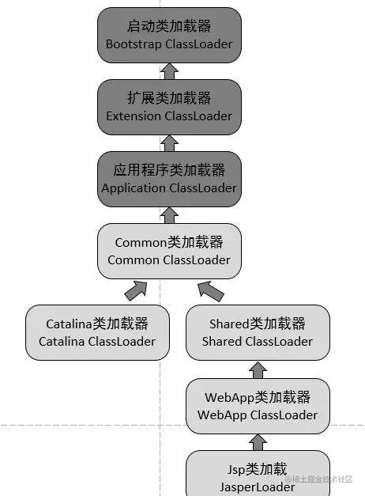

# JVM总体结构

JVM主要分为三部分：

- 类加载子系统
- 运行时数据区
- 执行引擎

# 一、内存区域详解

## 1. 运行时数据区

运行时数据区主要包含以下几个部分：

- 堆
- 元空间
- 虚拟机栈
- 本地方法栈
- 程序计数器

后三者是线程独享的。

## 2. 程序计数器

是一块较小的内存空间，线程独享。用来存放当前线程下一条将要执行的字节码指令的地址。无论是顺序执行，还是分支、循环、跳转、异常处理、线程恢复都需要依赖程序计数器来完成。

为了线程切换后，每个线程都能够恢复到正确的位置，程序计数器需要为每个线程维护一份。线程之间的程序计数器互不影响。

> 不会GC，也不会OOM。

## 3. Java虚拟机栈

Java虚拟机栈也是线程私有的，每个虚拟机栈就对应了一个Java线程。虚拟机栈内部存储的是一个个栈帧，每个栈帧对应着线程中一次方法调用。栈帧中主要存储：

- 局部变量表：记录方法中的局部变量，如果是非静态方法，第一个局部变量是`this`。基本单位是slot，大数据会占多个slot。局部变量表也是GC Roots的一部分。
- 操作数栈：主要为方法调用的中转站，用于存放方法中计算的中间结果，另外，临时变量也存储在其中。
- 动态链接：如果方法中调用了其他方法，类的Class文件的常量池中会保存被调用方法的符号引用(以字符串形式注明被调用方法的路径名和方法名)。当开始调用该方法时，就会将符号引用转换为直接引用，即直接指向该方法信息的指针。这个过程就被称为动态链接。
- 返回地址：方法执行完成后，需要返回被调用处继续执行。

> 不会被GC，但是会OOM。
>
> 如果栈是固定大小的，那么当新创建栈帧时，发现空间不够，就会抛出`StackOverFlow`。
>
> 如果允许栈自动扩容，当尝试扩容，但是扩容失败时，就会抛出`OutOfMemory:Stack`。
>
> 另外，如果新创建虚拟机时，发现剩余空间不足以创建，也会抛出`OutOfMemory:Stack`。

方法有两种返回方式：一种是正常返回；另一种是抛出异常。无论哪种返回方式，都会导致栈帧被弹出，方法都算作执行结束。

## 4. 本地方法栈

在HotSpot虚拟机中，本地方法栈和虚拟机栈合二为一。

当线程调用本地方法时，就会在本地方法栈中压入一个栈帧，用于存放本地方法的局部变量表、操作数栈、动态链接等。

> 因此，同样也会出现`StackOverFlowError`和`OutOfMemory`异常。

## 5. 堆

Java运行时数据区最大的区域。也是GC主要发生的地点。几乎所有的对象实例都在这里分配空间(部分对象可以直接在虚拟机栈中分配空间，如果该对象的引用没有通过方法返回或被外界使用，就可以。即逃逸分析)。

Java堆主要分为：年轻代和老年代。年轻代又可以分为：Eden、Survivor1、Survivor2。

Eden：实例化对象时，都会先尝试在Eden分配空间，如果Eden空间不足会发起GC，如果还是不足会尝试在老年代分配空间。

当Eden快满时，就会触发Minor GC，会将Eden和Survivor区的存活对象，全部转移到Survivor to区。并且给对象年龄增加1。如果Survivor to区空间不足，也可能会直接晋升老年代。年龄增长到阈值也会晋升到老年代。

Old：老年代一般存放生命周期比较长的对象，也有比较大的对象会直接分配在这里。当老年代空间不足会触发Full GC，对堆空间所有区域进行垃圾回收。

> 如果Full GC过后，剩余空间还是不足以创建新的对象，就会抛出`OutOfMemory: Java heap space`。因为，两种GC后Eden一定会被清空，只有老年代空间不足才会OOM。
>
> 如果JVM花费太多时间进行GC，但是只能回收很少一部分空间，就会抛出`GC Overhead Limit Exceeded`异常。

## 6. 元空间

JDK1.8之后，元空间替代了永久代。主要用于存储：

- 类信息
- 字段信息
- 方法信息
- 常量
- 静态变量
- JIT代码缓存

类加载子系统将Class文件加载进内存后，将解析结果存储在元空间。

方法区是一种规范，永久代和元空间都是它的实现。

*虽然，类信息存放在元空间，但是Class对象存储在堆空间中，元空间会保留对Class对象的引用*。

> GC在方法区几乎不进行。
>
> 可能会出现OOM: Meta space。

## 7. 运行时常量池

Class文件中除了类信息外，还有用于存放编译时产生的各种字面量和符号引用的常量池。

字面量就是代码中固定出现的数值，符号引用就是用字符串表示的被引用类的路径名，包括：类符号引用、字段符号引用、方法符号引用、接口符号引用。

运行时常量池存在于方法区中。

## 8. 字符串常量池

**字符串常量池** 是 JVM 为了提升性能和减少内存消耗针对字符串（String 类）专门开辟的一块区域，主要目的是为了避免字符串的重复创建。

JDK1.7之后从永久代转移到了堆空间中。为什么要移动？

主要是因为永久代（方法区实现）的 GC 回收效率太低，只有在整堆收集 (Full GC)的时候才会被执行 GC。Java 程序中通常会有大量的被创建的字符串等待回收，将字符串常量池放到堆中，能够更高效及时地回收字符串内存。

## 9. 直接内存

直接内存并不是虚拟机运行时数据区的一部分，也不是虚拟机规范中定义的内存区域，但是这部分内存也被频繁地使用。而且也可能导致 `OutOfMemoryError` 错误出现。

直接内存的分配不会受到 Java 堆的限制，但是，既然是内存就会受到本机总内存大小以及处理器寻址空间的限制。


# 二、HotSpot中的对象

## 1. 对象的创建

主要分为以下五步：

- 类加载检查：当虚拟机遇到`new`指令时，会先检查指令的参数能否在常量池中定位到类的符号引用，并检查该符号引用是否已经被加载、解析、初始化过。如果没有，就会进行相关的类加载过程。
- 分配内存：类加载检查通过后，会给对象分配内存。把一块确定大小的内存从 Java 堆中划分出来。分配方式有”指针碰撞“和”空闲列表“两种方式。
  - 指针碰撞：没有内存碎片，JVM只需要维护堆空间空闲空间的起始位置即可。将空闲空间指针向后移动待分配对象空间大小即可。
  - 空闲列表：有内存碎片，JVM需要维护一个列表，记录哪块空间是可用的。在分配时，找到一块能够容纳待分配对象的空闲空间，然后更新列表。

> 内存分配并发问题。
>
> 创建对象时，必须保证线程安全，因为在实际开发过程中，创建对象是很频繁的事情，作为虚拟机来说，必须要保证线程是安全的，通常来讲，虚拟机采用两种方式来保证线程安全：
>
> - **CAS+失败重试：** CAS 是乐观锁的一种实现方式。所谓乐观锁就是，每次不加锁而是假设没有冲突而去完成某项操作，如果因为冲突失败就重试，直到成功为止。**虚拟机采用 CAS 配上失败重试的方式保证更新操作的原子性。**
> - **TLAB：** 为每一个线程预先在 Eden 区分配一块儿内存，JVM 在给线程中的对象分配内存时，首先在 TLAB 分配，当对象大于 TLAB 中的剩余内存或 TLAB 的内存已用尽时，再采用上述的 CAS 进行内存分配。

- 初始化零值：内存分配完成后，给分配到的空间全部置零值。这一步操作保证了对象的实例字段在 Java 代码中可以不赋初始值就直接使用。
- 设置对象头：初始化零值完成之后，**虚拟机要对对象进行必要的设置**，例如这个对象是哪个类的实例、如何才能找到类的元数据信息、对象的哈希码、对象的 GC 分代年龄等信息。 **这些信息存放在对象头中。**
- 执行`<init>`方法：在上面工作都完成之后，从虚拟机的视角来看，一个新的对象已经产生了，但从 Java 程序的视角来看，对象创建才刚开始，`<init>` 方法还没有执行，所有的字段都还为零。所以一般来说，执行 new 指令之后会接着执行 `<init>` 方法，把对象按照程序员的意愿进行初始化，这样一个真正可用的对象才算完全产生出来。


## 2. 对象的内存布局

对象在堆内存中主要分为三部分：对象头、实例数据和对齐填充。

对象头主要包含两部分信息：

- 标记字段：用于存储对象自身的运行时数据， 如哈希码（HashCode）、GC 分代年龄、锁状态标志、线程持有的锁、偏向线程 ID、偏向时间戳等等。
- 类型指针：对象指向它的类元数据的指针，虚拟机通过这个指针来确定这个对象是哪个类的实例。指向的是方法区中的类元信息。

**实例数据部分是对象真正存储的有效信息**，也是在程序中所定义的各种类型的字段内容。

## 3. 对象的定位访问

目前主流的有两种访问堆中对象实例的方式：

- 句柄：在堆中维护一个句柄池，句柄池中会记录到对象实例的指针和到对象类元信息的指针。外部对对象的引用指向的是句柄池。
  - 优点：对象位置发生移动时，不需要修改外部对其的引用，而只用修改句柄池即可。方便维护。
- 直接指针：外部对对象的引用直接指向对象在堆中的实例。对象头中再保存指向类型信息的指针。
  - 优点：节省了时间开销。但是不方便维护。


# 三、垃圾回收详解

## 1. 死亡对象判断方法

### 引用计数法

给对象中添加一个引用计数器：

- 每当有地方引用它，就增加1。
- 每当有引用失效，就减少1。
- 任何时候引用计数器为0时，对象就已经死亡了。

特点：简单、高效。但是无法解决循环引用问题。

### 可达性分析

基本思想就是从一系列GC Roots的根节点开始，向下搜索，搜索所走过的路径称为引用链。当一个对象没有和任何GC Roots相连时，证明此对象已经死亡，需要被回收。

**哪些对象可以作为 GC Roots 呢？**

- 虚拟机栈(栈帧中的局部变量表)中引用的对象
- 本地方法栈(Native 方法)中引用的对象
- 方法区中类静态属性引用的对象
- 方法区中常量引用的对象
- 所有被同步锁持有的对象
- JNI（Java Native Interface）引用的对象

## 2. 对象可以被回收就一定会被回收吗

即使在可达性分析法中不可达的对象，也并非是“非死不可”的，这时候它们暂时处于“缓刑阶段”，要真正宣告一个对象死亡，至少要经历两次标记过程；可达性分析法中不可达的对象被第一次标记并且进行一次筛选，筛选的条件是此对象是否有必要执行 `finalize` 方法。当对象没有覆盖 `finalize` 方法，或 `finalize` 方法已经被虚拟机调用过时，虚拟机将这两种情况视为没有必要执行。

被判定为需要执行的对象将会被放在一个队列中进行第二次标记，除非这个对象与引用链上的任何一个对象建立关联，否则就会被真的回收。

## 3. 引用类型总结

JDK1.2之后对引用的概念进行了扩充，将引用分为强引用、软引用、弱引用、虚引用四类。引用的强度依次递减。除了强引用外，其他三种都可以在`java.lang.ref`包中找到。

Reference子类中只有中继器引用是包内可见的，其他三种引用类型都是public修饰。

- 强引用(Strong Reference)：最传统的引用定义，是指程序中普遍存在的引用赋值，类似于`Object obj = new Object()`这种引用关系。无论任何情况下，*只要强引用关系还存在，垃圾收集器就不会回收掉这些对象*。
- 软引用(Soft Reference)：*系统在即将发生内存溢出之前*，会这些对象列入回收范围之中进行二次回收，如果这回收后还没有充足的空间，才会抛出内存溢出异常。
- 弱引用(Weak Reference)：被弱引用关系引用的对象*只能生存到下一次垃圾回收之前*。当GC开始时，无论内存空间是否充足，都会将这些对象回收。
- 虚引用(Phantom Reference)：一个对象是否有虚引用的存在，*完全不会对其生存构成影响*，也无法通过虚引用来获取一个对象的实例。为一个对象设置虚引用的*唯一目的，就是能够在这个对象被回收时收到一个系统通知*。

## 4. 垃圾清除算法

### 标记-清除算法

先标记出来要回收的对象，然后再将对象直接清除。

清除后会产生大量的内存碎片。

### 复制算法

将内存划分为大小相同的两个空间。每次只使用一半的空间。

标记出来需要回收的对象后，将存活对象按照顺序复制到另一半空间。

特点：没有内存碎片，空间利用率低。不适合老年代，因为大部分对象都是存活的，需要复制过多的对象。

### 标记-整理算法

标记完要回收的对象后，将它们全部清除，然后将存活对象进行整理。

### 分代收集

不同的算法，有自己的使用场景。复制算法适合年轻代，因为大部分对象都是要清除的，需要复制的对象较少，且浪费的空间比较小(8:1:1)。标记整理适合老年代。

> 为什么堆空间需要分代？
>
> - 一点是对象的生命周期
> - 一点是垃圾收集算法

## 5. CMS

**CMS（Concurrent Mark Sweep）收集器是 HotSpot 虚拟机第一款真正意义上的并发收集器，它第一次实现了让垃圾收集线程与用户线程（基本上）同时工作。**

从名字中的**Mark Sweep**这两个词可以看出，CMS 收集器是一种 **“标记-清除”算法**实现的，它的运作过程相比于前面几种垃圾收集器来说更加复杂一些。整个过程分为四个步骤：

- **初始标记：** 暂停所有的其他线程，并记录下直接与 root 相连的对象，速度很快 ；
- **并发标记：** 同时开启 GC 和用户线程，用一个闭包结构去记录可达对象。但在这个阶段结束，这个闭包结构并不能保证包含当前所有的可达对象。因为用户线程可能会不断的更新引用域，所以 GC 线程无法保证可达性分析的实时性。所以这个算法里会跟踪记录这些发生引用更新的地方。
- **重新标记：** 重新标记阶段就是为了修正并发标记期间因为用户程序继续运行而导致标记产生变动的那一部分对象的标记记录，这个阶段的停顿时间一般会比初始标记阶段的时间稍长，远远比并发标记阶段时间短
- **并发清除：** 开启用户线程，同时 GC 线程开始对未标记的区域做清扫。

缺点：

- **对 CPU 资源敏感；**
- **无法处理浮动垃圾；**
- **它使用的回收算法-“标记-清除”算法会导致收集结束时会有大量空间碎片产生。**

## 6. G1

被视为 JDK1.7 中 HotSpot 虚拟机的一个重要进化特征。它具备以下特点：

- **并行与并发**：G1 能充分利用 CPU、多核环境下的硬件优势，使用多个 CPU（CPU 或者 CPU 核心）来缩短 Stop-The-World 停顿时间。部分其他收集器原本需要停顿 Java 线程执行的 GC 动作，G1 收集器仍然可以通过并发的方式让 java 程序继续执行。
- **分代收集**：虽然 G1 可以不需要其他收集器配合就能独立管理整个 GC 堆，但是还是保留了分代的概念。
- **空间整合**：与 CMS 的“标记-清除”算法不同，G1 从整体来看是基于“标记-整理”算法实现的收集器；从局部上来看是基于“标记-复制”算法实现的。
- **可预测的停顿**：这是 G1 相对于 CMS 的另一个大优势，降低停顿时间是 G1 和 CMS 共同的关注点，但 G1 除了追求低停顿外，还能建立可预测的停顿时间模型，能让使用者明确指定在一个长度为 M 毫秒的时间片段内，消耗在垃圾收集上的时间不得超过 N 毫秒。

其过程如下：

- **初始标记**：标记出GC Roots直接可达的对象。STW。单线程
- **并发标记**：和用户线程并发执行，标记存活对象。单线程
- **最终标记**：修正上次并发的结果。STW。多线程
- **筛选回收**：并行回收，STW。

**G1 收集器在后台维护了一个优先列表，每次根据允许的收集时间，优先选择回收价值最大的 Region(这也就是它的名字 Garbage-First 的由来)** 。这种使用 Region 划分内存空间以及有优先级的区域回收方式，保证了 G1 收集器在有限时间内可以尽可能高的收集效率（把内存化整为零）。

## 7. 安全点与安全区

​	

# 四、类加载过程详解

## 1. 类的生命周期

类从被加载进虚拟机开始，到卸载出内存为止，生命周期可以划分为三个阶段：

- 加载
- 连接
  - 验证
  - 准备
  - 解析
- 初始化
- 使用
- 卸载

### 加载

分为三步：

1. 通过类的全限定名获取类文件的二进制字节流。
2. 将字节流表示的静态存储结构转换为运行时数据区的结构。
3. 在内存中生成一个Class对象，作为访问方法区中类信息的入口。

### 链接

1. 验证阶段：验证类文件中数据是否符合JVM要求，确保加载类的正确性。
2. 准备阶段：给类变量(非`final`修饰的static变量)赋初值，即零值。
3. 解析阶段：将常量池中的符号引用转换为直接引用。例如`sout("hello");`在Class文件中实际上是指向了一个字符串的符号引用而不是指向hello字符串的对象。

### 初始化

执行`<clinit>()`方法的过程，即类构造器(不是类的构造器)。javac会自动收集静态变量和静态代码块中的赋值操作，合并而来。

> 由于类变量已经经过准备阶段的赋零值操作，所以允许在Java代码中先赋值类变量，在做出定义。
>
> 但是，不能使用该类变量，如输出打印。


# 五、类加载器

## 1. 类加载器分类

主要有三种类加载器：

- BootstrapClassLoader：由C++实现，没有父级加载器。用来加载Java的核心类库。
- ExtensionClassLoader：继承自ClassLoader抽象类，负责加载 `%JRE_HOME%/lib/ext` 目录下的 jar 包和类以及被 `java.ext.dirs` 系统变量所指定的路径下的所有类。父级加载器为启动类加载器。
- AppClassLoader/SystemClassLoader：面向用户的加载器，用来加载应用程序classpath下的jar包和类。父级加载器为扩展类加载器。

由于启动类加载器没有父级加载器，那么对于一个Class对象获取其类加载器后，调用`getParent()`方法返回值为null，证明该类是被启动类加载器加载的。

## 2. 双亲委派机制

ClassLoader主要有两个方法`loadClass()`和`findClass()`，前者用来加载类文件，后者用来定位类文件。

当需要加载类文件时，当前类加载器会在`loadClass()`方法中调用父加载器的`loadClass()`方法，即让父加载器尝试加载该类文件。

如果父加载器在其保存的已加载类对象中，找到了该类文件(证明类已经被加载过了)，就是直接返回。如果没有，就会再调用父加载器去尝试加载。

直到请求到达启动类加载器。如果都没有加载成功，最终会一级一级返回直到请求再次到达最开始的类加载器来加载。

优点：

- 避免类的重复加载。如我们自己定义一个`java.lang.String`，因为存在双亲委派机制，所以最终会被扩展类加载器加载，得到的就是Java内部的String类，而不是我们自己定义的String。
- 沙箱安全机制。如果我们在上述的自定义String中定义了main方法，我们在代码中调用main，就会报错。因为加载的是系统定义的String，而其中没有main的定义。可以保护核心代码不受恶意侵害。

## 3. 如何绕开双亲委派

正如前面所说，我们只需要自定义一个类加载器，继承ClassLoader抽象类，并重写`loadClass()`方法。在其中不去调用父加载器加载类，就可以绕过双亲委派。

## 4. 为什么要绕开双拼委派

为了实现热插拔、热部署、模块化。即添加或去除掉一个模块时不需要重启程序，只需要将模块连同类加载器一起换掉即可。

## 5. Tomcat的类加载器如何实现的

### 为什么Tomcat服务器要打破双拼委派机制

- 首先，Tomcat是一个web容器，其内部可能会部署多个应用程序。不同的应用程序可能会依赖不同版本的第三方类库。所以，不能要求同一个类库在同一个服务器中只能有一个版本。因此，要保证每个应用的类库都是独立的。
- 部署在同一个服务器上的多个应用程序，如果依赖的是同一个类库的同一版本，那么应该能够共享。否则如果有N个程序就要将同样的类库加载N份，浪费资源。
- web容器自己也有依赖的类库，应该将web容器的类库和程序的类库隔离开来。
- web容器支持jsp文件的修改，jsp文件最终也需要编译为class文件才能运行，但大部分情况下都是在程序运行后才修改jsp，所以web容器需要支持jsp修改后不用重启。

那么Tomcat使用默认的类加载器能否完成以上目标？

不能，首先，使用默认类加载器，同一个类库在JVM中只能存在一个版本，因为默认类加载器认为全限定名一致的两个类是同一个类。

其次，对于修改后的jsp文件，其对应的class文件已经被类加载器加载过，因此修改后不会重新加载，只能重启才能看到修改后的结果。

### 如何做到



Tomcat自己实现了五种类加载器：

- CommonClassLoader：Tomcat的基本类加载器，加载路径中的Class对象可以被Tomcat容器本身和各个Webapp访问。会加载`/common/*`路径下的文件。
- CatalinaClassLoader：Tomcat容器私有的类加载器，加载路径中的Class对Webapp不可见。会加载`/server/*`路径下的文件。
- SharedClassLoader：各个Webapp共享的类加载器，加载路径中的Class对所有的Webapp可见，但是对于Tomcat容器不可见。会加载`/shared/*`路径下的文件。
- WebAppClassLoader：各个Webapp私有的类加载器，每个Webapp对应一个。加载的Class仅对当前Webapp可见。会加载`/WebApp/WEB-INF/*`路径下的文件。
- JasperLoader：JSP文件对应的类加载器，每个JSP文件对应一个，修改JSP后，直接卸载该类加载器，即可重新加载JSP文件。

> 为什么说Tomcat破坏了双亲委派机制？
>
> 双亲委派机制是指除了启动类加载器，其余的类加载器在加载字节码文件时，都要先让其父级类加载器来尝试加载，父级无法加载再自己尝试。
>
> Tomcat实现的Webapp类加载器就不会请求父级加载器来加载其路径下的文件，而是自己加载。


# 六、OOM原因排查

## 1. OOM原因及分类

首先，OOM可能的原因有两种：

- JVM内存设置过小：JVM初始化内存小，不能满足业务需求；或者JVM内存不同区域比例设置不合理。
- 内存泄漏：某个对象频繁地被创建，但是一直没有被回收，导致内存耗尽。

OOM的分类：

- `OOM: Metadata space`：元空间内存溢出。一般是存储的类元信息、方法信息等耗尽了内存，即加载了过多的类文件。
- `OOM: Stack space`：栈空间内存溢出。如果虚拟机栈可以动态扩容，当扩容时发现剩余内存不足以扩展，就会爆出栈空间内存溢出。另外，如果创建新的虚拟机栈时发现空间不足，也会抛出该异常。
- `OOM: java heap space`：堆空间溢出。一般就是由于JVM内存设置不合理和内存泄漏导致的。

## 2. OOM排查方法

### 查看JVM内存分布

通过`jmap -heap PID`指令，来查看Java程序的内存分布。此指令可以获取Java堆栈的设置情况、使用情况(新生代、老年代各自的使用情况)。通过观察内存分布来考虑JVM内存设置是否合理。

通过`jmap -histo:live PID | more`来查看JVM最消耗资源的对象。对象会按照以下三个属性排序：

- instances：实例数
- bytes：字节数
- class name：类名

### DUMP文件分析

Dump 文件是 Java 进程的内存镜像，其中主要包括**系统信息**、**虚拟机属性**、**完整的线程 Dump**、**所有类和对象的状态**等信息。

JVM 启动参数配置添加以下参数：

- -XX:+HeapDumpOnOutOfMemoryError
- -XX:HeapDumpPath=./（参数为 Dump 文件生成路径）

然后通过JvisualVM、JProfiler等工具来分析Dump文件


# 七、JVM相关参数与调优

## 1. 堆内存相关

- 显式指定堆内存：
  - `-Xms`：堆内存起始大小。
  - `-Xmx`：堆内存最大大小。
- 显式指定新生代大小：
  - `-XX:NewSize=`：指定新生代最小大小。
  - `-XX:MaxNewSize`：指定新生代最大大小。
  - `-Xmn`：新生代固定大小。
  - `-XX:NewRatio=`：新生代老年代的比例。
- 显示指定元空间大小：
  - `-XX:PermSize=/-XX:MetaspaceSize=`：永久代/元空间初始大小。
  - `-XX:MaxPermSize=/-XX:MaxMetaspaceSize=`：永久代/元空间最大大小。


## 2. 垃圾回收相关

- 指定垃圾回收器：
  - `-XX:+UseSerialGC`
  - `-XX:+UseParallelGC`
  - `-XX:+UseConcMarkSweepGC`
  - `-XX:+UseG1GC`
- GC日志记录


## 3. 处理OOM

```java
-XX:+HeapDumpOnOutOfMemoryError // 出现OOM将堆内存转储到物理文件中
-XX:HeapDumpPath=./java_pid<pid>.hprof // 表明要写入的文件路径
-XX:OnOutOfMemoryError="< cmd args >;< cmd args >" // OOM出现时，执行命令
-XX:+UseGCOverheadLimit // 在抛出OOM之前，在GC中花费的时间限制
```


