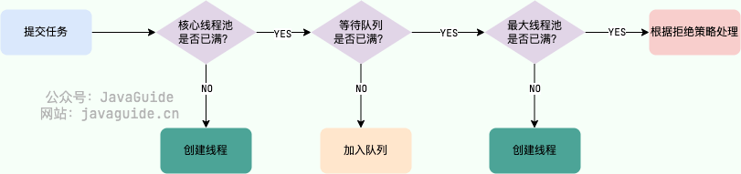

# 一、基本概念与常识

## 1. Java语言的特点

- 简单易学，好上手。
- 面向对象(封装、继承、多态)。
- 平台无关性(Java程序编译为平台无关的字节码文件，在对应平台上的JVM上皆可直接运行)。
- 支持多线程(C++没有内置的多线程机制，因此必须调用系统的多线程功能来支持多线程，而Java提供了多线程机制)。
- 可靠性(Java具备异常处理机制和自动内存管理)。
- 编译与解释并存(首先，Java程序会先编译成字节码，然后由JVM逐行解释为机器码交给CPU执行；其次，Java存在JIT可以将字节码直接编译为本地机器码来直接运行)。

## 2. Java SE vs Java EE

Java SE是指Java标准版，Java语言的基础，包含了Java应用程序开发和运行的核心类库以及虚拟机等核心组件。

Java EE是指Java企业版，在Java SE的基础上，增加了企业级应用开发和部署的标准和规范，包括Servlet、JDBC、JSP等。


## 3. JVM vs JDK vs JRE

简单来说，JDK包含了JRE，JRE又包含了JVM。

### JVM

JVM是指Java虚拟机，是负责将Java程序编译好的字节码文件加载入内存并解释执行的程序。JVM针对不同的操作系统都有不同的实现，目的就是为了能够让一个Java程序经过一次编译生成的字节码能够在不同平台上直接运行，而不用作出修改。

另外，JVM并不是只有一种，只要是符合Java虚拟机规范，每个公司都可以实现自己的JVM。

### JDK & JRE

JRE是指Java运行时环境，它包含了运行一个已编译Java程序所需的所有内容的集合，其中就包括了JVM和Java基础类库。

JDK是指Java开发工具，是提供给开发者使用的，能够创建和编译Java程序的开发套件。它包含了JRE和其他的工具，如jconsole，jdb，javadoc等。


## 4. 什么是字节码，字节码的优缺点

字节码即`.class`文件，是Java程序编译后的二进制文件。字节码文件能够被JVM直接运行，它不面向特定的处理器，只面向虚拟机。JVM运行时会将字节码文件加载进内存，并将字节码指令逐个翻译为机器码，交给处理器执行。

优点：
- 首先，就是Java的一次编译到处运行。Java程序只需要经过一次编译，就可以在不同平台上直接运行。
- 一定程度上解决了纯解释型语言的效率低的问题，在Java程序编译为字节码文件时，就可以被编译器优化从而调高解释执行的效率。

缺点：
- 性能相较于纯编译型的语言较差，因为字节码文件还需要经过JVM解释才能运行，因此时间效率上比不过纯编译型语言。
- 存在反编译风险，字节码文件更容易被反编译。
- 启动时间长，JVM需要初始化和加载字节码，因此Java程序的启动时间相较于纯编译型语言稍显劣势。
- Java字节码文件依赖JVM，因此，目标机器上必须安装相应版本的JVM才能正常运行。

## 5. 为什么说Java编译与解释并存

首先，Java程序需要先被编译为二进制字节码文件，这一步就是编译的体现。然后，再通过JVM将字节码指令逐条翻译为机器指令来交给处理器执行，这一步就是解释的体现。因此Java是编译与解释并存。

其次，JVM中存在JIT即时编译器，可以在字节码指令执行时，进行热点代码的探测，然后将热点代码直接编译为本地机器代码交给处理器执行从而提高效率。因此，Java程序在运行过程中既有字节码指令的解释执行，又有编译好的本地代码的直接执行，因此Java编译与解释并存。

## 6. AOT与JIT

### JIT

JIT是指即时编译，JVM在解释执行字节码文件时，会对其中的热点代码进行探测，然后将热点代码编译为本地机器码，从而可以直接在处理器上执行，提高程序的执行效率。

优点：
- 可以根据当前硬件情况实时编译生成最优机器指令。
- 可以根据当前程序的运行情况生成最优的机器指令序列。
- 可以根据进程中内存的实际情况调整代码，使内存能够更充分的利用。

缺点：
- 编译需要占用运行时资源，会导致进程卡顿。
- 需要一定时间和调用频率才能触发JIT。

### AOT

AOT预编译，是相对于JIT来说的，它是在Java程序还没有执行以前，就提前将字节码编译为可以直接执行的机器码。JVM在一起动时就可以直接调用这些预编译好的代码，从而提高启动速度，提高执行效率。同时，JIT需要预热，在执行过程中逐渐地将字节码编译，AOT就可以避免JIT预热的开销。

优点：
- 在程序运行前编译，可以避免在运行时的编译性能消耗和内存消耗。
- 可以在程序运行初期就达到最高性能。
- 可以显著的加快程序的启动。

缺点：
- 在程序运行前编译会使程序安装的时间增加。
- 不能支持Java的一些动态特性，如反射、动态代理等，但是很多框架都是用到了这些特性。
- 将提前编译的内容保存会占用更多的内存。
- 不能根据程序的运行情况进行调整。


## 7. Java和C++的区别

- Java提供自动内存管理，而C++需要手动分配和释放内存空间。
- Java不提供指针来直接访问内存，程序的内存更加安全。
- Java的类不支持多继承，而接口可以多继承。C++的类可以多继承。
- C++同时支持运算符重载和方法重载，Java只支持方法重载。


# 二、基本数据类型

## 1. 基本数据类型和其包装类型的区别

- 用途：基本数据类型一般只用作常量和局部变量，而包装类型用途较广。
- 存储方式：基本数据类型一般直接存储在Java虚拟机的局部变量表中，而包装类型在局部变量表中只有一个引用变量，其实力本身存储在堆中。
- 占用空间：基本数据类型相较于其对应的包装类型，占用空间较少。
- 基本数据类型可以通过`==`来判断是否相同，而包装类型`==`只能判断引用对象的地址是否相同。

Java中万物皆对象，一些场景下，如泛型，不能使用基本数据类型的数据，因此要用包装类型数据来装箱。另外，Java还提供了自动装箱和拆箱的机制。

## 2. 包装类型的缓存机制

Java 基本数据类型的包装类型的大部分都用到了缓存机制来提升性能。

Byte，Short，Integer，Long这4种包装类默认创建了数值$[-128，127]$的相应类型的缓存数据，Character创建了数值在$[0,127]$范围的缓存数据，Boolean直接返回True or False。

也就是说，连续两次通过自动装箱机制来申请包装类型数据，会返回同一个对象，前提是数据要落在缓存范围内。(如果使用的是new关键字，一定会创建新的对象)。

## 3. 自动装箱与自动拆箱

- 装箱：将基本类型用它们对应的引用类型包装起来。
- 拆箱：将包装类型转换为基本数据类型。

在遇到需要装箱和拆箱的场景就会触发，如将包装类型赋给基本数据类型的变量。

## 4. 为什么浮点数计算会丧失精度

因为浮点数遵循的是IEEE 754协议，其表示一个数的时候，会通过阶码和尾数来表示一个浮点是，而尾数部分长度有限，当浮点数超出了尾数部分所能表达的精度，超出部分就会丧失。

为了解决，可以通过BigDecimal来对浮点数运算。

## 5. 为什么静态方法不能调用非静态成员

首先，静态方法是被`static`关键字修饰的方法。静态方法是属于类的，当类的`.class`文件被加载进内存时，就会分配内存，不依赖于类的实例化对象，可以直接通过类名来调用。因此，即使当前类没有任何实例对象也是可以直接使用静态方法的。如果此时静态方法内部调用了非静态的成员，就无法正常运行。

## 6. 重载和重写

方法的重载是指使用同一个方法名，不同的形参来定义不同的方法。发生在类的内部。

方法的重写是指子类重写父类中定义的方法，方法名和参数列表都需要相同。

# 三、面向对象基础

## 1. 面向对象和面向过程的区别

- 面向过程会将问题拆解成一个一个的方法，通过方法的调用来解决问题。
- 面向对象则是将问题中涉及到的内容抽象成一个一个的对象，通过对象之间的交互来解决问题。

面向对象更符合思考问题的过程，能够更清晰地描述问题。

## 2. 如果一个类没有声明构造器，能否实例化对象

Java中即使一个类没有显示地定义构造方法，在编译时也会自动补充上一个`public`修饰的空参构造器。因此，可以实例化对象。但是，只要在类中定义了构造器，就不会有默认的空参构造器了，此时如果调用空参构造器就会报错。

构造方法名称必须和类名相同，没有返回值，不能被重写但是能够被重载。

## 3. 面向对象三大特征

- 封装：是指把一个对象的状态信息(也就是属性)隐藏在对象内部，不允许外部对象直接访问对象的内部信息。但是可以提供一些可以被外界访问的方法来操作属性getter/setter。
- 继承：不同类型的对象，相互之间经常有一定数量的共同点。通过使用继承，可以快速地创建新的类，可以提高代码的重用，程序的可维护性，节省大量创建新类的时间 ，提高我们的开发效率。
  - 子类拥有父类对象所有的属性和方法(包括私有属性和私有方法)，但是父类中的私有属性和方法子类是无法访问，只是拥有。
  - 子类可以拥有自己属性和方法，即子类可以对父类进行扩展。
  - 子类可以用自己的方式实现父类的方法。
- 多态：具体表现为父类的引用变量指向子类的实例对象。
  - 引用类型变量发出的方法调用的到底是哪个类中的方法，必须在程序运行期间才能确定。
  - 多态不能调用“只在子类存在但在父类不存在”的方法。
  - 如果子类重写了父类的方法，真正执行的是子类重写的方法，如果子类没有重写父类的方法，执行的是父类的方法。

## 4. 接口和抽象类的区别

共同点：
- 都不不能被实例化。
- 都有抽象方法。
- 都可以有默认实现的方法。

不同点：
- 接口主要是对类的行为进行约束，当前类实现了某个接口就具有了某项功能；而抽象类只是为了代码复用和体现继承关系。
- 一个类只能继承一个类，但是可以实现多个接口。
- 接口中的成员属性只能是`public static final`类型的，而抽象类中的成员属性默认是`default`，可以在子类中重新定义，可以重新赋值。

## 5. 深拷贝和浅拷贝

深浅拷贝对应的场景是类中的成员变量是另一个类的实例对象。此时，如果拷贝类的对象，就会出现深拷贝和浅拷贝。

- 深拷贝：成员对象也会重新实例化一个新的对象，将引用赋给成员变量。
- 浅拷贝：成员对象还是指向原来的对象，即拷贝前后的新老对象，其内部的成员对象指向的是同一个实例化对象。

## 6. ==和equals

- 对于基本类型变量来说，`==`和`equals()`等同，都是判断变量值是否相等。
- 对于引用类型变量来说，`==`只能判断引用的对象在堆内存中的地址是否相同，`equals()`可以经过重写判断属性值是否相同。

上述现象是因为Java中，方法中的变量都是保存在局部变量表中的，使用`==`就是判断局部变量表中存储的内容。但是引用类型变量在局部变量表中存储的内容，是实例对象在堆内存中的地址。因此，使用`==`就只能判断地址是否相同。

而引用类型都是继承自Object类，Object类中提供了`equals()`方法，可以在类中重写，用来判断属性是相同。

## 7. hashCode的作用

`hashCode()`方法是一个本地方法，能够根据指定的属性来计算哈希值。

在一些容器中，如HashMap、HashSet，会先根据哈希值来判断元素是否已经出现在容器中。如果计算出两个对象哈希值相同，再根据`equasl()`方法来判断对象是否相等，可以大大减少判断的耗时。

因此，有如下结论：
- 哈希值不同，两个对象一定不同。
- 哈希值相同，两个对象也可能不相同。
- 哈希值相同，如果`equals()`方法也返回true，就认为两个对象是相同的。

因此，重写`equals()`方法时，也要重写`hashCode()`方法。避免出现`equals()`判断相等，但是哈希值不相等的情况。


# 四、String

## 1. String、StringBuilder、StringBuffer

StringBuilder和StringBuffer都继承自`AbstractStringBuilder`抽象类，内部也是使用`char[]`来存储字符串，但是`char[]`没有被`final`修饰，所以是可以改变的。都提供`append()`等方法来修改字符串。

StringBuilder线程不安全，StringBuffer是线程安全的。StringBuffer对方法加了同步锁或者对调用的方法加了同步锁，所以是线程安全的。


## 2. String为什么是不可变的

首先，String内部使用的是`private final char[]`字符数组来保存字符串，所以数组的引用一旦赋值就不能修改。

另外，String类也被`final`修饰，所以不能被继承，因而防止了被子类继承而修改。


## 3.  字符串拼接

在Java程序中使用字符串拼接有以下几种情况：

- 参与拼接的字符串都是字面量：`String str = "123" + "456";`，会直接优化为拼接的结果。
- 参与拼接的字符串中有变量：`String str1 = "123"; String str2 = "345" + str2;`。

对于第二种情况，JVM会隐式创建一个StringBuilder，然后调用两次`append()`方法来进行字符串拼接。拼接完成后会调用`toString()`方法返回字符串，然后这个StringBuilder就没丢弃。

在循环中拼接字符串，就会重复创建StringBuilder对象，因此要避免在循环中采用`+`来拼接字符串，而是自己创建一个StringBuilder。


## 4. String#equals

`String#equals`方法重写过，可以判断字符串的内容是否相等。


## 5. 字符串常量池

字符串常量池逻辑上属于元空间，但是实际上存放在堆空间上。

常量池中不会存在重复对象，如果要创建的字符串已经存在，就会直接返回地址而不是创建新的。

如果通过字面量来创建字符串`String str = "123";`会直接在常量池中创建对象。

如果通过`new`关键字来创建对象，则分为两种情况：

- 传入的是一个字面量：`String str = new String("123");`，则等同于两条代码`String s = "123"; String str = new String(s);`。会先尝试在常量池中创建字符串，然后再去堆空间中创建一个字符串对象。
- 传入的是一个字符串变量：直接在堆空间中创建字符串对象。


`intern()`，会尝试在常量池中创建一个当前字符串的对象。如果，创建字符串时直接传入的是字面量，那么常量池中就已经存在该字符串对象，`intern()`方法就不会创建新的对象，而是返回地址。


## 6. String会创建几个对象

### 举例

```java
public static void main(String[] args) {
    String s1 = new String("1");
    s1.intern();
    String s2 = "1";
    sout(s1 == s2); // false
    
    String s3 = new String("1") + new String("1");
    s3.intern();
    String s4 = "11";
    sout(s3 == s4); // true
}
```

首先，`s1 == s2`为false，因为s1对象本身是存储在堆空间中的，即便调用了intern，其本身不会发生变化(况且即便不调用intern，也会在常量池创建“1”)。s2直接指向的是常量池中的字符串对象。

然后，s3首先会创建两个`"1"`对象，然后通过StringBuilder来拼接对象，最后返回的是存储在堆中的s3，且此时字符串常量池中没有"11"字符串。接着执行intern，才将“11”在堆中的地址记录在常量池中。s4直接引用的是常量池中的对象，所以其地址就是s3的地址。

如果交换代码顺序就会出现不同结果。

```java
public static void main(String[] args) {
    String s3 = new String("1") + new String("1");
    String s4 = "11";
    s3.intern();
    sout(s3 == s4); // false
}
```

s3在堆上创建后，此时字符串常量池中只有"1"。然后在常量池中创建“11”。s3执行intern时，直接返回的是s4的地址，因此两个字符串变量地址不相同。

```java
public static void main(String[] args) {
    String s = new String("a") + new String("b");
    String s2 = s.intern(); // 创建了对象
    String s3 = "ab";
    sout(s2 == s3); // true
    sout(s == s3); // false
}
```

```java
public static void main(String[] args) {
    String s = new String("a") + new String("b");
    s.intern(); // 发生了对象创建，地址不一致
    String s2 = "ab";
    sout(s == s2); // false
}
```


### 面试题`new String("abc");`会创建几个对象

1个或2个。使用`new`关键字创建String对象，相当于两个语句`String s = "abc"; String str = new String(s);`。

如果常量池中没有存在该字符串，会先在常量池中创建，然后再在堆中创建。

如果常量池种已经存在该字符串，只会在堆中创建。


### `new String("a") + new String("b")`会创建几个对象

5个或几个。

对于a和b，其创建过程都和上一题一致。然后因为涉及到字符串拼接，会使用StringBuilder对象，然后调用toString()方法。因此，最多创建5个。

> toString只会在对中创建字符串对象，而new会先在常量池中创建，再去堆中创建。
>
> 虽然StringBuilder#toString也是调用的`new`关键字，但是构造器不是同一个。只会在对中创建对象。


# 五、异常

**Java 异常类层次结构图概览**：


## 1. Exception和Error的区别

- **`Exception`** :程序本身可以处理的异常，可以通过 `catch` 来进行捕获。`Exception` 又可以分为 Checked Exception (受检查异常，必须处理) 和 Unchecked Exception (不受检查异常，可以不处理)。
- **`Error`**：`Error` 属于程序无法处理的错误 ，我们没办法通过 `catch` 来进行捕获不建议通过`catch`捕获 。例如 Java 虚拟机运行错误(`Virtual MachineError`)、虚拟机内存不够错误(`OutOfMemoryError`)、类定义错误(`NoClassDefFoundError`)等 。这些异常发生时，Java 虚拟机(JVM)一般会选择线程终止。

## 2. CheckedException和UncheckedException的区别

- 受检查异常：除了RuntimeException及其子类以外，其他的Exception及其子类都是受检查异常。在编译时期，如果没有没有通过`catch`或者`throws`关键字来处理异常，就无法通过编译。
- 不受检查异常：RuntimeException及其子类，只有在运行期间才能发现的异常，编译时期即使不处理也可以通过编译。如空指针异常、数组越界、类型转换错误等。

## 3. try-catch-finally如何使用

- `try`块：用于捕获异常。其后可接零个或多个 `catch` 块，如果没有 `catch` 块，则必须跟一个 `finally` 块。
- `catch`块：用于处理 try 捕获到的异常。
- `finally` 块：无论是否捕获或处理异常，`finally` 块里的语句都会被执行。当在 `try` 块或 `catch` 块中遇到 `return` 语句时，`finally` 语句块将在方法返回之前被执行。

**不要在 finally 语句块中使用 return!** 当 try 语句和 finally 语句中都有 return 语句时，try 语句块中的 return 语句会被忽略。这是因为 try 语句中的return返回值会先被暂存在一个本地变量中，当执行到finally语句中的return之后，这个本地变量的值就变为了 finally 语句中的 return 返回值。

## 4. finally中的代码一定会执行吗

不一定，如果在finally之前发生：虚拟机关闭、线程终结、CPU关闭，就不会被执行。


# 六、反射

## 1. 什么是反射，谈谈对反射的理解

反射就是通过类的Class对象来获取类中定义的属性和方法。它赋予了我们在运行时分析类以及执行类中方法的能力。

反射可以让我们的代码更加灵活，为各种框架提供了支持。

缺点：

- 但是反射也增加了安全问题，比如可以无视泛型参数的安全检查(泛型参数的安全检查发生在编译时)。
- 另外，反射的性能也要稍差点。


# 七、序列化和反序列化

## 1. 什么是序列化和反序列化

- 序列化：是指将数据结构或对象转换成二进制字节流的过程。
- 反序列化：是指将在序列化过程中所生成的二进制字节流转换成数据结构或者对象的过程。

为了能够将Java对象持久化，如保存在文件中，或者通过网络传输对象就需要用到序列化。

## 2. transient关键字

如果对象的某些字段不需要被序列化，就可以通过`transient`关键字来修饰。其作用为：阻止实例中那些用此关键字修饰的的变量序列化；当对象被反序列化时，被 `transient` 修饰的变量值不会被持久化和恢复。

关于 `transient` 还有几点注意：

- `transient` 只能修饰变量，不能修饰类和方法。
- `transient` 修饰的变量，在反序列化后变量值将会被置成类型的默认值。例如，如果是修饰 `int` 类型，那么反序列后结果就是 `0`。
- `static` 变量因为不属于任何对象(Object)，所以无论有没有 `transient` 关键字修饰，均不会被序列化。


# 八、I/O

## 1. 了解Java IO吗

Java的IO是指将数据从外部存储设备输入到内存中，以及从内存中写入到外部存储。Java IO流的类都是从以下四个抽象基类中派生出来的：

- `InputStream/Reader`：所有输入流的基类，前者为字节输入流，后者为字符输入流。
- `OutputStream/Writer`：所有输出流的基类，前者为字节输出流，后者为字符输出流。

## 2. 为什么要分字节流和字符流

**不管是文件读写还是网络发送接收，信息的最小存储单元都是字节，那为什么 I/O 流操作要分为字节流操作和字符流操作呢？**

个人认为主要有两点原因：

- 字符流是由 Java 虚拟机将字节转换得到的，这个过程还算是比较耗时。
- 如果我们不知道编码类型的话，使用字节流的过程中很容易出现乱码问题。

## 3. BIO，NIO，AIO

### BIO

同步阻塞IO，应用程序发起read调用后，会一直阻塞，直到内核将待读取数据拷贝到用户空间。

当客户端连接数量较低时，影响不大。但是在连接数量较高的场景下，传统的BIO是无能为力的。

### NIO

非阻塞IO，Java中的NIO可以看作是**IO多路复用模型**。

同步阻塞IO像上面的描述一致，应用程序发起read调用之后会一直阻塞。

同步非阻塞IO，用户发起read调用后，不会阻塞等待，而是可以继续执行其他任务，但是要轮询访问数据是否已经准备完成。轮询检查是比较消耗CPU资源的。

**用户线程想要获取数据就需要发起`read`系统调用，此时必定会切换内核态，引起用户线程阻塞。但是NIO下，先调用`select`让系统准备数据，等到准备好了，再去发起`read`避免了阻塞等待数据准备好。**

IO多路复用模型：用户线程会先发起`select`调用，询问内核数据是否已经准备好。等待内核准备好数据， 用户线程再发起read调用。read过程中用户线程还是被阻塞。

> 目前支持 IO 多路复用的系统调用，有 select，epoll 等等。select 系统调用，目前几乎在所有的操作系统上都有支持。
>
> - **select 调用**：内核提供的系统调用，它支持一次查询多个系统调用的可用状态。几乎所有的操作系统都支持。
> - **epoll 调用**：linux 2.6 内核，属于 select 调用的增强版本，优化了 IO 的执行效率。

**IO多路复用模型通过减少无效的系统调用，减少了CPU资源的消耗。**

Java 中的 NIO ，有一个非常重要的**选择器 ( Selector )** 的概念，也可以被称为 **多路复用器**。通过它，只需要一个线程便可以管理多个客户端连接。当客户端数据到了之后，才会为其服务。

#### NIO详解

NIO中主要分为三部分：

- Buffer：缓冲区，读写都需要通过缓冲区进行。读取时Channel将数据写入Buffer，而写入时客户端将数据写入Buffer，Channel从中读取。
- Channel：通道，是一个双向的、可读可写的数据传输通道。是一个抽象概念，可以代表文件、网络套接字、或其他数据源之间的链接。
- Selector：选择器，允许一个线程处理多个Channel，基于事件驱动的I/O多路复用模型。所有的Channel都可以注册到Selector上，由其来分配线程处理时间。

Selector工作原理：通过 Selector 注册通道的事件，Selector 会不断地轮询注册在其上的 Channel。当事件发生时，比如：某个 Channel 上面有新的 TCP 连接接入、读和写事件，这个 Channel 就处于就绪状态，会被 Selector 轮询出来。Selector 会将相关的 Channel 加入到就绪集合中。然后对这些就绪的 Channel 进行相应的 I/O 操作。

#### select、poll、epoll

linux中的三种系统调用。

> select
>
> 先在用户态，将所有链接的socket都放进一个描述文件中，然后发起`select`，将该文件拷贝至内核态。内核态中，通过遍历的方式来检查socket是否有网络事件产生，如果有将其置为可读可写。再将整个文件拷贝至用户态，再次遍历检查可读可写的socket进行处理。会经过两次遍历。`select`会将文件描述符放置在一个BitsMap中，长度有限制。
>
> poll
>
> 不再使用BitsMap，而是动态数组，突破了长度限制，其他没有区别。
>
> epoll
>
> 通过两个方面来解决`select`的问题。
>
> 一、在内核中使用红黑树来跟踪所有待检查的文件描述符，红黑树CRUD时间复杂度都是$O(logN)$。由于内核态已经维护了所有的socket，用户态只需要将一个待检查的socket即可，减少了需要复制内容。
>
> 二、epoll使用了事件驱动的机制，内核中维护了一个链表来记录就绪事件。当某个socket的事件到来时，通过回调函数将其加入到链表中。当用户调用`epoll_waite()`时，只返回有时间发生的文件描述符的个数，不需要像select那样遍历整个集合。提高了检测效率。

select/poll

select 实现多路复用的方式是，将已连接的 Socket 都放到一个**文件描述符集合**，然后调用` select `函数将文件描述符集合**拷贝**到内核里，让内核来检查是否有网络事件产生。检查的方式很粗暴，就是通过**遍历**文件描述符集合的方式，当检查到有事件产生后，将此 Socket 标记为可读或可写， 接着再把整个文件描述符集合**拷贝**回用户态里，然后用户态还需要再通过**遍历**的方法找到可读或可写的 Socket，然后再对其处理。

所以，对于 select 这种方式，需要进行 **2 次「遍历」文件描述符集合**，一次是在内核态里，一个次是在用户态里 ，而且还会发生 **2 次「拷贝」文件描述符集合**，先从用户空间传入内核空间，由内核修改后，再传出到用户空间中。

select 使用固定长度的 BitsMap，表示文件描述符集合，而且所支持的文件描述符的个数是有限制的，在 Linux 系统中，由内核中的 FD_SETSIZE 限制， 默认最大值为 `1024`，只能监听 0~1023 的文件描述符。

poll 不再用 BitsMap 来存储所关注的文件描述符，取而代之用动态数组，以链表形式来组织，突破了 select 的文件描述符个数限制，当然还会受到系统文件描述符限制。

但是 poll 和 select 并没有太大的本质区别，**都是使用「线性结构」存储进程关注的 Socket 集合，因此都需要遍历文件描述符集合来找到可读或可写的 Socket，时间复杂度为 O(n)，而且也需要在用户态与内核态之间拷贝文件描述符集合**，这种方式随着并发数上来，性能的损耗会呈指数级增长。

epoll 通过两个方面，很好解决了 select/poll 的问题。

*第一点*，epoll 在内核里使用**红黑树来跟踪进程所有待检测的文件描述字**，把需要监控的 socket 通过 `epoll_ctl()` 函数加入内核中的红黑树里，红黑树是个高效的数据结构，增删改一般时间复杂度是 `O(logn)`。而 select/poll 内核里没有类似 epoll 红黑树这种保存所有待检测的 socket 的数据结构，所以 select/poll 每次操作时都传入整个 socket 集合给内核，而 epoll 因为在内核维护了红黑树，可以保存所有待检测的 socket ，所以只需要传入一个待检测的 socket，减少了内核和用户空间大量的数据拷贝和内存分配。

*第二点*， epoll 使用**事件驱动**的机制，内核里**维护了一个链表来记录就绪事件**，当某个 socket 有事件发生时，通过**回调函数**内核会将其加入到这个就绪事件列表中，当用户调用 `epoll_wait()` 函数时，只会返回有事件发生的文件描述符的个数，不需要像 select/poll 那样轮询扫描整个 socket 集合，大大提高了检测的效率。


### AIO

异步IO，是基于事件和回调机制实现的。用户线程发起read调用后，会直接返回，不会阻塞。当后台处理完成后，操作系统会通知用户线程进行后续的操作。


# 九、集合概述

## 1. ArrayList对比Array

Array是静态数组，创建时就要确定大小，且数组长度一旦确定就无法更改。

ArrayList内部也是使用数组来存储数据的，但是ArrayList可以动态扩容。当容量不足时，就会申请一块新的空间，大小为原来的1.5倍，然后将内部的数组复制过去。

由于ArrayList扩容时需要重新申请空间，然后复制，因此频繁扩容必然会降低性能。可以在创建时就指定初始大小来避免这种情况。


## 2. Comparable和Comparator

`Comparable` 接口和 `Comparator` 接口都是 Java 中用于排序的接口，它们在实现类对象之间比较大小、排序等方面发挥了重要作用：

- `Comparable` 接口实际上是出自`java.lang`包 它有一个 `compareTo(Object obj)`方法用来排序。
- `Comparator`接口实际上是出自 `java.util` 包它有一个`compare(Object obj1, Object obj2)`方法用来排序。

`Comparator`一般称作外部比较器，可以在需要用到时通过匿名内部类的方式创建。


## 3. 无序性和不可重复性的含义

无序性不是随机性，而是容器中存储元素的顺序不是按照元素的添加顺序来维护的。一般那是按照哈希值的顺序。


## 4. HashSet、LinkedHashSet和TreeSet

HashSet底层的数据结构是HashMap，即哈希表+链式存储(发生哈希碰撞时将哈希值相同的元素以链表的形式存储起来)。因此，HashSet具有无序性和不可重复性。

LinkedHashSet底层的数据结构是LinkedHashMap，即哈希表+链表。元素可以直接通过计算哈希值的方式定位到，但是元素之间又按照双向链表的形式组织起来，使其能够按照加入顺序来维护。能够保证有序性和不可重复性。

TreeSet底层数据结构是红黑树，即按照元素的值维护成一个二叉搜索树，尽量保证平衡。


## 5. PriorityQueue

优先队列，将数据维护成堆，底层是使用数组来存储数据的。每次加入元素或删除根节点就需要维护堆，时间复杂度为$O(N)$。因为，会根据元素来维护堆，因此必须要传入比较器。

我们也可以手动实现增强堆，来为堆增加其他额外功能，如修改元素后自动调整、删除任意节点。


## 6. CopyOnWriteArrayList

​	其存储数据的方式和ArrayList一致，都是内部维护一个数组。其保证线程安全的地方：

- 内部数组使用`volatile`关键字修饰：这保证了线程每次读取数组时，都能读取到最新值。
- 加锁：CopyOnWriteArrayList内部有一个`ReetrantLock`对象，进行删、改、增操作时会进行加锁，从而保证线程安全。
- 使用COW思想：每次写入之前，都先拷贝一份数据副本，对数据副本进行修改。完成后再用副本替换源数据。

​	其进行写操作的流程大致如下：

1. 加锁。
2. 获取源数组。
3. 判断待写入值和旧值是否相同。
4. 不同的话拷贝数组，更新值；相同的话不做操作。
5. 更新源数组。
6. 释放锁。

# 十、Map

## 1. HashMap底层原理

HashMap底层使用的是数组+链表的方式来存储数据。发生哈希碰撞时，将元素通过链表组织起来。

当链表长度超过8，就会先检查数组长度，如果数组长度小于64，会先尝试扩容数组。如果数组长度已经超过64，就会将链表转换为红黑树，以减少搜索时间。


## 2. 为什么HashMap线程不安全

​	首先，JDK1.8以前，HashMap扩容时，可能会存在死循环。因为链表使用的是头插法，可能会导致链表中的节点指向错误的位置，从而形成环形链表，进而使得查询操作进入死循环。JDK1.8之后改为尾插法，就不存在这个问题了。因为，头插法需要遍历链表，找到头节点，如果在遍历过程中其他线程修改了链表就会造成上述现象。

​	其次，多个线程使用`put()`方法可能会引起数据覆盖。假设两个线程都插入值，且插入值的哈希值是一致的，但是当前数组对应位置没有值，于是两个线程都认为可以插入。但是，当线程1准备插入时时间片耗尽，线程2上处理机完成插入。线程1回到处理机上时会继续插入，从而将数据覆盖。


## 3. ConcurrentHashMap

### JDK1.7

​	JDK1.7中，CHM由一个Segement数组组成，数组的每个成员都是一个HashEntry数组，其结构与HashMap的结构一致，即保存着部分哈希数组。

​	Segment继承了ReetrantLock，意味着每个Segment对象就是一个锁对象。操作CHM中的某个元素时，先定位到某个Segment对象，然后加锁，然后再从其中的HashEntry数组中定位到一个HashEntry元素。然后由于CHM解决哈希冲突的方法是链式存储，所以再遍历对应位置的链表来找到元素。

​	上述操作相当于对HashMap进行了分段加锁，对比Hashtable得全体加锁，效率有很大提升。


### JDK1.8

​	其结构和HashMap几乎一致，即一个Node数组。发生哈希冲突时，采用链式存储来解决。同时采用红黑树来解决链表过长时遍历链表的时间效率低问题。当链表长度大于8时，维护为红黑树，小于6时降级为链表。

​	其加锁的粒度相较于上一个版本更下，直接对Node数组的某个节点加锁。


### Hashtable

​	直接给HashMap的所有`get/put`方法加上`synchronized`关键字修饰，即对整个表加锁。


# 十一、线程

## 1. 线程和进程

进程是程序的依次执行过程，是系统分配资源的基本单位。而线程是进程中可以运行的一个更小的单位，一个进程可以有多个线程，线程是处理机调度的最小单位。

体现在Java程序上就是，每个Java程序都会运行在一个JVM上，而JVM中又会给每个线程分配一个虚拟机栈、程序计数器等。

## 2. 如何创建线程

Java程序中有多种方式：继承`Thread`类、实现`Runnable`接口、实现`Callable`接口、使用线程池等。但是，都离不开`new Thread().start()`。只有这条代码才是创建线程并开始运行。


# 十二、volatile关键字

## 1. 如何保证变量的可见性？

`volatile`关键字可以保证被修饰的变量的可见性，该关键字指示JVM当前变量是共享且不稳定的，每次读取该变量都要去主存中读取。不能直接通古cache来读取。

## 2. 如何禁止指令重排

`volatile`关键字修饰的变量，在读写时，会插入特定的内存屏障，来禁止JVM指令重排。如`test = new Test();`，其实是分三步执行。

- 为`test`分配空间。
- 初始化`test`。
- 将`test`指向分配的空间。

上述三步可能会被JVM重排。单线程下指令重排不会有影响，但是多线程下，可能会出现`test`指向一个没有初始化的实例。

## 3. volatile关键字能否保证原子性

volatile仅仅只能保证变量的可见性，但是无法保证原子性。

如`volatile int i = 0; ++i;`，对于i的自增，其实是分成了三行代码：读取i，计算i + 1，给i赋值。volatile只能保证三条指令各自转换为字节码不会被重排，但是无法保证三条指令能够一气呵成地执行完，当发生线程切换时还是会出错。


# 十三、乐观锁和悲观锁

## 1. 什么是乐观锁和悲观锁

悲观锁是指总是假设最坏的情况，认为共享资源每次被访问时都会出现问题，如共享数据被修改，所以每次访问都需要对共享资源加锁。这样其他线程尝试加锁时就会被阻塞，直到上一个在访问的线程释放锁。共享资源每次只会给一个线程使用，其他线程阻塞。

高并发场景下，悲观锁会造成大量的线程阻塞，继而造成大量的上下文切换，消耗CPU资源。

乐观锁是指总假设最好的情况，认为共享资源每次被访问时都不会出问题，线程不需要对共享资源加锁，只是在提交修改时去验证对应的资源是否被其他线程修改了。如果已经被修改了就会放弃本次操作，尝试重新访问。

高并发的场景下，乐观锁相比悲观锁来说，不存在锁竞争造成线程阻塞，也不会有死锁的问题，在性能上往往会更胜一筹。但是，频繁地失败重试同样会影响性能。

二者分别适用于以下场景：

- 悲观锁通常多用于写多的情况(多写场景，竞争激烈)，这样可以避免频繁失败和重试影响性能，悲观锁的开销是固定的。不过，如果乐观锁解决了频繁失败和重试这个问题的话(比如`LongAdder`)，也是可以考虑使用乐观锁的，要视实际情况而定。
- 乐观锁通常多用于写少的情况(多读场景，竞争较少)，这样可以避免频繁加锁影响性能。不过，乐观锁主要针对的对象是单个共享变量(参考`java.util.concurrent.atomic`包下面的原子变量类)。

## 2. 如何实现乐观锁

### 版本号

给共享资源增加一个版本号，每次被修改就将版本号+1。当线程需要更新数据时，会先读取版本号`version`，在提交更新时会判断当前version和先前读取的version是否一致。如果不一致就要放弃提交。

### CAS

Compare And Swap，比较与交换。CAS 的思想很简单，就是用一个预期值和要更新的变量值进行比较，两值相等才会进行更新。

CAS 是一个原子操作，底层依赖于一条 CPU 的原子指令。

CAS 涉及到三个操作数：

- **V**：要更新的变量值(Var)
- **E**：预期值(Expected)
- **N**：拟写入的新值(New)

当且仅当 V 的值等于 E 时，CAS 通过原子方式用新值 N 来更新 V 的值。如果不等，说明已经有其它线程更新了 V，则当前线程放弃更新。

E是希望读取出来的值，V是实际读取出来的值。二者不相符放弃更改。


# 十四、synchronized关键字

## 1. synchronized底层原理

​	属于JVM层面的东西。

​	`synchronized` 同步语句块的实现使用的是 `monitorenter` 和 `monitorexit` 指令，其中 `monitorenter` 指令指向同步代码块的开始位置，`monitorexit` 指令则指明同步代码块的结束位置。

​	当执行 `monitorenter` 指令时，线程试图获取锁也就是获取 **对象监视器 `monitor`** 的持有权。在执行`monitorenter`时，会尝试获取对象的锁，如果锁的计数器为 0 则表示锁可以被获取，获取后将锁计数器设为 1 也就是加 1。

​	对象锁的的拥有者线程才可以执行 `monitorexit` 指令来释放锁。在执行 `monitorexit` 指令后，将锁计数器设为 0，表明锁被释放，其他线程可以尝试获取锁。

​	如果获取对象锁失败，那当前线程就要阻塞等待，直到锁被另外一个线程释放为止。

## 2. 能够保证什么特性

### 原子性

通过synchronized关键字保护的代码块，在同一时间只允许一个线程执行，其他线程需要等待前一个线程执行完毕释放锁后才能执行，从而确保了对共享资源的安全访问。

### 可见性

当一个线程释放锁时，会将修改的共享变量的值刷新到主内存中，而其他线程在获取锁时会从主内存中重新读取该变量的值，确保了共享变量的修改对其他线程的可见性。

### 锁的粒度

synchronized关键字可以修饰方法、静态方法、代码块，以及类对象，因此可以根据实际需求选择合适的锁粒度。
方法级别的同步锁适用于整个方法需要同步的情况，代码块级别的同步锁适用于部分代码需要同步的情况，静态方法和类对象级别的同步锁适用于静态资源的同步访问。


# 十五、ReetrantLock

## 1. 什么是ReetrantLock

​	实现了`Lock`接口，是一个可重入的独占锁。相比于`synchronized`关键字增加了轮询、超时、中断、公平锁和非公平锁高级功能。

​	其内部有一个Sync类继承自`AQS`，添加锁和释放锁的操作大部分都是在Sync类中进行的。Sync有公平锁和非公平锁两个子类，ReetrantLock默认使用非公平锁，可以通过构造器显式指定使用公平锁。


## 2. 和sychronized的区别

相同点：

- 两者都是可重入锁：非可重入锁，线程在获取锁的状态下再次加锁就会引起死锁。可重入锁为线程可以再次获取其内部的锁。

不同点：

- synchronized依赖于JVM来实现，而ReetrantLock基于JDK的API实现。
- ReetrantLock增加了一些高级功能，如公平锁，等待可中断(正在等待锁的线程可以放弃等待)，可选择性通知。


# 十五、ThreadLocal

## 1. ThreadLocal原理

Java中每个线程都会对应一个Thread类实例化对象。

Thread类中有一个`threadLocals`，它是ThreadLocalMap类型的，本质上就是一个HashMap。

我们调用`ThreadLocal#get/set`方法，它内部会调用`Thread.currentThread()`来获取当前的线程对象，然后访问线程对象中的ThreadLocalMap来存放值。

ThreadLocalMap，其key就是ThreadLocal类型的变量，value为Object对象。

在线程中创建两个ThreadLocal对象，他们都存储在当前线程的ThreadLocalMap中。


## 2. ThreadLocal内存泄漏

ThreadLocalMap中，对于key采用的是ThreadLocal的弱引用。如果ThreadLocal没有外部强引用的情况下，每次GC都会将弱引用的对象清除，导致Map中出现key为null的键值对。而value采用的是强引用。

就会出现，无法通过ThreadLocal来访问value的情况。value一直不会被清除，出现内存泄漏。使用完 `ThreadLocal`方法后最好手动调用`remove()`方法。


# 十六、线程池

## 1. 什么是线程池

线程池就是用来管理线程的资源池。其内部维护一系列线程，有任务需要处理时直接从线程池中获取线程，处理完成之后线程不用销毁，而是再次放回线程池，等待下次任务。

线程池有如下优点：

- 降低资源消耗。重复利用已经创建的线程，避免反复创建和释放线程带来的资源消耗。
- 提高响应速度。任务到达时，不需要创建线程就能立即执行。
- 提高线程的可管理性。线程是稀缺资源，如果无限创建，不仅会消耗系统资源，还会让系统不稳定。使用线程池统一分配和管理，可以提高可管理性。

具体结构如下：

- 任务队列：用于存放待处理的任务，线程池中的线程会取出相关任务并执行。任务队列可以是有界队列，也可以是无界队列。有界队列可以避免任务无限提交导致的OOM。
- 线程池管理器：负责创建、管理和维护线程池。包括线程的创建、销毁和重用，以及监控线程池的运行状态。
- 线程工厂：用于创建线程池中的线程。
- 拒绝策略：当任务队列已满且无法接受新的任务时，拒绝策略规定了线程池应该采取的操作。常见的有抛出异常、丢弃任务、丢弃最旧任务。

## 2. 线程池常用参数

- `corePoolSize`：任务队列未到达队列容量时，可以同时运行的线程数。
- `maxiumPoolSize`：任务队列达到最大容量时，可以同时运行的线程数。
- `workQueue`：任务队列，新到达的任务会先判断当前运行的线程数量是否达到核心线程数，如果达到就会将任务加入任务队列，等待分配线程。

## 3. 线程的拒绝策略

如果当前同时运行的线程数量达到最大线程数量并且队列也已经被放满了任务时，`ThreadPoolExecutor` 定义一些策略:

- `ThreadPoolExecutor.AbortPolicy`：抛出 `RejectedExecutionException`来拒绝新任务的处理。
- `ThreadPoolExecutor.CallerRunsPolicy`：调用执行自己的线程运行任务，也就是直接在调用`execute`方法的线程中运行(`run`)被拒绝的任务，如果执行程序已关闭，则会丢弃该任务。因此这种策略会降低对于新任务提交速度，影响程序的整体性能。如果你的应用程序可以承受此延迟并且你要求任何一个任务请求都要被执行的话，你可以选择这个策略。
- `ThreadPoolExecutor.DiscardPolicy`：不处理新任务，直接丢弃掉。
- `ThreadPoolExecutor.DiscardOldestPolicy`：此策略将丢弃最早的未处理的任务请求。

## 4. 如果不允许丢弃任务，应该选取什么拒绝策略

应该选取`CallerRunsPolicy`，只要程序不关闭，就一定会被执行。

但是，这种策略下，使用的是主线程来处理任务，可能会造成主线程阻塞，影响程序的正常运行。

## 5. 常用的阻塞队列

如果当前同时运行的线程数量达到最大线程数量并且队列也已经被放满了任务时，`ThreadPoolExecutor` 定义一些策略:

- `ThreadPoolExecutor.AbortPolicy`：抛出 `RejectedExecutionException`来拒绝新任务的处理。
- `ThreadPoolExecutor.CallerRunsPolicy`：调用执行自己的线程运行任务，也就是直接在调用`execute`方法的线程中运行(`run`)被拒绝的任务，如果执行程序已关闭，则会丢弃该任务。因此这种策略会降低对于新任务提交速度，影响程序的整体性能。如果你的应用程序可以承受此延迟并且你要求任何一个任务请求都要被执行的话，你可以选择这个策略。
- `ThreadPoolExecutor.DiscardPolicy`：不处理新任务，直接丢弃掉。
- `ThreadPoolExecutor.DiscardOldestPolicy`：此策略将丢弃最早的未处理的任务请求。

## 6. 线程池处理任务的流程



1. 如果当前运行的线程数小于核心线程数，那么就会新建一个线程来执行任务。
2. 如果当前运行的线程数等于或大于核心线程数，但是小于最大线程数，那么就把该任务放入到任务队列里等待执行。
3. 如果向任务队列投放任务失败(任务队列已经满了)，但是当前运行的线程数是小于最大线程数的，就新建一个线程来执行任务。
4. 如果当前运行的线程数已经等同于最大线程数了，新建线程将会使当前运行的线程超出最大线程数，那么当前任务会被拒绝，拒绝策略会调用`RejectedExecutionHandler.rejectedExecution()`方法。

## 7. 线程池中线程异常时，是直接销毁还是复用

先说结论，需要分两种情况：

- **使用`execute()`提交任务**：当任务通过`execute()`提交到线程池并在执行过程中抛出异常时，如果这个异常没有在任务内被捕获，那么该异常会导致当前线程终止，并且异常会被打印到控制台或日志文件中。线程池会检测到这种线程终止，并创建一个新线程来替换它，从而保持配置的线程数不变。
- **使用`submit()`提交任务**：对于通过`submit()`提交的任务，如果在任务执行中发生异常，这个异常不会直接打印出来。相反，异常会被封装在由`submit()`返回的`Future`对象中。当调用`Future.get()`方法时，可以捕获到一个`ExecutionException`。在这种情况下，线程不会因为异常而终止，它会继续存在于线程池中，准备执行后续的任务。

简单来说：使用`execute()`时，未捕获异常导致线程终止，线程池创建新线程替代；使用`submit()`时，异常被封装在`Future`中，线程继续复用。

# 十七、JUC

## 1. 什么是JUC

`java.util.concurrent`包，是Java提供的并发编程工具包。主要用于简化多线程编程、提高程序性能和可维护性。JUC提供了一系列线程安全的数据结构、并发工具类和线程池等。

常用的并发工具和类：

- 原子变量类(Atomic Variables)：原子操作类，如AtomicInteger、AtomicLong、AtomicReference等。用于在多线程环境中进行原子操作，避免了锁的开销，提高性能。
- 并发集合类(Concurrent Collections)：JUC提供了一系列线程安全集合。如ConcurrentHashMap、ConcurrentSkipListMap等。用于替代传统的非线程安全的集合类。
- 线程池(Executor Framework)：线程池框架，如Executor、ThreadPoolExecutor等，用具管理和调度线程的执行，提高了程序的性能，线程的利用率。
  - 同步工具类(Synchronization Utilities)：如CountDownLatch、CyclicBarrier、Semaphore等。用于在多线程之间进行协调和同步，实现线程的等待、通知和同步操作。

## 2. 原子类的原理

- 原子类变量：底层的变量被volatile关键字修饰过，更新时会进行CAS操作。
- 原子类数组：对数组进行CAS操作。
- 原子类引用变量：对引用进行CAS操作。

CAS操作(compare and swap)，乐观锁的一种实现，在更新变量前会有一个期望值E，更新时会读取变量的值V，如果E==V再执行更新操作。

## 3. 并发编程中的三个特性以及Java如何保证三个特性

- 原子性：是指一组操作，要么全部被执行，要么全部不被执行，不存在部分执行的情况。并发编程中，原子性能保证当前线程的操作不被其他线程所影响。
  - 可以通过加锁、synchronized关键字、原子类等来保证操作的原子性。
- 可见性：是指一个线程对共享资源的修改能否**立即**被其他线程感知。
  - 通过volatile关键字来保证可见性，当一个变量被其修饰，这个变量的写操作会立即被其他线程所感知。
- 有序性：是指程序的执行顺序和代码指定的顺序一致。多线程环境下，由于指令重排等原因，可能会导致二者不一致。
  - 可以使用锁、volatile关键字、原子操作等来解决。

## 4. volatile关键字

volatile关键字可以保证可见性和有序性，但是不能保证原子性。

- 可见性：volatile关键字修饰的变量，其写操作会立即刷新到主存，且对该变量的读取只能主存进行，而不是线程的工作内存。
- 有序性：volatile修饰的变量会禁止指令重排，该变量在读写时会插入内存屏障，防止编译器和处理器对其进行优化。这样可以保证程序的执行顺序和代码规定的顺序一致。

为什么不能保证原子性？对变量的写操作会对应多条字节码指令，如读内存、计算值、写内存。volatile不能保证这些指令在执行过程中不发生线程切换。

## 5. synchronized关键字

### 实现原理

synchronized关键字可以用来修饰方法或代码块。在多线程环境下，当一个线程执行synchronized修饰的方法或代码块时，会尝试获取对象的锁(或者类的锁)，如果获取成功，则可以执行对应的代码；如果获取失败，则会被阻塞，直到获取到锁为止。
当线程执行完synchronized修饰的方法或代码块时，会释放对象的锁，其他等待的线程可以继续竞争锁。

### 原子性

通过synchronized关键字保护的代码块，在同一时间只允许一个线程执行，其他线程需要等待前一个线程执行完毕释放锁后才能执行，从而确保了对共享资源的安全访问。

### 可见性

当一个线程释放锁时，会将修改的共享变量的值刷新到主内存中，而其他线程在获取锁时会从主内存中重新读取该变量的值，确保了共享变量的修改对其他线程的可见性。

### 锁的粒度

synchronized关键字可以修饰方法、静态方法、代码块，以及类对象，因此可以根据实际需求选择合适的锁粒度。
方法级别的同步锁适用于整个方法需要同步的情况，代码块级别的同步锁适用于部分代码需要同步的情况，静态方法和类对象级别的同步锁适用于静态资源的同步访问。

## 6. Java中保证线程安全的方法

- synchronized关键字
- Lock接口：通过Lock的实现类对象，来实现加锁和释放锁的功能。
- ThreadLocal：将变量存储在线程独享的空间中(Thread.ThreadLocalMap)。
- 悲观锁、乐观锁：悲观锁每次都要加锁，乐观锁通过CAS机制，不断尝试。

## 7. 自旋锁

自旋锁是一种基于忙等待的锁机制。在尝试获取锁变量时，线程不会立即阻塞，而是以循环的方式不断尝试获取锁，直到尝试成功或达到尝试次数上限。

自旋锁适合锁竞争不太激烈的场景，可以减少线程阻塞和唤醒带来的开销，提高了并发性能。但是，当线程竞争激烈或者持有锁时间过长时，可能会出现性能问题。

优点：在锁竞争不激烈的情况下，自旋锁可以减少线程的切换次数，避免了线程进入阻塞状态带来的额外开销。
自旋锁的等待时间通常很短，不会引起线程上下文切换，适用于锁竞争不激烈、且持有锁的时间较短的情况。

缺点：在锁竞争激烈的情况下，自旋锁可能会导致线程长时间的忙等待，占用CPU资源，降低系统的整体性能。

## 8. 进程间通信

- 管道通信：可以是半双工或全双工通信。适用于父子进程或兄弟进程。
- 命名管道通信：可以通过文件系统路径名来标识通道，适用于没有亲缘关系的进程。
- 消息队列：通过消息队列来实现进程之间的异步通信，可以多对多。
- 共享内存：允许多个进程共享同一块内存区域，使得数据可以直接共享。
- 信号量：信号量是一种进程间同步和互斥机制。通常用于控制临界资源的访问。
- 套接字：Socket，允许不同主机上的进程在网络上通信。

## 9. 线程间通信

通过`wait()`和`notify()`方法来通信，实现线程同步。
