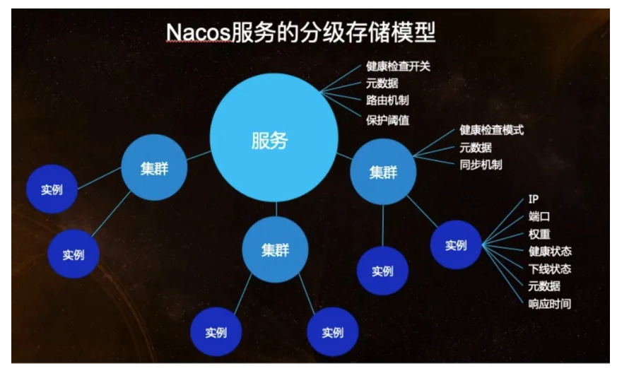
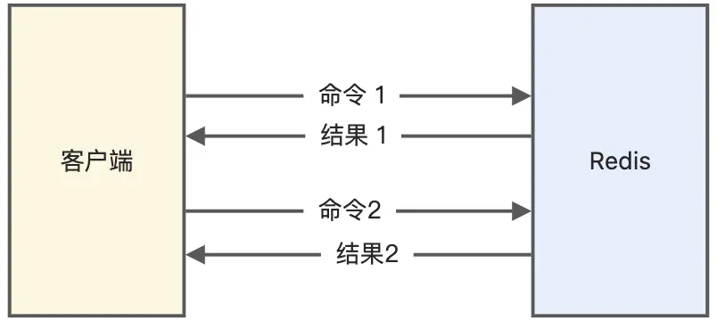
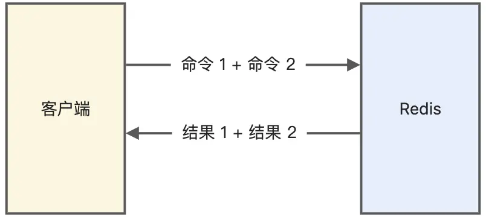

# Nacos

## Nacos基本原理

​	Spring Cloud的注册中心组件。围绕服务实例注册、实例健康检查、服务实例获取这三个核心来实现的。

### 服务注册基本流程

- 服务实例启动，将自身注册到Nacos注册中心
- 维持与注册中心的心跳
- 注册中心主动发起健康检查
- 服务消费者通过注册中心获取实例，并发起调用

> 注册：
>
> ​	将服务实例的名称，套接字交给注册中心。同一个服务如果有多个实例，需要保证服务名称相同。
>
> 维持心跳与健康检查：
>
> ​	心跳维持策略为每5秒服务实例像Nacos发送一次心跳，携带实例信息(服务名、实例IP、端口等)。
>
> ​	15秒没有心跳，且健康检查失败，认为实例不健康。如果30秒健康检查失败会剔除实例。
>
> 服务发现：
>
> ​	支持两种场景：一、服务消费者向Nacos发送获取某服务的请求，Nacos返回所有可用实例。
>
> ​	二、服务消费者向Nacos订阅某服务，并提交一个监听器。当服务发生变化时，监听器会收到通知，消费者更新本地服务实例列表，以保证所有服务均可用。

### Nacos的数据模型

​	Nacos服务注册表结构为`Map<namespace, Map<group::servicaName, Service>>`。

​	可以理解为Nacos支持用户创建多个环境(dev，prod)，每个环境有自己的namespace，每个环境中可以分组，不同组内的服务名称可以相同。默认分组为DEFAULT_GROUP。


### Nacos服务领域模型

​	通过上述描述，我们知道可以通过三元组定位一个服务。那么，服务模型又是什么。



​	服务可以包含多个集群(cluster)，集群中包含多个实例(instance)。

- 在服务级别，保存了健康检查开关、元数据、路由机制、保护阈值等设置。
- 集群保存了健康检查模式、元数据、同步机制等数据。
- 实例保存了该实例的ip、端口、权重、健康检查状态、下线状态、元数据、响应时间。


### 注册中心与配置中心

#### 注册中心

​	微服务一个项目中包含多个模块，各个模块自己作为一个独立的项目，部署在不同的服务器上，彼此之间通过网络进行服务器之间的通信。模块之间在相互调用时，需要知道服务提供方的IP、端口号。如果模块不多，且部署固定，可以直接将被调用方的套接字以硬编码的方式写死在程序中。

​	但是，微服务结构下，通常一个服务都会存在多个实例，部署在不同的机器上，构成了集群。集群中的机器会频繁的增加和减少，于是管理IP和端口号就非常繁琐。

​	注册中心就是为了管理服务的IP和端口号的。每个服务的实例上线时，将自己的IP和端口号发送给注册中心；需要调用别的服务时就向注册中心获取。因此，注册中心只提供两个接口：

- 接收别人发送的ip和端口信息并存储起来。
- 查询并返回相应的IP和端口信息。


#### 配置中心

​	Spring Boot的出现极大地减少了项目的配置难度，但是仍然需要配置。微服务的众多模块都有各自的配置文件，即使两个项目使用的是相同的配置，他们也需要各自持有一份，于是管理配置的难度也十分高。如果某个模块有十几个实例，当它的配置发生变化，就需要手动重启这十几个服务器。

> Nacos作为配置中心时，其配置项可以存储在文件、MySQL、Redis中。

配置中心针对配置的管理提供四种操作：
- 获取配置：从Nacos配置中心读取配置。
- 监听配置：订阅相关配置，当配置发生变化时可以收到一个事件。
- 发布配置：将配置保存到Nacos配置中心。
- 删除配置：从Nacos配置中心删除相关配置。

从原理上来看，就是对配置的CRUD和动态监听。

##### 配置的CRUD

- 对于服务端来说：要考虑配置如何存储，是否需要持久化。
- 对于客户端来说：要考虑如何通过接口从Nacos获取配置。

##### 动态监听配置

客户端对服务端配置的监听有两种模式：
- Pull模式：客户端主动从服务端拉取配置。
  - 客户端定时从服务端读取配置，由于时间间隔是固定的，不能保证数据的时效性。且如果配置长时间不变化会有大量无效Pull操作。
- Push模式：服务端主动将配置发送到客户端。
  - 服务端需要保持大量的与客户端的长连接，消耗大量资源。且还需要通过心跳机制来检查连接是否有效。

Nacos采用的是Pull模式，客户端主动地轮询请求服务端，如果有变化就返回新的配置。


## Nacos中保护阈值的作用是什么

​	假设一个服务有10个实例，其中有5个挂掉了，此时，本来应该由10个实例来处理的流量，现在就全部交给剩余的5个实例来处理。但是，剩余的实例也无法正常处理，最终会被压垮。此时，就可以给服务设定一个保护阈值，取值范围为$[0,1]$，如取0.5，该服务中半数的实例挂掉后，Nacos会在服务调用方调用服务时，将所有的实例都拉取到调用者本地，包括健康的和不健康的实例。然后在本地进行负载均衡地调用，调用的实例可能是健康的实例，也可能是挂掉的实例。通过这样的方法，很好的保护了剩余的健康实例。


## Nacos中的负载均衡是怎样的

​	Nacos的负载均衡，是在进行发现服务时负载均衡。正常情况下，进行服务发现时，会根据服务名称将该服务所有的实例拉取到本地。但是，Nacos提供了一个功能，即在拉取实例时，可以根据*随机选择策略*，只拉取所有实例中的一个。这就是Nacos中的负载均衡。它跟Ribbon中的负载均衡并不冲突，Ribbon是在拉取得到的所有实例上进行负载均衡，是在Nacos负载均衡之后发生的。


## Nacos的就近访问

​	Nacos中一个服务可以包含多个集群，一个集群可以包含多个实例。如果现在某个服务A想要调用服务B，那么Nacos会看调用服务A的实例是属于哪个集群的，并且调用服务B时，那就会调用同样集群下的服务B实例，根据cluster-name来判断两个实例是不是同一个集群，这就是Nacos的就近访问。


## 如何看待CAP理论

​	CAP(Consistency，Availability，Partition Tolerance)，对应一致性，可用性和分区容错性。

- Consistency：系统处于一致状态，即分布式系统中所有节点看到的数据都是相同的。
- Availability：系统必须保证任何时刻，都能处理请求并返回正确的结果，即系统处于可用状态。
- Partition Tolerance：系统在遇到网络分区故障时，仍能够保持正常的工作。即系统能够容忍任意数量的消息丢失或网络分区。
  - 网络分区：网络分区只在分布式集群中，节点之间由于网络不通，导致集群中节点形成不同的子集，子集中节点之间网络互通，而子集与子集之间网络不通。

​	CAP理论可以理解为目前硬件条件下对于分布式架构的一种限制，就是对于一个分布式系统，只能保证AP或CP，而不能同时保证CAP。首先对于一个分布式系统，P，也就是分区容错性是一定要保证的，对于一个分布式系统，得保证在网络出现分区后，分布式系统仍然能工作，所以得保证P。当出现网络分区后，整个分布式系统如果想要保证数据一致性，那么就要损耗系统可用性，或者如果想要保证系统的可用性，就不能保证系统的一致性。这里说的是强一致性，因为如果网络出现问题，分布式系统中的数据就无法进行及时的同步，如果要求强一致性，那么就只能等网络好了之后，数据同步好了之后，才能提供给用户使用，同理，如果要求网络出现后问题，系统要能使用，那就可能数据会不一致，所以对于一个分布式系统，目前来说只能保证CP或AP。


## Nacos中保证的是AP还是CP

​	Nacos既能保证AP，也能保证CP，具体看如何配置。Nacos作为注册中心时才能保证AP或CP，因为作为配置中心时，其数据都存储在一个MySQL中，只有注册中心的数据需要在集群节点之间同步。

​	如果注册的节点是临时节点，那么就是AP，如果是非临时节点，那么就是CP，默认是临时节点。


## 如何理解Nacos中的命名空间

​	命名空间，namespace，在Nacos无论是配置还是服务都是属于一个命名空间的。默认情况下，都属于public命名空间。我们可以在Nacos中新增命名空间，即开辟了一块新的空间用来存储服务和配置。命名空间之间是完全独立的。


## 你认为注册中心应该保证AP还是CP

​	我认为应该保证AP，因为如果保证CP，当我们向注册中心注册实例或移除实例时，都要等待注册中心集群中的数据达到一致后，才算注册或移除成功，而这是比较耗时的，随着业务应用规模的增大，应用频繁的上下线，那么就会导致注册中心的压力比较大，会影响到服务发现的效率以及服务调用了。

​	而如果注册中心是AP的，那么注册中心集群不管出现了什么情况，都是可以提供服务的，就算集群节点之间数据出现了不一致，对于业务应用而言，可能拉取到了一个已经下线了的服务节点，但是现在一般的微服务框架或组件都提供了服务容错和重试功能，也可以避免这个问题，而如果是AP，对于注册中心而言就不需要消耗太多的资源来实时的保证数据一致性了，保证最终一致性就可以了，这样注册中心的压力会小一点。


# Feign

## Feign基本原理

### 什么是Feign

​	Feign可以翻译为假装、伪装。Feign可以将Rest的请求进行隐藏，伪装成类似SpringMVC中的Controller方法一样。使得调用远程服务无需自己拼接url和参数等，就像调用本地方法一样。

​	Feign是Netflix开发的声明式、模板化的HTTP客户端。可以帮助我们更加便捷优雅地调用HTTP API。在Spring Cloud中，使用Feign非常简单，只需要为远程服务创建一个接口，接口上添加`@FeignClient`注解，便可在该接口中定义远程服务中的方法和其`@RequestMapping`。

​	Spring Cloud使Feign支持了SpringMVC注解，并整合了Ribbon和Eureka。

### Feign的工作原理

​	服务提供方需要引入注册中心的依赖，如Nacos。并将提供的服务注册在注册中心。

​	服务消费者同样也需要在注册中心注册。同时需要在启动类上添加`@EnableFeignClients`。并未远程服务创建接口，并用`@FeignClient`修饰。

​	在为服务启动时，Feign会进行包扫描，对被`@FeignClient`注解修饰的接口，按照注解的规则，创建远程接口的本地JDK Poxy代理实例。并将该实例存储到Spring IoC容器中。

​	当远程接口中的方法被调用时，由Proxy代理实例去完成真正的远程访问，并返回结果。

​	Proxy代理实例，实现了远程调用的接口，能够在内部进行HTTP请求的封装和发送。代理实例能够处理远程HTTP请求的响应，并完成结果的编码，返回给调用者。

### Feign的负载均衡

​	OpenFeign默认将Ribbon作为负载均衡器，直接内置了Ribbon。Ribbon是一个客户端负载均衡器，运行在服务消费者端。

​	Ribbon内置的负载均衡策略：

- RoundRobinRule：轮询策略。如果经过一轮轮询没有找到可用的provider，做多能轮询十次。还未找到返回null。
- RandomRule：随机策略
- RetryRule：重试策略。先按照轮询策略获取，若果是白，在指定时间内重试。
- BestAvailableRule：最可用策略，选择并发量最小的provider。
- AvailabilityFilteringRule：可用过滤算法。过滤处理掉处于熔断状态的server与已经超过连接极限的server，对剩余的进行轮询。

#### 更换负载均衡策略

- 修改配置文件
- 添加一个JavaConfig类，使用`@Configuration`注解，类中新建一个`IRule`接口的实现类对象，注册到Spring IoC容器中。

#### 自定义负载均衡策略

- 自己定义一个`IRule`接口的实现类，重写其中的方法。
- 修改JavaConfig类。如排除某个端口。

#### SpringCloudLoadBalancer

​	Netflix对于Ribbon的维护已经暂停，所以SpringCloud推荐使用自定义的SpringCloudLoadBalancer作为负载均衡器。


## SpringCloudFeign与OpenFeign的区别

​	首先，Feign是SpringCloud的一个组件，用于封装HTTP服务调用，Feign内置了Ribbon作为哭护短负载均衡器。Feign使用的方法是，使用Feign的注解定义接口，调用接口，就可以直接使用注册中心注册的服务。

​	Openfeign实在SpringCloudFeign的基础上支持了SpringMVC的注解，如`@RequestMapping`等。OpenFeign的`@FeignClient`注解可以解析SpringMVC的注解，并通过动态代理的方式产生实现类。


# Redis

## 1. 谈谈你对Redis的理解

### 为什么要引入Redis

​	在项目中一般使用MySQL数据库来存储数据，这在性能方面存在一定弊端。由于数据库的持久化数据是存储在磁盘上的，而磁盘的读写速度较慢，当面对高并发场景时，如抢票、抢购等瞬间访问量较大的场景，需要系统在瞬间完成上千万次的读写操作。此时，数据库无法承受，容易导致数据库系统的瘫痪，最终导致服务器的宕机。

​	为了解决这一问题，可以引入Redis，它是一种基于内存的数据库，是NoSQL，并提供一定的持久化能力。

### Redis是什么

​	Redis(Remote Dictionary Server，远程字典服务)，它是一个基于内存实现的，键值型，非关系数据库。是一种基于内存的数据库，对数据的读写操作都是在内存中完成，因此**读写速度非常快**，常用于**缓存，消息队列、分布式锁等场景**。它存在如下特点：

- Redis不经可以将数据完全保存在内存中，还可以通过池畔实现数据的持久化支持。
- Redis支持丰富的数据类型，如String， List， Set，Zset, Hash等数据结构。
- Redis支持主从同步，数据可以从主服务器向任意数量的服务器上同步。有效地保证数据安全性。
- Redis支持多种编程语言，C/C++，Java，Python等。

### 与SQL型数据库的区别

​	Redis没有提供新建数据库的操作，它自带16个数据库([0, 15]，默认使用0库)。同一个数据库中，key是唯一的，键值存储的本质就是使用key来识别value。

​	Redis数据库没有表的概念，因为它是非关系数据库。它通过不同的数据类型来实现存储数据的需求。


## 2. Redis的使用场景

### 1) 缓存

​	Redis基于内存，读写速度快，可以用作缓存来减轻MySQL的压力，提升系统性能。

​	因为Redis具有高性能，读写都在内存中；并且Redis支持高并发，单台设备Redis的每秒处理请求次数是MySQL的十倍，直接访问 Redis 能够承受的请求是远远大于直接访问 MySQL 的。

### 2) 消息队列

​	Redis提供发布/订阅机制，可以通过channel和pattern来向其中的订阅者发送消息。另外，我们还可以利用List来实现一个队列机制。

### 3) Session共享

​	Session保存在服务器的文件中，如果是集群服务，同一个用户的请求可能会落到不同的服务器上，就会导致用户频繁登录。利用Redis保存Session后，无论用户的请求落在哪台机器上，都能够获取相应的Session信息。

> ​	Session为会话控制，是服务器为了保存用户状态而创建的一个特殊对象。简而言之，就是一个对象，用于存储信息。
>
> ​	服务器会为每一个浏览器(客户端)创建一个唯一的Session。这个Session是服务器共享，客户端独享的。
>
> ​	Session的接口类似于Map，里面可以存放多个键值对。key必须是字符串，value必须是对象。
>
> ​	当客户端访问浏览器时，HTTP请求中会携带一个名为`JSESSIONID`的cookie，表示Session的id。是由服务器创建的，并且是唯一的。
>
> ​	如果客户端的请求携带了JSESSIONID的cookie，服务器会判断该id对应的Session是否存在，存在就在响应时携带Session对象。如果不存在，就创建Session，并返回JSESSIONID。
>
> ​	如果客户端的请求没有携带JSESSIONID的cookie，服务器会直接创建一个新的Session，并返回JSESSONID。

### 4) 排行榜

​	利用Redis的SortSet来实现。


## 3. Redis的常见功能

- 数据缓存
- 分布式锁Redisson
- 数据持久化
- 支持事务
- 支持消息队列


## 4. Redis支持的数据类型

​	

​	Redis的数据是以键值对的方式存储的，其value支持以下几种类型：

- String字符串
- Hash：value存储的值可以是多个Hash键值对，如`value = {{field1, value1},...{fieldN, valueN}}`
- List：用来存储多个有序的元素，列表两端都可以插入和弹出。可以充当栈和队列的角色。
- Set：相比于List，Set是不允许有重复的元素，但是，Set中的元素是无序的。
- zset：有序集合。不同于List中按照索引排序，可以为每个元素设置一个分数，作为排序依据。

## 5. Redis为什么快？

- Redis 的大部分操作**都在内存中完成**，并且采用了高效的数据结构，因此 Redis 瓶颈可能是机器的内存或者网络带宽，而并非 CPU，既然 CPU 不是瓶颈，那么自然就采用单线程的解决方案了；
- Redis 采用单线程模型可以**避免了多线程之间的竞争**，省去了多线程切换带来的时间和性能上的开销，而且也不会导致死锁问题。
- Redis 采用了 **I/O 多路复用机制**处理大量的客户端 Socket 请求，IO 多路复用机制是指一个线程处理多个 IO 流，就是我们经常听到的 select/epoll 机制。简单来说，在 Redis 只运行单线程的情况下，该机制允许内核中，同时存在多个监听 Socket 和已连接 Socket。内核会一直监听这些 Socket 上的连接请求或数据请求。一旦有请求到达，就会交给 Redis 线程处理，这就实现了一个 Redis 线程处理多个 IO 流的效果。

> 阻塞I/O：发送请求后，在数据准备好之前通常需要一段时间。在该模式下，用户线程会一直处于阻塞状态，等待数据准备，直到读写完成。用户大部分时间都在等待I/O事件完成。
>
> 非阻塞I/O：与阻塞I/O相反，如果数据未准备就绪就会直接返回，应用层会轮询读取查询，直到成功读取数据。
>
> **I/O多路复用：** 是非阻塞I/O的一种特例，也是目前最经典、最常用的高性能IO模型。其具体处理方式是：先查询I/O事件是否准备就绪，当I/O事件准备就绪了，则会真正的通过系统调用实现数据读写；查询操作，不管是否数据准备就绪都会立即返回，即非阻塞；因此，通常情况下，会通过轮训来不断监听I/O事件是否准备就绪；因为操作是非阻塞的，这个过程中通常只需及少量线程（一般一个线程即可）来处理这个轮训操作，极大的解决阻塞模式下I/O枯竭问题。


## 6. 什么是缓存雪崩，如何解决

现象：	

​	当某一时刻出现大量的缓存失效的情况，那么就会导致大量的请求直接打到数据库上，导致数据库压力过大，在高并发状态下，可能瞬间就会导致服务器宕机。

分析：

​	造成缓存雪崩的原因是，在同一时刻有大量的key失效。出现该问题的原因可能有：Redis宕机；大规模的key采用了同样的过期时间。

解决方案：

- 在原有的过期时间上，增加一个随机值，如1-5分钟，可以避免在同一时刻大量的key过期。
- 为了防止Redis宕机导致缓存雪崩的问题，可以搭建Redis集群，提高Redis的容灾性。

----------------------------以下为兜底措施-----------------------------------

- 采用熔断机制，当流量到达一定阈值时，就直接返回"系统繁忙"之类的提示，防止过多的请求打在数据库上。这样至少可以保证部分用户正常使用，剩下的用户刷新几次也可以得到想要的结果。
- 提高数据库的容灾能力，可以使用分库分表，读写分离的策略。


## 7. 什么是缓存击穿，如何解决

现象：

​	类似于缓存雪崩，缓存击穿是某个热点key，有大规模并发对其进行访问，此时，该key突然失效了，会导致打量的请求直接打到数据库上。数据库压力剧增。

分析：

​	关键在于某个热点key失效了，导致大量并发集中打在数据库上。

解决方案：

- 如果业务允许的话，可以考虑对热点key设置为永不过期。
- 使用互斥锁，如果缓存失效，只要拿到锁才能访问数据库，降低了同一时间打在数据库上的请求量，防止数据库服务器宕机。但是可能会降低系统性能。


## 8. 什么是缓存穿透，如何解决

现象：

​	使用Redis的大部分情况都是根据key查找value，如果请求的key在Redis中并不存在，那么缓存必然不命中，就一定需要查询数据库。如果有大量的这种请求，缓存就像是被"穿透了"一样，请求直接到达数据库。

分析：

​	关键在于Redis并不存在该key，这与缓存击穿有本质区别。如果有黑客有意传入大量的不存在的key，就会有大量的请求直接到达数据库。

解决方案：

- 对参数做好校验，一些非法的参数，不可能存在的key就直接返回错误提示。
- 将不存在的key，直接存入Redis，设置`value=null`，下次再查询该key就直接返回null，就不再需要查询数据库。但是，如果每次传入的key都是随机的，那么这么做是没有意义的。
- **使用布隆过滤器**。布隆过滤器可以用于检索一个元素是否在一个集合中。它的优点是空间效率和查询时间都比一般的算法要好的多，缺点是有一定的误识别率和删除困难。如果一个key不存在于布隆过滤器中，那么就一定不存在于Redis中；如果某个key存在于布隆过滤器中，那么很大可能是存在Redis中。于是我们可以在缓存之前再加一层布隆过滤器，在查询的时候先去布隆过滤器查询 key 是否存在，如果不存在就直接返回。


## 9. 如何保证缓存和数据库是一致的

​	首先，如果设置了合理的过期时间，就能保证缓存和数据库是一致的。因为，缓存过期后，就会被删除，随后的请求需要查询数据库，并将查询结果写入缓存。

​	另外，还可以在新增、修改和删除数据库时同步更新Redis，可以使用事务机制来保证更新是同步的。存在以下四种同步方案：

- 先更新数据库，再更新缓存：并发场景下，会从Redis中读出脏数据。
- 先更新缓存，再更新数据库：如果缓存更新成功，而数据库更新失败，会导致数据不一致。
- 先删除缓存，再更新数据库。
- 先更新数据库，后删除缓存。

后两种方案能保证双写一致性(即，缓存和数据库中的数据是一致的)。


## 10. Redis的持久化方式

### RDB

​	Redis Database，按照一定的时间周期策略把内存的数据以快照的形式保存到硬盘的二进制文件。即 Snapshot 快照存储，对应产生的数据文件为 dump.rdb，通过配置文件中的 save 参数来定义快照的周期。核心函数：rdbSave（生成 RDB 文件）和 rdbLoad（从文件加载内存）两个函数。

### AOF

​	Append-only File，Redis会将每一个收到的写命令都通过 Write 函数追加到文件最后，即数据库中的日志文件。当 Redis 重启时会通过重新执行文件中保存的写命令来在内存中重建整个数据库的内容。

​	两者对比：

- AOF 文件比 RDB 更新频率高，优先使用 AOF 还原数据；
- AOF比 RDB 更安全也更大；
- RDB 性能比 AOF 好；
- 如果两个都配了优先加载 AOF。


## 11. Redis内存满了怎么办

​	首先，可以考虑增加Redis的可用内存。有两种方式，修改安装目录下的redis.conf，通过命令修改。

​	但是，Redis总是会受制于物理内存的大小，不可能无限增长。于是，我们可以采取Redis内存淘汰策略。Redis共有8种内存淘汰策略。

- noeviction：直接返回错误，不淘汰任何已经存在的redis键
- allkeys-lru：所有的键使用lru算法进行淘汰
- volatile-lru：有过期时间的使用lru算法进行淘汰
- allkeys-random：随机删除redis键
- volatile-random：随机删除有过期时间的redis键
- volatile-ttl：删除快过期的redis键
- volatile-lfu：根据lfu算法从有过期时间的键删除
- allkeys-lfu：根据lfu算法从所有键删除


## 12. Redis常见性能问题和解决方案

- master写RDB内存快照，save命令调度rdbsave函数，会阻塞主线程的工程，当快照比较大的时候对性能的影响是非常大的，会间断性暂停服务 。所以master最好不要写内存快照。

- master AOF持久化，如果不重写AOF文件，这个持久化方式对性能的影响是最小的，但是AOF文件会不断增大，AOF文件过大会影响master重启时的恢复速度。master最好不要做任何持久化工作，包括内存快照和AOF日志文件，特别是不要启用内存快照做持久化，如果数据比较关键，某个slave开启AOF备份数据，策略每秒为同步一次。

- master调用BGREWRITEAOF重写AOF文件，AOF在重写的时候会占大量的CPU和内存资源，导致服务load过高，出现短暂的服务暂停现象。

- redis主从复制的性能问题，为了主从复制的速度和连接的稳定性，slave和master最好在同一个局域网内


## 13. Redis的过期键的删除策略

​	Redis对于设置了过期时间的key有两种策略，定期删除和惰性删除。当然，也可以采取过期时间一到就立即删除，但是会占用大量的CPU资源。

### 定期删除

​	Redis会将设置了过期时间的key放到一个独立的的字典中，然后定期地扫描检查。Redis 默认会每秒进行十次过期扫描（100ms一次），过期扫描不会遍历过期字典中所有的 key，而是采用了一种简单的贪心策略：

- 从过期字典中随机选择20个key
- 删除这些key种已经过期的key
- 如果过期的key的比例超过1/4，重复1

​	Redis默认是每隔 100ms就随机抽取一些设置了过期时间的key，检查其是否过期，如果过期就删除。注意这里是随机抽取的。如果不随机选取 ，每隔100ms就要遍历所有的设置过期时间的key，就会给CPU带来很大的负载。

### 惰性删除

​	所谓惰性策略就是在客户端访问这个key的时候，Redis对key的过期时间进行检查，如果过期了就立即删除，不会给用户返回任何结果。


​	如果仅仅依靠定期删除，会存在很多过期未删除的key，因此需要配合惰性删除。


## 14. Redis如何解决key的哈希冲突

​	Redis的key存储在哈希表中，并采用链式法解决哈希冲突，即哈希值相同的key存储在一个链表里。但是当链表过长时，会降低查询性能。所以，Redis为了性能，使用了两个全局哈希表，来做ReHashing。

​	开始时，默认使用`[Hash Table 1]`存储key，`[Hash Table 2]`没有分配空间。当发生哈希碰撞的次数逐渐增多，会执行以下操作。

- 给`[Hash Table 2]`分配更多空间
- 将`[Hash Table 1]`的元素逐渐重新映射到`[Hash Table 2]`上
- 释放`[Hash Table 1]`

​	需要注意的是，重新映射并不是一次完成的，这样会造成Redis的阻塞，一定时间内无法提供服务。而是采用了渐进式的ReHash。每次处理客户端请求时，会将当前位置的所有数据重新映射到新表中。并将表1中的数据删除。

​	扩容会扩容两倍。当实际存储的元素只有哈希表的十分之一时，会执行缩容。


## 15. Redis在生成RDB快照时，可以处理写请求吗

​	可以的，Redis使用操作系统的多进程**写时复制技术 COW(Copy On Write)** 来实现快照持久化，保证数据一致性。

​	Redis 在持久化时会调用 glibc 的函数`fork`产生一个子进程，快照持久化完全交给子进程来处理，父进程继续处理客户端请求。

​	当主线程执行写指令修改数据的时候，这个数据就会复制一份副本， `bgsave` 子进程读取这个副本数据写到 RDB 文件。

​	这既保证了快照的完整性，也允许主线程同时对数据进行修改，避免了对正常业务的影响。


## 16. 重启Redis如何实现数据尽可能少丢失又能兼顾性能呢

​	重启Redis时，很少使用RDB来恢复内存状态，因为会丢失大量数据。通常使用AOF文件重放，但是重放AOF相比较RDB来说又要慢很多，如果Redis实例比较大，重启需要花费很多时间。

​	Redis4.0支持了混合持久化，即将RDB和AOF日志存在一起，此时的AOF不再是全量的日志，AOF 重写时会把 Redis 的持久化数据，以 RDB 的格式写入到 AOF 文件的开头，之后的数据再以 AOF 的格式化追加的文件的末尾。

​	Redis重启时，先加载RDB的内容，然后再重放增量的AOF，提高重启效率。


## 17. Redis 和 Memcached 有什么区别

​	两者都是基于内存的数据库，都有过期策略，性能都非常高。其区别如下：

- Redis支持非常多的数据类型，而Memcached只支持简单的key-value。
- Redis支持数据持久化，可以将内存的数据保持在硬盘中，但是Memcached不支持持久化。
- Redis原生支持集群模式，Memcached不支持集群。
- Redis支持消息订阅/发布，事务等，Memcached不支持。


## 18. Redis线程模型

​	首先，Redis的主线程是单线程的，**「接收客户端请求->解析请求 ->进行数据读写等操作->发送数据给客户端」**这个过程由主线程单独完成。但是，除此以外，Redis还会为「关闭文件、AOF 刷盘、释放内存」开启后台线程，因为这些操作比较耗时。如果把这些任务都放在主线程来处理，那么 Redis 主线程就很容易发生阻塞，这样就无法处理后续的请求了。

​	

## 19. Redis如何实现服务高可用

​	要想设计一个高可用的 Redis 服务，一定要从 Redis 的多服务节点来考虑，比如 Redis 的主从复制、哨兵模式、切片集群。

### 主从复制

​	主从复制是 Redis 高可用服务的最基础的保证，实现方案就是将从前的一台 Redis 服务器，同步数据到多台从 Redis 服务器上，即一主多从的模式，且主从服务器之间采用的是「读写分离」的方式。

​	主服务器可以进行读写操作，当发生写操作时自动将写操作同步给从服务器，而从服务器一般是只读，并接受主服务器同步过来写操作命令，然后执行这条命令。也就是说，所有的数据修改只在主服务器上进行，然后将最新的数据同步给从服务器，这样就使得主从服务器的数据是一致的。

​	主从服务器之间的命令复制是**异步**进行的。在主从服务器命令传播阶段，主服务器收到新的写命令后，会发送给从服务器。但是，主服务器并不会等到从服务器实际执行完命令后，再把结果返回给客户端，而是主服务器自己在本地执行完命令后，就会向客户端返回结果了。如果从服务器还没有执行主服务器同步过来的命令，主从服务器间的数据就不一致了。

​	所以，无法实现强一致性保证（主从数据时时刻刻保持一致），数据不一致是难以避免的。


### 哨兵模式

​	在使用 Redis 主从服务的时候，会有一个问题，就是当 Redis 的主从服务器出现故障宕机时，需要手动进行恢复。

​	为了解决这个问题，Redis 增加了哨兵模式（**Redis Sentinel**），因为哨兵模式做到了可以监控主从服务器，并且提供**主从节点故障转移的功能。**


​	哨兵的作用如下：

- 通过发送命令，让Redis 服务器返回监控其运行状态，包括主服务器和从服务器。
- 当哨兵检测到Master宕机时，会通过投票机制自动将Slave切换成Master，然后再通过发布订阅模式通知其它的从服务器，修改配置文件，让它们切换主机。


### 切片集群模式

​	当 Redis 缓存数据量大到一台服务器无法缓存时，就需要使用 **Redis 切片集群**（Redis Cluster ）方案，它将数据分布在不同的服务器上，以此来降低系统对单主节点的依赖，从而提高 Redis 服务的读写性能。

​	Redis Cluster 方案采用哈希槽（Hash Slot），来处理数据和节点之间的映射关系。在 Redis Cluster 方案中，**一个切片集群共有 16384 个哈希槽**，这些哈希槽类似于数据分区，每个键值对都会根据它的 key，被映射到一个哈希槽中，具体执行过程分为两大步：

- 根据键值对的 key，按照 [CRC16 算法 (opens new window)](https://en.wikipedia.org/wiki/Cyclic_redundancy_check)计算一个 16 bit 的值。
- 再用 16bit 值对 16384 取模，得到 0~16383 范围内的模数，每个模数代表一个相应编号的哈希槽。

哈希槽怎么被映射到具体的 Redis 节点上的呢？有两种方案：

- **平均分配：** 在使用 cluster create 命令创建 Redis 集群时，Redis 会自动把所有哈希槽平均分布到集群节点上。比如集群中有 9 个节点，则每个节点上槽的个数为 16384/9 个。
- **手动分配：** 可以使用 cluster meet 命令手动建立节点间的连接，组成集群，再使用 cluster addslots 命令，指定每个节点上的哈希槽个数。


## 20. 集群脑裂怎么办

​	由于网络问题，集群节点之间失去联系。主从数据不同步；重新平衡选举，产生两个主服务。等网络恢复，旧主节点会降级为从节点，再与新主节点进行同步复制的时候，由于会从节点会清空自己的缓冲区，所以导致之前客户端写入的数据丢失了。

​	当主节点发现从节点下线或者通信超时的总数量小于阈值时，那么禁止主节点进行写数据，直接把错误返回给客户端。

​	**原主库发现从库大量失联，原主库就会被限制接收客户端写请求，客户端也就不能在原主库中写入新数据了**。

​	**等到新主库上线时，就只有新主库能接收和处理客户端请求，此时，新写的数据会被直接写到新主库中。而原主库会被哨兵降为从库，即使它的数据被清空了，也不会有新数据丢失。**


## 21. Redis 持久化时，对过期键会如何处理的

​	如果采用RDB持久化，在RDB生成阶段和加载阶段处理如下：

- **RDB 文件生成阶段**：从内存状态持久化成 RDB（文件）的时候，会对 key 进行过期检查，**过期的键「不会」被保存到新的 RDB 文件中**，因此 Redis 中的过期键不会对生成新 RDB 文件产生任何影响。

- RDB 加载阶段：RDB 加载阶段时，要看服务器是主服务器还是从服务器，分别对应以下两种情况：

  - **如果 Redis 是「主服务器」运行模式的话，在载入 RDB 文件时，程序会对文件中保存的键进行检查，过期键「不会」被载入到数据库中**。所以过期键不会对载入 RDB 文件的主服务器造成影响；
  - **如果 Redis 是「从服务器」运行模式的话，在载入 RDB 文件时，不论键是否过期都会被载入到数据库中**。但由于主从服务器在进行数据同步时，从服务器的数据会被清空。所以一般来说，过期键对载入 RDB 文件的从服务器也不会造成影响。

  如果采用AOF持久化，文件写入阶段和 AOF 重写阶段处理如下：

- **AOF 文件写入阶段**：当 Redis 以 AOF 模式持久化时，**如果数据库某个过期键还没被删除，那么 AOF 文件会保留此过期键，当此过期键被删除后，Redis 会向 AOF 文件追加一条 DEL 命令来显式地删除该键值**。

- **AOF 重写阶段**：执行 AOF 重写时，会对 Redis 中的键值对进行检查，**已过期的键不会被保存到重写后的 AOF 文件中**，因此不会对 AOF 重写造成任何影响。


## 22. Redis主从模式中对过期键会如何处理

​	在主从模式下，从库不会进行过期检查，即使从库中key过期了，客户端访问时还会返回对应的value，就像没有过期一样。

​	从库的过期需要主库控制，主库在key过期时会在AOF中显示地添加一条del命令，同步到所有从库。


## 22A. Redis主从模式数据同步如何实现

### 全量同步

使用RDB日志来同部数据，主数据库发送RDB，从数据库根据RDB来调整内存。第一次数据同步只能是全量同步。

但是，为了减轻主数据库的压力，从数据库之间也可以传递RDB，不用全部都通过主数据库获取。

### 增量同步

第一次全量同步完成后，主从之间会保持一个TCP链接，主服务器将自己的写操作记录下来，从服务器执行这些操作，从而保证数据一致性。

### 网络故障时的环形缓存

当网络发生扰动时，主服务器会将写操作记录在一个环形缓存中，当网络恢复时，主服务器将自己的写操作在缓存中的偏移地址发送给从服务器，从服务器从自己的读偏移开始，逐步执行写操作。


## 23. 如何实现延迟队列

​	延迟队列是指将当前要做的事情，往后推迟一段时间再做。如订单超时未支付，打车超时叫不到车，外卖超时自动取消等。

​	Redis可以使用有序集合(ZSet)的方式来实现延迟消息队列。给ZSet的Score属性设置为延迟的时间，然后将需要处理的任务插入队列即可。


## 24. Redis的大key如何处理

​	Redis的大key并不是指key本身很大，而是key对应的value很大。大key会带来以下影响：

- 客户端超时阻塞：Redis执行读写命令是单线程操作，操作大key时比较耗时，就会阻塞Redis。客户端会很久得不到响应。
- 引发网络阻塞：读写的数据需要通过网络传输，因此会产生较大的网络流量，对于服务器的网卡有很大压力。
- 阻塞工作线程：如果使用del命令来删除大key，会导致主线程阻塞，无法处理其他的命令。
- 内存分布不均匀：集群模型在slot分片均匀的情况下，会出现数据和查询倾斜情况。部分有大key的节点占用内存多，QPS也多。

​	如何删除大key？

​	将大key删除，擦做系统需要将释放掉的内存插入空闲内存表来管理，方便后续分配，这本身会占用一定时间，会阻塞当前释放内存的应用程序。

​	如果以下释放了大量内存，空闲内存表的操作时间也会增加，Redis主线程会被阻塞，无法正常提供服务。

​	因此，对于大key，可以采取分批次删除和异步删除。

- 分批次删除：每次只删除value的一部分，分多次循环删除。减少每次删除的元素数量。
- 异步删除：Redis4.0后新增了一个后台线程用于释放内存，采用unlink命令代替del命令，会将释放内存的操作交给该线程。从而不会阻塞主线程。


## 25. Redis管道的作用

​	管道技术(Pipline)是客户端提供的一种批处理技术，用于一次处理多个Redis命令，从而提高整体交互的性能。

普通命令模式如图：



管道模式：



​	使用管道技术可以解决多个命令执行的网络等待，它是把多个命令整合到一起发送给服务器端处理之后统一返回给客户端，这样就免去了每条命令执行后都要等待的情况。

​	但是需要注意避免发送的命令过大，或者管道内的数据过多导致的网络阻塞。

​	管道技术本质上是客户端提供的功能，而不是Redis服务器的功能。


## 26. Redis事务是否支持回滚

​	Redis的事务不支持回滚，Redis虽然提供了DSICARD命令，但是这个命令只能用来主动放弃事务执行，并把暂存在队列中的命令清空，起不到回滚作用。

​	如，如果命令队列中前面的命令都是正确的，但是当前命令出现语法错误，就需要执行DISCARD来放弃事务执行。但是先前正确的命令的执行是有效的。因此**Redis的事务不保证原子性**。

​	为什么Redis的事务不支持回滚？

​	首先，管法昂认为，Redis执行事务时，错误通常是由编程错误引起的，事务回滚并不能避免编程错误。

​	其次，支持事务回滚与Redis追求的简单高效是不符合的。


## 27. Redis如何实现分布式锁

​	Redis本身可以被多个客户端共享访问，正好就是一个共享存储系统，可以用来保存分布式锁。而且Redis的读写性能高，可以用于高并发的锁。

### 加锁过程

​	Redis的SET命令有个NX参数，可以实现「key不存在才插入」，所以可以使用它来实现分布式锁：

- 如果key不存在，显示插入成功，表示加锁成功。
- 如果key存在，显示插入失败，表示加锁失败。

​	基于Redis实现分布式锁，对于加锁操作需要满足如下条件：

- 加锁操作包括了读取锁变量，检查变量值和设置锁变量三个操作。这三个操作需要以原子操作的方式完成，所以，使用SET带上NX选项来实现加锁。
- 锁变量需要有过期时间，避免客户端拿到锁之后发生异常，导致锁一直无法释放。所以，需要给SET命令加上EX/PX，设置过期时间。
- 锁变量的值需要能够区分不同客户端的操作，以免出现误释放操作。需要在执行SET时确保每个客户端设置的值是一个唯一值。

```java
SET lock_key unique_value NX PX 10000
```

### 释放锁过程

​	解锁的过程就是将`lock_key`删除。但是要保证执行该操作的客户端，是加锁的客户端。所以，解锁时，要先判断锁的值是否为客户端生成的值，如果是再删除。

### 优缺点

优点：

- 性能高
- 实现方便
- 避免单点故障(Redis都是跨集群部署的)

缺点：

- 超时时间不好设置。如果超时时间设置的过长，会很影响性能；如果设置的过短，起不到互斥的效果，如果A加了锁，但是在业务代码还没执行完之前锁就过期了，就会导致后续线程加锁成功，开始执行代码。
    - 如何设置合理的时间呢。可以基于续约的方式，先给锁设置一个时间，然后启动一个守护线程，让守护线程在一段时间后重置所得超时时间：先写一个守护线程，让其每隔一段时间重置一次锁的时间，如果主线程执行完毕就结束守护线程。
- Redis主从复制模式中的数据是异步复制的，导致了分布式锁的不可靠性。如果Redis的主节点获取到锁之后，在没有同步给从库之前，Redis主节点宕机了，此时新的Redis主节点认为没有加锁，可以允许后续线程加锁。


## 28. RedLock红锁

​	官方设计了分布式锁算法Redlock。基本思路：让客户端可多个独立的Redis节点依次请求加锁，如果客户端能够和超过半数的节点成功完成加锁操作，纳闷认为客户端成功地获得分布式锁，否则加锁失败。

​	如果客户端和超过半数的节点加锁成功，但是总用时超过了分布式锁的过期时间，也视为加锁失败。

​	加锁成功后，就需要从新计算锁的有效时间。如果有效时间已经不足完成数据操作，就要立即释放锁。

​	加锁失败后，客户端向所有的Redis节点发起释放锁的操作，释放过程和单节点上释放锁的操作一致。


# ThreadLocal

ThreadLocal本质上一个本地变量，是为了满足线程隔离功能而设计的。每个Thread线程内部有一个ThreadLocalMap类型的变量，其结构类似于HashMap。key为ThreadLocal实例变量，value则为通过ThreadLocal#set方法设置进去的对象。

这个Map的key是弱引用，也就是说每次GC都会将ThreadLocal实例变量清除。这样会导致一问题，即内存泄漏。value是强引用，而key是弱引用，当key被清除之后，就会导致外部无法通过key来访问value，而ThreadLocalMap中却一直保留着value的强引用，从而导致value不会被清除。


# Kafka

## 1. 什么是消息队列

消息队列就是用来存放消息的队列，主要有三大功能：

- 异步：可以让不同服务之间的操作异步处理，不需要同步等待。
- 解耦：让不同模块之间的调用解耦，方便增加或删除功能。
- 削峰：避免大量访问同时到来时，系统直接崩溃。

## 2. Kafka的应用场景和优势

应用场景：

- 消息队列：建立实时流数据管道，以可靠地在系统或应用程序之间获取数据。
- 数据处理：构建实时的流数据处理程序来转换或处理数据流。

优势：

- 性能较高：基于Scala和Java开发，设计中使用了大量的批处理和异步思想，最高每秒可以处理千万级别的数据。
- 生态系统兼容行好：在大数据和流计算领域兼容性较高。

## 3. Kafka结构

Kafka中主要分为三部分：

- Producer：生产者，负责生产消息。
- Broker：代理，即Kafka实例，多个Kafka Broker组成一个Kafka集群。
- Consumer：消费者，负责消费消息。

Broker中又包含了两个概念：

- Topic：主题，Producer将消息发送到特定的主题中，Consumer通过订阅Topic来消费消息。
- Partition：分区，Partition是Topic的一部分，一个Topic可以分布在多个Broker上，每个Broker上都一个该Topic的部分Partition。每个Partition上的消息是不同的。

Partion存在多副本机制。多个副本中有一个leader和多个follower，生产者和消费者只与leader交互，生产的消息交给leader后follower才能从leader中拉取同步。当leader故障时会重新选取leader。

优点：

- Topic指定多个Partition，而各个Partition分布在多个Broker上，提高了并发能力。
- Partition通过指定副本数量，提高了容灾能力，提高了消息存储的安全性。

## 4. Kafka如何保证消费顺序

由于Partition是按照顺序存储的，所以单个Partition可以保证消息的消费顺序。但是多个Partition之间无法保障消费顺序。

于是有两种方式可以保证消费顺序：

- 每个Topic中只指定一个Partition，但是会大大降低并发能力。
- 在发送消息时指定Partition，让需要保证消费顺序的消息存储在一个Partition中。

## 5. Kafka如何保证消息不丢失

### 生产者消息丢失

生产者调用`send()`方法将消息发送后，消息可能会由于网络原因没有送达。因此，需要在发送后判断发送结果。通常使用回调函数的方式获取发送结果。如果消息发送失败，检查失败原因然后重发。

重发也需要设置合理的重试次数和重发间隔，如果间隔太短可能没有效果。

### 消费者消息丢失

消费者读取Partition中的消息后，会自动提交offset。如果在消息处理过程中消费者出现问题，消息没有成功消费，但是offset却移动了。

于是，我们可以关闭offset的自动提交，每次在消息真正消费完成后再移动offset。但是会出现消息被消费了两次的情况。

### Kafka消息丢失

生产者的消息发送给Partition的leader，leader再同步给follower。如果，leader刚刚接收到消息就挂掉了，那么重新选取出来的leader就会丢失掉这条消息。

我们可以通过设置参数的方式来解决：

- `acks = all`，这是Producer的参数，默认`acks=1`，只要leader接收了就算发送成功。设置为all，表示所有的副本都接收到了消息才算发送成功，生产者才会收到Kafka的响应。但是会提高延迟。
- `min.insync.replicas > 1`：这样配置代表消息至少要被写入到 2 个副本才算是被成功发送。

## 6. 如何保证消息不被重复消费

出现消息重复消费的原因为：

- 消费者已经消费的数据没有成功提交offset。
- 消费者处理消息的时间较长或网络连接等原因，Kafka认为服务假死从而触发了分区rebalance。

解决方法：

- 消费服务做幂等校验，如将已经消费的数据放在Redis中，再次消费时检查是否已经消费过。
- 关闭自动提交offset，改为手动提交。但是需要注意时机：
  - 如果消费完毕再提交，可能还会出现重复消费的情况。
  - 如果拉取消息时就提交，可能会出现消息丢失的情况。

## 7. 消费失败怎么办

默认设置下，Kafka消费失败不会影响后续消息的消费，会对当前消息进行重试。默认会重复十次，其是立即重复。


