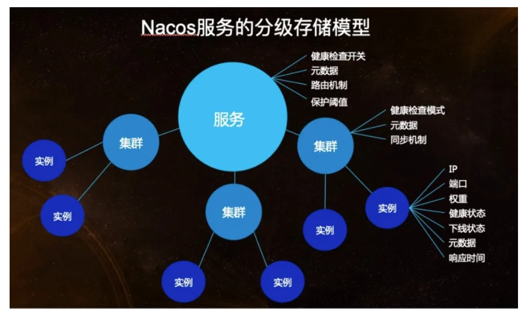
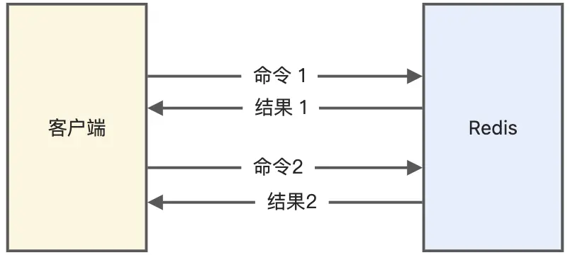
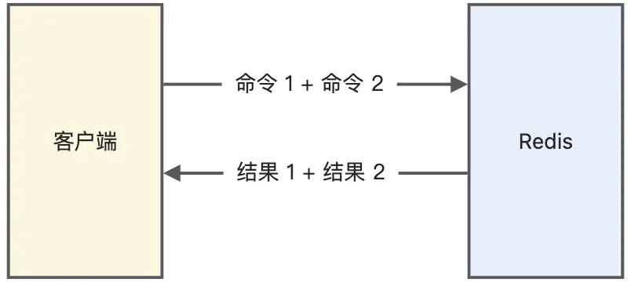

# Nacos

## Nacos基本原理

​	SpringCloud的注册中心组件。围绕服务实例注册、实例健康检查、服务实例获取这三个核心来实现的。

### 服务注册基本流程

- 服务实例启动，将自身注册到Nacos注册中心
- 维持与注册中心的心跳
- 注册中心主动发起健康检查
- 服务消费者通过注册中心获取实例，并发起调用

> 注册：
>
> ​	将服务实例的名称，套接字交给注册中心。同一个服务如果有多个实例，需要保证服务名称相同。
>
> 维持心跳与健康检查：
>
> ​	心跳维持策略为每5秒服务实例像Nacos发送一次心跳，携带实例信息(服务名、实例IP、端口等)。
>
> ​	15秒没有心跳，且健康检查失败，认为实例不健康。如果30秒健康检查失败会剔除实例。
>
> 服务发现：
>
> ​	支持两种场景：一、服务消费者向Nacos发送获取某服务的请求，Nacos返回所有可用实例。
>
> ​	二、服务消费者向Nacos订阅某服务，并提交一个监听器。当服务发生变化时，监听器会收到通知，消费者更新本地服务实例列表，以保证所有服务均可用。

### Nacos的数据模型

​	Nacos服务注册表结构为`Map<namespace,Map<group::servicaName,Service>>`。

​	可以理解为Nacos支持用户创建多个环境(dev，prod)，每个环境有自己的namespace，每个环境中可以分组，不同组内的服务名称可以相同。默认分组为DEFAULT_GROUP。


### Nacos服务领域模型

​	通过上述描述，我们知道可以通过三元组定位一个服务。那么，服务模型又是什么。



​	服务可以包含多个集群(cluster)，集群中包含多个实例(instance)。

- 在服务级别，保存了健康检查开关、元数据、路由机制、保护阈值等设置。
- 集群保存了健康检查模式、元数据、同步机制等数据。
- 实例保存了该实例的ip、端口、权重、健康检查状态、下线状态、元数据、响应时间。


### 注册中心与配置中心

#### 注册中心

​	微服务一个项目中包含多个模块，各个模块自己作为一个独立的项目，部署在不同的服务器上，彼此之间通过网络进行服务器之间的通信。模块之间在相互调用时，需要知道服务提供方的IP、端口号。如果模块不多，且部署固定，可以直接将被调用方的套接字以硬编码的方式写死在程序中。

​	但是，微服务结构下，通常一个服务都会存在多个实例，部署在不同的机器上，构成了集群。集群中的机器会频繁的增加和减少，于是管理IP和端口号就非常繁琐。

​	注册中心就是为了管理服务的IP和端口号的。每个服务的实例上线时，将自己的IP和端口号发送给注册中心；需要调用别的服务时就向注册中心获取。因此，注册中心只提供两个接口：

- 接收别人发送的ip和端口信息并存储起来。
- 查询并返回相应的IP和端口信息。


#### 配置中心

​	SpringBoot的出现极大地减少了项目的配置难度，但是仍然需要配置。微服务的众多模块都有各自的配置文件，即使两个项目使用的是相同的配置，他们也需要各自持有一份，于是管理配置的难度也十分高。如果某个模块有十几个实例，当它的配置发生变化，就需要手动重启这十几个服务器。

> Nacos作为配置中心时，其配置项可以存储在文件、MySQL、Redis中。

配置中心针对配置的管理提供四种操作：
- 获取配置：从Nacos配置中心读取配置。
- 监听配置：订阅相关配置，当配置发生变化时可以收到一个事件。
- 发布配置：将配置保存到Nacos配置中心。
- 删除配置：从Nacos配置中心删除相关配置。

从原理上来看，就是对配置的CRUD和动态监听。

##### 配置的CRUD

- 对于服务端来说：要考虑配置如何存储，是否需要持久化。
- 对于客户端来说：要考虑如何通过接口从Nacos获取配置。

##### 动态监听配置

客户端对服务端配置的监听有两种模式：
- Pull模式：客户端主动从服务端拉取配置。
  - 客户端定时从服务端读取配置，由于时间间隔是固定的，不能保证数据的时效性。且如果配置长时间不变化会有大量无效Pull操作。
- Push模式：服务端主动将配置发送到客户端。
  - 服务端需要保持大量的与客户端的长连接，消耗大量资源。且还需要通过心跳机制来检查连接是否有效。

Nacos采用的是Pull模式，客户端主动地轮询请求服务端，如果有变化就返回新的配置。


## Nacos中保护阈值的作用是什么

​	假设一个服务有10个实例，其中有5个挂掉了，此时，本来应该由10个实例来处理的流量，现在就全部交给剩余的5个实例来处理。但是，剩余的实例也无法正常处理，最终会被压垮。此时，就可以给服务设定一个保护阈值，取值范围为$[0,1]$，如取0.5，该服务中半数的实例挂掉后，Nacos会在服务调用方调用服务时，将所有的实例都拉取到调用者本地，包括健康的和不健康的实例。然后在本地进行负载均衡地调用，调用的实例可能是健康的实例，也可能是挂掉的实例。通过这样的方法，很好的保护了剩余的健康实例。


## Nacos中的负载均衡是怎样的

​	Nacos的负载均衡，是在进行发现服务时负载均衡。正常情况下，进行服务发现时，会根据服务名称将该服务所有的实例拉取到本地。但是，Nacos提供了一个功能，即在拉取实例时，可以根据*随机选择策略*，只拉取所有实例中的一个。这就是Nacos中的负载均衡。它跟Ribbon中的负载均衡并不冲突，Ribbon是在拉取得到的所有实例上进行负载均衡，是在Nacos负载均衡之后发生的。


## Nacos的就近访问

​	Nacos中一个服务可以包含多个集群，一个集群可以包含多个实例。如果现在某个服务A想要调用服务B，那么Nacos会看调用服务A的实例是属于哪个集群的，并且调用服务B时，那就会调用同样集群下的服务B实例，根据cluster-name来判断两个实例是不是同一个集群，这就是Nacos的就近访问。


## 如何看待CAP理论

​	CAP(Consistency，Availability，PartitionTolerance)，对应一致性，可用性和分区容错性。

- Consistency：系统处于一致状态，即分布式系统中所有节点看到的数据都是相同的。
- Availability：系统必须保证任何时刻，都能处理请求并返回正确的结果，即系统处于可用状态。
- PartitionTolerance：系统在遇到网络分区故障时，仍能够保持正常的工作。即系统能够容忍任意数量的消息丢失或网络分区。
  - 网络分区：网络分区只在分布式集群中，节点之间由于网络不通，导致集群中节点形成不同的子集，子集中节点之间网络互通，而子集与子集之间网络不通。

​	CAP理论可以理解为目前硬件条件下对于分布式架构的一种限制，就是对于一个分布式系统，只能保证AP或CP，而不能同时保证CAP。首先对于一个分布式系统，P，也就是分区容错性是一定要保证的，对于一个分布式系统，得保证在网络出现分区后，分布式系统仍然能工作，所以得保证P。当出现网络分区后，整个分布式系统如果想要保证数据一致性，那么就要损耗系统可用性，或者如果想要保证系统的可用性，就不能保证系统的一致性。这里说的是强一致性，因为如果网络出现问题，分布式系统中的数据就无法进行及时的同步，如果要求强一致性，那么就只能等网络好了之后，数据同步好了之后，才能提供给用户使用，同理，如果要求网络出现后问题，系统要能使用，那就可能数据会不一致，所以对于一个分布式系统，目前来说只能保证CP或AP。


## Nacos中保证的是AP还是CP

​	Nacos既能保证AP，也能保证CP，具体看如何配置。Nacos作为注册中心时才能保证AP或CP，因为作为配置中心时，其数据都存储在一个MySQL中，只有注册中心的数据需要在集群节点之间同步。

​	如果注册的节点是临时节点，那么就是AP，如果是非临时节点，那么就是CP，默认是临时节点。


## 如何理解Nacos中的命名空间

​	命名空间，namespace，在Nacos无论是配置还是服务都是属于一个命名空间的。默认情况下，都属于public命名空间。我们可以在Nacos中新增命名空间，即开辟了一块新的空间用来存储服务和配置。命名空间之间是完全独立的。


## 你认为注册中心应该保证AP还是CP

​	我认为应该保证AP，因为如果保证CP，当我们向注册中心注册实例或移除实例时，都要等待注册中心集群中的数据达到一致后，才算注册或移除成功，而这是比较耗时的，随着业务应用规模的增大，应用频繁的上下线，那么就会导致注册中心的压力比较大，会影响到服务发现的效率以及服务调用了。

​	而如果注册中心是AP的，那么注册中心集群不管出现了什么情况，都是可以提供服务的，就算集群节点之间数据出现了不一致，对于业务应用而言，可能拉取到了一个已经下线了的服务节点，但是现在一般的微服务框架或组件都提供了服务容错和重试功能，也可以避免这个问题，而如果是AP，对于注册中心而言就不需要消耗太多的资源来实时的保证数据一致性了，保证最终一致性就可以了，这样注册中心的压力会小一点。


# Eureka

Eureka的注册表结构为`Map<String,Map<String,Lease<InstanceInfo>>`，即`Map<服务名,Map<实例id,实例信息>>`。

使用的数据结构为`ConcurrentHashMap`保证并发安全。

对Eureka的所有操作都是通过HTTP请求来实现的，主要提供如下功能：

- 接收服务注册
- 接收心跳
- 服务下线
- 获取注册表
- 集群同步

### 集群同步原理

整个过程大致就是：

1）某个节点收到客户端的消息（注册、心跳、下线、状态变更等）后，刷新本地注册信息；

2）遍历所有的节点（会排除自己），将消息转发到其他节点；

为了实现数据同步（Eureka保证的AP特性），每个节点需要维护一个节点列表，这个节点列表就是PeerEurekaNodes，她负责管理所有的PeerEurekaNode。

每当进行集群同步时，都会清空二级缓存，来保证一致性。

## 1.为什么Eureka是保证AP的，而不是CP

### 为什么不保证C

Eureka不保证强一致性，但能够保证最终一致性。

- Eureka集群中没有主从的概念，各个节点都是平等的，节点间采用的是`Replicate`异步的方式来同步数据。
- 使用了三级缓存：二三级缓存之间的同步每30s进行一次，这就不能保证强一致性。
- 服务器从其他节点拉注册表，不能保证节间的状态是一致的。
- 集群同步：
  - 注册：当有服务注册时，当前节点会将注册请求转发到所有的节点上，实现同步。但是，防止无线广播，将注册请求转发给其他节点时，使用的是同步请求。
  - 续约：有服务续约，自动同步到其他服务器节点。
  - 下线：服务下线，直接同步到其他服务器节点。
  - 剔除：不同步，每个节点都有自己的提出机制。开启自我保护可能不会剔除，取决于是否到达阈值；关闭自我保护一定剔除。

### 为什么是AP

A：当客户端向一个节点拉取服务信息，连接失败时，还可以访问其他节点，从而保证了高可用。

P：当网络状态不好时，因为存在自我保护机制和定时剔除(而不是立刻剔除)，服务器端还是保存着注册表。

## 2.三级缓存

为了做到读写分离，使写操作不会阻塞读操作。在写操作时，线程会持有ConcurrentHashMap相应Hash桶节点的锁对象，阻塞同一个Hash桶节点的其他读线程。这样可以有效减少读写并发，避免读写资源竞争资源带来的压力。

### 三级缓存结构

三级缓存有如下策略：

- EurekaServer每60s清理超过90s*2未续约的实例。
- EurekaClient每30s从readOnlyCacheMap更新服务注册信息。
- 网页UI界面从registry读取最新的注册信息。

| 缓存                      | 缓存类型          | 所处类                   | 概述                                                         |
| ------------------------- | ----------------- | ------------------------ | ------------------------------------------------------------ |
| registry一级缓存/注册表   | ConcurrentHashMap | AbstractInstanceRegistry | 实时更新                                                     |
| readWriteCacheMap二级缓存 | GuavaCache        | ResponseCacheImpl        | 实时更新，缓存180s                                           |
| readOnlyCacheMap三级缓存  | ConcurrentHashMap | ResponseCacheImpl        | 周期更新，每30s从二级缓存中拉取数据；客户端默认从这里读取实例信息。 |

> 默认情况下客户端从三级缓存中更新实例信息，但是可以通过配置，直接从二级缓存中读取。

### 缓存数据同步

#### 注册一个服务实例

当服务实例注册时，会向注册表中写入服务的实例信息。然后，使二级缓存失效，直接清空。

客户端拉取实例时，如果三级缓存为空，就会向二级缓存拉取，如果二级缓存为空，就会触发二级缓存从注册表拉取的操作。

#### 二三级缓存初始化

在SpringBoot启动时，根据自动配置类来自动初始化。

在初始化时，会进行如下设置：

- 设置二级缓存过期时间，默认为180s，设置二级缓存向三级缓存的同步时间，默认为30s。
- 设置是否使用三级缓存，默认使用；如果使用，就启动一个定时任务，默认30s从二级缓存读取数据到三级缓存。

## 3.Eureka优化

### 自我保护机制

Eureka的自我保护机制有两个参数，一个是每分钟预期收到的心跳数，一个是能接受的最少心跳数。在一个时间段内，如果收到的心跳数量小于阈值，就会触发自我保护机制，此时，服务实例不会因为没有心跳而被剔除。

当实例数量较多时，丢失少量心跳，更可能的原因是网络抖动，而不是服务实例真的下线了。此时，应该开始自我保护，防止服务器剔除没有心跳的实例。

当实例数量较少时，丢失同样数量的心跳，更可能是因为服务实例下线了。此时，如果还是开启自我保护机制，就会让客户端拉取到无效实例。

综上，应该根据实例的数量手动开启或关闭自我保护机制。另外，实例数量不同，也要设置合理的阈值。如阈值为80%，10个实例收到的心跳数量低于16就会自我保护，而100个实例收到的心跳数量低于160才会触发。因此，也有根据实例数量适时调整。

### 定时任务，时间间隔

Eureka中的定时任务，如自动剔除没有心跳的服务等操作，采用的是Timer定时任务来实现的。但是，Timer如果执行多个定时任务，只要有一个煤油捕获抛出的异常，所有的任务都会停止。

而ScheduledExecutorService就不会有这样的问题。可以用它来替代。

另外，默认的时间间隔为60s清楚一次任务，我们可以自己手动设置时间间隔，来做到快速下线，防止拉取到不可用的服务实例。

### 三级缓存

三级缓存默认每30s从二级缓存中更新一次信息，这会导致服务的发现速度变慢，因为客户端默认是从三级缓存中拉取服务注册信息的。

我们可以手动关闭三级缓存，让客户端直接从二级缓存中拉取服务注册信息。或修改三级缓存更新时间间隔。

### service-url打乱顺序

客户端配置EurekaServer的URL时，需要打乱顺序，不能所有的客户端都是用同样的配置。这样会导致所有的客户端都优先访问服务器集群中的同一个节点，导致负载不均衡。

## 4.服务测算，抗压能力

自己写了Test方法，模拟Eureka服务的心跳维持和客户端拉取服务信息操作，每秒可以承受几十万次的访问。

Eureka默认每个服务实例每30s发送一次心跳，拉取一次服务信息。则几百个微服务实例可以轻松应对。

> Eureka服务器集群并不会比单体服务器有更高的承受能力，但是可以保证高可用性。


## 5.增量拉取与全量拉取

客户端在启动时，会去服务端的三级缓存中全量拉取服务注册信息。

之后，客户端会启动定时任务，去服务端增量拉取注册中心新的服务信息。

Eureka通过`ApplicationResource#getContainerDifferential`方法，来从三级缓存中读取增量的服务信息返回给客户端。

它和全量拉取的区别就是读取缓存使用的key为`ALL_APPS_DELTA`，而全量拉取的key为`ALL_APPS`。

Eureka会维护一个recentlyChangedQueue队列，来存储最近发生变化的服务信息。其元素为RecentlyChangedItem对象，包含三部分：

- 实例信息：Lease<InstanceInfo>
- 操作类型：新增、更新、删除
- 最后更新时间。

该队列每180s遍历一次，去除掉最后更新时间超过了180s的记录。

## 6.客户端什么时候向服务端注册自己

客户端在启动时，会启动一个定时任务，向服务器发送心跳。服务端回想客户端的心跳做出响应。如果响应状态码为404，表示服务端没有该客户端的服务信息，此时，客户端就向服务端发送服务注册请求，包括服务名称、ip、端口、唯一实例id等。

## 7.为什么服务重启时，需要先停服，再手动下线

因为客户端30s自动续约，如果先下线，在停服。可能在停服之前又自动续约了，导致服务又注册进服务器了。

续约：如果续约时服务端没有该服务信息，就会重新注册。

## 8.region和zone

Eureka可以配置可用区region，同一个区中的服务消费者，优先调用同一个区域中的服务提供者。

同时，一个region中可以有多个zone，zone可以理解为region内部的更小的分区。

同一个区域内部的服务相互调用，可以减少网络延迟。


# Feign

## Feign基本原理

### 什么是Feign

​	Feign可以翻译为假装、伪装。Feign可以将Rest的请求进行隐藏，伪装成类似SpringMVC中的Controller方法一样。使得调用远程服务无需自己拼接url和参数等，就像调用本地方法一样。

​	Feign是Netflix开发的声明式、模板化的HTTP客户端。可以帮助我们更加便捷优雅地调用HTTPAPI。在SpringCloud中，使用Feign非常简单，只需要为远程服务创建一个接口，接口上添加`@FeignClient`注解，便可在该接口中定义远程服务中的方法和其`@RequestMapping`。

​	SpringCloud使Feign支持了SpringMVC注解，并整合了Ribbon和Eureka。

### Feign的工作原理

​	服务提供方需要引入注册中心的依赖，如Nacos。并将提供的服务注册在注册中心。

​	服务消费者同样也需要在注册中心注册。同时需要在启动类上添加`@EnableFeignClients`。并未远程服务创建接口，并用`@FeignClient`修饰。

​	在为服务启动时，Feign会进行包扫描，对被`@FeignClient`注解修饰的接口，按照注解的规则，创建远程接口的本地JDKPoxy代理实例。并将该实例存储到SpringIoC容器中。

​	当远程接口中的方法被调用时，由Proxy代理实例去完成真正的远程访问，并返回结果。

​	Proxy代理实例，实现了远程调用的接口，能够在内部进行HTTP请求的封装和发送。代理实例能够处理远程HTTP请求的响应，并完成结果的编码，返回给调用者。

### Feign的负载均衡

​	OpenFeign默认将Ribbon作为负载均衡器，直接内置了Ribbon。Ribbon是一个客户端负载均衡器，运行在服务消费者端。

​	Ribbon内置的负载均衡策略：

- RoundRobinRule：轮询策略。如果经过一轮轮询没有找到可用的provider，做多能轮询十次。还未找到返回null。
- RandomRule：随机策略
- RetryRule：重试策略。先按照轮询策略获取，若果是白，在指定时间内重试。
- BestAvailableRule：最可用策略，选择并发量最小的provider。
- AvailabilityFilteringRule：可用过滤算法。过滤处理掉处于熔断状态的server与已经超过连接极限的server，对剩余的进行轮询。

#### 更换负载均衡策略

- 修改配置文件
- 添加一个JavaConfig类，使用`@Configuration`注解，类中新建一个`IRule`接口的实现类对象，注册到SpringIoC容器中。

#### 自定义负载均衡策略

- 自己定义一个`IRule`接口的实现类，重写其中的方法。
- 修改JavaConfig类。如排除某个端口。

#### SpringCloudLoadBalancer

​	Netflix对于Ribbon的维护已经暂停，所以SpringCloud推荐使用自定义的SpringCloudLoadBalancer作为负载均衡器。


## SpringCloudFeign与OpenFeign的区别

​	首先，Feign是SpringCloud的一个组件，用于封装HTTP服务调用，Feign内置了Ribbon作为哭护短负载均衡器。Feign使用的方法是，使用Feign的注解定义接口，调用接口，就可以直接使用注册中心注册的服务。

​	Openfeign实在SpringCloudFeign的基础上支持了SpringMVC的注解，如`@RequestMapping`等。OpenFeign的`@FeignClient`注解可以解析SpringMVC的注解，并通过动态代理的方式产生实现类。


# Redis

## 认识Redis

### 1.谈谈你对Redis的理解

#### 为什么要引入Redis

​	在项目中一般使用MySQL数据库来存储数据，这在性能方面存在一定弊端。由于数据库的持久化数据是存储在磁盘上的，而磁盘的读写速度较慢，当面对高并发场景时，如抢票、抢购等瞬间访问量较大的场景，需要系统在瞬间完成上千万次的读写操作。此时，数据库无法承受，容易导致数据库系统的瘫痪，最终导致服务器的宕机。

​	为了解决这一问题，可以引入Redis，它是一种基于内存的数据库，是NoSQL，并提供一定的持久化能力。

#### Redis是什么

​	Redis(RemoteDictionaryServer，远程字典服务)，它是一个基于内存实现的，键值型，非关系数据库。是一种基于内存的数据库，对数据的读写操作都是在内存中完成，因此**读写速度非常快**，常用于**缓存，消息队列、分布式锁等场景**。它存在如下特点：

- Redis不经可以将数据完全保存在内存中，还可以通过池畔实现数据的持久化支持。
- Redis支持丰富的数据类型，如String，List，Set，Zset,Hash等数据结构。
- Redis支持主从同步，数据可以从主服务器向任意数量的服务器上同步。有效地保证数据安全性。
- Redis支持多种编程语言，C/C++，Java，Python等。

#### 与SQL型数据库的区别

​	Redis没有提供新建数据库的操作，它自带16个数据库([0,15]，默认使用0库)。同一个数据库中，key是唯一的，键值存储的本质就是使用key来识别value。

​	Redis数据库没有表的概念，因为它是非关系数据库。它通过不同的数据类型来实现存储数据的需求。


### 2.Redis和Memcached有什么区别

​	两者都是基于内存的数据库，都有过期策略，性能都非常高。其区别如下：

- Redis支持非常多的数据类型，而Memcached只支持简单的key-value。
- Redis支持数据持久化，可以将内存的数据保持在硬盘中，但是Memcached不支持持久化。
- Redis原生支持集群模式，Memcached不支持集群。
- Redis支持消息订阅/发布，事务等，Memcached不支持。


### 3.Redis的优势

#### 高性能

- Redis的大部分操作**都在内存中完成**，并且采用了高效的数据结构，因此Redis瓶颈可能是机器的内存或者网络带宽，而并非CPU，既然CPU不是瓶颈，那么自然就采用单线程的解决方案了；

#### 高并发

- Redis采用单线程模型可以**避免了多线程之间的竞争**，省去了多线程切换带来的时间和性能上的开销，而且也不会导致死锁问题。
- Redis采用了**I/O多路复用机制**处理大量的客户端Socket请求，IO多路复用机制是指一个线程处理多个IO流，就是我们经常听到的select/epoll机制。简单来说，在Redis只运行单线程的情况下，该机制允许内核中，同时存在多个监听Socket和已连接Socket。内核会一直监听这些Socket上的连接请求或数据请求。一旦有请求到达，就会交给Redis线程处理，这就实现了一个Redis线程处理多个IO流的效果。


## Redis数据结构与使用场景

### 1.5种数据结构

#### 数据结构

​	

​	Redis的数据是以键值对的方式存储的，其value支持以下几种类型：

- String字符串
- Hash：value存储的值可以是多个Hash键值对，如`value={{field1,value1},...{fieldN,valueN}}`
- List：用来存储多个有序的元素，列表两端都可以插入和弹出。可以充当栈和队列的角色。
- Set：相比于List，Set是不允许有重复的元素，但是，Set中的元素是无序的。
- zset：有序集合。不同于List中按照索引排序，可以为每个元素设置一个分数，作为排序依据。

#### 数据结构的使用场景

- String：缓存对象、常规计数、分布式锁(SETNX)、共享session等。
- List：消息队列(存在问题：1.生产者消费者需要自行实现全局唯一ID；2.不能以消费组形式消费数据)、分布式锁实现公平锁。
- Hash：缓存对象、分布式锁。
- Set：聚合计算(点赞、共同关注等)。
- Zset：排序场景(排行榜、电话簿)。

> - 消息队列通过发布/订阅机制实现，发布者可以通过channel和pattern来向其中的订阅者发送消息。另外，我们还可以利用List来实现一个队列机制。
> - Session保存在服务器的文件中，如果是集群服务，同一个用户的请求可能会落到不同的服务器上，就会导致用户频繁登录。利用Redis保存Session后，无论用户的请求落在哪台机器上，都能够获取相应的Session信息。


### 2.数据类型是怎么实现的


## Redis线程模型

### 1.Redis线程概况

​	Redis的主线程是单线程的，负责：接收客户端请求、请求分析、进行数据读写操作、发送数据给客户端。

​	但是Redis除此以外还有其他几个后台线程：

- 关闭文件。
- AOF刷盘：将Redis写指令写入AOF文件，刷入外存。
- 异步释放Redis内存：使用unlink命令来代替del，会将删除key的任务交给这个线程。因为删除大key时，非常耗时，会造成主线程的阻塞。

​	除了主线程之外的线程，都是因为相关操作都是非常耗时的，如果交给主线程来处理，很容易造成阻塞，无法保证Redis的高并发性能。

​	后台线程类似于消息队列的消费者，主线程将这些操作的任务放置在相关队列中，这些线程将任务取出执行。

### 2.单线程模型


​	Redis启动时会进行初始化：

- 创建一个epoll模型对象，和一个服务端socket对象。
- 使用bind绑定socket和6379端口，并调用listen方法监听该端口。
- 调用epoll_ctl将listensocket加入到epoll，并注册*连接事件*处理函数。

​	初始化完成后，主线程会进入一个事件循环：

- 先调用发送队列处理函数，查看发送队列中是否有发送任务，如果有则通过write函数将客户端发送缓存区的数据发送出去。如果一轮没有发送完，会注册写事件，等待epoll_wait发现后进行处理。

- 然后，调用epoll_wait等待事件到来：

  - 如果是连接事件到来，调用连接处理函数：使用accept获取已连接的socket，调用epoll_ctl将socket加入到epoll，注册读事件。
  - 如果是读事件，调用读事件处理函数：调用read获取客户端发送的数据，分析命令，处理命令，将客户端对象添加至发送队列，将执行结果写入发送缓存区等待发送。
  - 如果是写事件到来，会调用写事件处理函数：通过write将客户端发送缓存区的数据发送出去，如果没有写完，再次注册写事件。

  > 写事件为要将数据传送给客户端。
  >
  > 读事件为客户端对Redis的请求。


### 3.Redis为什么单线程还这么快

- Redis的大部分操作**都在内存中完成**，并且采用了高效的数据结构，因此Redis瓶颈可能是机器的内存或者网络带宽，而并非CPU，所以采用单线程。
- Redis采用单线程模型可以**避免了多线程之间的竞争**，省去了多线程切换带来的时间和性能上的开销，而且也不会导致死锁问题。
- Redis采用了**I/O多路复用机制**处理大量的客户端Socket请求，IO多路复用机制是指一个线程处理多个IO流，就是我们经常听到的select/epoll机制。简单来说，在Redis只运行单线程的情况下，该机制允许内核中，同时存在多个监听Socket和已连接Socket。内核会一直监听这些Socket上的连接请求或数据请求。一旦有请求到达，就会交给Redis线程处理，这就实现了一个Redis线程处理多个IO流的效果。


## Redis持久化

### 1.Redis持久化方式

 #### RDB(内存快照)

​	RedisDatabase，按照一定的时间周期策略，把内存的数据以快照的形式保存到硬盘的二进制文件，即Snapshot快照存储。对应产生的数据文件为dump.rdb，通过配置文件中的save参数来定义快照的周期。核心函数：rdbSave（生成RDB文件）和rdbLoad（从文件加载内存）两个函数。

#### AOF(写命令集合)

​	Append-onlyFile，Redis会将每一个收到的写命令都通过write函数追加到文件最后，即数据库中的日志文件。当Redis重启时会通过重新执行文件中保存的写命令来在内存中重建整个数据库的内容。

​	两者对比：

- AOF文件比RDB更新频率高，优先使用AOF还原数据；
- AOF比RDB更安全也更大；
- RDB性能比AOF好；
- 如果两个都配了优先加载AOF。

### 2.AOF如何实现的

​	Redis在执行完一条写操作命令后，就会把该命令以追加的方式写入到一个文件里，然后Redis重启时，会读取该文件记录的命令，然后逐一执行命令的方式来进行数据恢复。

#### 为什么先执行写命令，再写AOF

​	Redis先执行写命令，然后再将命令记录到AOF文件中，这么做有两个好处：

- 避免额外的检查开销：如果先记录命令，再执行命令，就要先判断当前命令的语法是否有问题。如果不进行检查写入AOF文件的命令就可能出错，导致恢复数据库时出错。
- 不会阻塞当前的写进程：当前命令执行完成后，客户端不需要等待Redis将命令记录到AOF文件中。

​	但是也存在以下风险：

- 数据可能会丢失：如果Redis执行完写命令，还没有记录AOF文件，就宕机了，这个写命令的数据就会有丢失的风险。
- 可能会阻塞下面的操作：AOF日志的记录是在主线线程中的进行的，当Redis将日志文件写入磁盘时，会阻塞后续的操作。

#### AOF写回策略

​	Redis的AOF文件会先存在内核缓冲区中，然后根据写回策略决定什么时候将其写入硬盘。

- Always：每次写操作执行完后，同步将AOF日志文件写会硬盘。
- Everysec：每次写操作完成后将AOF暂存至内核缓冲区，每秒将AOF文件写入硬盘中。
- No：不由Redis控制，而是由操作系统控制，Redis只将AOF文件写入内核缓冲区。

#### AOF重写机制

​	AOF文件会随着写命令的越来越多，大小不断增大。如果AOF增长地过于大就会造成问题，如Redis重启后恢复数据需要很长时间。为了避免AOF文件过大，提供了*AOF重写机制*。

​	重写机制中：读取当前所有键值对，每个键值对只保留一条写命令(最后一条)，添加到新的AOF文件中，然后用新的AOF替换原来的AOF文件。

#### AOF重写的过程以及一致性处理

​	Redis的AOF重写是交给后台的`bgrewriteof`子进程来完成的。有两个优点：

- 子进程处理AOF文件期间，父进程可以继续处理命令请求，从而避免阻塞主进程。
- 子进程带有父进程的内存副本。这里不使用线程是因为多线程共享内存，在修改内存数据时需要通过加锁的方式来避免线程安全问题，从而会降低性能。父子进程之间的内存共享是只读的，其中一方修改了数据，就会发生写时复制，复制一份内存副本，从而避免了加锁。

​	重写过程：主进程创建重写AOF的子进程，此时父子进程共享物理内存，子进程只对内存有只读权限。子进程将内存中的AOF文件逐一修改。

​	但是在子进程处理期间父进程还可以继续处理命令，如果此时主进程修改内存，就会造成内存不一致情况。为了解决这一问题，引入AOF重写缓冲区。

​	在子进程处理期间，主进程每处理一条写命令，会同时将这条命令写入AOF内核缓冲区和AOF重写缓冲区。当子进程完成AOF重写工作，会向主进程发送信号，主进程会进行如下操作：

- 将AOF重写缓冲区中所有内容追加到新的AOF文件(子进程写完的)中，使得新旧两个AOF文件数据保持一致。
- 将新的AOF文件覆盖旧的AOF文件。

> 因为AOF重写期间的写命令都是发生在AOF文件中的命令之后的，所以直接追加不会对数据一致性造成影响。


### 3.RDB如何实现的

​	AOF文件存储的是写命令，不是实际的数据。当利用AOF文件恢复数据时，需要将日志中的指令全部执行一遍。因此，如果AOF文件比较大，恢复数据耗时会非常长。

​	RDB则可以解决恢复时间长的问题的问题，RDB是将某一时刻的内存数据记录起来。恢复数据时直接将RDB文件读取入内存即可。

#### 写RDB文件时，会阻塞主线程吗

​	Redis提供了两个指令来生成RDB文件，`save`和`bgsave`，其区别就是是否在主线程执行：

- `save`：在主线程生成RDB文件，因此如果生成时间长会阻塞主线程。
- `bgsave`：创建一个子进程来生成RDB文件，可以避免主线程的阻塞。

​	通常Redis通过配置文件来设置每隔一段时间来自动执行一次`bgsave`。Redis的快照是全量快照，会将内存中的所有数据都保存到RDB文件中，因此如果生成RDB太频繁就会影响Redis性能。

#### 写RDB文件时，可以修改数据吗

​	执行`bgsave`时是可以修改数据的。子进程和父进程共享一块内存数据，读操作不会互相影响。如果主线程中修改了数据，就会给子进程复制一份原来的数据，子进程只需要将原来的数据写入RDB即可。因此，主进程可以修改数据。


### 4.混合持久化

​	两种日志性能分析：

- RDB优点是数据恢复速度快，但是快照的频率不好把握。频率太低，丢失的数据就会比较多，频率太高，就会影响性能。
- AOF优点是丢失数据少，但是数据恢复不快。

​	为了集成了两者的优点，Redis4.0提出了**混合使用AOF日志和内存快照**，也叫混合持久化，既保证了Redis重启速度，又降低数据丢失风险。

​	当开启了混合持久化时，在AOF重写日志时，fork出来的重写子进程会先将与主线程共享的内存数据以RDB方式写入到AOF文件，然后主线程处理的操作命令会被记录在重写缓冲区里，重写缓冲区里的增量命令会以AOF方式写入到AOF文件，写入完成后通知主进程将新的含有RDB格式和AOF格式的AOF文件替换旧的的AOF文件。

​	即AOF文件记录的是上一次持久化到现在的写命令+持久化时的内存快照。

**混合持久化优点：**

- 混合持久化结合了RDB和AOF持久化的优点，开头为RDB的格式，使得Redis可以更快的启动，同时结合AOF的优点，有减低了大量数据丢失的风险。

**混合持久化缺点：**

- AOF文件中添加了RDB格式的内容，使得AOF文件的可读性变得很差；
- 兼容性差，如果开启混合持久化，那么此混合持久化AOF文件，就不能用在Redis4.0之前版本了。

## Redis集群

​	集群模式是为了实现Redis的高可用。

### 1.主从复制

​	将一台Redis服务器，同步数据到多台从Redis服务器上，即一主多从的模式，且主从服务器之间采用的是「读写分离」的方式。所有的数据修改只在主服务器上进行，然后将最新的数据同步给从服务器，这样就使得主从服务器的数据是一致的。

​	主从服务器之间的命令复制是**异步**进行的。在主从服务器命令传播阶段，主服务器收到新的写命令后，会发送给从服务器。但是，主服务器并不会等到从服务器实际执行完命令后，再把结果返回给客户端，而是主服务器自己在本地执行完命令后，就会向客户端返回结果了。如果从服务器还没有执行主服务器同步过来的命令，主从服务器间的数据就不一致了。

无法实现强一致性保证（主从数据时时刻刻保持一致），数据不一致是难以避免的。


### 2.Redis主从模式数据同步如何实现

#### 全量同步

​	使用RDB日志来同部数据，主数据库发送RDB，从数据库根据RDB来调整内存。第一次数据同步只能是全量同步。

​	但是，为了减轻主数据库的压力，从数据库之间也可以传递RDB，不用全部都通过主数据库获取。

#### 增量同步

​	第一次全量同步完成后，主从之间会保持一个TCP链接，主服务器将自己的写操作记录下来，从服务器执行这些操作，从而保证数据一致性。

#### 网络故障时的环形缓存

​	当网络发生扰动时，主服务器会将写操作记录在一个环形缓存中，当网络恢复时，主服务器将自己的写操作在缓存中的偏移地址发送给从服务器，从服务器从自己的读偏移开始，逐步执行写操作。


### 3.哨兵模式

​	在使用Redis主从服务的时候，会有一个问题，就是当Redis的主从服务器出现故障宕机时，需要手动进行恢复。为了解决这个问题，Redis增加了哨兵模式（**RedisSentinel**），因为哨兵模式做到了可以监控主从服务器，并且提供**主从节点故障转移的功能。**

> ​	设置一个特殊的Redis集群，称为哨兵集群。哨兵会每隔1秒给所有主从节点发送PING命令，当主从节点收到PING命令后，会发送一个响应命令给哨兵，这样就可以判断它们是否在正常运行。如果主节点或者从节点没有在规定的时间内响应哨兵的PING命令，哨兵就会将它们标记为「**主观下线**」。
>
> ​	对于主节点，还有客观下线，当一个哨兵判断主节点为「主观下线」后，就会向其他哨兵发起命令，其他哨兵收到这个命令后，就会根据自身和主节点的网络状况，做出赞成投票或者拒绝投票的响应。当收到的赞同票大于阈值就会认为主节点客观下线。

​	主节点下线后，哨兵会从剩余从节点中选举出来一个新的主节点。

### 4.集群裂脑怎么办

​	由于网络问题，集群节点之间失去联系。主从数据不同步；重新平衡选举，产生两个主服务。等网络恢复，旧主节点会降级为从节点，再与新主节点进行同步复制的时候，由于会从节点会清空自己的缓冲区，所以导致之前客户端写入的数据丢失了。

​	当主节点发现从节点下线或者通信超时的总数量小于阈值时，那么禁止主节点进行写数据，直接把错误返回给客户端。

​	原主库发现从库大量失联，原主库就会被限制接收客户端写请求，客户端也就不能在原主库中写入新数据了。

​	等到新主库上线时，就只有新主库能接收和处理客户端请求，此时，新写的数据会被直接写到新主库中。而原主库会被哨兵降为从库，即使它的数据被清空了，也不会有新数据丢失。


### 5.切片集群

​	当Redis缓存数据量大到一台服务器无法缓存时，就需要使用**Redis切片集群**（RedisCluster）方案，它将数据分布在不同的服务器上，以此来降低系统对单主节点的依赖，从而提高Redis服务的读写性能。

​	RedisCluster方案采用哈希槽（HashSlot），来处理数据和节点之间的映射关系。在RedisCluster方案中，**一个切片集群共有16384个哈希槽**，这些哈希槽类似于数据分区，每个键值对都会根据它的key，被映射到一个哈希槽中，具体执行过程分为两大步：

- 根据键值对的key，按照[CRC16算法(opensnewwindow)](https://en.wikipedia.org/wiki/Cyclic_redundancy_check)计算一个16bit的值。
- 再用16bit值对16384取模，得到0~16383范围内的模数，每个模数代表一个相应编号的哈希槽。

​	哈希槽的分配：

- **平均分配：**在使用clustercreate命令创建Redis集群时，Redis会自动把所有哈希槽平均分布到集群节点上。比如集群中有9个节点，则每个节点上槽的个数为16384/9个。
- **手动分配：**可以使用clustermeet命令手动建立节点间的连接，组成集群，再使用clusteraddslots命令，指定每个节点上的哈希槽个数。

#### 哈希槽扩容

​	Redis的key存储在哈希表中，并采用链式法解决哈希冲突，即哈希值相同的key存储在一个链表里。但是当链表过长时，会降低查询性能。所以，Redis为了性能，使用了两个全局哈希表，来做ReHashing。

​	开始时，默认使用`[HashTable1]`存储key，`[HashTable2]`没有分配空间。当发生哈希碰撞的次数逐渐增多，会执行以下操作。

- 给`[HashTable2]`分配更多空间
- 将`[HashTable1]`的元素逐渐重新映射到`[HashTable2]`上
- 释放`[HashTable1]`

​	需要注意的是，重新映射并不是一次完成的，这样会造成Redis的阻塞，一定时间内无法提供服务。而是采用了渐进式的ReHash。每次处理客户端请求时，会将当前位置的所有数据重新映射到新表中。并将表1中的数据删除。

​	扩容会扩容两倍。当实际存储的元素只有哈希表的十分之一时，会执行缩容。


## Redis过期删除与淘汰机制

### 1.Redis的过期删除策略

#### 过期字典

​	Redis会维持一个过期字典，将每一个设置了过期时间的key与其过期时间一起保存起来。每次查询Redis时，都会先查询过期字典：

- 如果key不存在于Redis中，直接查询Redis获取键值。
- 如果key存在于Redis中，会判断key的过期时间和当前时间，判断是否过期。

#### 过期删除策略

​	Redis对过期key的删除策略为惰性删除+定期删除。

##### 惰性删除

​	不主动删除key，而是每次访问key时判断key是否过期。如果过期就直接删除该key。

​	优缺点：

- 只会使用很少的系统资源，惰性删除策略对CPU时间最友好。
- 造成了一定的内存空间浪费，因为已经过期的key还占用了内存空间。

##### 定期删除

​	**每隔一段时间「随机」从数据库中取出一定数量的key进行检查，并删除其中的过期key。**

​	Redis的定期删除的流程：

1. 从过期字典中随机抽取20个key；
2. 检查这20个key是否过期，并删除已过期的key；
3. 如果本轮检查的已过期key的数量，超过5个（20/4），也就是「已过期key的数量」占比「随机抽取key的数量」大于25%，则继续重复步骤1；如果已过期的key比例小于25%，则停止继续删除过期key，然后等待下一轮再检查。

​	优缺点：

- 通过限制删除操作执行的时长和频率，来减少删除操作对 CPU 的影响，同时也能删除一部分过期的数据减少了过期键对空间的无效占用。
- 难以确定删除操作执行的时长和频率。如果执行的太频繁，就会对 CPU 不友好；如果执行的太少，那又和惰性删除一样了，过期 key 占用的内存不会及时得到释放。


### 2. Redis持久化时过期key如何处理

#### AOF文件

- AOF写入阶段：如果写入AOF文件时，某个key已经过期但是没有删除，AOF会保留该key。等到key被删除时再追加一个del命令来记录该key的删除。
- AOF重写阶段：执行AOF文件重写时，会对key进行检查，如果key已经过期，不会保留。

#### RDB文件

- RDB生成阶段：会对key进行检查，如果已经过期不会保存。
- RDB加载阶段：加载RDB文件来恢复数据库时，要看是主服务器还是从服务器。
  - 主服务器：主服务器在加载RDB文件时，会对key进行检查，如果已经过期不会加载进内存。
  - 从服务器：不会检查，全部加载。

### 3. 主从模式中过期key如果解决

​	主服务器检测到key过期时，会在AOF文件中增加一条del指令来删除key，并将这条命令同步到从服务器。

​	从服务器不会检查key是否过期，而是被动等待主服务器的指令。


### 4. Redis内存满了怎么处理

​	首先，可以考虑增加Redis的可用内存。有两种方式，修改安装目录下的redis.conf，通过命令修改。

​	但是，Redis总是会受制于物理内存的大小，不可能无限增长。于是，我们可以采取Redis内存淘汰策略。Redis共有8种内存淘汰策略。

- noeviction：直接返回错误，不淘汰任何已经存在的redis键
- allkeys-lru：所有的键使用lru算法进行淘汰
- volatile-lru：有过期时间的使用lru算法进行淘汰
- allkeys-random：随机删除redis键
- volatile-random：随机删除有过期时间的redis键
- volatile-ttl：删除快过期的redis键
- volatile-lfu：根据lfu算法从有过期时间的键删除
- allkeys-lfu：根据lfu算法从所有键删除


## Redis缓存设计

### 1. 什么是缓存雪崩，如何解决

现象：	

​	当某一时刻出现大量的缓存失效的情况，那么就会导致大量的请求直接打到数据库上，导致数据库压力过大，在高并发状态下，可能瞬间就会导致服务器宕机。

分析：

​	造成缓存雪崩的原因是，在同一时刻有大量的key失效。出现该问题的原因可能有：Redis宕机；大规模的key采用了同样的过期时间。

解决方案：

- 在原有的过期时间上，增加一个随机值，如1-5分钟，可以避免在同一时刻大量的key过期。
- 为了防止Redis宕机导致缓存雪崩的问题，可以搭建Redis集群，提高Redis的容灾性。

- 采用熔断机制，当流量到达一定阈值时，就直接返回"系统繁忙"之类的提示，防止过多的请求打在数据库上。这样至少可以保证部分用户正常使用，剩下的用户刷新几次也可以得到想要的结果。
- 提高数据库的容灾能力，可以使用分库分表，读写分离的策略。


### 2. 什么是缓存击穿，如何解决

现象：

​	类似于缓存雪崩，缓存击穿是某个热点key，有大规模并发对其进行访问，此时，该key突然失效了，会导致打量的请求直接打到数据库上。数据库压力剧增。

分析：

​	关键在于某个热点key失效了，导致大量并发集中打在数据库上。

解决方案：

- 如果业务允许的话，可以考虑对热点key设置为永不过期。
- 使用互斥锁，如果缓存失效，只要拿到锁才能访问数据库，降低了同一时间打在数据库上的请求量，防止数据库服务器宕机。但是可能会降低系统性能。


### 3. 什么是缓存穿透，如何解决

现象：

​	使用Redis的大部分情况都是根据key查找value，如果请求的key在Redis中并不存在，那么缓存必然不命中，就一定需要查询数据库。如果有大量的这种请求，缓存就像是被"穿透了"一样，请求直接到达数据库。

分析：

​	关键在于Redis并不存在该key，这与缓存击穿有本质区别。如果有黑客有意传入大量的不存在的key，就会有大量的请求直接到达数据库。

解决方案：

- 对参数做好校验，一些非法的参数，不可能存在的key就直接返回错误提示。
- 将不存在的key，直接存入Redis，设置`value=null`，下次再查询该key就直接返回null，就不再需要查询数据库。但是，如果每次传入的key都是随机的，那么这么做是没有意义的。
- **使用布隆过滤器**。

> 布隆过滤器原理：
>
> ​	一个bitmap和若干个哈希函数组成的。对于每个数据，都要经过设置好的所有哈希函数计算得到一个哈希值，并将对应的bitmap的位置置为1。
>
> ​	当查找数据时，现根据所有哈希函数计算哈希值，然后判断bitmap这些位置上的数值是否为1。只有全部为1该数据才有可能存在。虽然存在误判可能，但是概率极低。
>
> 误判的解决方法：
>
> - 设置多个布隆过滤器，多个布隆过滤器同时误判的概率极低。
> - 增大bitmap，增多哈希函数。
>
> 布隆过滤器的优点：
>
> - 空间占用极小，因为本身不存储数据而是用比特位表示数据是否存在，某种程度有保密的效果。
> - 插入与查询时间复杂度均为 O(k)，常数级别，k 表示散列函数执行次数
> - 散列函数之间可以相互独立，可以在硬件指令层加速计算
>
> 缺点：
>
> 1. 误差(假存在性)。
> 2. 无法删除。


### 4. 如何保证缓存和数据库是一致的

后两种方案能保证双写一致性(即，缓存和数据库中的数据是一致的)。

#### 先更新数据库还是先更新缓存

​	无论哪一方更新失败都会造成不一致。

- 先更新数据库，再更新缓存：缓存更新失败，会从Redis中读出脏数据。
- 先更新缓存，再更新数据库：如果缓存更新成功，而数据库更新失败，会导致数据不一致。

#### 先更新数据库还是先删除缓存

​	先删除缓存，再更新数据库。假设某个用户的年龄是 20，请求 A 要更新用户年龄为 21，所以它会删除缓存中的内容。这时，另一个请求 B 要读取这个用户的年龄，它查询缓存发现未命中后，会从数据库中读取到年龄为 20，并且写入到缓存中，然后请求 A 继续更改数据库，将用户的年龄更新为 21。

​	此时就出现了缓存和数据库不一致的情况。上述情况中，后续请求对用户年龄的访问都会直接命中缓存，从而读取的是错误值。

------------------------------------------------------------------

​	先更新数据库，再删除缓存。假如某个用户数据在缓存中不存在，请求 A 读取数据时从数据库中查询到年龄为 20，在未写入缓存中时另一个请求 B 更新数据。它更新数据库中的年龄为 21，并且清空缓存。这时请求 A 把从数据库中读到的年龄为 20 的数据写入到缓存中。

​	此时还是出现了数据不一致的情况。但是实际情况中出现的概率很低，因为缓存写入速度远高于数据库更新速度。很难出现B已经更新完数据库并且删除了缓存，A才更新完缓存的情况。


## Redis实战

### 1. 如何实现延迟队列

​	延迟队列是指将当前要做的事情，往后推迟一段时间再做。如订单超时未支付，打车超时叫不到车，外卖超时自动取消等。

​	Redis可以使用有序集合(ZSet)的方式来实现延迟消息队列。给ZSet的Score属性设置为延迟的时间，然后将需要处理的任务插入队列即可。


### 2. Redis的大key如何处理

#### 什么是大key

​	Redis的大key并不是指key本身很大，而是key对应的value很大。

#### 大key的影响

​	大key会带来以下影响：

- 客户端超时阻塞：Redis执行读写命令是单线程操作，操作大key时比较耗时，就会阻塞Redis。客户端会很久得不到响应。
- 引发网络阻塞：读写的数据需要通过网络传输，因此会产生较大的网络流量，对于服务器的网卡有很大压力。
- 阻塞主线程：如果使用del命令来删除大key，会导致主线程阻塞，无法处理其他的命令。
- 内存分布不均匀：集群模型在slot分片均匀的情况下，会出现数据和查询倾斜情况。部分有大key的节点占用内存多，QPS也多。

#### 如何找到大key

-  `redis-cli --bigkeys`
  - 只能返回每种类型中最大的key，而不能返回topN。
- `SCAN`
  - 对Redis进行扫描，找到大key。
- 使用RdbTools找到大key
  - 通过第三方开源工具来找到大key。

#### 如何删除大key？

​	将大key删除，擦做系统需要将释放掉的内存插入空闲内存表来管理，方便后续分配，这本身会占用一定时间，会阻塞当前释放内存的应用程序。

​	如果以下释放了大量内存，空闲内存表的操作时间也会增加，Redis主线程会被阻塞，无法正常提供服务。

​	因此，对于大key，可以采取分批次删除和异步删除。

- 分批次删除：每次只删除value的一部分，分多次循环删除。减少每次删除的元素数量。
- 异步删除：Redis4.0后新增了一个后台线程用于释放内存，采用unlink命令代替del命令，会将释放内存的操作交给该线程。从而不会阻塞主线程。e


### 3. Redis管道的作用

​	管道技术(Pipline)是客户端提供的一种批处理技术，用于一次处理多个Redis命令，从而提高整体交互的性能。

普通命令模式如图：



管道模式：



​	使用管道技术可以解决多个命令执行的网络等待，它是把多个命令整合到一起发送给服务器端处理之后统一返回给客户端，这样就免去了每条命令执行后都要等待的情况。

​	但是需要注意避免发送的命令过大，或者管道内的数据过多导致的网络阻塞。

​	管道技术本质上是客户端提供的功能，而不是Redis服务器的功能。


### 4. Redis事务是否支持回滚

​	Redis的事务不支持回滚，Redis虽然提供了DSICARD命令，但是这个命令只能用来主动放弃事务执行，并把暂存在队列中的命令清空，起不到回滚作用。

​	如，如果命令队列中前面的命令都是正确的，但是当前命令出现语法错误，就需要执行DISCARD来放弃事务执行。但是先前正确的命令的执行是有效的。因此**Redis的事务不保证原子性**。

​	为什么Redis的事务不支持回滚？

​	首先，管法昂认为，Redis执行事务时，错误通常是由编程错误引起的，事务回滚并不能避免编程错误。

​	其次，支持事务回滚与Redis追求的简单高效是不符合的。


### 5. SETNX如何实现分布式锁

​	Redis本身可以被多个客户端共享访问，正好就是一个共享存储系统，可以用来保存分布式锁。而且Redis的读写性能高，可以用于高并发的锁。

#### 加锁过程

​	Redis的SET命令有个NX参数，可以实现「key不存在才插入」，所以可以使用它来实现分布式锁：

- 如果key不存在，显示插入成功，表示加锁成功。
- 如果key存在，显示插入失败，表示加锁失败。

​	基于Redis实现分布式锁，对于加锁操作需要满足如下条件：

- 加锁操作包括了读取锁变量，检查变量值和设置锁变量三个操作。这三个操作需要以原子操作的方式完成，所以，使用SET带上NX选项来实现加锁。
- 锁变量需要有过期时间，避免客户端拿到锁之后发生异常，导致锁一直无法释放。所以，需要给SET命令加上EX/PX，设置过期时间。
- 锁变量的值需要能够区分不同客户端的操作，以免出现误释放操作。需要在执行SET时确保每个客户端设置的值是一个唯一值。

```java
SETlock_keyunique_valueNXPX10000
```

#### 释放锁过程

​	解锁的过程就是将`lock_key`删除。但是要保证执行该操作的客户端，是加锁的客户端。所以，解锁时，要先判断锁的值是否为客户端生成的值，如果是再删除。

#### 优缺点

优点：

- 性能高
- 实现方便
- 避免单点故障(Redis都是跨集群部署的)

缺点：

- 超时时间不好设置。如果超时时间设置的过长，会很影响性能；如果设置的过短，起不到互斥的效果，如果A加了锁，但是在业务代码还没执行完之前锁就过期了，就会导致后续线程加锁成功，开始执行代码。
    - 如何设置合理的时间呢。可以基于续约的方式，先给锁设置一个时间，然后启动一个守护线程，让守护线程在一段时间后重置所得超时时间：先写一个守护线程，让其每隔一段时间重置一次锁的时间，如果主线程执行完毕就结束守护线程。
- Redis主从复制模式中的数据是异步复制的，导致了分布式锁的不可靠性。如果Redis的主节点获取到锁之后，在没有同步给从库之前，Redis主节点宕机了，此时新的Redis主节点认为没有加锁，可以允许后续线程加锁。


# Redisson

## 1.分布式锁如何实现

## 2.加锁如何保证加锁过程原子性

​	Redission中没有通过SETNX来实现加锁，而是自己实现了一套逻辑。先获取锁对象，然后调用锁对象的`lock()`方法，执行加锁向redis服务器发送一段lua脚本。加锁过程最终是通过lua脚本来实现的，而Redis在执行lua脚本时可以保证是原子性的。因此，加锁过程就是依赖lua脚本的。

​	Redis执行lua脚本时，会将脚本作为一个整体执行，中间不会插入其他指令，因此可以保证原子性。

## 3.如何自动延长锁的释放时间，以及过期自动释放锁

​	lua脚本在加锁时，会默认锁的TTL为30s，避免出现死锁的情况。但是，如果线程在30s内没执行完任务，锁就会被释放，就会造成线程安全问题，因此Redission引入了watchdog机制。如果客户端加锁成功之后，没有指定锁的过期时间，就会设置一个定时任务，每10s执行一次，将锁的释放时间再延长至30s。

​	如果在加锁时指定了释放时间，就不会开启watchdog机制，这样就不会自动续约，从而可以实现到期自动释放。

## 4.如何实现可重入锁

​	可重入锁是指，同一个客户端的同一个线程，可以重复对一个锁对象加锁。如果是非可重入锁，在持有锁的状态下，再次加锁就会出现死锁。

​	可重入锁是通过lua脚本来实现的，lua脚本会判断当前已经加锁的key，对应的加锁线程是否为同一个，如果是就将线程对应的枷锁次数+1。

## 5.如何主动释放锁

​	如果加锁时没有指定释放时间，且不主动释放锁，就会导致watchdog不断地续约，从而引起死锁；而如果指定了释放时间，但是任务提前完成，不主动释放就会造成资源浪费。

​	Redission通过`unlock()`方法来释放锁，同样是让redis执行一段lua脚本。lua脚本首先判断来释放锁的线程和加锁的线程是否为同一个，如果不是直接返回，防止释放了其他线程的锁导致并发安全问题；然后，将加锁次数-1，并判断加锁次数，如果小于零证明没有重入锁，锁已经释放；如果大于零，证明当前锁为重入锁，并没有完全释放。

## 6.如何实现线程互斥

​	首先，redis中lua脚本的加锁逻辑只有一个线程能执行，即lua脚本是原子性的。然后，一旦有线程加锁成功，另外再有线程来加锁时就会判断是否为上一个加锁线程，如果不是就直接返回而不会加锁，从而保证了线程互斥。

## 7.加锁失败的处理

​	加锁失败后，会进入自旋加锁状态，不断地循环尝试加锁。但是，在循环中，会判断当前时间和比较时间，如果超出设定的时间就会放弃加锁，防止陷入死锁。(线程释放锁失败，而其他线程一直在循环尝试)

## 8.如何实现公平锁

​	公平锁是指线程加锁成功的顺序和线程申请加锁的顺序是一致的。其优点是能够按序平均分配锁资源，但缺点是按需唤醒线程的开销较大，执行性能不高。非公平锁的执行性能较高。

​	Redisson中RedissionFairLock类就是公平锁的实现，其交给redis执行的lua脚本逻辑如下：如果线程加锁失败了，就将线程放入到一个set集合中，由于set是有序的，所以线程在set中的顺序就代表了加锁的顺序。当锁释放时，set头部的线程被取出进行加锁。这样就实现了加锁的顺序性。

## 9.如何实现读写锁

​	现实的业务中，读多写少的场景会有很多，如果使用独占锁，就会大大降低并发性能。而读写锁的特点为：读操作不互斥，写操作之间和写操作与读操作之间互斥。就可以有较好的并发性能。

​	Redission中首先获得一个RReadWriteLock锁对象；需要加读锁时，通过其获得读锁对象，需要加写锁时，获取写锁对象。

​	Redis执行lua脚本加锁成功后，会维护一个Hash数据，保存当前线程加锁的次数。在读写锁这里，会额外添加一个mode字段，用来记录当前锁的类型，并根据类型来判断后续是否能加锁成功：

- 如果当前没有加锁，无论是什么类型的锁都可以加锁成功。
- 如果mode为读锁，加锁线程为读锁，加锁成功。
- 如果mode为读锁，加锁线程为写锁，加锁失败。
- 如果mode为写锁，无论加什么锁都会失败(除非加锁线程就是当前已经加的锁的线程，即重入)。

## 10.如何实现RedLock

​	要设置一个Redis集群，当线程尝试加锁时，就要对每个节点进行尝试加锁，如果超过半数的节点都加锁成功，才能加锁成功，否则就是加锁失败。

- 如果客户端和超过半数的节点加锁成功，但是总用时超过了分布式锁的过期时间，也视为加锁失败。

- 加锁成功后，就需要从新计算锁的有效时间。如果有效时间已经不足完成数据操作，就要立即释放锁。

- 加锁失败后，客户端向所有的Redis节点发起释放锁的操作，释放过程和单节点上释放锁的操作一致。

## 11.RRateLimmiter

​	Redission包中，用于实现限流的工具。采用的是令牌桶的思想来实现分布式限流。其主要特点如下：

- 令牌按照指定速率生成。
- 令牌存放在桶中，如果桶存满了，多于生产的令牌就会直接丢弃。
- 请求到达时，先尝试从桶中获取令牌，获取成功才能够继续执行。
- 如果桶已经空了，尝试获取令牌的请求会被直接丢弃。


# Kafka

## 1.什么是消息队列

消息队列就是用来存放消息的队列，主要有三大功能：

- 异步：可以让不同服务之间的操作异步处理，不需要同步等待。
- 解耦：让不同模块之间的调用解耦，方便增加或删除功能。
- 削峰：避免大量访问同时到来时，系统直接崩溃。

## 2.Kafka的应用场景和优势

应用场景：

- 消息队列：建立实时流数据管道，以可靠地在系统或应用程序之间获取数据。
- 数据处理：构建实时的流数据处理程序来转换或处理数据流。

优势：

- 性能较高：基于Scala和Java开发，设计中使用了大量的批处理和异步思想，最高每秒可以处理千万级别的数据。
- 生态系统兼容行好：在大数据和流计算领域兼容性较高。

## 3.Kafka结构

Kafka中主要分为三部分：

- Producer：生产者，负责生产消息。
- Broker：代理，即Kafka实例，多个KafkaBroker组成一个Kafka集群。
- Consumer：消费者，负责消费消息。

Broker中又包含了两个概念：

- Topic：主题，Producer将消息发送到特定的主题中，Consumer通过订阅Topic来消费消息。
- Partition：分区，Partition是Topic的一部分，一个Topic可以分布在多个Broker上，每个Broker上都一个该Topic的部分Partition。每个Partition上的消息是不同的。

Partion存在多副本机制。多个副本中有一个leader和多个follower，生产者和消费者只与leader交互，生产的消息交给leader后follower才能从leader中拉取同步。当leader故障时会重新选取leader。

优点：

- Topic指定多个Partition，而各个Partition分布在多个Broker上，提高了并发能力。
- Partition通过指定副本数量，提高了容灾能力，提高了消息存储的安全性。

## 4.Kafka如何保证消费顺序

由于Partition是按照顺序存储的，所以单个Partition可以保证消息的消费顺序。但是多个Partition之间无法保障消费顺序。

于是有两种方式可以保证消费顺序：

- 每个Topic中只指定一个Partition，但是会大大降低并发能力。
- 在发送消息时指定Partition，让需要保证消费顺序的消息存储在一个Partition中。

## 5.Kafka如何保证消息不丢失

### 生产者消息丢失

生产者调用`send()`方法将消息发送后，消息可能会由于网络原因没有送达。因此，需要在发送后判断发送结果。通常使用回调函数的方式获取发送结果。如果消息发送失败，检查失败原因然后重发。

重发也需要设置合理的重试次数和重发间隔，如果间隔太短可能没有效果。

### 消费者消息丢失

消费者读取Partition中的消息后，会自动提交offset。如果在消息处理过程中消费者出现问题，消息没有成功消费，但是offset却移动了。

于是，我们可以关闭offset的自动提交，每次在消息真正消费完成后再移动offset。但是会出现消息被消费了两次的情况。

### Kafka消息丢失

生产者的消息发送给Partition的leader，leader再同步给follower。如果，leader刚刚接收到消息就挂掉了，那么重新选取出来的leader就会丢失掉这条消息。

我们可以通过设置参数的方式来解决：

- `acks=all`，这是Producer的参数，默认`acks=1`，只要leader接收了就算发送成功。设置为all，表示所有的副本都接收到了消息才算发送成功，生产者才会收到Kafka的响应。但是会提高延迟。
- `min.insync.replicas>1`：这样配置代表消息至少要被写入到2个副本才算是被成功发送。

## 6.如何保证消息不被重复消费

出现消息重复消费的原因为：

- 消费者已经消费的数据没有成功提交offset。
- 消费者处理消息的时间较长或网络连接等原因，Kafka认为服务假死从而触发了分区rebalance。

解决方法：

- 消费服务做幂等校验，如将已经消费的数据放在Redis中，再次消费时检查是否已经消费过。
- 关闭自动提交offset，改为手动提交。但是需要注意时机：
  - 如果消费完毕再提交，可能还会出现重复消费的情况。
  - 如果拉取消息时就提交，可能会出现消息丢失的情况。

## 7.消费失败怎么办

默认设置下，Kafka消费失败不会影响后续消息的消费，会对当前消息进行重试。默认会重复十次，其是立即重复。


# RabbitMQ

## 1.RabbitMQ是什么

​	RabbitMQ是一种消息队列，实现了高级队列协议(AMQP)，是一种消息中间件。RabbitMQ的模型结构和AMQP的结构是一致的。

## 2.AMQP是什么

​	是一种高级队列协议，对消息队列的功能做出了一定约束。它主要包含三部分：交换器、队列、绑定。

- 交换器：用于将生产者的消息路由至指定队列的组件。
- 队列：用来存储消息的数据结构，位于硬盘或内存中。
- 绑定：一套规则，指定了交换器应该将消息路由至哪个队列中。

​	RabbitMQ中，一个Broker代表了一个RabbitMQ的服务器，一个Broker中包含多个交换器和队列。交换器需要与队列之间进行绑定，交换机需要根据`bindingkey`来绑定一个队列。生产者的消息发送给交换器，并需要和消息一同发送一个`routingkey`。交换器根据`routingkey`和`bingdingkey`进行模糊匹配，如果匹配成功，就将消息转发至对应的队列。

## 3.为什么需要消息队列(优缺点)

​	有如下原因：

1. 异步处理：对于Web应用，客户请求中可能包含复杂耗时的操作，如果不进行异步处理，就会造成客户端长时间等待。而如果采用消息队列，服务端可以在将请求处理的消息发送至消息对立后就直接给客户端一个响应，减少了响应时间，提高用户体验。
2. 解耦：生产者只需要负责将消息发送至消息队列，消费者只需要监听队列，从中取出消息进行消费。二者之间不需要有任何耦合，提高了系统的扩展性。同时，如果生产者和消费者的速率不匹配，如果不使用消息队列，就会造成速率较快的一方等待另一方处理的情况。
3. 削峰/限流：可以将短时间内高并发产生的消息存储在消息队列中，然后再根据自己的能力再去慢慢消费，避免高并发的请求直接将服务端击垮。

​	缺点：

1. 系统的可用性肯能会降低：系统会引入更多的外部依赖，如果MQ节点挂掉了，整个系统也会崩溃。
2. 系统的复杂性提高：业务流程可能需要重新设计。
3. 需要保证消息消费的顺序性。
4. 可能会造成系统不一致性：假设A为生产者，BCD为消费者，A发送消息后返回成功，但是BCD中，BC处理成功，数据库更新成功，结果D处理失败，此时系统是不一致的。

## 4.如何保证消息的可靠性

### 生产者到RabbitMQ

​	采用事务机制或Confirm机制，二者互斥。

#### 事务机制

​	事务机制是AMQP协议规定的。提供了三个方法：`txSelect()``txCommit()`和`txRollback()`。`txSelect()`将channel设置为transaction模式，相当于开启事务，此时就可以开始向Broker发送消息了。发送完毕，调用`txCommit()`方法提交事务，如果提交成功，则消息一定到达了Broker，如果失败就要调用`txRollback()`方法来回滚事务。

#### Confirm机制

​	事务机制会降低RabbitMQ的吞吐量。Confim模式会更高效。

​	生产者将channel设置为Confirm模式后，所有在该channel上发布的消息都会被分配一个唯一的ID。一旦消息发送到Broker，就会返回一个确认给生产者，包含消息的ID。如果消息是可持久化的，会在消息写入磁盘后发出确认。

​	Confirm机制是异步的，生产者在等待确认时，还可以继续发出消息。

> ​	这个唯一ID还可以用于消费端消息去重，保证消息的唯一性。

### RabbitMQ自身

1. 持久化
2. 集群
3. 镜像模式

#### 持久化

​	RabbitMQ的持久化分为三种：

- 交换器的持久化：交换器在声明时如果不指定为durable，MQ重启后交换器的元数据会丢失，不能将消息发送到该交换器。
- 队列持久化：队列持久化只能保证MQ重启时队列的元数据不会丢失，不能保证消息不丢失。
- 消息持久化：通过消息的投递模式来实现，可以控制每一条消息是否持久化。消息持久化会将消息写入到磁盘中，会降低MQ的吞吐量，因此需要在可靠性和吞吐量之间权衡。

​	持久化的消息会在进入队列时就写入磁盘，内存中会保存部分副本来提高效率。而非持久化的消息只会保存在内存中。

#### 集群

​	RabbitMQ集群的结构如图所示：


​	集群中所有节点上的交换器Exchange是一致的，即交换器在每个节点上都有副本。而消息队列只会存在于创建时所在的节点上，其他节点上只知道该队列的元数据和指向该队列所在节点的指针。

​	RabbitMQ集群会始终同步四种数据：

1. 交换机元数据：交换器名称、类型和属性。
2. 队列元数据：队列名称和它的属性。
3. 绑定元数据：交换器名称、类型和属性。
4. vhost元数据：为vhost内的队列、交换器和绑定提供命名空间和安全属性。

​	因此，当用户访问集群中任意一个节点时，查询到的交换器、队列、vhost的信息都是相同的。

> 为什么只同步元数据：
>
> 1. 节省存储空间，如果将每个节点上队列中所有的消息都完全拷贝，那么每个节点占用的存储空间会非常大，集群的消息积压能力会降低，和单个节点没有区别。
> 2. 提高性能：如果拷贝消息，消息的发布者就会耗费大量时间来将消息复制到每个节点上，造成大量开销。

​	如果客户端连接的节点上，没有目标队列，此节点就起到了一个路由转发的作用，将消息发送至对应节点中的队列中或从中取出消息交给客户端。

#### 镜像队列

​	如果RabbitMQ只有一个节点，那么该节点失效时就会导致整个服务不可用。虽然RabbitMQ可以搭建集群，但是集群中每个节点上的队列是不同的，单个节点失效时，队列中的消息还是会丢失或暂时不可用。镜像队列是基于集群模式的，每个队列都有一个master和若干个slave。master负责读写，而slave只负责备份。每个队列的master都在自己指定的节点上，而不是所有的master都在一个节点上。

## 5.交换器的四种模式

- fanout：将发送到该交换器上的消息，转发至其所有绑定的队列中。
- direct：将消息转发至`bindingkey`和`routingkey`完全一致的队列中。
- topic：给队列绑定一个匹配模式，类似于正则表达式，交换器将根据模式匹配来路由消息。
- headers：不根据`routingkey`来处理消息，而是在绑定交换器和队列时，指定一个键值对header。发送至交换机的消息也需要在headers中指定键值对。交换器根据键值对来匹配。

## 6.消息生产者的使用过程

### 生产者

1. Producer连接至Broker，建立连接Connection，并开启通道Channel。
2. Producer声明一个交换器，并设置好相关属性。
3. Producer声明一个队列，并设置好相关属性。
4. Producer通过`bindingkey`将交换器和队列绑定起来。
5. Producer将消息通过channel发送至Broker。
6. 交换器根据`routingkey`来匹配队列，如果匹配失败根据用户的配置来决定丢弃消息或退回。
7. 关闭channel。

### 消费者

1. Consumer先连接至Broker，建立Connection，并开启Channel。
2. 向Broker请求消费对应消息对立中的消息，设置回调函数。
3. 等待Broker回应并投递相应队列中的消息，接收消息。
4. Consumer消费消息，并返回ack。
5. Broker删除对应消息。
6. 关闭Channel。

## 6.死信队列和死信交换器

​	当一个消息出现：超过存活时间、消息被拒、消息队列已满无法添加。就会变为死信消息。

​	死信消息会被发送至一个死信交换器中。绑定到死信交换器上的队列就是死信队列，死信交换器会将消息再转发至死信队列中。

## 7.延迟队列和优先级队列

​	延迟队列，消息发送至队列后，不让生产者立即拿到消息，而是等待特定时间后，再让消费者进行消费。

​	优先级队列，优先级较高的消息会被先消费。但是，如果消费速率较高，且Broker没有消息积压的情况下，优先级没有意义。

## 8.消费者获取消息的方式

### PUSH

​	通过`@EnableRabbit`和`@RabbitListener`两个注解来实现。这种模式下，消息队列会主动将消息推送至消费者。

### PULL

​	通过`AmqpTemplate`或`RabbitTemplate`提供的方法来主动从消息队列拉取消息。如果消息队列没有消息，就会拉取到null值。


