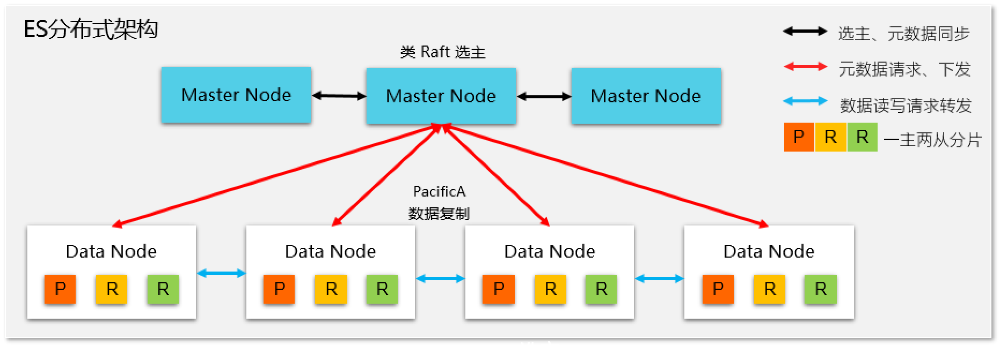

# 一、数据库基础知识

## 1. 主键和外键

- 主键：能够唯一标识一条数据库记录的字段。主键不能重复，不许为空。一张表只能有一个字段作为主键。
- 外键：用来和其他表建立联系，外键是另一张表的主键。外键可以重复，也可以有空值，一张表可以有多个外键。

## 2. 为什么不推荐使用外键与级联

1. 增加了复杂性：每次进行DELETE和UPDATE操作，都必须考虑外键约束；外键的主从关系是确定的，如果需求发生变化，两张表不需要建立联系，修改很麻烦。
2. 增加了额外工作：数据库需要增加维护外键的工作，比如当我们做一些涉及外键字段的增，删，更新操作之后，需要触发相关操作去检查，保证数据的的一致性和正确性，这样会不得不消耗资源。

# 二、NoSQL基础知识总结

## 1. NoSQL是什么

NoSQL(Not Only SQL 的缩写)泛指非关系型的数据库，主要针对的是键值、文档以及图形类型数据存储。并且，NoSQL 数据库天生支持分布式，数据冗余和数据分片等特性，旨在提供可扩展的高可用高性能数据存储解决方案。

常见的NoSQL数据库有：Redis、MongoDB。

通常不支持事务，且扩展集群时为横向扩展，即切片集群，每台机器上存储的数据都不同。MySQL集群如读写分离，每台机器数据都是相同的。

## 2. NoSQL的优势

NoSQL 数据库非常适合许多现代应用程序，例如移动、Web 和游戏等应用程序，它们需要灵活、可扩展、高性能和功能强大的数据库以提供卓越的用户体验。

- **灵活性：** NoSQL 数据库通常提供灵活的架构，以实现更快速、更多的迭代开发。灵活的数据模型使 NoSQL 数据库成为半结构化和非结构化数据的理想之选。
- **可扩展性：** NoSQL 数据库通常被设计为通过使用分布式硬件集群来横向扩展，而不是通过添加昂贵和强大的服务器来纵向扩展。
- **高性能：** NoSQL 数据库针对特定的数据模型和访问模式进行了优化，这与尝试使用关系数据库完成类似功能相比可实现更高的性能。
- **强大的功能：** NoSQL 数据库提供功能强大的 API 和数据类型，专门针对其各自的数据模型而构建。

# 三、MySQL基础

## 0. MySQL执行一条SQL语句的流程

### 1. 连接器

1. 首先，建立TCP链接，MySQL是基于TCP的，根据IP和端口号建立连接。

2. 然后，连接器验证用户名和密码。如果密码不正确就会返回一个`Access denied for user`，然后客户端结束执行。
3. 验证成功，连接器会记录用户的权限，后续所有的操作都会基于此处记录的权限来进行逻辑判断。如果在连接使用过程中修改了权限，不会对现有连接造成影响，只会对后续新建的链接有影响。

MySQL的连接也和HTTP连接一样，有长连接和短链接。短链接每次执行完SQL都会断开。

长连接会存在占用内存的情况。可以采用以下方法来解决：

- 定时断开长连接。
- 客户端主动重置连接。那么当客户端执行了一个很大的操作后，在代码里调用 `mysql_reset_connection()` 函数来重置连接，达到释放内存的效果。这个过程不需要重连和重新做权限验证，但是会将连接恢复到刚刚创建完时的状态。

### 2. 查询缓存

> MySQL8.0之后将缓存删除，执行SQL不需要经过这一步了。

连接器建立好连接后，客户端就可以向MySQL发送SQL语句了。服务器拿到SQL之后，会检查其类型，如果类型为SELECT，就会先查询缓存，看看之前有没有执行过这一条指令。缓存中数据是以键值对的形式存在的，key为SQL语句，value为查询结果。

如果缓存命中，就会直接返回结果；如果缓存没有命中，就会继续向后执行SQL。

那么缓存真的有用吗？

对于更新比较频繁的表，缓存的命中率相当低，因为，只要表中有一个纪录被修改，就会直接清空该表的缓存。如果刚刚缓存了一个查询结果比较大的数据，然后该表发生了修改，缓存就直接被清空了，相当于缓存了个寂寞。

### 3. 解析SQL

正式开始执行SQL语句之前，会对其进行解析，这个工作交给解析器来执行。解析器会进行如下两步操作：

1. 词法分析：对于`select username from userinfo`，会解析出来四个token，其中有两个keyword，分别为select和from。
2. 语法分析：根据词法分析的结果，判断SQL语句是否符合语法规则，如果没问题就会构建出语法树，方便后续模块获取SQL类型、表名、字段名、where条件等。

如果SQL不符合语法，就会报错。但是表名或字段名不存在不会检查出来。

### 4. 执行SQL

每条select查询语句执行流程可以分为三部分：

- prepare阶段，即预处理阶段。
- optimize阶段，优化阶段。
- execute阶段，即执行阶段。

#### 预处理阶段

主要进行如下操作：

- 检查表名和字段名称是否存在。
- 将`select *`中的`*`扩展为表中的所有列。

#### 优化阶段

经过预处理后，优化器需要给SQL语句指定一个执行计划。所以，优化器的主要工作就是将SQL语句的执行方案确定下来。

例如，在表中有多个索引时，需要根据成本考虑来决定使用哪个索引。如果没有索引就会使用全表扫描，效率非常差。

> 可以使用`explain`来查看具体使用了哪个索引

#### 执行阶段

经过优化，就可以将SQL语句交给执行器执行了。在执行过程中，执行器和存储引擎交互，交互是以记录为单位。

下面以三种方式来举例执行过程：

##### 主键索引查询

`select * from userinfo where id=1`。这句SQL使用到了主键索引，而且是等值查询，不会有id相同的记录。所以优化器就会决定使用访问类型为const的进行访问，也就是使用主键索引查询一条记录。其执行过程如下：

- 执行器第一次查询。调用`read_first_record`函数指针指向的函数，将条件`id=1`交给InnoDB，让存储引擎定位符合条件的第一条记录。
- 存储引擎通过主键的B+树结构定位到符合条件的第一条记录。如果记录存在就会返回记录给执行器；如果记录不存在，就会返回记录找不到的错误。
- 执行器从存储引擎拿到记录后，会判断记录是否符合查询条件。如果符合就会返回给客户端；如果不符合则跳过该记录。
- 执行器执行查询是一个循环结构，所以还会再进行一次查询。但是，因为不是第一次查询，所以会调用`read_record`函数指针指向的函数，因为优化器选择的类型为const，这个函数指针指向的函数返回值为-1，然后执行器退出执行。

##### 全表扫描

`select * from product where name="iphone"`。这条语句没有使用索引，所以优化器会决定使用访问类型为ALL进行查询。其过程如下：

- 执行器第一次查询。调用`read_first_record`函数指针指向的函数。因为访问类型为ALL，这个函数指针指向InnoDB的全扫描接口，让InnoDB返回符合条件的第一条记录。
- 执行器获取到存储引擎返回的记录，会判断是否符合条件，如果符合返回给客户端；如果不符合会跳过该记录。(执行器是一条记录一判断，一条记录一返回)。
- 执行器的查询操作是一个循环，所以还会再查一次，调用`read_record`函数指针指向的函数，因为访问类型为ALL，该指针还是指向全扫描接口，接着向存储引擎要求读取刚才记录的下一条记录，继续寻找符合条件的记录，返回。
- 执行器判断是否符合，返回给客户端。一直循环直到将表中所有记录都读完。

## 1. 什么是关系型数据库、SQL、MySQL

关系型数据库是指建立在关系模型上的数据库，关系模型表明了数据库中所存储的数据之间的联系(一对一、一对多、多对多)。关系数据库中，数据都被存放在一张张表中，表的每一行代表了一条数据。

SQL是指结构化查询语言。专门用来操作数据库，可以对数据库进行CRUD操作。

MySQL是是一种关系数据库，主要用来持久化存储系统中的数据。 是开源免费并且比较成熟的数据库。

其优点为：

- 成熟稳定，功能完善。
- 开源免费。
- 文档丰富，既有详细的官方文档，又有非常多优质文章可供参考学习。
- 开箱即用，操作简单，维护成本低。
- 兼容性好，支持常见的操作系统，支持多种开发语言。
- 社区活跃，生态完善。
- 事务支持优秀， InnoDB 存储引擎默认使用 REPEATABLE-READ 并不会有任何性能损失，并且，InnoDB 实现的 REPEATABLE-READ 隔离级别其实是可以解决幻读问题发生的。
- 支持分库分表、读写分离、高可用。

## 2. MySQL基础结构

从上图可以看出， MySQL 主要由下面几部分构成：

- **连接器：** 身份认证和权限相关(登录 MySQL 的时候)。
- **查询缓存：** 执行查询语句的时候，会先查询缓存(MySQL 8.0 版本后移除，因为这个功能不太实用)。
- **分析器：** 没有命中缓存的话，SQL 语句就会经过分析器，分析器说白了就是要先看你的 SQL 语句要干嘛，再检查你的 SQL 语句语法是否正确。
- **优化器：** 按照 MySQL 认为最优的方案去执行。
- **执行器：** 执行语句，然后从存储引擎返回数据。 执行语句之前会先判断是否有权限，如果没有权限的话，就会报错。
- **插件式存储引擎**：主要负责数据的存储和读取，采用的是插件式架构，支持 InnoDB、MyISAM、Memory 等多种存储引擎。

## 3. MySQL存储引擎

MySQL5.5.5之前默认引擎为MyISAM，之后为InnoDB。二者区别为：

- 是否支持事务：InnoDB支持事务，实现了 SQL 标准定义了四个隔离级别，具有提交(commit)和回滚(rollback)事务的能力。并且，InnoDB 默认使用的 REPEATABLE-READ(可重读)隔离级别是可以解决幻读问题发生的(基于 MVCC 和 Next-Key Lock)。

- 是否支持行级锁：MyISAM 只有表级锁(table-level locking)，而 InnoDB 支持行级锁(row-level locking)和表级锁,默认为行级锁。

  也就说，MyISAM 一锁就是锁住了整张表，这在并发写的情况下是多么滴憨憨啊！这也是为什么 InnoDB 在并发写的时候，性能更佳。

- 是否支持外键：外键对于维护数据一致性非常有帮助，但是对性能有一定的损耗。InnoDB支持。

- 是否支持异常崩溃后的安全恢复：InnoDB通过redo log能够让数据库恢复到崩溃前的状态。

- 是否支持MVCC：多版本控制，是行级锁的升级，可以有效减少加锁操作，提高性能。

- 索引方式不一样：虽然二者都是使用B+树作为索引结构，但是MyISAM索引文件和数据文件是分开的，根据B+树查询到叶节点时，只能获取数据文件的索引。二InnoDB叶节点就是数据文件。

**总结**：

- InnoDB 支持行级别的锁粒度，MyISAM 不支持，只支持表级别的锁粒度。
- MyISAM 不提供事务支持。InnoDB 提供事务支持，实现了 SQL 标准定义了四个隔离级别。
- MyISAM 不支持外键，而 InnoDB 支持。
- MyISAM 不支持 MVCC，而 InnoDB 支持。
- 虽然 MyISAM 引擎和 InnoDB 引擎都是使用 B+Tree 作为索引结构，但是两者的实现方式不太一样。
- MyISAM 不支持数据库异常崩溃后的安全恢复，而 InnoDB 支持。
- InnoDB 的性能比 MyISAM 更强大。

## 4. MySQL日志

常见的日志有：

- bin log：归档日志，事务日志记录了所有对数据库进行修改的操作，例如INSERT、UPDATE、DELETE等。事务日志是MySQL数据库复制(Replication)的基础，它可以用于在主从服务器之间复制数据，并实现数据备份和灾难恢复。(用于数据备份和主从复制)
- undo log：回滚日志，记录了数据库引擎对事务进行的修改操作的逆操作，以便于在事务回滚或数据库崩溃时撤销事务对数据库的影响。
- redo log：重做日志，记录了数据库引擎对数据文件进行的物理级别的修改，例如页的插入、更新和删除操作。重做日志用于在数据库崩溃或断电等意外情况下，恢复数据到最新的一致状态。

### undo log

保证了数据库的ACID中的A，原子性。具有两大作用：

1. 实现事务回滚，保证事务的原子性。如果在事务中执行了ROLLBACK，就可以利用undo log来撤销事务的更改。
2. 实现MVCC关键因素之一，MVCC 是通过 ReadView + undo log 实现的。undo log 为每条记录保存多份历史数据，MySQL 在执行快照读（普通 select 语句）的时候，会根据事务的 Read View 里的信息，顺着 undo log 的版本链找到满足其可见性的记录。

### redo log

保证数据的持久性。

为什么不每次把修改后的数据页直接刷盘不就好了？为什么还要redo log 要写到磁盘？

1. 数据页大小较大，直接写回外存比较耗时，而且数据页中被修改的数据比例应该比较小。
2. redo log体积较小，刷盘速度比较快。
3. redo log采用的是追加操作，写回外存可以顺序写，而数据页需要先定位，再写，属于随机写。

### bin log

二进制日志，其内部保存的是所有修改数据库的语句，即存储的是SQL语句。

主要用在主从复制中，服务器通过bin log来复制数据改动。

> bin log和redo log的区别
>
> 前者存储的是SQL语句，后者存储的是数据叶的改动。
>
> 前者用于主从复制，后者用于崩溃恢复。

# 四、MySQL索引

## 1. 索引的分类

- 按照数据结构分：B+Tree、Hash、Full-Text
- 按照物理存储分：聚簇索引(主键索引)、二级索引(辅助索引)
- 按照字段特性分：主键索引、唯一索引、普通索引、前缀索引
- 按照字段个数分：单列索引、联合索引

### 按数据结构分

在创建表时，InnoDB会根据不同的场景自动创建索引：

- 如果有主键，默认会使用逐渐作为聚簇索引的索引键
- 如果没有主键，就选择一个不包含NULL值的唯一列作为聚簇索引的索引键
- 如果上述两个都没有，InnoDB将自动生成一个隐式自增id列作为聚簇索引的索引键

InnoDB中，除了上述创建的索引外，其余的索引都成为二级索引或辅助索引。无论是什么索引，都是采用的B+树结构。

> 主键索引和二级索引的区别：
>
> - 主键索引的B+树，叶子节点存储的是完整的记录。
> - 二级索引(使用非主键作为索引键)，叶子节点存储的是记录的主键值。
>
> 如果使用二级索引来查询数据库，会先查询二级索引的B+树，找到符合条件的记录的主键值。然后，再去查询主键索引对应的B+树。需要两次查表过程，称为回表。
>
> 但是，如果带查询的数据能够在二级索引中找到，就不需要回表。如要查询的就是id值。`select id from product where product_id=001`。
>
> 这种情况就叫做*覆盖缩影*，即只在二级索引B+树就能够查询到结果的过程。

### 按物理存储分

从物理存储的角度来看，索引可以分为聚簇索引和二级索引。

- 主键索引的B+树，叶子节点存储的是完整的记录。
- 二级索引(使用非主键作为索引键)，叶子节点存储的是记录的主键值。

### 按字段特性分类

可以分为：

- 主键索引：索引键为表的主键。一张表只能有一个主键索引。
- 唯一索引：索引键为表中UNIQUE字段。一张表可以有多个唯一索引。
- 普通索引：建立在普通字段上的索引。不要求字段唯一，也不要求是主键。
- 前缀索引：是指对字符类型字段的前几个字符建立的索引，而不是在整个字段上建立的索引。

### 按字段数量分类

- 单列索引：建立在单个属性上的索引。
- 联合索引：建立在多个列上的索引。

## 2. B+树的结构和优缺点

### B+树结构

非叶子节点本质上就是一个B树，每个内部存储多个索引键值，且按照顺序排列。

对于主键索引(聚簇索引)叶子节点存储的是主键对应的记录。但是，由于非叶节点只能指示一个范围，所以，叶子节点内部会有在该范围内的所有记录。叶子结点的存储结构是数据页，页内部记录之间按照索引键的顺序排列。

### 优缺点

优点：

1. 对比B树，B+树只在叶子节点存储数据，而B树所有节点都要存储数据，所以数据量更小。
2. 对比二叉树，首先，同样的节点数量下，二叉树树高更高，查询效率低，而B+树树高为$O(logdN)$，d节点允许的子节点数，实际运用中常常大于100，即使节点数量在千万级别，一次查询操作也只需要三到四次的磁盘I/O。其次，B树就是平衡多叉树，所以二叉树也存在其缺点，即需要存储的数据量更大。
3. 对比Hash，Hash在做等值查询时效率很高，但是不适合做范围查询。

总结：

1. 查询效率稳定，任何查询必须从根节点走到叶节点，路径长度是固定的。
2. 更适合范围查询。
3. 单次查询需要的IO次数较少。

缺点：

1. 插入记录时，需要维护B+树，即树的结构需要调整。
2. 增加了额外的存储。

## 3. MySQL索引失效

MySQL索引失效可能有如下几种情况：

1. 索引列参与了计算。等号左边是索引列的计算，如`select * from stu where id + 1 = 2`
2. 索引列进行了函数运算。如`select * from stu where Year(age) = 2024`
3. where使用了`or`，且两次出现了`><`。
4. like操作。
5. `!=`不等于

## 4. 什么时候需要索引(索引的缺点)

索引也是存在缺点的：

- 需要占用物理空间，数量越大，占用空间越大；
- 创建索引和维护索引要耗费时间，这种时间随着数据量的增加而增大；
- 会降低表的增删改的效率，因为每次增删改索引，B+ 树为了维护索引有序性，都需要进行动态维护。

什么时候需要：

- 字段有唯一性限制的，比如商品编码；
- 经常用于 `WHERE` 查询条件的字段，这样能够提高整个表的查询速度，如果查询条件不是一个字段，可以建立联合索引。
- 经常用于 `GROUP BY` 和 `ORDER BY` 的字段，这样在查询的时候就不需要再去做一次排序了，因为我们都已经知道了建立索引之后在 B+Tree 中的记录都是排序好的。

什么时候不需要：

- `WHERE` 条件，`GROUP BY`，`ORDER BY` 里用不到的字段，索引的价值是快速定位，如果起不到定位的字段通常是不需要创建索引的，因为索引是会占用物理空间的。
- 字段中存在大量重复数据，不需要创建索引，比如性别字段，只有男女，如果数据库表中，男女的记录分布均匀，那么无论搜索哪个值都可能得到一半的数据。在这些情况下，还不如不要索引，因为 MySQL 还有一个查询优化器，查询优化器发现某个值出现在表的数据行中的百分比很高的时候，它一般会忽略索引，进行全表扫描。
- 表数据太少的时候，不需要创建索引；
- 经常更新的字段不用创建索引，比如不要对电商项目的用户余额建立索引，因为索引字段频繁修改，由于要维护 B+Tree的有序性，那么就需要频繁的重建索引，这个过程是会影响数据库性能的

## 5. 优化索引的方法

### 前缀索引优化

使用某个字段中字符串的前几个字符建立索引，减小索引字段大小。

不过，前缀索引有一定的局限性，例如：

- order by 就无法使用前缀索引。
- 无法把前缀索引用作覆盖索引。

### 覆盖索引优化

覆盖索引是指，查询中待返回的所有字段，都能够在条件字段(非主键)的B+树上找到数据，不需要再去查主键索引，避免回表。

假设数据库表中存储的是商品信息，但经常只需要查询商品名称、价格。就可以在ID、名称、价格上建立联合索引。可以大大减少回表的可能。

### 主键索引是自增的

一般库表的逐渐都是默认自增的，其好处是：

InnoDB创建主键索引默认为聚簇索引，数据被存放在叶子节点上。即叶子节点内的记录是按照主键的顺序存放的，当有新的数据插入时，数据库就会根据主键将其插入到对应的叶子节点上。

如果使用自增主键，那么每次插入的新数据就会按顺序添加到当前索引节点的位置，不需要移动已有的数据，当页面写满，就会自动开辟一个新页面。因为每次**插入一条新记录，都是追加操作，不需要重新移动数据**，因此这种插入数据的方法效率非常高。

**如果我们使用非自增主键**，由于每次插入主键的索引值都是随机的，因此每次插入新的数据时，就可能会插入到现有数据页中间的某个位置，这将不得不移动其它数据来满足新数据的插入，甚至需要从一个页面复制数据到另外一个页面，我们通常将这种情况称为**页分裂**。**页分裂还有可能会造成大量的内存碎片，导致索引结构不紧凑，从而影响查询效率**。

### 索引最好为非空

- 第一原因：索引列存在 NULL 就会导致优化器在做索引选择的时候更加复杂，更加难以优化。因为可为 NULL 的列会使索引、索引统计和值比较都更复杂，比如进行索引统计时，count 会省略值为NULL 的行。
- 第二个原因：NULL 值是一个没意义的值，但是它会占用物理空间，所以会带来的存储空间的问题，因为 InnoDB 存储记录的时候，如果表中存在允许为 NULL 的字段，那么[行格式 (opens new window)](https://xiaolincoding.com/mysql/base/row_format.html#innodb-行格式有哪些)中**至少会用 1 字节空间存储 NULL 值列表**。

### 防止索引失效

## 6. InnoDB的物理存储以及索引如何查询

### 物理存储

InnoDB中记录是以行为单位存储的，但是在进行读写时是按照*数据页*来进行的。

- 一个数据页中存储多条记录。
- 数据页之间是以双链表的形式组织在一起的，数据页头部有指向上一个数据页和下一个数据页的指针。这样数据页之间可以物理上不连续。
- 数据页内部记录按照主键的顺序来排列，组成单向链表。插入和删除非常方便，但是查询效率不高。

为了提高查询效率，给每个数据页创建了页目录：将数据页分为若干个分组，页目录中会用对应数量的槽slot来记录每一组最后一条记录的偏移地址。

### B+树如何查询

B+树的结构为：

- 非叶子节点存储的是页目录，即只给出一定的范围，通过不断向下查询就能定位到某一个数据页。
- 叶子节点存储的是数据页，但是可能是多个数据页，因为非叶节点只能指示一定范围。
- 在非叶节点，通过二分查找的方式来找到目标数据在哪个范围上，然后向下一层级查询。

## 7. MySQL单表数据不要超过2000W条记录

超过2000w条记录，可能会让B+树的树高变高，导致I/O次数变多。

# 五、MySQL事务

## 1. 并发事务会带来什么问题

脏读：读取到别的事务未提交的数据。

不可重复读：连续两次读同一个数据，结果不一致。重点是指一条记录内部某些字段的值发生变化。

幻读：事务期间两次读取数据库，发现数据库记录数量发生变化。

## 2. 并发事务的控制方式

并发事务的控制方式只有两种：锁和MVCC，锁可以看作是悲观锁的实现，MVCC多版本并发控制可以看作是乐观锁的实现。

### 锁

MySQL中主要通过读写锁来实现并发控制：

- 共享锁(S锁)，又称读锁，事务在读取记录时，获取共享锁，允许其他事务同时获取共享锁。
- 排他锁(X锁)，又称写锁，事务在修改记录时，不允许多个事务同时获取。如果一个事务已经加了排他锁，则其他事务不能再添加任何类型的锁。

另外，锁还可以根据粒度分为：行级锁和表级锁。InnoDB默认是行级锁，粒度更小只需要对相关记录上锁即可。

### MVCC

多版本并发控制，一份数据会对应多个版本，通过事务的可见性来保证事务能看到自己应该看到的版本。

## 3. 事务隔离级别

SQL 标准定义了四个隔离级别：

- **READ-UNCOMMITTED(读取未提交)** ：最低的隔离级别，允许读取尚未提交的数据变更，可能会导致脏读、幻读或不可重复读。
- **READ-COMMITTED(读取已提交)** ：允许读取并发事务已经提交的数据，可以阻止脏读，但是幻读或不可重复读仍有可能发生。
- **REPEATABLE-READ(可重复读)** ：对同一字段的多次读取结果都是一致的，除非数据是被本身事务自己所修改，可以阻止脏读和不可重复读，但幻读仍有可能发生。
- **SERIALIZABLE(可串行化)** ：最高的隔离级别，完全服从 ACID 的隔离级别。所有的事务依次逐个执行，这样事务之间就完全不可能产生干扰，也就是说，该级别可以防止脏读、不可重复读以及幻读。

## 4. 事务隔离级别是通过什么做到的

可串行化是通过锁来实现的，可重复读和读取已提交是通过MVCC来实现的。但是可重复读会通过加锁的方式来避免幻读。

# 六、MySQL锁

## 1. 表级锁和行级锁

- 表级锁：对整张表加锁，针对非索引字段加锁。实现简单，资源消耗少，枷锁快，不会出现死锁。但是并发性能差。
- 行级锁：针对索引字段，仅对当前事务操作的记录上锁。加锁粒度小，并发性能高。但是资源消耗多，加锁慢，会出现死锁。

> 行级锁是针对索引字段加锁的，如果我们执行`UPDATE` `DELETE`等操作时，如果`WHERE`语句中没有唯一命中索引，或者索引失效的话，就会扫描全表对每行记录加锁。

## 2. 行级锁的分类

- 记录锁(Record Lock)：给单个记录行上锁。
- 间隙锁(Gap Lock)：锁定一个范围内的记录，不包括边界。给定两个记录，锁定两记录之间的记录，不包括边界。
- 临建锁(Next-Key Lock)：锁定一个范围内的记录，但是包括边界。

## 3. 意向锁

如果想要给表加上表锁，如何判断表中记录是否被加了行级锁。如果直接遍历，性能太差。所以就要用到意向锁，当要对表中记录加行级锁时，就要先给记录所属表添加意向锁。

意向锁是表级锁，共有两种：

- **意向共享锁（Intention Shared Lock，IS 锁）**：事务有意向对表中的某些记录加共享锁（S 锁），加共享锁前必须先取得该表的 IS 锁。
- **意向排他锁（Intention Exclusive Lock，IX 锁）**：事务有意向对表中的某些记录加排他锁（X 锁），加排他锁之前必须先取得该表的 IX 锁。

意向锁之间相互兼容，但是意向锁和表级的共享排他锁会互斥。

## 7. MVCC

多版本并发控制，用于在多个并发事务同时读写数据库时保持数据的一致性和隔离性。它是通过在每个数据行上维护多个版本的数据来实现的。当一个事务要对数据库中的数据进行修改时，MVCC 会为该事务创建一个数据快照，而不是直接修改实际的数据行。

MVCC 通过创建数据的多个版本和使用快照读取来实现并发控制。读操作使用旧版本数据的快照，写操作创建新版本，并确保原始版本仍然可用。这样，不同的事务可以在一定程度上并发执行，而不会相互干扰，从而提高了数据库的并发性能和数据一致性。

### 读操作

当一个事务执行读操作时，它会使用快照读取。快照读取是基于事务开始时数据库中的状态创建的，因此事务不会读取其他事务尚未提交的修改。具体工作情况如下：

- 对于读取操作，事务会查找符合条件的数据行，并选择符合其事务开始时间的数据版本进行读取。
- 如果某个数据行有多个版本，事务会选择不晚于其开始时间的最新版本，确保事务只读取在它开始之前已经存在的数据。
- 事务读取的是快照数据，因此其他并发事务对数据行的修改不会影响当前事务的读取操作。

### 写操作

当一个事务执行写操作时，它会生成一个新的数据版本，并将修改后的数据写入数据库。具体工作情况如下：

- 对于写操作，事务会为要修改的数据行创建一个新的版本，并将修改后的数据写入新版本。
- 新版本的数据会带有当前事务的版本号，以便其他事务能够正确读取相应版本的数据。
- 原始版本的数据仍然存在，供其他事务使用快照读取，这保证了其他事务不受当前事务的写操作影响。

### 事务提交和回滚

- 当一个事务提交时，它所做的修改将成为数据库的最新版本，并且对其他事务可见。
- 当一个事务回滚时，它所做的修改将被撤销，对其他事务不可见。

### 旧版本回收

为了防止数据库中的版本无限增长，MVCC 会定期进行版本的回收。回收机制会删除已经不再需要的旧版本数据，从而释放空间。

# 七、读写分离和分库分表

## 1. 主从复制

MySQL的binlog记录了数据库中所有库表变化的SQL语句。因此，通过binlog就可以实现主从复制。具体过程如下：

1. 主库将数据库中数据的变化写入到 binlog
2. 从库连接主库
3. 从库会创建一个 I/O 线程向主库请求更新的 binlog
4. 主库会创建一个 binlog dump 线程来发送 binlog ，从库中的 I/O 线程负责接收
5. 从库的 I/O 线程将接收的 binlog 写入到 relay log 中。
6. 从库的 SQL 线程读取 relay log 同步数据到本地（也就是再执行一遍 SQL ）

## 2. 如何避免主从延迟

读写分离对于提升数据库的并发非常有效，但是，同时也会引来一个问题：主库和从库的数据存在延迟。

避免主从延迟主要有两个方法：

- 强制将读写请求路由到主库处理。
- 延迟读取。

## 3. 什么是分库

分库就是将数据库中的数据分散到不同的数据库中。有水平分库和垂直分库。

- 水平分库：按照一定规则，将一张表的数据拆分到不同的数据库中。
- 垂直分库：按照业务划分，将不同的表划分到不同的数据库上。

## 4. 什么是分表

分表就是对单个表进行拆分，有水平分表和垂直分表：

- 水平分表：对数据记录行进行拆分，如果一个表记录较多，就可以拆分成多个表。每张表字段都一致。
- 垂直分表：对数据列进行拆分，将一张列比较多的表，拆分成多个表。

## 5. 什么情况下需要分库分表

- 单表的数据达到千万级别以上，此时读写性能较差。
- 数据库中的数据越来越多，备份时间越来越长。
- 应用的并发量太大。

## 6. 常见的分片算法

分片算法是为了解决数据被水平划分后，数据应该存放在那张表中的问题。

常见的分片算法有：

- 哈希分片：就是简单的哈希表映射，直接对节点数取余，得到的数字就是对应的表的序号。对动态伸缩不友好，即增加减少表时不能即使改变映射。
- 范围分片：直接按照某个键值的范围区间来划分。数据为未被分散，可能会出现热点数据问题。
- 映射表分片：维护一个映射表，存储分片键值和分片位置的关系。增加了额外开销。
- 一致性哈希分片：将哈希空间维护成一个环形，分片健和节点都映射到环上，然后根据顺时针的规则确定数据或请求应该分配到哪个节点上，解决了传统哈希对动态伸缩不友好的问题。

## 7. 分库分表的缺点

- join操作：同一个数据库的表分散在了不同数据库中，导致无法使用join操作。
- 事务问题：同一个数据库的表分散在了不同数据库中，如果单个操作涉及到多个数据库，自带的事务就无法满足需求。
- 分布式ID：分库之后， 数据遍布在不同服务器上的数据库，数据库的自增主键已经没办法满足生成的主键唯一了。

# 八、MySQL慢查询

## 1. 慢查询是什么，原因分析

MySQL慢查询是指，执行时间超过设定阈值的查询语句。这些操作可能会消耗大量的数据库资源，导致系统性能下降或响应时间延长。主要影响如下：

- 造成性能损耗：慢查询会消耗CPU、内存和I/O资源，导致数据库性能下降。
- 响应时间过长：用户请求的响应时间会被慢查询拉长，降低用户体验。
- 资源浪费：不必要的慢查询会浪费数据库服务器的资源，降低系统的稳定性。

如何识别慢查询？

MySQL中可以设置`long_query_time`属性，超过这个设定值的查询语句就是慢查询。然后，再开启慢查询日志就可以记录慢查询语句的执行。

其可能原因如下：

1. 没有建立索引或索引不生效
   1. 索引失效的原因：索引键参与运算、`or`两侧使用了范围查询、使用了`like`等等。
2. I/O吞吐量小。MySQL数据是存储在外存中的，如果磁盘I/O性能较差就会成为瓶颈，导致慢查询。
3. 内存不足：内存不足导致读取出来的数据需要频繁更换，MySQL需要频繁地进行磁盘I/O。
4. 网速过慢：如果是远程数据库连接，网速也会成为制约性能的因素。
5. 查询出的数据量过大：返回的结果集过大，增加了数据传输和结果处理的时间。
6. 锁或死锁：查询时遇到了表级锁、行级锁等导致查询被阻塞或延迟。如果遇到死锁就会陷入等待。
7. SQL未优化：查询语句不合理，使用了大量的子查询或复杂的连接条件。

## 2. 如何优化慢查询

根据具体的原因给出解决方法。

# 一、ElasticSearch

## 1. 什么是ElasticSearch，为什么要使用

​	是一款开源的搜索、聚合分析和存储引擎，同时也是一种非关系数据库。

​	系统中的数据随着业务的发展，会越来越多。而业务中经常会出现模糊查询，模糊查询会导致MySQL索引失效，从而需要遍历全表才能找到数据。在百万级数据库中遍历全表的查询效率十分低下。而ES的倒排索引对模糊查询有较好的支持，我们对ES中的数据做全文倒排索引，就可以使用常用字段来模糊查询，大大提高了查询效率。

​	另外，在短信平台项目中，数据库用来存储已经发送的短信信息，对于这些信息是读少写多的，而ES天然支持分布式，可以很方便地配置多台分片服务器，用于写数据。

## 1. 倒排索引

​	MySQL等采用的是正向索引，如果直接根据索引字段进行检索，就可以直接使用建立好的索引快速定位到相关记录。但是，如果是要进行模糊匹配，无论是否是根据索引字段检索，都只能遍历所有记录来判断查找。

​	倒排索引，包含文档和词条两个概念。文档就是被存储的数据，即记录；词条就是将文档按照一定算法进行分词，得到的词条。

​	对于ES中存储的文档，首先对每一条文档进行分词，然后可以得到当前文档中所有词条和该文档的对应关系，存储在一个Map中<term, 文档id>，所有文档都分词后，就可以得到每个词条都出现在哪些文档中。

​	需要检索时，只需要对检索条件进行分词，然后分别使用分得的词条查找其出现过的文档id，然后取交集，就能够定位到一个文档。

正向索引：

- 优点：
  - 可以给多个字段设置索引。
  - 根据索引字段搜索记录，速度非常快。
- 缺点：
  - 根据非索引字段，或索引字段中的部分词条进行检索时，只能扫描全表。

倒排索引：

- 优点：
  - 根据词条搜索、模糊搜索时，速度很快。
- 缺点：
  - 只能给词条创建索引，而不是字段。
  - 无法根据字段做排序。

## 2. 存储结构

​	ES面向文档存储，一条文档对应的是一条记录。文档会被序列化为JSON格式来存储，每个字段对应的是JSON的一个属性。

​	ES中的索引index，对应的是MySQL中的表。一条索引中包含了多个文档。

## 3. 对比MySQL

- MySQL擅长事务类型操作，可以确保数据的安全和一致性。
- ES擅长对海量数据做检索、分析和计算。

## 5. ElasticSearch分布式结构

​	ElasticSearch的分布式集群由多个节点组成，节点分为下面几类：

- 主节点(master node)：负责管理集群元数据。
- 数据节点(data node)：负责存储和管理数据。
- 功能节点：辅助功能。

​	主节点可以有多个，他们之间通过类Raft算法的分布式一致性协议来选主、元数据同步等。数据节点内部包含了一个数据分片，其中是整个数据库的一部分数据(主分片)，以及该数据分片的数据副本(从分片)。数据节点的主分片按照主键Hash或用户自定义的路由均匀分布到各个节点上。

### 读写模型

#### 写入

​	ES的任意节点都可以作为写入请求的协调节点，接收用户请求。节点接收到写入请求后，先计算Hash值来确定该请求数据应该写入的分片号，然后将请求转发至对应的数据节点。对应数据节点接收到请求后，先对主分片进行写入，然后再对从分片进行写入。主从分片都写入完成，再由最初接收到请求的协调节点返回响应给客户端。

#### 读取

​	和写入模型一致，读取时所有的节点都可以作为协调节点。节点接收到读取请求后，计算Hash值确定数据所在分片，然后将请求转发至对应节点(一个或多个)。对应的数据节点在主分片或从分片上进行查询，并将结果汇总在协调节点上统一返回。

​	根据查询的复杂度，常见的查询过程有两种：

1. `QUERY_THEN_FETCH`：最常用到的查询类型。协调节点需要向其他节点分发两轮任务：
   1. Query Phase：协调节点向各数据节点分发查询任务，数据节点按照条件筛选数据对应的文档id集合。
   2. Fetch Phase：协调节点归并上一阶段的结果。得到最终的文档id集合和聚合结果，并向目标数据片发送命令抓取数据。
2. `QUERY_AND_FETCH`：应用于查询结果仅涉及到一个数据分片的情况：
   1. ES对查询流程进行优化，在数据节点的Query Phase阶段最后，直接抓取数据返回。只需要一轮任务就可以完成。

## 6. ES的master选举流程

​	基于类Raft协议来进行选举。主要流程如下：

- 每个几点

