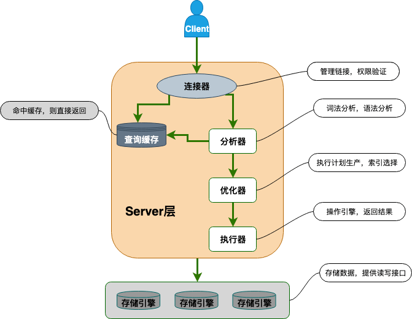

# 一、数据库基础知识

## 1. 主键和外键

- 主键：能够唯一标识一条数据库记录的字段。主键不能重复，不许为空。一张表只能有一个字段作为主键。
- 外键：用来和其他表建立联系，外键是另一张表的主键。外键可以重复，也可以有空值，一张表可以有多个外键。

## 2. 为什么不推荐使用外键与级联

1. 增加了复杂性：每次进行DELETE和UPDATE操作，都必须考虑外键约束；外键的主从关系是确定的，如果需求发生变化，两张表不需要建立联系，修改很麻烦。
2. 增加了额外工作：数据库需要增加维护外键的工作，比如当我们做一些涉及外键字段的增，删，更新操作之后，需要触发相关操作去检查，保证数据的的一致性和正确性，这样会不得不消耗资源。

# 二、NoSQL基础知识总结

## 1. NoSQL是什么

NoSQL(Not Only SQL 的缩写)泛指非关系型的数据库，主要针对的是键值、文档以及图形类型数据存储。并且，NoSQL 数据库天生支持分布式，数据冗余和数据分片等特性，旨在提供可扩展的高可用高性能数据存储解决方案。

常见的NoSQL数据库有：Redis、MongoDB。

通常不支持事务，且扩展集群时为横向扩展，即切片集群，每台机器上存储的数据都不同。MySQL集群如读写分离，每台机器数据都是相同的。

## 2. NoSQL的优势

NoSQL 数据库非常适合许多现代应用程序，例如移动、Web 和游戏等应用程序，它们需要灵活、可扩展、高性能和功能强大的数据库以提供卓越的用户体验。

- **灵活性：** NoSQL 数据库通常提供灵活的架构，以实现更快速、更多的迭代开发。灵活的数据模型使 NoSQL 数据库成为半结构化和非结构化数据的理想之选。
- **可扩展性：** NoSQL 数据库通常被设计为通过使用分布式硬件集群来横向扩展，而不是通过添加昂贵和强大的服务器来纵向扩展。
- **高性能：** NoSQL 数据库针对特定的数据模型和访问模式进行了优化，这与尝试使用关系数据库完成类似功能相比可实现更高的性能。
- **强大的功能：** NoSQL 数据库提供功能强大的 API 和数据类型，专门针对其各自的数据模型而构建。

# 三、MySQL基础

## 1. 什么是关系型数据库、SQL、MySQL

关系型数据库是指建立在关系模型上的数据库，关系模型表明了数据库中所存储的数据之间的联系(一对一、一对多、多对多)。关系数据库中，数据都被存放在一张张表中，表的每一行代表了一条数据。

SQL是指结构化查询语言。专门用来操作数据库，可以对数据库进行CRUD操作。

MySQL是是一种关系数据库，主要用来持久化存储系统中的数据。 是开源免费并且比较成熟的数据库。

其优点为：

- 成熟稳定，功能完善。
- 开源免费。
- 文档丰富，既有详细的官方文档，又有非常多优质文章可供参考学习。
- 开箱即用，操作简单，维护成本低。
- 兼容性好，支持常见的操作系统，支持多种开发语言。
- 社区活跃，生态完善。
- 事务支持优秀， InnoDB 存储引擎默认使用 REPEATABLE-READ 并不会有任何性能损失，并且，InnoDB 实现的 REPEATABLE-READ 隔离级别其实是可以解决幻读问题发生的。
- 支持分库分表、读写分离、高可用。

## 2. MySQL基础结构

从上图可以看出， MySQL 主要由下面几部分构成：

- **连接器：** 身份认证和权限相关(登录 MySQL 的时候)。
- **查询缓存：** 执行查询语句的时候，会先查询缓存(MySQL 8.0 版本后移除，因为这个功能不太实用)。
- **分析器：** 没有命中缓存的话，SQL 语句就会经过分析器，分析器说白了就是要先看你的 SQL 语句要干嘛，再检查你的 SQL 语句语法是否正确。
- **优化器：** 按照 MySQL 认为最优的方案去执行。
- **执行器：** 执行语句，然后从存储引擎返回数据。 执行语句之前会先判断是否有权限，如果没有权限的话，就会报错。
- **插件式存储引擎**：主要负责数据的存储和读取，采用的是插件式架构，支持 InnoDB、MyISAM、Memory 等多种存储引擎。

## 3. MySQL存储引擎

MySQL5.5.5之前默认引擎为MyISAM，之后为InnoDB。二者区别为：

- 是否支持事务：InnoDB支持事务，实现了 SQL 标准定义了四个隔离级别，具有提交(commit)和回滚(rollback)事务的能力。并且，InnoDB 默认使用的 REPEATABLE-READ(可重读)隔离级别是可以解决幻读问题发生的(基于 MVCC 和 Next-Key Lock)。

- 是否支持行级锁：MyISAM 只有表级锁(table-level locking)，而 InnoDB 支持行级锁(row-level locking)和表级锁,默认为行级锁。

  也就说，MyISAM 一锁就是锁住了整张表，这在并发写的情况下是多么滴憨憨啊！这也是为什么 InnoDB 在并发写的时候，性能更佳。

- 是否支持外键：外键对于维护数据一致性非常有帮助，但是对性能有一定的损耗。InnoDB支持。

- 是否支持异常崩溃后的安全恢复：InnoDB通过redo log能够让数据库恢复到崩溃前的状态。

- 是否支持MVCC：多版本控制，是行级锁的升级，可以有效减少加锁操作，提高性能。

- 索引方式不一样：虽然二者都是使用B+树作为索引结构，但是MyISAM索引文件和数据文件是分开的，根据B+树查询到叶节点时，只能获取数据文件的索引。二InnoDB叶节点就是数据文件。

**总结**：

- InnoDB 支持行级别的锁粒度，MyISAM 不支持，只支持表级别的锁粒度。
- MyISAM 不提供事务支持。InnoDB 提供事务支持，实现了 SQL 标准定义了四个隔离级别。
- MyISAM 不支持外键，而 InnoDB 支持。
- MyISAM 不支持 MVCC，而 InnoDB 支持。
- 虽然 MyISAM 引擎和 InnoDB 引擎都是使用 B+Tree 作为索引结构，但是两者的实现方式不太一样。
- MyISAM 不支持数据库异常崩溃后的安全恢复，而 InnoDB 支持。
- InnoDB 的性能比 MyISAM 更强大。

## 4. MySQL索引

## 5. MySQL日志

常见的日志有：

- bin log：归档日志，事务日志记录了所有对数据库进行修改的操作，例如INSERT、UPDATE、DELETE等。事务日志是MySQL数据库复制(Replication)的基础，它可以用于在主从服务器之间复制数据，并实现数据备份和灾难恢复。(用于数据备份和主从复制)
- undo log：回滚日志，记录了数据库引擎对事务进行的修改操作的逆操作，以便于在事务回滚或数据库崩溃时撤销事务对数据库的影响。
- redo log：重做日志，记录了数据库引擎对数据文件进行的物理级别的修改，例如页的插入、更新和删除操作。重做日志用于在数据库崩溃或断电等意外情况下，恢复数据到最新的一致状态。

### undo log

保证了数据库的ACID中的A，原子性。具有两大作用：

1. 实现事务回滚，保证事务的原子性。如果在事务中执行了ROLLBACK，就可以利用undo log来撤销事务的更改。
2. 实现MVCC关键因素之一，MVCC 是通过 ReadView + undo log 实现的。undo log 为每条记录保存多份历史数据，MySQL 在执行快照读（普通 select 语句）的时候，会根据事务的 Read View 里的信息，顺着 undo log 的版本链找到满足其可见性的记录。

### redo log

保证数据的持久性。

为什么不每次把修改后的数据页直接刷盘不就好了？为什么还要redo log 要写到磁盘？

1. 数据页大小较大，直接写回外存比较耗时，而且数据页中被修改的数据比例应该比较小。
2. redo log体积较小，刷盘速度比较快。
3. redo log采用的是追加操作，写回外存可以顺序写，而数据页需要先定位，再写，属于随机写。

### bin log

二进制日志，其内部保存的是所有修改数据库的语句，即存储的是SQL语句。

主要用在主从复制中，服务器通过bin log来复制数据改动。

> bin log和redo log的区别
>
> 前者存储的是SQL语句，后者存储的是数据叶的改动。
>
> 前者用于主从复制，后者用于崩溃恢复。

## 6. MySQL事务

### 脏读、不可重复读、幻读

脏读：读取到别的事务未提交的数据。

不可重复读：连续两次读同一个数据，结果不一致。

幻读：事务期间两次读取数据库，发现数据库记录数量发生变化。

### 事务隔离级别

SQL 标准定义了四个隔离级别：

- **READ-UNCOMMITTED(读取未提交)** ：最低的隔离级别，允许读取尚未提交的数据变更，可能会导致脏读、幻读或不可重复读。
- **READ-COMMITTED(读取已提交)** ：允许读取并发事务已经提交的数据，可以阻止脏读，但是幻读或不可重复读仍有可能发生。
- **REPEATABLE-READ(可重复读)** ：对同一字段的多次读取结果都是一致的，除非数据是被本身事务自己所修改，可以阻止脏读和不可重复读，但幻读仍有可能发生。
- **SERIALIZABLE(可串行化)** ：最高的隔离级别，完全服从 ACID 的隔离级别。所有的事务依次逐个执行，这样事务之间就完全不可能产生干扰，也就是说，该级别可以防止脏读、不可重复读以及幻读。

## 7. MVCC

多版本并发控制，用于在多个并发事务同时读写数据库时保持数据的一致性和隔离性。它是通过在每个数据行上维护多个版本的数据来实现的。当一个事务要对数据库中的数据进行修改时，MVCC 会为该事务创建一个数据快照，而不是直接修改实际的数据行。

MVCC 通过创建数据的多个版本和使用快照读取来实现并发控制。读操作使用旧版本数据的快照，写操作创建新版本，并确保原始版本仍然可用。这样，不同的事务可以在一定程度上并发执行，而不会相互干扰，从而提高了数据库的并发性能和数据一致性。

### 读操作

当一个事务执行读操作时，它会使用快照读取。快照读取是基于事务开始时数据库中的状态创建的，因此事务不会读取其他事务尚未提交的修改。具体工作情况如下：

- 对于读取操作，事务会查找符合条件的数据行，并选择符合其事务开始时间的数据版本进行读取。
- 如果某个数据行有多个版本，事务会选择不晚于其开始时间的最新版本，确保事务只读取在它开始之前已经存在的数据。
- 事务读取的是快照数据，因此其他并发事务对数据行的修改不会影响当前事务的读取操作。

### 写操作

当一个事务执行写操作时，它会生成一个新的数据版本，并将修改后的数据写入数据库。具体工作情况如下：

- 对于写操作，事务会为要修改的数据行创建一个新的版本，并将修改后的数据写入新版本。
- 新版本的数据会带有当前事务的版本号，以便其他事务能够正确读取相应版本的数据。
- 原始版本的数据仍然存在，供其他事务使用快照读取，这保证了其他事务不受当前事务的写操作影响。

### 事务提交和回滚

- 当一个事务提交时，它所做的修改将成为数据库的最新版本，并且对其他事务可见。
- 当一个事务回滚时，它所做的修改将被撤销，对其他事务不可见。

### 旧版本回收

为了防止数据库中的版本无限增长，MVCC 会定期进行版本的回收。回收机制会删除已经不再需要的旧版本数据，从而释放空间。