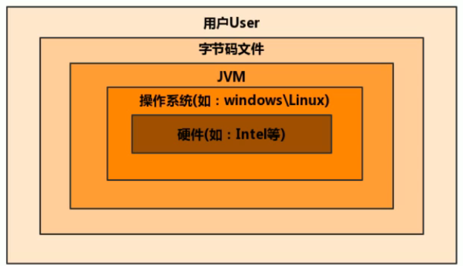
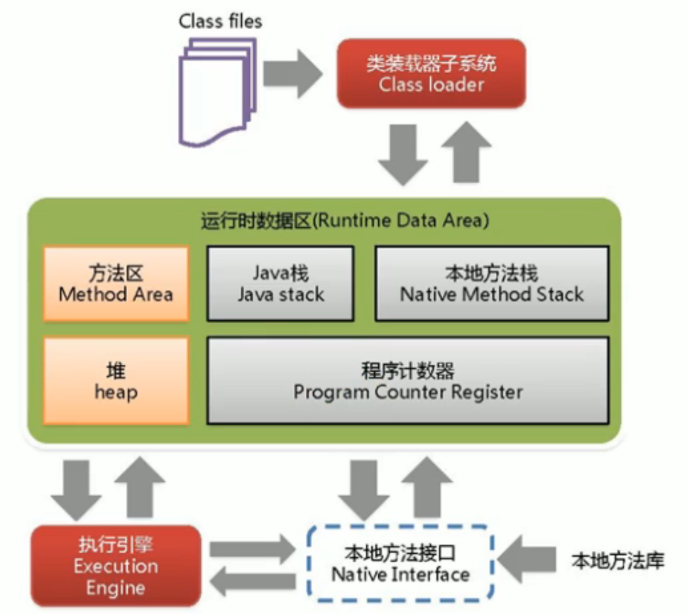
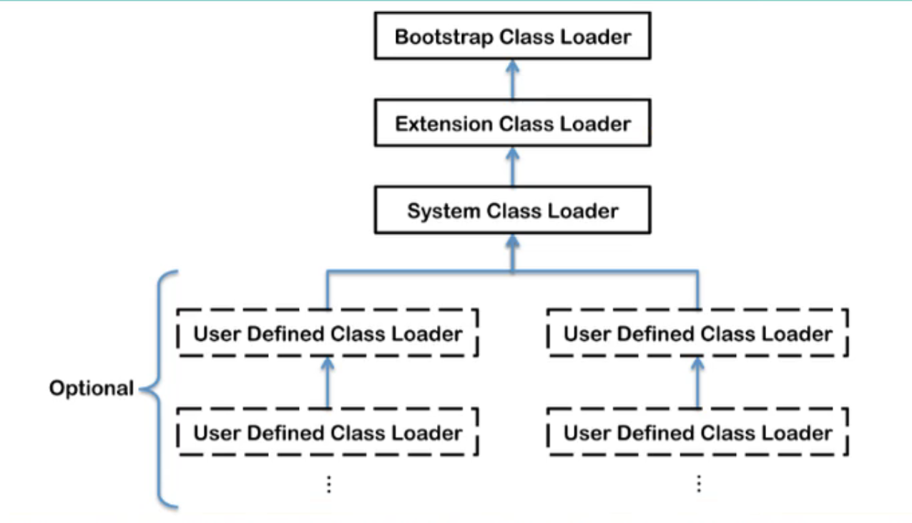

# JVM整体介绍

## JVM简介

### 基本概念

​	JVM(Java Virtual Machine)，Java虚拟机。是一种跨语言的平台。JVM只关心字节码文件，不只能够解释运行Java字节码文件，只要语言的编译器遵守相关标准，则JVM就可以解释运行其编译产生的字节码文件。

​	通过JVM可以实现多语言混合编程，各种语言之间的交互不存在任何困难，就像调用自己语言的原生API一样方便，因为他们最终运行在同一个虚拟机上。

### 虚拟机与Java虚拟机

​	虚拟机，就是一台虚拟的计算机。是一款软件，用来执行一系列虚拟计算机指令，大体上可以分为*系统级虚拟机和程序虚拟机*：

- 系统级虚拟机：完全对物理计算机的仿真。
- 程序虚拟机：专门为执行单个计算机程序而设计。

​	无论哪种虚拟机，在其上运行的软件都被限制于虚拟机提供的资源中。

​	Java虚拟机是一台执行Java自己妈的虚拟计算机，拥有独立的运行机制，Java技术的核心就是Java虚拟机。

​	Java虚拟机就是二进制字节码的运行环境。有如下特点：

- 一次编译，到处运行
- 自动内存管理
- 自动垃圾回收功能

### JVM的位置



​	JVM运行在操作系统之上。

## JVM的整体结构

​	

​	以上为HotSpot VM。主要分为三大部分：

- 类装载子系统：负责将字节码文件加载到内存中，生成Class对象
- 运行时数据区：运行时内存分布，灰色部分为线程独享
- 执行引擎：解释器、JIT、GC


## Java代码执行流程

- `.java`文件，经过编译器(编译器前端)，生成`.class`文件的二进制字节码
- `.class`文件被类加载子系统加载至内存，生成`Class`对象
- 执行引擎将二进制字节码翻译为机器指令，交给CPU执行，如果有热点代码，会进行缓存(JIT)


## JVM的生命周期

### 虚拟机的启动

​	Java虚拟机的启动时通过引导类加载器(bootstrap class loader)创建一个初始类(initial class)来完成的。

### 虚拟机的执行

​	执行一个Java程序时，真正在执行的是一个叫做Java虚拟机的进程。

### 虚拟机的退出

​	有如下几种退出情况：

- 程序正常执行结束
- 程序在执行中发生了异常或者错误而异常终止
- 由于操作系统出现错误而导致Java虚拟机进程终止
- 某线程调用Runtime类或System类的exit方法，或Runtime类的halt方法，并且Java安全管理器也允许这次exit或halt操作
- JNI(Java Native Interface)规范描述了用JNI Invocation API来加载或卸载Java虚拟机时，Java虚拟机的退出情况


## JVM发展历程

### Sun Classic VM

​	世界上第一款商用Java虚拟机，只提供解释器。jdk1.4被淘汰

## Exact VM

​	Exact Memory Management，准确式内存管理。虚拟机可以知道内存中某个位置的数据具体是什么类型的数据。编译器与解释器混合工作。

## HotSpot VM

​	JDK8中默认的虚拟机。HotSpot指的是它的热点探测技术：

- 通过计数器找到最具编译价值代码，触发即时编译或栈上替换
- 通过编译器与解释器协同工作，在最优化的程序响应时间与最佳执行性能中取得平衡

## JRockit VM

​	专注于服务器端应用，可以不太关注程序启动速度，因此，内部不包含解释器实现，全部代码都靠即时编译器编译后执行。

​	世界上最快的JVM。

## IBM J9

​	有影响力的三大商用虚拟机之一，也号称是世界上最快的Java虚拟机。


# 类加载子系统

​	类加载器的工作原理包含三个阶段：加载阶段、连接阶段和初始化阶段。

- 类加载子系统负责从文件系统或网络中加载`.class`文件，`.class`文件开头有客厅的文件标识。
- ClassLoader只负责`.class`文件的加载，至于其是否可运行，由执行引擎决定。
- 加载的类信息防御一块称为方法区的内存空间。除了类的信息外，方法区中还会存在存放运行时常量池信息，可能还包括字符串字面量和数字常量。

## 加载阶段Loading

- 通过一个类的全限定名获取此类的二进制字节流
- 将这个字节流所代表的静态存储结构转化为方法区的运行时数据结构
- 在内存中生成一个代表这个类的`java.lang.Class`对象，作为方法去这个类的各种数据的访问入口(将类信息存储在方法区)

> 加载`.class`文件的方式：
>
> - 从本地系统中直接加载
> - 从网络获取，如Web Applet
> - 从zip压缩包中读取，为jar，war格式的基础
> - 运行时计算生成，使用最多的是：动态代理技术
> - 由其他文件生成，如：JSP
> - 从专有数据空中提取`.class`文件
> - 从加密文件中获取，典型的防Class文件被反编译的保护措施


## 连接阶段Linking

### 验证Verify

​	验证的目的在于确保Class文件的字节楼中包含信息符合当前虚拟机要求，保证被加载类的正确性，不会危害虚拟机自身安全。主要包含四种验证：文件格式验证、元数据验证、字节码验证、符号引用验证。

### 准备Prepare

​	为类变量分配内存并设置该类变量的默认初始值，即零值。

- 所有的变量都会被赋予默认值，而不是实际的赋值。
- 这里不包含使用`final`修饰的`static`元素，因为`final`在编译时就会分配内存，准备阶段会显示初始化。

- 不会为实例变量分配初始化，类变量会分配在方法区中，而实例变量时会随着对象一起分配到Java堆中。

### 解析Resolve

​	将常量池内的符号引用转换为直接引用的过程。事实上，解析操作往往会伴随着JVM在执行完初始化之后完成。

> 如`System.out.pringln("hello world");`中是通过符号引用了`java.lang.System`类中的方法，在解析阶段，会直接指向该类对象，转换为直接引用。


### 初始化Initialization

​	初始化阶段就是执行类构造器方法`<clinit>()`的过程。此方法不需要定义，是javac编译器自动收集类中所有变量的赋值动作和静态代码块中的语句合并而来。

​	类构造器方法中指令按照语句在源文件中出现的顺序执行。

```java
public class Test {
	private static int num = 1;
	static {
		num = 10;
		number = 20;
        sout(number); // 会报错，非法前向引用
	}
	private static int number = 10;
	public static void main(String[] args) {
		sout(num); // 10
		sout(number); // 10
	}
}
```

> 上述代码中，首先，`number`可以先赋值，再定义，这是因为在准备阶段，会对`number`进行赋零值操作。但是，如果在静态代码块中就直接输出`number`，就会报错。
>
> 然后，在`<clinit>()`方法中，会先对`num`赋值为1，再赋值为10。对`number`先赋值为20，再赋值为10，按照顺序操作。

​	`<clinit>()`方法不同于类的构造器。类的构造器在虚拟机中为`<init>()`。

> 如果类中不存在静态变量和代码块，就不会生成`<clinit>()`类构造器方法。
>
> 任何一个类声明之后，都会至少存在一个类的构造方法。

​	若当前类具有父类，JVM会保证子类的`<clinit>()`执行前，让父类的`<clinit>()`执行完毕。

​	虚拟机必须保证一个类的`<clinit>()`方法在多线程下被同步加锁。

> 保证一个类只会被加载一次。一个线程加载成功，其他线程都会被阻塞。


## 类加载器的分类



​	图中的四种类加载器是包含关系，不是继承关系。

​	JVM支持两种类型的类加载器，分别为引导类加载器(Bootstrap ClassLoader)和自定义类加载器(User-Defined ClassLoader)。

​	只要是直接或间接继承自ClassLoader的类加载器都是自定义类加载器。常见的类加载器只有三个：

- Bootstrap ClassLoader