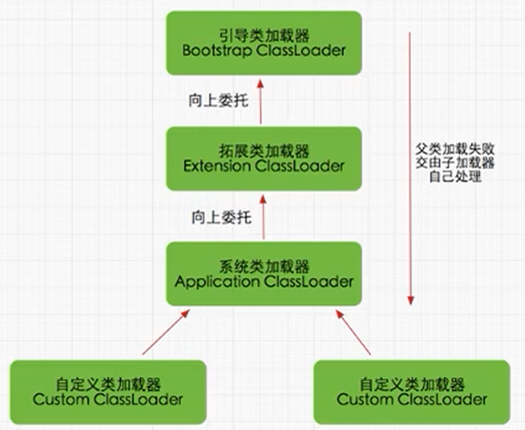
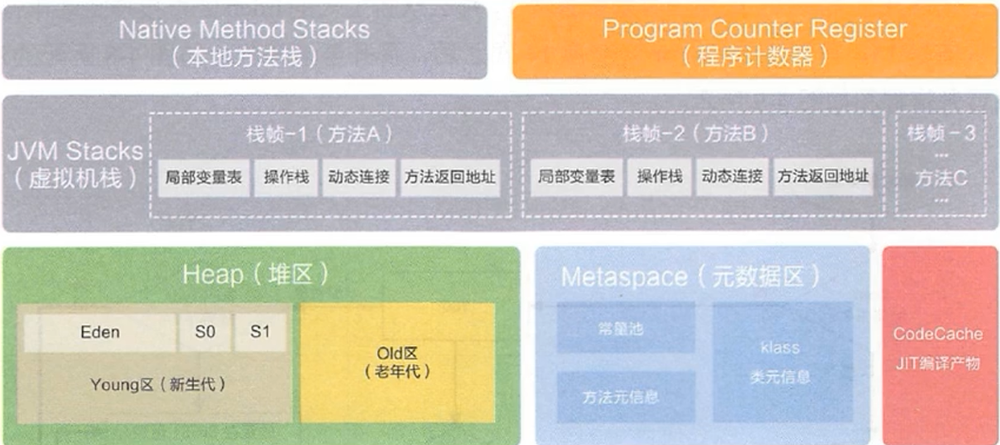
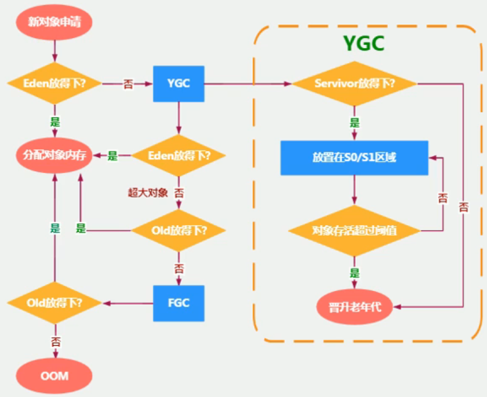
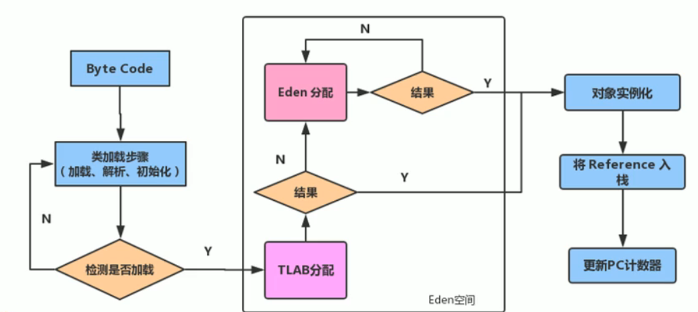
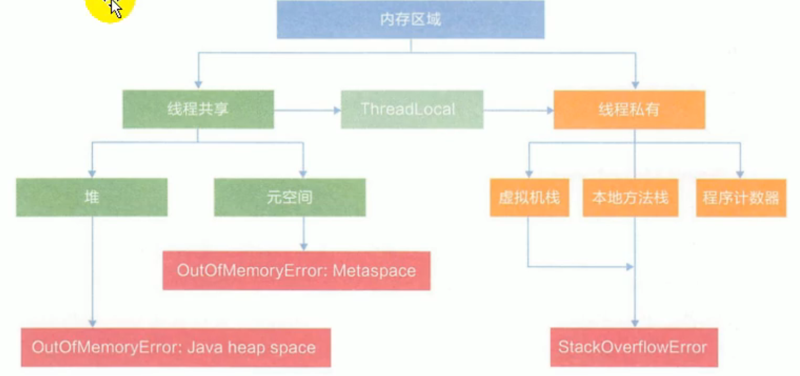
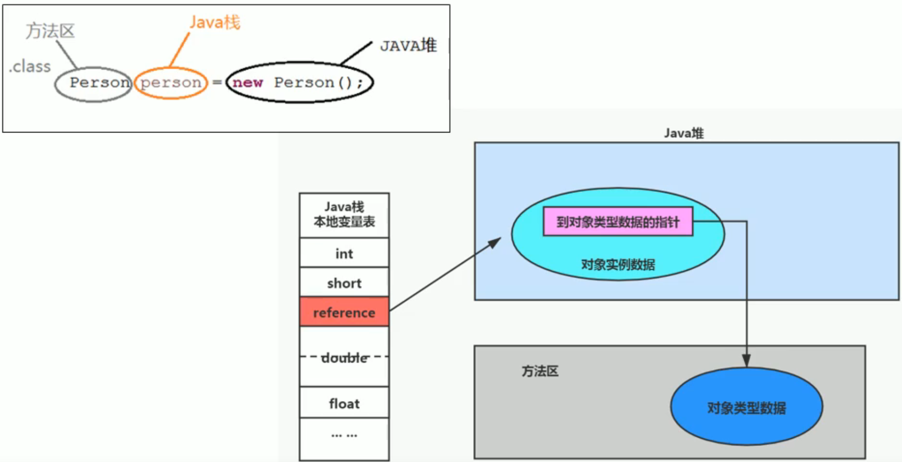

# JVM整体介绍

## JVM简介

### 基本概念

JVM(Java Virtual Machine)，Java虚拟机。是一种跨语言的平台。JVM只关心字节码文件，不只能够解释运行Java字节码文件，只要语言的编译器遵守相关标准，则JVM就可以解释运行其编译产生的字节码文件。

通过JVM可以实现多语言混合编程，各种语言之间的交互不存在任何困难，就像调用自己语言的原生API一样方便，因为他们最终运行在同一个虚拟机上。

### 虚拟机与Java虚拟机

虚拟机，就是一台虚拟的计算机。是一款软件，用来执行一系列虚拟计算机指令，大体上可以分为*系统级虚拟机和程序虚拟机*：

- 系统级虚拟机：完全对物理计算机的仿真。
- 程序虚拟机：专门为执行单个计算机程序而设计。

无论哪种虚拟机，在其上运行的软件都被限制于虚拟机提供的资源中。

Java虚拟机是一台执行Java自己妈的虚拟计算机，拥有独立的运行机制，Java技术的核心就是Java虚拟机。

Java虚拟机就是二进制字节码的运行环境。有如下特点：

- 一次编译，到处运行
- 自动内存管理
- 自动垃圾回收功能

### JVM的位置


JVM运行在操作系统之上。

## JVM的整体结构


以上为HotSpot VM。主要分为三大部分：

- 类装载子系统：负责将字节码文件加载到内存中，生成Class对象
- 运行时数据区：运行时内存分布，灰色部分为线程独享
- 执行引擎：解释器、JIT、GC


## Java代码执行流程

- `.java`文件，经过编译器(编译器前端)，生成`.class`文件的二进制字节码
- `.class`文件被类加载子系统加载至内存，生成`Class`对象
- 执行引擎将二进制字节码翻译为机器指令，交给CPU执行，如果有热点代码，会进行缓存(JIT)


## JVM的生命周期

### 虚拟机的启动

Java虚拟机的启动时通过引导类加载器(bootstrap class loader)创建一个初始类(initial class)来完成的。

### 虚拟机的执行

执行一个Java程序时，真正在执行的是一个叫做Java虚拟机的进程。

### 虚拟机的退出

有如下几种退出情况：

- 程序正常执行结束
- 程序在执行中发生了异常或者错误而异常终止
- 由于操作系统出现错误而导致Java虚拟机进程终止
- 某线程调用Runtime类或System类的exit方法，或Runtime类的halt方法，并且Java安全管理器也允许这次exit或halt操作
- JNI(Java Native Interface)规范描述了用JNI Invocation API来加载或卸载Java虚拟机时，Java虚拟机的退出情况


## JVM发展历程

### Sun Classic VM

世界上第一款商用Java虚拟机，只提供解释器。jdk1.4被淘汰

## Exact VM

Exact Memory Management，准确式内存管理。虚拟机可以知道内存中某个位置的数据具体是什么类型的数据。编译器与解释器混合工作。

## HotSpot VM

JDK8中默认的虚拟机。HotSpot指的是它的热点探测技术：

- 通过计数器找到最具编译价值代码，触发即时编译或栈上替换
- 通过编译器与解释器协同工作，在最优化的程序响应时间与最佳执行性能中取得平衡

## JRockit VM

专注于服务器端应用，可以不太关注程序启动速度，因此，内部不包含解释器实现，全部代码都靠即时编译器编译后执行。

世界上最快的JVM。

## IBM J9

有影响力的三大商用虚拟机之一，也号称是世界上最快的Java虚拟机。


# 类加载子系统

类加载器的工作原理包含三个阶段：加载阶段、连接阶段和初始化阶段。

- 类加载子系统负责从文件系统或网络中加载`.class`文件，`.class`文件开头有客厅的文件标识。
- ClassLoader只负责`.class`文件的加载，至于其是否可运行，由执行引擎决定。
- 加载的类信息防御一块称为方法区的内存空间。除了类的信息外，方法区中还会存在存放运行时常量池信息，可能还包括字符串字面量和数字常量。

## 加载阶段Loading

- 通过一个类的全限定名获取此类的二进制字节流
- 将这个字节流所代表的静态存储结构转化为方法区的运行时数据结构
- 在内存中生成一个代表这个类的`java.lang.Class`对象，作为方法去这个类的各种数据的访问入口(将类信息存储在方法区)

> 加载`.class`文件的方式：
>
> - 从本地系统中直接加载
> - 从网络获取，如Web Applet
> - 从zip压缩包中读取，为jar，war格式的基础
> - 运行时计算生成，使用最多的是：动态代理技术
> - 由其他文件生成，如：JSP
> - 从专有数据空中提取`.class`文件
> - 从加密文件中获取，典型的防Class文件被反编译的保护措施


## 连接阶段Linking

### 验证Verify

验证的目的在于确保Class文件的字节楼中包含信息符合当前虚拟机要求，保证被加载类的正确性，不会危害虚拟机自身安全。主要包含四种验证：文件格式验证、元数据验证、字节码验证、符号引用验证。

### 准备Prepare

为类变量分配内存并设置该类变量的默认初始值，即零值。

- 所有的变量都会被赋予默认值，而不是实际的赋值。
- 这里不包含使用`final`修饰的`static`元素，因为`final`在编译时就会分配内存，准备阶段会显示初始化。

- 不会为实例变量分配初始化，类变量会分配在方法区中，而实例变量时会随着对象一起分配到Java堆中。

### 解析Resolve

将常量池内的符号引用转换为直接引用的过程。事实上，解析操作往往会伴随着JVM在执行完初始化之后完成。

> 如`System.out.println("hello world");`中是通过符号引用了`java.lang.System`类中的方法，在解析阶段，会直接指向该类对象，转换为直接引用。


## 初始化Initialization

初始化阶段就是执行类构造器方法`<clinit>()`的过程。此方法不需要定义，是javac编译器自动收集类中所有静态变量的赋值动作和静态代码块中的语句合并而来。

类构造器方法中指令按照语句在源文件中出现的顺序执行。

```java
public class Test {
    private static int num = 1;
    static {
        num = 10;
        number = 20;
        sout(number); // 会报错，非法前向引用
    }
    private static int number = 10;
    
    public static void main(String[] args) {
        sout(num); // 10
        sout(number); // 10
    }
}
```

> 上述代码中，首先，`number`可以先赋值，再定义，这是因为在准备阶段，会对`number`进行赋零值操作。但是，如果在静态代码块中就直接输出`number`，就会报错。
>
> 然后，在`<clinit>()`方法中，会先对`num`赋值为1，再赋值为10。对`number`先赋值为20，再赋值为10，按照顺序操作。

`<clinit>()`方法不同于类的构造器。类的构造器在虚拟机中为`<init>()`。

> 如果类中不存在*静态变量和静态代码块*，就不会生成`<clinit>()`类构造器方法。
>
> 任何一个类声明之后，都会至少存在一个类的构造方法`<init>()`。

若当前类具有父类，JVM会保证子类的`<clinit>()`执行前，让父类的`<clinit>()`执行完毕。

虚拟机必须保证一个类的`<clinit>()`方法在多线程下被同步加锁。

> 保证一个类只会被加载一次。一个线程加载成功，其他线程都会被阻塞。


## 类加载器的分类


图中的四种类加载器是包含关系，不是继承关系。

JVM支持两种类型的类加载器，分别为引导类加载器(Bootstrap ClassLoader)和自定义类加载器(User-Defined ClassLoader)。

只要是直接或间接继承自ClassLoader的类加载器都是自定义类加载器。常见的类加载器只有三个：

- Bootstrap ClassLoader：加载系统核心类库，使用该引导类加载器进行加载。无法直接获取该类加载器。
- Extension ClassLoader：扩展类加载器。
- System ClassLoader：系统类加载器/应用程序类加载器。加载用户自定义类，默认使用系统类加载器进行加载。

```java
public class Test {
public static void main(String[] args) {
        ClassLoader systemClassLoader = ClassLoader.getSystemClassLoader();
        ClassLoader extensionClassLoader = systemClassLoader.getParent();
        ClassLoader bootstrapClassLoader = extensionClassLoader.getParent(); // null
        // 用户自定义类加载器
        ClassLoader classLoader = Test.class.getClassLoader();
        sout(classLoader.equals(systemClassLoader)); // true
        // 系统核心类的加载器
        // 用户自定义类加载器
        ClassLoader classLoader1 = String.class.getClassLoader(); // null
    }
}
```


### 虚拟机自带的类加载器

#### 启动类加载器 Bootstrap ClassLoader

- 该类加载器使用C/C++实现的，嵌在JVM内部。
- 使用该类加载器来加载Java的核心类库，如`JAVA_HOME/jre/lib/rt.jar`、`resources.jar`或`sun.boot.class.path`下的内容。用于提供Java自身需要的类。
- 不继承自`java.lang.ClassLoader`，没有父加载器。
- 负责加载*扩展类加载器*和*应用程序类加载器*，并且是这两个类加载器的父加载器。
- 出于安全考虑，启动类加载器只加载包名为`java`、`javax`和`sun`开头的类。

#### 扩展类加载器 Extension ClassLoader

- Java语言编写，由`sun.misc.Launcher$ExtClassLoader`实现。
- 派生于ClassLoader类。
- 父加载器为`Bootstrap ClassLoader`启动类加载器。
- 从`java.ext.dirs`系统属性所指定的目录加载类库，或从`JAVA_HOME/jre/lib/ext`子目录下加载类库。如果用户创建的jar包也放在该目录下，也会由该类加载器加载。

#### 系统类加载器/应用程序类加载器 System ClassLoader/AppClassLoader

- Java语言编写，由`sun.misc.Launcher$AppClassLoader`实现。
- 派生于ClassLoader类。
- 父类加载器为`ExtensionClassLoader`扩展类加载器。
- 负责加载环境变量`classpath`或系统属性`java.class.path`指定路径下的类库。
- *该类加载器是程序中默认的类加载器*，一般来说Java应用的类都是由其完成加载。
- 通过`ClassLoader.getSystemClassLoader()`方法可以获取该来加载器实例对象。


### 用户自定义类加载器

Java应用的开发中，类的加载几乎都是上述三种类加载器完成的。必要时，我们也可以自定义类加载器。

为什么需要自定义类加载器：

- 隔离加载类：可以避免不同模块之间jar包冲突。
- 修改类的加载方式：
- 扩展加载源
- 防止源码泄露：可以在生成字节码文件时进行加密，在加载字节码时进行解密。

使用方法：

- 可以通过继承`java.lang.ClassLoader`类的方式，实现自己的类加载器，以满足一些需求。
- 建议将自己的类加载逻辑写在`findClass()`方法中。
- 如果没有特殊需求，可以直接继承`URLClassLoader`类，能够避免自己编写`findClass()`方法，及获取字节码流的方法。


## ClassLoader

ClassLoader是一个抽象类，除了BootstrapClassLoader外，所有的类加载器都继承自它。

常用方法和获取方式：

- `Class.forName("java.lang.String").getClassLoader();`
- `Thread.currentThread().getContextClassLoader();`
- `ClassLoader.getSystemClassLoader();`
- `getParent`：获取父类加载器，注意不是继承的父类，而是前置。


## 双亲委派机制

Java虚拟机对`.class`文件采用的是按需加载的方式。也就是说当需要使用该类时，才会将它的`.class`文件加载到内存生成Class对象。而且加载某个类的`.class`文件时，Java虚拟机采用的是双亲委派模式，即把请求交由父类处理，它是一种任务委派模式。



其工作原理如下：

- 当一个类加载器收到了类加载请求，它不会自己先去加载，而是将请求交付给父类加载器去执行。
- 如果父类加载器还存在父类加载器，则进一步向上委派。请求最终会到达启动类加载器。
- 如果父类加载器能够完成请求，就返回成功；如果父类返回失败，则子类会尝试加载。

> 验证：可以在项目目录中创建一个`java.lang`包，并创建一个`String`类，然后new一个String对象。结果会发现，new出来的还是Java自带的`java.lang.String`，而不是我们自己创建的String。
>
> 这是因为通过双亲委派机制，类的加载请求会不断向上委托，String类最终会由Bootstrap ClassLoader来加载，而它只会加载指定目录下的Java核心类库。
>
> 同时，如果在自定义的String类中调用main方法，会报错，说找不到main方法，原因同上。

`rt.jar`包中的SPI接口，其实现类是由第三方提供的`jdbc.jar`，所以，SPI接口为核心类库，实现类是第三方类库。这种情况下就会出现反向委派，接口由启动类加载器加载，实现类的加载委派给Context ClassLoader，线程上下文类加载器来加载。


双亲委派机制的优势：

- 避免类的重复加载
- 保护程序安全，避免核心API被篡改
  - 如上面提到的自定义`java.lang.String`
  - 或者自己创建一个`java.lang.MyTest`类，此时类的包名是`java`，会由启动类加载器来加载，因此会报错，提示不允许访问。防止恶意破坏启动类加载器。


## 沙箱安全机制

上文中提到的自定义`java.lang.String`，如果运行main方法，就会加载Java核心类库中的String类，然后从其中找到main方法。但是，因为Java自带的String没有main方法，就会报错。这就是沙箱安全机制，可以保护核心代码不受恶意侵害。


## 其他

### 区分两个类的方式

在JVM中，区分两个类是否是一个类有两个必要条件：

- 两个类的完整类名必须一致。
- 加载这两个类的类加载器必须一致，必须是同一个实例。

因此，即使是同一个类被同一个JVM所加载，但是只要是加载时使用的类加载器不是同一个实例，那么产生的两个Class对象也是不同的。

Java类加载器这种特性可以简单的总结为**命名空间**。即在 Java 虚拟机中，类的唯一性是由类加载器实例以及类的全名一同确定的。即便是同一串字节流，经由不同的类加载器加载，也会得到两个不同的类。

JVM必须知道一个类是由启动类加载器加载的，还是由用户类加载器加载的。如果一个类是由用户类加载器加载的，JVM会将这个类加载器的一个引用作为类型信息的一部分保存在方法区中。当解析一个类型到另一个类型的引用时，JVM需要保证这两个类的类加载器是相同的。


### 类的主动使用与被动使用

Java程序对类的使用分为主动使用和被动使用，主动使用分为七种：

- 创建类的实例
- 调用某个类或接口的静态变量，或对该静态变量赋值
- 调用类的静态方法
- 反射，如`Class.forName("java.lang.String");`
- 初始化一个类的子类
- Java虚拟机启动时被标记为启动类的类
- 动态语言

除了以上七种情况，类的使用都会被看做是被动使用，不会导致类的初始化。


# 运行时数据区概述及线程

## 概述



不同JVM的运行时内存各有同，以上为HotSpot VM的运行时内存，分为：

- 本地方法栈：用来存储C/C++编写的本地的方法(native method)。
- 程序计数器(Program Conter Register)：PC用来记录当前程序下一条指令的地址。
- 虚拟机栈(JVM Stack)：每调用一个方法，压入一个栈帧。
- 堆区(Heap)：包含新生代和老年代。
- 元数据区(Metaspace)：常量池、方法元信息、klass类元信息。
- CodeCache：JIT编译产物。

JVM的运行时数据区，一部分会随着JVM的创建而创建，随着JVM的退出而销毁，即随进程变化。另一部分随着线程的生命周期变化。

本地方法栈、虚拟机栈和程序计数器是每个线程独一份的。方法区(非堆空间)和堆区是线程共享的。

> 每个Java程序只有一个Runtime对象，可以通过它和运行时环境(运行时内存)进行交互。


## 线程

线程是进程的一个运行单元，JVM允许一个进程有多个并行执行的线程。

在HotSpot VM中，每个JVM线程都和一个操作系统本地线程直接映射。当一个Java线程创建好准备运行时，此时一个操作系统的线程也同时创建。Java线程终止后，操作系统线程也会回收。

操作系统负责所有线程的安排调度。会将线程安排到可用的CPU上。一旦本地线程创建好，就会调用Java线程中的`run()`方法。

### 后台线程

如果使用调试工具，可以看到除了Java应用程序自己编写的线程外(调用main方法的线程和main线程自己创建的线程)，后台还有很多线程在执行。这些后台系统线程主要包含以下几个：

- 虚拟机线程：这种线程的操作需要JVM达到安全点才会出现。该线程的执行类型包括"stop-the-world"垃圾回收、线程栈回收、线程挂起以及偏向锁撤销。
- 周期任务线程：这种线程是时间周期事件的体现，如中断。一般用于周期性操作的调度执行。
- GC线程：这种线程对JVM里不同种类的垃圾回收提供支持。
- 编译线程：在运行时将字节码转换为本地代码。
- 信号调度线程：接收信号并发送给JVM，在它内部调用适当的方法进行处理。


# 程序计数器

## 程序计数器介绍

JVM中的程序计数器，其命名源于CPU中的PC寄存器，在CPU中用于记录下一条指令的地址。JVM中的程序计数器是对物理PC寄存器的抽象模拟。也是存储下一条指令的地址，由执行引擎负责读取下一条指令。

PC是一块很小的内存空间，是运行速度最快的内存空间。每个线程都有自己的PC，即PC为线程私有，生命周期与线程周期保持一致。

任何时刻，一个线程只会有一个方法在执行，也就是所谓的*当前方法*。PC会记录当前方法的JVM指令地址。如果在执行的是native方法，PC内容为未指定值(undefined)。

PC是程序控制流的指示器，分支、循环、跳转、异常处理、线程恢复等基础功能都依赖这个寄存器。字节码解释器就是通过修改PC的内容来获取下一条需要执行的字节码指令。同时，PC也是JVM规范中唯一没有规定任何OOM的区域。


## 常见问题

### 使用PC寄存器存储字节码指令地址有什么用？为什么使用PC寄存器记录当前线程的执行地址呢？

在CPU中，因为CPU需要不停的切换各个线程，当切换回来以后，CPU需要知道从哪里开始执行。JVM的字节码解释同样也是如此，通过PC寄存器来指明下一条需要执行的指令。

### PC寄存器为什么是线程私有

为了能够准确记录每个线程正在执行的字节码指令地址。还是因为会有线程切换。

CPU采取的是时间片轮转，CPU或者多核CPU的每个核心，每个时刻只会执行一个线程的一条指令，总是会频繁的切换线程。


# 虚拟机栈(栈帧内都包含什么结构)

## 概述

Java的指令是基于栈来实现的，优点是可以跨平台，指令集小，编译器容易实现。缺点是，性能下降，实现同样的功能需要更多指令。

栈是运行时的单位，而堆是存储的单位。即，栈解决程序的运行问题，即程序如何执行，或者说如何处理数据。堆解决的是数据存储的问题,即数据怎么放、放在哪儿。

Java虚拟机栈，每个线程创建时都会创建一个虚拟机栈，内部保存一个一个的栈帧，对应每次的方法调用。因此，生命周期和线程一致。保存方法的局部变量、部分结果，并参与方法的调用与返回。

线程调用方法，会压入栈帧；方法执行结束，会弹出栈帧。所以，对于虚拟机栈来说，不存在垃圾回收问题。但是，如果不停的方法调用，会存在栈溢出问题(OOM)。


## 虚拟机栈的常见问题以及如何设置栈大小

如果采用固定大小的Java虚拟机栈，那么每一个线程的Java虚拟机栈容量可以在线程创建时独立选定。如果线程请求分配的容量超过了JVM允许的最大容量，JVM会抛出一个`StackOverflowError`异常。

如果Java虚拟机栈的大小可以动态扩展，那么在尝试扩展时无法申请到足够的内存，或者在创建新线程时没有足够的空间去创建对应的虚拟机栈，JVM就会抛出`OutOfMemoryError`异常。


## 栈的存储单位

### 栈中存储什么

每个线程都有自己的栈，栈中的数据都是以栈帧`Stack Frame`的形式存在的。

当前线程的每个正在执行的方法都会各自对应一个栈帧。

栈帧是一个内存区域，是一个数据集，存储着方法执行过程中的各种数据信息。

### 栈运行原理

JVM直接对Java虚拟机栈的操作只有两个，就是对栈帧的压栈和出栈。遵循先进后出原则。

在一个活动线程中，一个时间点上，只有一个活动的栈帧。即当前只有一个正在执行的方法。这个栈帧被称为当前栈帧(Current Frame)。与当前栈帧对应的方法就是当前方法。定义这个方法的类就是当前类。

执行引擎运行的所有二进制字节码指令只针对当前栈帧进行操作。

如果在当前方法中调用了其他方法，对应的新的栈帧会被压入栈，成为当前栈帧。


需要注意：

- 不同线程的栈帧之间不允许相互引用。
- 如果当前栈帧调用了其他方法，该方法执行结束时，会返回执行结果给调用栈帧。然后JVM会丢弃该方法的栈帧。
- Java方法有两种返回方法的方式，一种是正常方法返回，使用`return`指令；另一种是抛出异常。但是无论哪种，都会抛弃当前栈帧。
  - 如果抛出异常，会将异常返回给调用方法，如果没有处理就要一直向前返回，直到被catch，或JVM停止运行。


### 栈帧内部结构

每个栈帧内部有如下结构：

- 局部变量表(Local Variables)
- 操作数栈(Operand Stack)，或表达式栈
- 动态链接(Dynamic Linking)，或指向运行时常量池的引用
- 方法返回地址(Return Address)，或方法正常退出与异常退出的定义
- 附加信息

## 局部变量表

也被称为局部变量数组或本地变量表。

其定义为一个数字数组，主要用于存储方法参数和定义在方法内部的局部变量。这些数据的类型包括基本数据类型、应用数据类型和`returnAddress`类型。

局部变量表建立在线程的栈上，是线程私有的数据，因此不存在数据安全问题。

局部变量表的容量，是在*编译时期就确定的*，并保存在方法的`Code`属性的`maximum local variables`数据项中。在方法运行期间，是不会改变局部变量表大小的。

方法嵌套调用的次数，由栈的大小决定。栈越大，方法嵌套调用的次数就越多。对于一个方法来说，其参数和局部变量越多，栈帧就越大，占用的空间就越大，进而嵌套调用的次数就越少。

局部变量表中的变量只在当前栈帧有效。方法执行结束，方法的局部变量就会被销毁。

### 关于slot的理解

局部变量表，最基本的单位是slot变量槽。

在局部变量表中，32位以内的数据只占用一个slot，64位的数据(long和double)占用两个slot。

JVM会给每一个slot都分配一个索引，通过索引就可以访问到指定的局部变量。如果需要访问64位的变量，只需要访问前一个索引即可。

当一个实例方法被调用时，其方法参数和方法体内部定义的变量，会按照顺序被复制到局部变量表中的slot上。

> 如果当前栈帧是由构造方法或实例方法创建的，会将调用方法的对象的`this`存储在0号slot上。

局部变量表的slot是可以复用的，如果一个局部变量过了其作用域，其占用的slot就会释放。在其后申请的新的局部变量就有可能复用该slot。这样做可以节省资源。


> 在栈帧中，与性能调优关系最密切的就是局部变量表。在方法执行时，JVM使用局部变量表完成方法的传递。
>
> 局部变量表中的变量也是重要的垃圾回收根节点。只要被局部变量表直接或间接引用的对象，都不会被回收。


### 静态变量与局部变量的对比

Java中变量的初始化顺序为：静态变量初始零值(准备阶段) -> 静态变量显式赋值(初始化阶段) -> 静态代码块赋值 -> 实例变量默认零值 -> 构造代码块赋值 -> 构造函数赋值。

类变量无论是静态的还是非静态的，都会有初始化动作。而局部变量表不存在于系统初始化过程之中，所以，局部变量必须人为初始化，否则无法使用。

> 成员变量一般分为：静态变量(类变量)和非静态变量(实例变量)。


## 操作数栈

每个栈帧内部，还包含一个先进后出的操作数栈，可称之为表达式栈。

在方法执行过程中，根据字节码指令，往栈中写入数据或提取数据，即入栈/出栈。

- 某些指令将数据压入栈中，区域的字节码将数据取出，使用后再把结果压入栈。
- 如果被执行的方法有返回值，其返回值就会被压入当前栈帧的操作数栈中，并更新PC。
- 操作数栈中的数据类型要与字节码指令的序列严格匹配，由编译器在编译期间验证。同时在类加载过程的类检验阶段的数据流分析阶段要再次验证。
- 我们说Java虚拟机的解释引擎是基于栈的执行引擎。其中的栈就是指操作数栈。

操作数栈，主要用于保存计算中间结果，同时作为计算过程中中间变量的临时存储空间。

操作数栈就是JVM执行引擎的一个工作空间，当一个方法被调用时，会有一个新的栈帧被创建，此时栈帧的操作数栈是空的。

每一个操作数栈都有一个明确的栈深度，在编译时期就已经确定了。

操作数栈中不采用基于索引的数据访问，而是只能通过入栈出栈操作。

### 面试题i++和++i的区别

放在字节码篇章再说。


## 代码追踪


## 栈顶缓存技术

基于栈式架构的虚拟机所使用的零地址指令更加紧凑，但是完成一项操作，需要更多的入栈/出栈操作。内存读写次数也更频繁。于是会拖慢执行速度。

将栈顶元素全部缓存在CPU的寄存器中，以此来降低对内存的读写次数，提高引擎执行效率。


## 动态链接

大部分的字节码在执行时都需要对运行时常量池进行访问。每一个栈帧都有一个指向*运行时常量池*中**该帧所属方法的引用**。这个引用的目的就是为了能够支持当前方法代码的动态链接。

> 方法引用就会变为一个指向常量池中某一行的引用。在常量池该行中，用字符串记录了调用方法的全类名和方法名。但是只是字符串，而不是直接指向该类该方法的引用。

Java源文件被编译为字节码文件时，所有的变量和方法的引用都作为*符号引用*保存在字节码文件的常量池中。比如一个方法中调用了另一个方法，就是通过常量池中指向方法的符号引用来实现的。

动态链接的作用就是将符号引用转为直接引用。

> 符号引用：即用**(用字符串符号的形式)**来表示引用，其实被引用的类、方法或者变量还没有被加载到内存中。
>
> 直接引用：有具体引用地址的指针，被引用的类、方法或者变量已经被加载到内存中。
>
> 动态链接可以在没有用到该引用时，不加载到内存中。

常量池的作用就是提供一些符号和常量，便于指令的识别。

## 方法的调用：解析与分派

### 方法的绑定机制

JVM中将符号引用转换为被调用方法的直接引用与方法的绑定机制有关。

- 静态链接：当一个字节码被加载进内存时，如果被调用的方法在编译期间可知，且运行期保持不变。这种情况将符号引用转换为直接引用的过程称为静态链接。
- 动态链接：如果被调用的方法，在编译期无法被确定下来，只能够在运行期将符号引用转换为直接引用，这种转换过程具备动态性。称之为动态链接。

对应的绑定机制分为早期绑定和晚期绑定。绑定是指，一个字段、方法、类由符号引用转换为直接引用的过程，仅仅发生一次。

- 早期绑定：在编译期间就转换为直接引用。
- 晚期绑定：在运行期间转换为直接引用。

### 虚方法与非虚方法

非虚方法：编译期就已经确定了具体的调用版本，实现了早期绑定的方法。

- 静态方法、私有方法、final方法、实例构造器、父类方法都是非虚方法。

> 虚方法都涉及到方法的重写，而非虚方法都不能被重写。

JVM中提供如下几种指令来调用方法：

- `invokestatic`：调用静态方法，解析阶段确定唯一方法版本。
- `invokespecial`：调用`<init>()`方法、私有方法、父类方法、解析阶段确定唯一版本。
- `invokevirtual`：调用所有虚方法。
- `invokeinterface`：调用接口方法。

以上四条指令都固化在虚拟机内部，方法的调用执行不可人为干预。

前两条调用的都是非虚方法。其余的除了`final`修饰的方法都是虚方法。

以及一个动态调用指令：

- `invokedynamic`：支持用户指定方法版本。


### invokedynamic

Java本身是静态语言，`invokedynamic`在Java7出现，就是为了支持动态类型语言的支持。

静态语言就是变量本身有类型，只能被赋予特定类型的值；动态语言就是变量本身没有类型，而变量的值有类型。(约等于强类型和弱类型语言)。


### 方法的重写和虚方法表

Java中方法重写的本质：

当调用方法时：

1. 找到操作数栈顶的第一个元素所执行的对象的实际类型,记作C。
2. 如果在类型C中找到，与常量中的描述符、简单名称都相符的方法，则进行访问权限校
    验，如果通过则返回这个方法的直接引用，查找过程结束；如果不通过，则返回
    `java.lang.IllegalAccessError` 异常。
3. 否则,按照继承关系从下往上依次对 C 的各个父类进行第 2 步的搜索和验证过程。
4. 如果始终没有找到合适的方法,则抛出` java.lang.AbstractMethodError`异常。

面向对象编程中，会频繁的用到动态分派，如果每次分派都重新在类的方法元数据中搜索合适的目标，会降低执行效率。为了提高性能，Java在类的方法区中建立了一个虚方法表(virtual method table)，使用索引来替代查找。

每个类中都有一个虚方法表，存放着各个方法的实际入口。

虚方法表会在类加载的链接阶段被创建并初始化。类的变量初始值准备完成后，JVM会将该类的虚方法表也初始化完毕。

子类的虚方法会继承父类的虚方法表。并且在父类的虚方法的基础上，添加自己的虚方法。

如果发生法发重写，就会在自己的虚方法表上覆盖父类的虚方法。

## 方法返回地址

在发生方法调用之前，PC寄存器会指向方法调用下一条指令的地址。

方法的返回地址就是保存方法调用时PC寄存器的值。被调用方法执行完毕后，可以跳转到调用点下一条指令。

无论方法以哪种方式退出，都需要跳转。正常退出时，需要跳转至被调用点；异常退出时，调转地址需要通过异常表来确定。

> 程序执行到return指令，就会有返回值返回给调用者。返回的指令有如下几种：
>
> - ireturn：返回值为boolean, bute, short, char, int(32位以下的返回值)
> - lreturn：返回值为long
> - freturn：返回值为float
> - dreturn：返回值为double
> - areturn：返回值为引用类型
> - return：没有返回值。

方法执行过程中遇到了异常，并且这个一场没有在方法中进行处理，也就是只要在本方法的异常表中没有搜索到匹配的异常处理器，就会导致方法退出。简称异常完成出口。

方法执行过程中抛出异常时的异常处理，存储在一个异常处理表中。

通过异常完成出口的方法，不会给调用者返回值。


## 附加信息


## 面试题

### 举例栈溢出的情况

`StackOverflowError`，通过`-Xss`来设置栈的大小，如果申请的空间超过了这个设定值，就会出现栈溢出异常。

### 调整栈的大小，就能保证不出现溢出吗

不能保证，理论上只能延缓栈溢出出现的时间，不能避免栈溢出。

### 分配的栈内存越大越好吗

不是，如果分配的栈空间过大，可以创建的虚拟机栈就会变小，可能会导致无法创建新的虚拟机栈。出现OOM异常。

### 垃圾回收是否会涉及到虚拟机栈

不会涉及到。

### 方法中定义的局部变量是否线程安全

需要具体问题具体分析。如果局部变量是传入参数，且是引用类型的参数，则有可能存在多个线程操作一个变量的情况，此时线程不安全。

如果是方法内部创建的局部变量，还要分类讨论：如果该变量在方法内部就结束了生命周期，是线程安全的，因为每个线程对应一个虚拟机栈，虚拟机栈之间不会相互影响；如果该变量返回给了调用者，就不是线程安全的。


# 本地方法接口

本地方法就是Java调用非Java代码的接口。再定义一个本地方法时，并不提供具体实现，而是在Java语言外用其它语言实现。因此，读源码时会发现本地方法用`native`关键字修饰，没有方法体。但是，它并不是没有方法体，只是不是Java实现的。

为什么需要本地方法：Java应用需要与Java外面的环境交互。Java不能直接操作硬件，于是需要借助其他语言来与硬件交互。


# 本地方法栈

Java虚拟机用于管理Java方法的调用，本地方法栈用于管理本地方法的调用。

本地方法栈也线程私有的。

当某个线程调用一个本地方法时，它就进入到了一个全新的且不受虚拟机限制的世界，它和虚拟机拥有同样的权限。

本地方法可以通过本地方法接口访问虚拟机内部的运行时数据区。

甚至可以直接使用本地处理器中的寄存器(物理寄存器)。

直接从本地内存的堆中分配任意数量的内存。


# 堆

## 核心概述

堆空间和方法区是进程唯一的，生命周期和进程一致。进程中的所有线程共享堆空间和方法区。堆空间存在如下特点：

- 一个JVM实例只有一个堆内存，堆内存也是Java内存管理的核心区域。
- Java堆空间在JVM启动时就被创建，其空间大小也就确定了。堆空间是Java内存管理最大的一块空间。
  - 堆空间的大小是可以调整的。启动时根据参数调节。
- 《Java虚拟机规范》规定，堆可以处在物理上不连续的空间上。但是逻辑上应该是连续的。
- 所有的线程共享Java堆，在这里还可以划分线程私有的缓冲区(Thread Local Allocation Buffer, TLAB)。
- 所有的对象实例和数组都应该在运行时分配在堆上。
  - 几乎所有的对象实例都在这里分配内存。
- 数组和对象实例不会永远都存储在栈上。因为栈帧中保存的只是引用地址，指向的是数组和对象在堆中的位置。
- 方法结束后，栈帧被弹出，但是数组和对象不会马上被回收，仅仅是在GC时才会被移除。
- 堆，是垃圾回收GC的重要区域。

### 堆内存细分

Java8之后，堆空间逻辑上分为三部分：

- 新生代/新生区/年轻代(Young/New Generation Space)
  - 又划分为：Eden区和Survivor区。
  - Survivor区又分为Survivor0和Survivor1。
- 老年代/养老区/老年区(Tenure/Old Generation Space)
- 元空间(Meta Space)：看作是方法区的实现。


## 设置堆内存大小与OOM

### 堆空间大小的设置

通过参数设置堆空间大小，只会影响新生代和老年代的大小。

堆空间的大小可以通过以下两个参数调节：

- `-Xms`：用于设置堆空间的初内存。等价于`-XX:InitialHeapSize`。单位是`byte`。
  - `-Xmx`：用于设置堆区的最大内存。等价于`-XX:MaxHeapSize`。单位是`byte`。

一旦堆空间的内存大小超过了`-Xmx`设置的值，就会抛出`OutOfMemoryError`异常。

通常会将两个参数设置同样的值。其目的是为了能够在垃圾回收后，不需要重新分隔计算堆区的大小，从而提高性能。

默认情况下：初始内存 = 物理内存 / 64；最大内存 = 物理内存 / 4。

> 可以在终端中通过`jps`来查看正在执行的Java进程。然后通过`jstat -gc pid`来查看内存分区。


### OOM的说明与举例

当堆内存已经被填满，但是继续创建对象，就会出现OOM错误。

## 年轻代与老年代

在JVM中的对象可以划分为两类：

- 一类是生命周期较短的瞬时对象，这类对象的创建和消亡都很迅速。
- 一类是生命周期较长的对象，极端情况下与JVM的生命周期一致。

年轻代分为Eden、Survivor0和Survivor1。

- 可以通过`-NewRatio`来设置新生代和老年代的比例。默认为2。一般开发都不会调整。	
- 可以通过`-SurvivorRatio`来调整Survivor区和Eden的比例。
- 可以通过`-XX:-UserAdaptiveSizePolicy`，前面有个减号，表示关闭自适应分配策略。

几乎所有的对象都是在Eden区中new出来的。

绝大部分的对象都在新生代中销毁了。


## 图解对象分配过程

### 对象分配过程概述

- new出来的对象，先放在Eden区。
- 当Eden被填满时，程序继续创建对象，JVM的垃圾回收器就会堆Eden进行垃圾回收(Minor GC)。Minor GC会将Eden中不再被其他对象所引用的对象销毁。然后再创建新的对象放在Eden中。
- 接着，会将Eden中剩余的对象放置在Survivor0区。
- 如果再次触发垃圾回收(Eden又被填满了，且又创建了对象)，Survivor0中幸存下来的对象，就会被转移到Survivor1区。
- 此后，每次触发垃圾回收，就会将幸存者区的幸存者转移到另一个幸存者区。
- 每个对象被创建时都会有一个年龄计数器，记录其经历了几次GC。
- 当转移次数达到设定值时，就会被转移到老年代。
  - 可以通过`-XX:MaxTenuringThreshold=<N>`来设置次数，默认是15次。

> 设置老年代的目的就是为了提高性能，如果一个对象的生命周期较长，每次GC都要扫描一遍它，会降低性能。因此，放置在老年代，减少检查的次数。

- 当老年代内存满时，会触发Full GC。对老年代的空间进行垃圾回收。
- 如果老年代执行了GC后，仍然无法进行对象的保存，就会抛出`OutOfMemoryError: Java heap space`。

总结：

- 幸存者s0和s1，谁空谁是to
- 垃圾回收：频繁发生在新生代，很少发生在老年代，几乎不发生在元空间。

### 对象分配的特殊情况



- Minor GC时，如果Eden中存活的对象Survivor区中放不下，也会晋升到老年代中。
- 超大对象如果老年代能够放得下，就会在老年代中创建出来。如果大到老年代都放不下，就会抛出OOM错误。

### 常用调优工具

- JDK命令行
- Jconsole
- VisualVM
- Jprofiler

## Minnor GC、Major GC、Full GC

Minor GC == Young GC。Major GC 和Full GC造成的暂停时间是Minor GC的十倍以上。

JVM进行垃圾回收时，并非每次都对新生代和老年代进行。大部分时间回收的都是新生代。

针对HotSpot VM，它的垃圾回收又可以根据区域的不同，划分为两大类：部分收集(Partial GC)和整堆收集(Full GC)。

- 部分收集：不是完整收集整个Java堆的垃圾，其中又分为：
  - 新生代收集：只是新生代的垃圾收集。
  - 老年代收集：只是老年代的垃圾收集。
    - 目前只有CMS GC才会单独收集老年代。
    - 很多时候Major GC和Full GC混用，需要具体分辨是老年代回收还是整体回收。
  - 混合收集：Mixed GC，收集整个新生代和部分老年代。只有G1 GC才有这种行为。
- 整堆收集：收集整个Java堆的垃圾回收。


Minor GC触发机制：

- 当年轻代空间不足时(单指Eden)，就会触发GC。Survivor满了不会触发，因为每次Eden满了都会整理Survivor。
- 因为Java对象大部分的生命周期都很短，所以Minor GC非常频繁，一般回收速度也很快。
- Minor GC会引发STW(Stop The Work)，暂停其他用户线程，等待垃圾回收结束。


Major GC触发机制：

- 对象从老年代消失时，我们说发生了老年代GC。
- 出现了Major GC，通常会伴随着至少一次Minor GC，但并非是绝对的。在Parallel Scavenge收集器的搜集策略里就有直接进行Major GC的策略选择过程。
  - 也就是说，老年代空间不足时，会先尝试进行Major GC的策略选择过程，从而触发Minor GC。如果之后还是空间不足，会触发Major GC。
- Major GC的速度比Minor GC慢十倍往上，STW时间更长。
- 如果Major GC之后，老年代空间还是不足，就会报OOM。


Full GC触发机制：

- 调用`System.gc()`，系统建议执行Full GC，但是不是必然执行。
- 老年代空间不足
- 方法区空间不足。
- 通过Minor GC后进入老年代的平均大小，大于老年代可用内存。
- 由Eden、Survivor From向Survivor To复制时，对象大小大于To区可用内存，则把该对象转移到老年代。如果此时老年代可用空间不足，就会触发。

说明Full GC是开发时应该尽量避免的，因为暂停时间较长。


## 堆空间分代思想

### 为什么要把Java堆进行分代

经研究，不同的对象生命周期不同，99%的对象是临时对象，生命周期较短。

其实不分代也可以正常运行，分代的唯一理由就是优化GC的性能。如果没有分代，进行垃圾回收时，就需要将所有的对象都扫描一遍。而很多对象都是临时对象，如果分代，可以将新创建的对象放在一起，这样就会腾出很大的空间，同时减少对生命周期较长的对象的重复扫描。


## 内存分配策略

对象晋升(Promotion)规则：

如果对象在Eden被创建出来，并经历过一次Minor GC后仍然存活，如果Survivor To区能够容纳的话，就会被转移到Survivor中。并且将年龄设置为1。对象在Survivor中每经历过一次Minor GC就会增长一岁。当年龄增长到一定阈值时，就会被晋升至老年代。

针对不同年龄段的对象分配原则如下：

- 优先分配到Eden。
- 大对象直接分配到老年代
  - 尽量避免出现较大对象。
- 长期存活的对象分配到老年代。
- 动态对象年龄判断
  - 如果Survivor区中，所有年龄相同的对象的大小总和，大于Survivor区空间的一半，年龄大于或等于该年龄的对象可以直接进入老年代，无需年龄增长至阈值。
- 空间分配担保
  - `-XX:HandlePromotionFailure`，将Survivor区中无法容纳的对象直接放置在老年代。前提是老年代也有空间容纳。


## 为对象分配内存：TLAB

### 为什么要设置TLAB

- 堆区是线程共享区域，任何线程都可以访问堆区中的共享数据。
- 由于对象实例在JVM中的创建十分频繁，在并发环境下从堆区中划分空间是线程不安全的。
- 为了避免多个线程操作同一地址，需要加锁机制，进而会影响分配速度。

### 什么是TLAB

- 从内存模型，而不是垃圾回收的角度，对Eden进行划分。JVM为每个线程分配了一个线程私有缓存区域。
- 多线程同时分配内存时，TLAB可以避免一系列线程安全问题。同时还可以提升内存分配的吞吐量，被称为快速分配策略。

尽管不是所有的对象实例都能在TLAB中创建，但是TLAB是JVM作为内存分配的首选。

默认情况下，TLAB很小，只占Eden的百分之一。

一旦对象在TLAB中分配内存失败时，JVM就会尝试通过加锁机制确保数据操作的原子性，从而直接在Eden中分配内存。



## 小结：堆空间的参数设置

| 参数                     | 作用                     |
| ------------------------ | ------------------------ |
| `-XX:+PrintFlagsInitial` | 查看所有参数的默认配置   |
| `-XX:+PirntFlagsFinal`   | 查看所有参数的最终值     |
| `-Xms:`                  | 设置初始堆空间大小       |
| `-Xmx:`                  | 设置堆空间最大值         |
| `-Xmn:`                  | 设置新生代的大小         |
| `-XX:NewRatio:`          | 设置新生代和老年代的比例 |


## 堆是分配对象的唯一选择吗

不是。

在Java虚拟机中，对象是在堆中分配内存的，这是一个普遍常识。但是有一种特殊情况，如果经过*逃逸分析(Escape Analysis)*后发现，一个对象并没有逃逸出去的话，那么就可能被优化为栈上分配。

这样就无需在堆中分配内存，也无需进行垃圾回收，这是最常见的堆外存储技术。

另外，基于OpenJDK深度定制的TaoBao VM，实现了GCIH(GC invisible heap)。将生命周期较长的对象从堆中转移到堆外，并且GC不能管理GCIH内部的对象，以此来降低垃圾回收的频率，提高GC的效率。

### 逃逸分析

是一种可以有效减少Java中同步负载和内存堆分配压力的跨函数，全局数据流分析算法。

通过逃逸分析，可以分析出一个新的对象的引用的使用范围，从而决定是否要分配在堆中。

逃逸分析的基本行为就是分析对象的动态作用域：

- 如果一个对象在方法中被定义后，对象只在方法内部使用，就认为对象没有逃逸。
- 当一个对象方法中被定义后，他被方法外部所引用，就认为发生了逃逸。例如作为调用参数传给了其他方法。

没有逃逸的对象可以分配在栈上，这样随着方法的结束，栈帧弹出，对象就会被移除。从而避免了垃圾回收。

一般对应如下情况：

- 给成员变量赋值
- 作为方法返回值
- 实例引用传递(方法传入参数)

#### 代码优化

- 栈上分配：将堆分配转化为栈分配。如果一个对象在子程序中被创建，要使指向该对象的引用永远不会被逃逸，对象可能是栈分配的候选，而不是堆分配。
- 同步省略：如果一个对象只能被一个线程访问到，那么对于这个对象可以考虑不同步。(不加锁)。
  - JIT可以通过逃逸分析来判断一个同步块使用的锁对象能否只被一个线程访问，如果是，就会消除同步，称为锁消除。
- 分离对象或标量替换：有的对象可能不需要作为一个连续的内存结构存在，也可以被访问到，那么对象的部分或全部可以不存储在内存中，可以存储在CPU寄存器中。

#### 逃逸分析并不成熟

逃逸分析不能保证其自身带来的消耗会小于被优化代码的消耗。逃逸分析也是一个相对较为耗时的操作。

但是，它仍然是JIT编译器的重要手段。


# 方法区

## 栈、堆、方法区的交互关系




## 方法区的理解



当使用`new`关键字创建对象时，需要用一个类型指针来接受该对象的引用。该类型的数据，即Class对象存储在方法区。对象的引用指向堆中对象的实例，堆中对象实例有一个指针指向了该对象的类型数据在方法区中的位置。

元空间不在虚拟机设置的内存中，而是直接使用本地内存，即计算机的物理内存。

## 设置方法区的大小与OOM

jdk7以前，OOM为`OutOfMemoryError: PermGen space`

jdk8以后，OOM为`OutOfMemoryError: Metaspace`

加载了过多的类，就会出现OOM。

## 方法区的内部结构

主要存放：

- 类型信息：Class对象
- 运行时常量池
- 静态变量
- JIT代码缓存
- 域信息
- 方法信息


### 类型信息

对每个加载的类型(类class，接口interface，枚举enum，注解annotation)，JVM必须在方法区中存储以下类型信息：

- 该类型的完整有效名称(全类名 = 包名.类名)
- 该类型直接父类的完整有效名称(对于interface 或是` java.lang.Object` 没有父类)
- 该类型的修饰符(public，abstract，final的某个子集)
- 该类型直接接口的一个有序列表

还要记录当前类型是被哪个加载器加载的。

### 域信息(Field)

- JVM必须在方法区中保存类型的所有与域的相关信息，以及域的声明顺序。
- 域的相关信息包括：域名称、域类型、域修饰符(public, private, protected, static, final, volatile, transient的某个子集)


### 方法信息

JVM必须保存所有方法的信息，包括声明顺序：

- 方法名称
- 方法的返回值类型或(void)
- 方法参数的数量和类型(按顺序)
- 方法的修饰符
- 方法的字节码(bytecodes)、操作数栈、局部变量表及其大小(abstract和native方法除外)
- 异常表(abstract和native方法除外)
  - 每个异常处理的开始位置，结束位置，代码错误处理在程序计数器中的偏移地址，被捕获的异常类的常量池索引(符号引用)。


### non-final的类变量(static)

静态变量和类关联子啊一起，随着类的加载而加载，他们成为类数据在逻辑上的一部分。

类变量被类的所有实例共享，即使没有类实例也可以直接访问他们。

### 全局常量(static final)

被声明为`final`的类变量的处理方法不同，每个全局常量在编译的时候，就会被分配。

也就是说，在编译的时候，就会给该变量分配空间。而`non-final`的静态变量，只有在加载的时候才会分配空间。会在准备阶段赋零值，在初始化阶段赋初值。


### 运行时常量池 vs 常量池

方法区内部包含了运行时常量池。字节码文件包含了常量池。

字节码文件中主要包含三部分：
- 类的基本信息
- 方法的基本信息
- 常量池

常量池中主要存放两类数据：
- 字面量。
    - String类型的字符串值，或被定义为`final`的常量值。
- 符号引用。
    - 以字符串的形式，保存被引用对象的类或接口的全限定名，变量或方法的名称，变量或方法的描述信息，`this`等。

当类加载到内存中后，JVM就会将class常量池中的内容存放到运行时常量池中；运行时常量池里面存储的主要是编译期间生成的字面量、符号引用等等。

类加载在链接环节的解析过程，会符号引用转换成直接引用（静态链接）。此处得到的**直接引用**也是放到运行时常量池中的。

运行期间可以动态放入新的常量。


### 字符串常量池

JDK1.8之后，字符串常量池是存储在堆空间中的，因为字符串会频繁的创建，如果放在元空间中会容易出现OOM。因此，只在元空间中存放字符串的引用，字符串本体还是放在堆中。`String.intern()`方法，就是将字符串放入了字符串常量池中，将其引用保存在了元空间中。

字符串都是`new`出来的，所以本体都在堆空间中。

### 静态变量存放位置

JDK1.8之后，静态变量也存放在堆空间中。

## 方法区的垃圾回收

《Java虚拟机规范》中对方法去的约束是比较宽松的，可以不要求在方法区中实现垃圾回收。

一般来说这个区域的回收效果比较难令人满意，尤其是类型的卸载，条件相当苛刻。但是这个区域的GC有时又是必要的。

方法区的GC只要回收两个部分：常量池中废弃的常量和不再使用的类型。

HotSpot VM堆常量池的回收策略是比较明确的：只要常量池中的常量没有被任何地方引用，就可以被回收。

## 总结


### 说说JVM内存模型，有哪些分区，分别是干什么的

JVM运行时内存主要包含：虚拟机栈、程序计数器、本地方法栈、堆空间、元空间。其中，虚拟机栈是线程独享的，每一个线程都会创建一个虚拟机栈。其内部结构为一个一个的栈帧，对应着当前线程中的每一次方法调用。栈帧内部又包含了局部变量表、操作数栈、返回地址和附加信息等。

程序计数器，也是线程独享的区域。用于记录当前线程下一条要执行的字节码指令的地址。执行引擎根据程序计数器来取出下一条指令来执行。

本地方法栈，Java虚拟机用于管理本地方法的调用。本地方法就是非Java实现的方法。当一个线程调用本地方法时，它就拥有和JVM同样的权限，可以直接与本地硬件直接交互。可以通过本地方法接口来与运行时数据区来交互，可以与本地处理器的寄存器交互，也可以直接从本地内存中分配任意数量的空间。

堆空间，是线程共享的数据区域。堆空间可以分成：新生代和老年代。新生代又可以划分为Eden区、Survivor0区和Survivor1区。堆空间主要用于存储程序运行时创建的对象，这里也是垃圾回收的最重要的区域。

元空间，JDK8之前称为永久代或方法区。用于存储加载进内存的类的类型信息，方法信息，运行时常量池，静态变量，JIT代码缓存等。

### Java8的内存分代改进

### JVM内存分布/内存结构？堆和栈的区别是什么？堆的结构是什么？为什么要有两个Survivor区？Eden和Survivor区的比例分配是什么？

### 为什么要有新生代和老年代

### JVM运行时数据区的结构，什么时候对象会进入老年代。

### 永久代中会有垃圾回收吗

# 对象实例化的内存布局与访问布局

## 对象的实例化

### 对象的创建方式

- `new`
- `Class.newInstance()` 反射，只能构造空参构造器。权限只能是`public`。
- `Constructor.newInstance()` 反射，可以调用带参构造器。权限没有要求。
- `clone()` 不调用构造器，但是当前类需要实现`Cloneable`接口。
- 反序列化 从文件、网络中获取一个对象的二进制流。
- 第三方库`Objenesis`

### 创建对象的步骤

1. 加载类元信息
2. 为对象分配空间
3. 处理并发安全问题
4. 执行属性的默认初始化
5. 设置对象头的信息
6. 执行属性的显式初始化、代码块中初始化、构造器初始化

- 判断对象的类是否已经加载、链接、初始化。
    - 当JVM遇到一条`new`指令，首先去元空间中检查该指令的参数能否定位到一个类的符号引用。并检查该类是否已经被加载、解析、初始化。如果没有，在双亲委派机制下，尝试加载该类文件。加载成功生成对应的Class对象。
- 为对象分配内存。 首先，计算对象扎用空间大小，接着在堆中划分一块内存给对象。
    - 如果内存完整 -> 指针碰撞。类似于数组的size，该指针之前的空间都被占用，之后的空间都是空闲的。
    - 如果内存不完整 -> 虚拟机需要维护一个列表，根据列表分配空闲空间
- 处理并发安全问题
    - 采用CAS配上失败重试、区域加锁保护更新的原子性
    - 每个线程预先分配一块TLAB
- 初始化分配到的空间：所有属性设置默认值，保证对象实例字段在不赋值的情况下可以直接使用。
- 设置对象的对象头。
- 执行`init()`方法初始化，即构造器方法。


### 面试题


#### 对象在JVM中的是怎么存储的

#### 对象头信息里面有哪些东西


## 对象的内存布局

Java对象的内存布局包含三部分：对象头(Header)、实例数据(Instance Data)、对齐填充(Padding)。

### 对象头

主要包含两部分：运行时元数据(Mark Word)和类型指针。

- 运行时元数据包含：哈希值、GC分代年龄、锁状态标志、线程持有的锁、偏向线程ID、偏向时间戳。
- 类型指针是指向类元数据`InstanceKlass`的指针，确定该对象所属的类型。

> 如果对象是数组，还需要记录数组的长度。
### 实例数据

实例数据是对象真正存储的有效信息，包括程序代码中定义的各种类型的字段(包括从父类继承下来的和本身拥有的字段)。

存储的规则：

- 相同宽度的字段总是分配在一起。
- 父类中定义的变量会出现在子类之前
- 如果`CompactFields`参数为`true`，子类的窄变量可能插入到父类变量的空隙中。

## 对象的访问定位

JVM如何通过栈帧中的对象引用访问到其指向的对象实例的呢。有两种方式：
- 句柄访问：栈帧中的对象引用，指向的是堆空间中的句柄池的某处。该句柄记录了对象实例数据的指针和对象类型数据的指针。
    - 优点：由于通过句柄池来维护对象实例的位置，所以如果对象发生移动，只需要修改句柄池对应项的内容即可。
    - 缺点：需要维护句柄池，占用了额外空间。另外访问对象实例需要两次索引，时间效率较低。
- 直接指针(HotSpot VM 采用)：栈帧中的对象引用，直接指向了堆空间中的该对象。该对象内部有一个指向类型数据的指针。
    - 优点：能够直接访问到对象实例，时间效率高，空间效率高。
    - 缺点：如果对象在堆空间中的位置发生了变化，此时就需要修改每一处引用。


# 直接内存(Direct Memory)


直接内存不是JVM运行时数据区的一部分，也不是《Java虚拟机规范》中定义的内存区域。直接内存是在Java堆外的、直接向系统申请的内存空间。

其来源于NIO，通过堆中的DirectByteBuffer操作本地内存。

通常来说直接内存的速度会优于Java堆，读写性能高。

出于性能考虑，频繁读写的场合可能会考虑使用直接内存。

Java的NIO库允许Java程序使用直接内存，用于数据缓冲区。