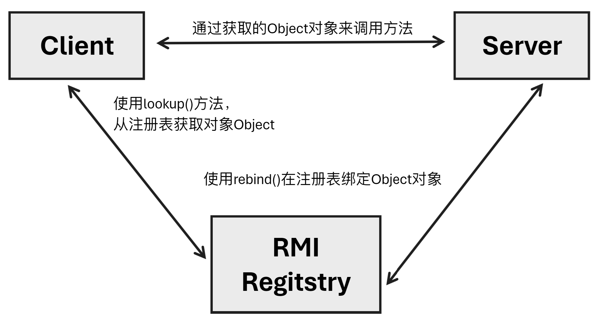

架构变化

单体架构

​	项目中是以包为单位进行划分，所有的包都在一个项目中。

​	代码结构

```json
-- org.moroboshidan
	-- controller
	-- service
	-- mapper
```


​	维护方便，部署简单，成本低。

​	当项目规模大、访问量大时会出现宕机。

分布式架构

​	把一个项目按照特定需求(多按照功能或模块)拆分成多个项目，每个项目部署到不同的服务器上。

​	代码结构

```json
-- org.moroboshidan.xxx
	-- controller
	-- service
	-- mapper
-- org.moroboshidan.yyy
	-- controller
	-- service
	-- mapper
```

​	优点：

​	增大了系统可用性，减少单点故障，导致整个项目不可用。

​	增加重用性，因为模块化，所以重用性高。

​	增加可扩展性，有新的模块，增加新的项目即可。

​	增加每个模块的负载能力，因为每个模块就是一个项目，所以负载能力更高。

​	缺点：

​	成本更高

​	架构结构更复杂

​	整体响应之间变长。一些业务需要多项目通信后给出结果。

​	吞吐量更大。

# RPC简介

## 1. RFC

​	Request For Comments，由IETF发布的文件集，每个文件都有自己的编号，RPC收录在rfc1831。

## 2. RPC

​	Remote Procedure Call，远程过程调用协议。

​	允许互联网中一台主机调用另一台主机的程序，而程序员无需对这个交互过程进行编程。在RPC协议中强调调用者不知道被调用者的具体实现。

​	RPC是上层协议，底层可以是基于TCP，也可以基于HTTP。一般来说，RPC都指的是RPC的具体实现，如Dubbo框架。

## 3. RPC对比HTTP

### 3.1 具体实现

- RPC：可以基于TCP，也可以基于HTTP。

- HTTP：基于HTTP

### 3.2 效率

- RPC：自定义具体实现可以减少很多无用报文，使得报文体积更小。
- HTTP：HTTP1.1中很多报文是无用的。HTTP2.0以后，与RPC相差不大，缺少一些服务治理功能。

### 3.3 连接方式

- RPC：支持长连接。(一个连接可以发送多个数据包，发送完毕可以保持连接)
- HTTP：每次链接都是三次握手。(短链接：发送完毕数据需要断开连接)

### 3.4 性能

- RPC：可以基于很多序列化方式。
- HTTP：主要通过JSON，序列化和反序列化效率更低。

### 3.5 注册中心

- RPC：一般框架都带有注册中心。
  - 注册中心类似于容器，A需要调用B，A不是直接访问B，而是访问注册中心，注册中心负责访问B。
- HTTP：直连。

### 3.6 负载均衡

- RPC：绝大部分框架自带负载均衡。
  - 多个模块的功能是一致的，会将访问均衡地分布在这些模块上。
- HTTP：一般需要借助第三方工具，如Nginx

### 3.7 综合结论

​	RPC框架一般都带有丰富的服务治理功能，


# HttpClient实现RPC

## 1. HttpClient简介

​	在JDK的`java.net`包中，提供了用户HTTP访问的基本功能，但是缺少很多灵活性和许多应用所需的功能。

​	HttpClient起初是Apache Jakarta Common的子项目。用来提供高效率、最新的、功能丰富的支持HTTP协议的客户端编程工具包，并且支持HTTP协议的最新版本。

​	HttpClient可以实现使用Java代码完成标准HTTP请求及响应。

## 2. 代码实现

### 2.1 服务端

​	新建HttpClientServer

#### 2.1.1 新建控制器

`org.moroboshidan.controller.DemoController`

```java
@Controller
public class DemoController {
    @RequestMapping("/demo")
    @ResponseBody
    public String demo(String param) {
        return param + "abc";
    }
}
```

#### 2.1.2 新建启动器

`org.moroboshidan.ServerApplication`

```java
@SpringBootApplication
public class ServerApplication  {
    public static void main( String[] args ) {
        SpringApplication.run(ServerApplication.class, args);
    }
}
```


### 2.2 客户端

​	新建HttpClientDemo

#### 2.2.1 添加依赖

```xml
<dependency>
    <groupId>org.apache.httpcomponents</groupId>
    <artifactId>httpclient</artifactId>
    <version>4.5.2</version>
</dependency>
```


#### 2.2.2 新建类

​	新建`org.moroboshidan.HttpClientDemo`编写主方法

#### 2.2.2.1 使用GET方法访问

```java
@Test
public void testGetDemo() {
    try {
        // 1. 创建http工具，理解为浏览器对象，发送请求，解析响应
        CloseableHttpClient httpClient = HttpClients.createDefault();
        // 2. 确定请求路径
        URIBuilder uriBuilder = new URIBuilder("http://localhost:8080/demo");
        uriBuilder.addParameter("param", "moro");
        // 3. 创建HttpGet请求对象
        HttpGet get = new HttpGet(uriBuilder.build());
        // 4. 创建响应对象
        CloseableHttpResponse response = httpClient.execute(get);
        // 5. 由于响应体是字符串，因此把HttpEntity类型转换为字符串
        String ans = EntityUtils.toString(response.getEntity(), "utf-8");
        // 6. 输出结果
        System.out.println(ans);
        // 7. 释放资源
        response.close();
    } catch (Exception e) {
        e.printStackTrace();
    }
}
```


#### 2.2.2.2 使用POST方法访问

```java
@Test
public void testPostDemo() {
    try {
        // 1. 创建http工具
        CloseableHttpClient httpClient = HttpClients.createDefault();
        // 2. 创建Post请求对象
        HttpPost post = new HttpPost("http://localhost:8080/demo");
        // 2.1 创建请求参数
        List<NameValuePair> params = new ArrayList<>();
        params.add(new BasicNameValuePair("param", "moro"));
        // 2.2 创建HttpEntity接口的文本实现类对象，放入参数，设计编码
        HttpEntity httpEntity = new UrlEncodedFormEntity(params, "utf-8");
        // 2.3 将HttpEntity放入post对象
        post.setEntity(httpEntity);
        // 3. 创建响应对象
        CloseableHttpResponse response = httpClient.execute(post);
        // 4. 由于响应体是字符串，所以将HttpEntity对象转换为字符串
        String ans = EntityUtils.toString(response.getEntity(), "utf-8");
        // 5. 输出结果
        System.out.println(ans);
        // 6. 释放资源
        response.close();
    } catch (Exception e) {
        e.printStackTrace();
    }
```


## 3. Jackson用法

​	导入Jackson依赖

```xml
<dependency>
    <groupId>com.fasterxml.jackson.core</groupId>
    <artifactId>jackson-databind</artifactId>
    <version>2.15.2</version>
</dependency>
```

### 3.1 把对象转换为json字符串

```java
ObjectMapper mapper = new ObjectMapper();
People people = new People();
mapper.writeValueAsString(peple);
```

### 3.2 把json字符串转换为对象

```java
ObjcetMapper mapper = new ObjectMapper();
People people = mapper.readValue(str, People.class);
```

### 3.3  把json字符串转换为List集合

```java
ObjectMapper mapper = new ObjectMapper();
JavaType javaType = mapper.getTypeFactory().constructParametricType(List.class, People.class);
List<People> list = mapper.readValue(str, javaType);
```

 

 ## 4. HttpClient请求包含json

### 4.1 Java代码实现

```java
@Test
public void testInputStream() {
    try {
        // 1. 创建http工具
        CloseableHttpClient httpClient = HttpClients.createDefault();
        // 2. 创建post对象
        HttpPost post = new HttpPost("http://localhost:8080/demo4");
        // 3. 创建请求参数集合
        List<User> paramList = new ArrayList<>();
        paramList.add(new User(1, "alpha"));
        paramList.add(new User(2, "beta"));
        // 4. 将集合对象转换为json字符串
        ObjectMapper mapper = new ObjectMapper();
        String jsonParam = mapper.writeValueAsString(paramList);
        // 5. 将字符串放入httpEntity，并将之放入post请求对象
        HttpEntity httpEntity = new StringEntity(jsonParam, ContentType.APPLICATION_JSON);
        post.setEntity(httpEntity);
        // 6. 获取响应对象
        CloseableHttpResponse response = httpClient.execute(post);
        String ans = EntityUtils.toString(response.getEntity());
        System.out.println(ans);
        // 释放资源
        response.close();
        
    } catch (Exception e) {
        e.printStackTrace();
    }
```


## 5. 控制器接口参数

​	`@RequestBody`把请求体中的流数据，转化为指定的对象。多在请求参数为json数据，且请求的`ContentType = application/json`时使用。

```java
@RequestMapping("/demo4")
@ResponseBody
public String demo4(@RequestBody List<User> list) {
    System.out.println(list);
    return list.toString();
}
```


## 6. Ajax发送json参数写法

 ```javascript
 $(function () {
     $("button").click(function () {
         var json = '[{"id":123, "name":"moro"}, {"id":456, "name":"msb"}]';
         $.ajax({
             url:'/demo5',
             type:'post',
             success:function (data) {
                 for (var i = 0; i < data.length; i++) {
                     alert(data[i].id + " " + data[i].name);
                 }
             },
             contentType:'application/json', // 请求体中的数据类型
             dataType:'json', // 响应内容类型
             data:json
         });
     });
 });
 ```


## 7. Ajax跨域请求

​	跨域：协议、ip、端口中只要有一个不同，就是跨域请求。

​	同源策略：浏览器默认只允许Ajax访问同源内容(协议、ip、端口都相同)。

​	解决同源策略：在浏览器控制接口上添加`@CrossOrigin`注解，表示允许跨域。本质上是在响应头中添加`Access-Control-Allow-Origin:*`。


# RMI实现RPC

## 1. RMI简介

​	RMI(Remote Method Invocation)，远程方法调用。

​	RMI是JDK1.2推出的功能，它可以实现一个Java应用中像调用本地方法一样，调用另一个服务器中的Java应用中的内容。

​	RMI是Java语言的远程调用，无法实现跨语言。

## 2. 执行流程



​	Regtistry(注册表)，是放置所有服务器对象的命名空间。每次服务端创建一个对象时，它都会使用bind()或rebind()方法注册该对象，绑定时使用的是唯一的绑定名称。

​	要调用远程对象，客户端需要该对象的引用。即，通过服务端绑定的名称从注册表中查找对象。

## 3 API介绍

### 3.1 Remote

​	`java.rmi.Remote`定义了此接口为远程调用接口。如果接口需要被外部调用，需要继承此接口。

```java
public interface Remote() {}
```


### 3.2 RemoteException

​	`java.rmi.RemoteException`，如果接口继承了Remote接口，且该方法允许被远程调用，需要抛出该异常。

### 3.3 UnicastRemoteObject

​	`java.rmi.server.UnicastRemoteObject`，此类实现了Remote接口和Serializable接口。

​	自定义接口的实现类，除了需要实现自定义接口，还需要继承此类。

### 3.4 LocateRegistry

​	`java.rmi.registry.LocateRegistry`，可以通过其在本机上创建Registry，通过该特定端口就可以访问该Registry。

### 3.5 Naming

​	`java.rmi.Naming`，定义了发布内容可访问RMI名称。通过Naming获取指定的远程方法。

​	

## 4. 代码实现

### 4.1 服务端创建

#### 4.1.1 编写接口

​	自定义接口需要继承Remote接口

```java
public interface DemoService extends Remote {
    String demo(String param) throws RemoteException;
}
```


#### 4.1.2 编写实现类

​	接口的实现类，需要继承UnicastRemoteObject类，并将构造器改为`public`修饰，并抛出异常。

```java
public class DemoServiceImpl extends UnicastRemoteObject implements DemoService {
    public DemoServiceImpl() throws RemoteException {
    }

    @Override
    public String demo(String param) throws RemoteException {
        return param + "abc";
    }
}
```


#### 4.1.3 编写主方法

```java
// 创建接口实例
DemoService demoService = new DemoServiceImpl();
// 创建注册表
LocateRegistry.createRegistry(8989);
// 绑定服务
Naming.bind("rmi://localhost:8989/demoService", demoService);
System.out.println("server start successfully");
```


#### 4.1.4 运行项目

### 4.2 客户端创建

​	通过Naming的`lookup()`方法通过注册的唯一名称查找方法。

```java
DemoService demoService = (DemoService) Naming.lookup("rmi://localhost:8989/demoService");
String moro = demoService.demo("moro");
System.out.println(moro);
```


# Zookeeper


## Zookeeper安装

### 1. Zookeeper简介

​	Zookeeper分布式管理软件，常用它做注册中心(依赖Zookeeper的发布/订阅功能)、配置文件中心、分布式锁配置和	集群管理等。

#### 2. 安装

##### 2.1 上传压缩文件

##### 2.2 解压

##### 2.3 新建data目录

##### 2.4 解压


## 向Zookeeper中注册内容

​	新建ZookeeperClient项目

### 1. 创建/demo

​	使用Zookeeper的客户端命令工具创建/demo目录

```unix
./zkCli.sh
create /demo
```

### 2. 添加依赖

```xml
<!-- https://mvnrepository.com/artifact/org.apache.zookeeper/zookeeper -->
<dependency>
  <groupId>org.apache.zookeeper</groupId>
  <artifactId>zookeeper</artifactId>
  <version>3.8.4</version>
</dependency>
```

### 3. 编写代码

​	创建`org.moroboshidan.SendContent`类。

​	`ZooDefs.Ids.OPEN_ACL_UNSAFE`表示权限

​	`CreateMode.PERSISTENT_SEQUENTIAL`永久储存，文件内容编号递增。

```java
public static void main(String[] args) {
    /*
    * 创建zookeeper对象
    * 参数：1 zookeeper ip + 端口号
    * 参数：2 访问超时设置
    * 参数：3 通过观察者模式发出访问回复
    * */
    ZooKeeper zooKeeper = null;
    try {
        zooKeeper = new ZooKeeper("172.29.205.122:2181", 100000, new Watcher() {
            @Override
            public void process(WatchedEvent watchedEvent) {
                System.out.println("get connection");
            }
        });
        /*
         * 向zookeeper服务器中发送内容
         * 发送的文件
         * 发送的内容
         * 权限
         * 内容的模式
         * */
        String content =  zooKeeper.create("/demo/rmi-address", "rmi:locaohost:8080/demoService".getBytes(), ZooDefs.Ids.OPEN_ACL_UNSAFE, CreateMode.PERSISTENT_SEQUENTIAL);
        System.out.println("content: " + content);
    } catch (IOException e) {
        throw new RuntimeException(e);
    } catch (InterruptedException e) {
        throw new RuntimeException(e);
    } catch (KeeperException e) {
        throw new RuntimeException(e);
    }
}
```

### 4. 查看上传数据

​	运行上述代码后，可以看到`/demo`目录下，出现了`rmi-address0000000000`文件。

​	使用`get`指令，可以看到其内容为`rmi:locaohost:8080/demoService`。


## 从ZooKeeper中发现内容

​	在上述项目中新建一个类，编写主方法。

```java
public static void main(String[] args) {
    // 创建zookeeper对象
    try {
        ZooKeeper zooKeeper = new ZooKeeper("172.29.205.122:2181", 100000, new Watcher() {
            @Override
            public void process(WatchedEvent watchedEvent) {
                System.out.println("get connection");
            }
        });
        // 从zookeeper中获取内容
        // 获取节点
        List<String> children = zooKeeper.getChildren("/demo", false);
        for (String child : children) {
            byte[] data = zooKeeper.getData("/demo/" + child, false, null);
            System.out.println(new String(data));
        }
    } catch (IOException e) {
        throw new RuntimeException(e);
    } catch (InterruptedException e) {
        throw new RuntimeException(e);
    } catch (KeeperException e) {
        throw new RuntimeException(e);
    }
}
```


# 手写RPC框架

​	使用Zookeeper作为注册中心，RMI作为连接技术，手写RPC框架。

> ​	RMI可以让两个Java项目之间相互调用方法，但是在先前的案例中，存在如下问题：
>
> - 被调用的方法是服务提供方某个接口的实现类的方法，该实现类还继承固定的类，抛出固定异常。
>
>   - 在使用方，调用该接口需要将`lookup()`方法的返回值强转为该接口类型。
>   - 但是在使用方并没有这个接口，因此先前的做法是直接将提供方的接口拷贝到使用方。
>
> - 项目之间是直接调用的，没有管理，连接关系是写死的。
>
> - 调用的方法也是直接在本项目中写死的，无法动态修改。
>
>     为了解决第一个问题，通常会再写一个父项目，让双方都依赖该父项目，解决冗余问题。
>
> ​        使用Zookeeper作为注册中心，可以让各个项目将自己提供的服务注册在Zookeeper中。某个项目需要调用非本地的方法时，通过注册中心来获取服务名称，从而实现调用。
>
> ​	Zookeeper本质上就是个map集合。服务提供方将自己的服务通过`Naming.bind()`注册在RMI中，注册时会给这个服务起一个名称。然后，将服务的名称(如连接套接字`rmi://localhost:8080/service`)写在一个文件内。需要使用服务的客户端就到约定好的文件中读取出这个字符串，然后通过这个套接字字符串，使用`Naming.lookup()`方法从RMI中查找先前注册的服务。

## 1. 创建项目

​	创建父项目`ParentDemo`

​	包含三个聚合子项目

pojo：service中需要的实体类。service项目依赖之，就可以直接使用其中的实体类，而不用复制一份。

service：包含被serviceimpl和consumer依赖的接口。

serviceimpl：provider提供的服务内容

consumer：消费者,调用服务内容。

