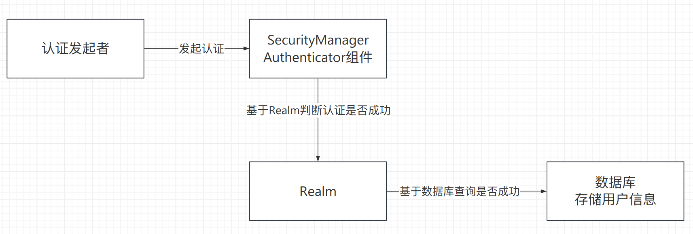

# 一、现存问题

## 1.1 问题

- 认证(登录时的认证)：认证操作流程差不多，但是每次都需要手动的基于业务代码区实现，比较繁琐。
- 授权：访问接口时检查是否有权限使用。如果控制粒度比较粗，可以自己手动实现，但如如果控制粒度比较细，操作也十分繁琐。
- 分布式会话管理：单体项目时，需要依赖Web容器的session实现会话，搭建了集群或是分布式项目，手动去基于Redis或者其他拥有公共存储能力的中间件实现分布式会话管理。
- 单点登录：在一处服务认证，所有其他服务都信任。(了解即可，不常用)

## 1.2 Shiro框架介绍

​	Shiro是基于Java语言编写的，Shiro最核心的功能就是认证和授权。

​	官方网站：http://shiro.apache.org


​	Shiro框架主要分成三部分：

- 发起认证、授权操作的客户端。最上方的部分
- Security Manager，Shiro的核心。
    - Authenticator，认证
    - Authorizer，授权
    - Session Manager，Session管理
    - Cache Manager，授权信息的缓存
- Realm，Shiro的单独组件。
    - 认证和授权是否成功，是Realm来负责和数据库沟通校验的。

# 二、Shiro的基本使用

## 2.1 SimpleAccountRealm



​	    基于内存来存储用户名，密码，角色等信息。重启过后就会失效。

## 2.2 IniRealm

​	    基于文件存储用户名，密码，角色等信息。适合小应用，避免使用数据库操作。

​		创建realm对象时，需要指定一个`.ini`文件，文件内部按照如下格式来书写

```ini
[users]
username=password, role1, role2
[roles]
role1=user:add, user:
```


## 2.3 JdbcRealm

​		实现权限校验时，库表设计方案。

​		经典五张表设计：

- 用户表：存储用户, username, password。表名`users`
- 角色表：存储系统中存在的角色列表。表名`roles`
- 用户角色表：用来将用户和关系进行多对多关联。表名`user_roles`
- 权限表：存储系统中存在的权限列表。表名`permissions`
- 角色权限表：用来将角色和权限进行关联。表名`role_permissions`

> 可以自定义sql语句


## 2.4 CustomRealm

​		仿照JdbcRealm，自定义Realm。

- 声明POJO类，继承`AuthorizingRealm`
- 重写`doGetAuthenticationInfo()`方法
	- 认证时，只需要认证用户名，密码由shiro内部自动校验。
	- 如果用户名为空，返回null，shiro会默认抛出异常，也可以自己抛出。
- 重写`doGetAuthorizationInfo()`方法


# 三、Shiro的WEB流程

# 四、Shiro整合WEB(SpringMVC，SpringBoot)

# 五、Shiro的授权方式


# 六、Shiro分布式session的处理

# 七、Shiro的授权缓存

# 八、Shiro整合CAS框架实现单点登录

