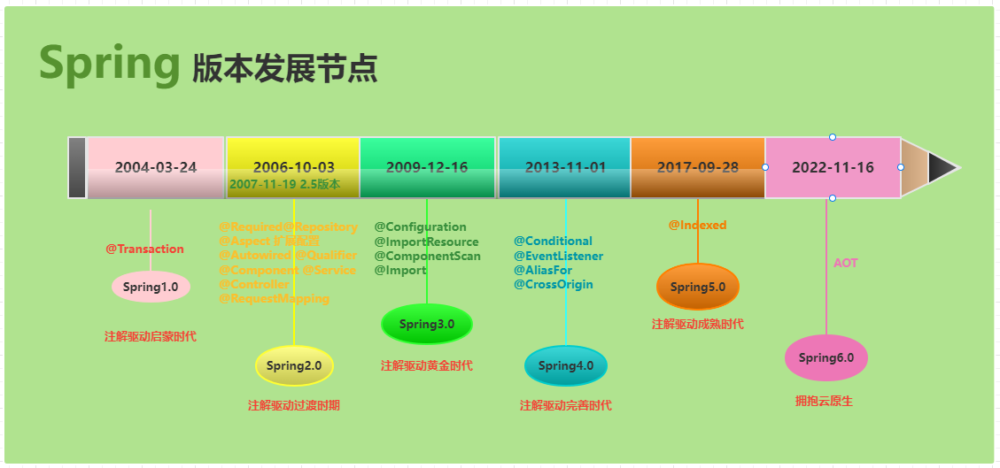

# 一、SpringBoot基础内容

## 1. Spring和SpringBoot

### 1.1 Spring介绍

​	Spring（Spring Framework） 是一个开源框架，最早由Rod Johnson创建，并在《Expert One-on-One：J2EE Design and Development》这本著作中进行了介绍。Spring是为了解决企业级应用开发的复杂性而创建的，使用Spring可以让简单的JavaBean实现之前只有EJB才能完成的事情。但Spring不仅仅局限于服务器端开发，任何Java应用都能在简单性、可测试性和松耦合等方面从Spring中获益。

### 1.2 SpringBoot介绍

​	SpringBoot是由Pivotal团队提供的全新框架，其设计目的是用来简化新Spring 应用的初始搭建以及开发过程。该框架使用了特定的方式来进行配置，从而使开发人员不再需要定义样板化的配置。简单来说,就是SpringBoot其实不是什么新的框架，它默认配置了很多框架的使用方式，就像Maven整合了所有的Jar包，SpringBoot整合了所有的框架。

## 2. SpringBoot2入门操作

## 3. 浅谈自动装配原理

# 二、SpringBoot核心功能

## 1. 配置文件

## 2. WEB文件

## 3. 数据访问

## 4. 单元测试

## 5. 指标监控

# 三、案例讲解

