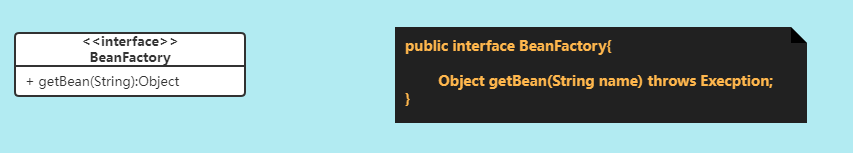
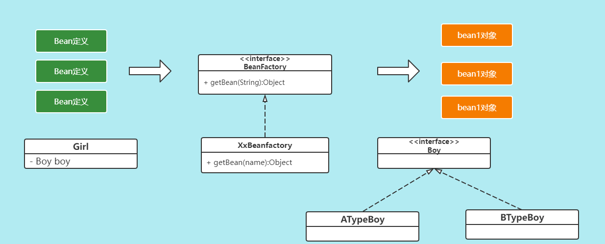
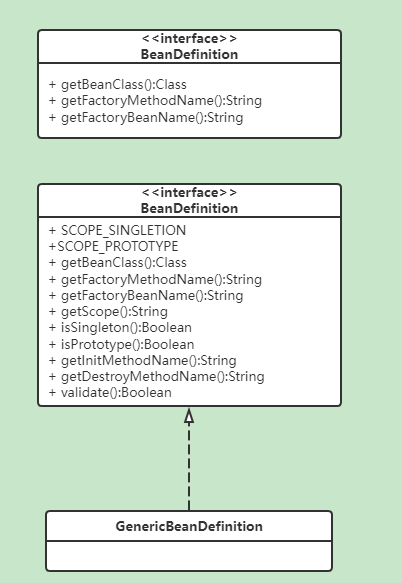
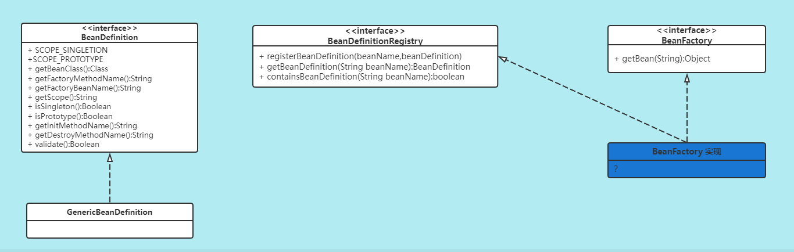

# Spring源码手写篇-手写IoC

## 一、IoC分析

### 1. Spring的核心

​	Spring的核心是IoC和AOP

### 2. IoC的几个疑问

#### 2.1 IoC是什么

​	Inversion of Control，控制反转，将对象的创建交给容器管理。

#### 2.2 IoC的好处

IoC带来的好处

1. 代码更加简洁，不需要new需要的对象了
2. 面向接口编程，使用者和具体的实现类解耦，通过接口引用指向实现类，易扩展
3. 可以放便进行AOP

#### 2.4 IoC容器做了什么

​	IoC容器负责创建、管理类的实例、向使用者提供实例。

#### 2.5 IoC容器是否是工厂模式的实例

​	是的，IoC容器负责来创建类实例对象，需要从IoC容器中get获取。IoC容器我们也称为Bean工厂。


## 二、IoC实现

​	通过上面的介绍我们也清楚了IoC的核心就是Bean工厂。

### 1. Bean工厂的作用

​	首先Bean工厂的作用我们上面也分析了就是创建，管理Bean，并且需要对外提供Bean的实例。

### 2. Bean工厂的初步设计

​	首先Bean工厂应该要对外提供获取bean实例的方法，所以需要定义一个`getBean()`方法。同时工厂需要知道生产的bean的类型，所以方法的形参为bean的信息，同时返回类型这块也可能有多个类型，我们就用`Object`来表示。这样Bean工厂的定义就出来了。



​	上面描述了Bean工厂向外提供实例的方法，但是Bean工厂创建bean对象需要bean的定义信息。所以在这里我们得把Bean的定义信息告诉BeanFactory工厂，然后BeanFactory工厂根据Bean的定义信息来生成对应的bean实例对象。所以在这儿我们要考虑两个问题：

1. 我们需要定义一个模型来表示该如何创建Bean实例的信息，也就是BeanDefinition。
2. Bean工厂需要提供行为来接收这些Bean的定义信息。



​	BeanDefinition定义BeanFactory如何创建bean对象的相关信息。BeanFactory负责根据提供的信息创建和管理对象。BeanFactory只是一个接口，具体的创建由工厂的实现类来完成的。

### 3. BeanDefinition

#### 3.1 什么时Bean定义，以及其意义

​	我们自己定义的类，想要成为SpringIoC容器管理的Bean类，需要通过xml文件中的<bean>标签，或者@Bean注解，来告诉Spring。

​	而<bean>标签和注解就是用来定义bean的，在Spring IoC容器内部，这些定义信息是以BeanDefinition对象的形式存在的。

​	作用：告诉Bean工厂应该如何来创建某类的Bean实例。

通常包括如下信息：

- 全限定类名， 通常是Bean的实际实现类；
- Bean行为配置元素，它们说明Bean在容器中的行为（作用域、生命周期回调等等）；
- Bean执行工作所需要的的其他Bean的引用，这些Bean也称为协作者或依赖项；
- 其他配置信息，例如，管理连接池的bean中，限制池的大小或者使用的连接的数量。

#### 3.2 创建实例的方式

​	通过`new Constructor();`关键字创建对象。

```java
Person person = new Person();
```

​	工厂方式：静态方法。工厂类中提供的静态方法。

```java
public class PersonFactory {
    public static Person getPerson() {
        return new Person();
    }
}
```

​	工厂方式：成员方法。需要创建工厂的对象，才能创建bean对象。

```java
public class PersonFactory {
	public Person getPerson() {
        return new Person();
    }
}
```

#### 3.3 BeanDefinition中需要提供的信息

​	如果是通过`new Constructor()`来实例化对象，需要提供*类名*；

​	如果是工厂模式的静态方法，需要提供*类名、方法名*；

​	如果是工厂模式的成员方法，由于要创建工厂的对象，所以需要提供*工厂bean名，方法名*；

基于以上分析，BeanDefinition的基本功能如下：

- getBeanClass():Class
- getFactoryMethodName():String
- getFactoryBeanName():String

#### 3.4 增强功能

​	在上述基础功能之上，我们可以有增强功能，如Bean工厂创建的是单例对象、具有特定的初始化方法和销毁逻辑。

​	同时，BeanDefinition只是一个接口，还需要具体的实现类。

 


### 4. Bean的注册

​	Bean的定义清楚后，我们要考虑的就是如何实现BeanDefinition和BeanFactory的关联了。目前BeanDefinition和BeanFactory之间还是独立的，需要一个模型来将两者联系起来。

​	在这儿我们可以专门定义一个 `BeanDefinitionRegistry`来实现Bean定义的注册功能。其应该具备的基本功能如下：

- 注册BeanDefinition
- 获取BeanDefinition

​	同时为了保证能够区分每个BeanDefinition的定义信息，我们得给每一个Bean定义一个唯一的名称。

### 5. BeanFactory实现



​	通过上面的分析我们接下来就要考虑BeanFactory的功能实现了。我们先来实现一个最基础的默认的Bean工厂：DefaultBeanFactory。它需要实现BeanFactory和BeanDefinitionRegistry接口，需要DefaultBeanFactory实现如下的5个功能

1. 实现Bean定义信息的注册
2. 实现Bean工厂定义的getBean方法
3. 实现初始化方法的执行
4. 实现单例的要求
5. 实现容器关闭是执行单例的销毁操作